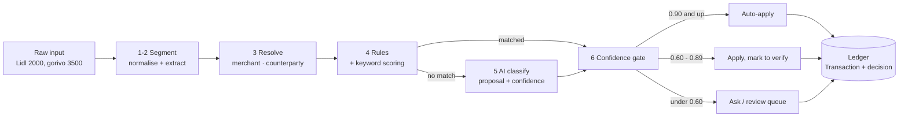
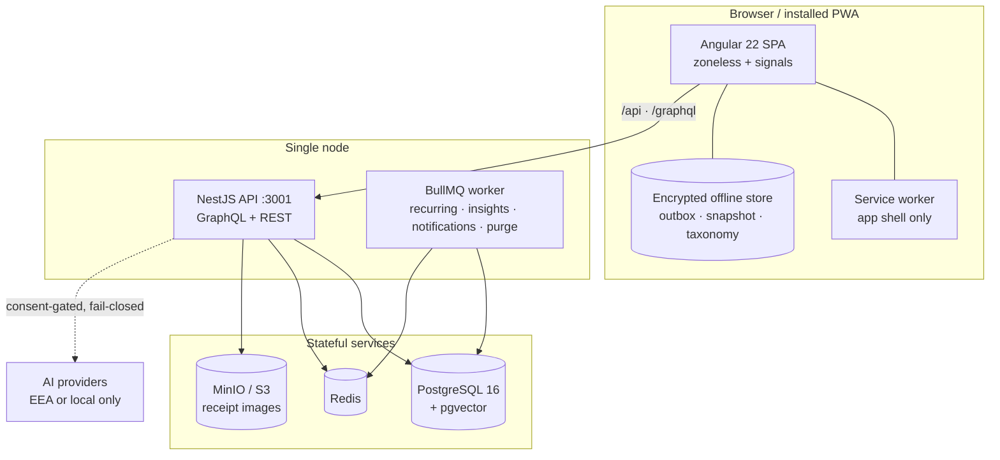

# FinMate

**Type `Lidl 2000` — get a correctly categorised, budget-aware transaction in under five seconds.**

FinMate is an AI-first household budgeting app for desktop and mobile. Natural language is the primary
input, and a deterministic backend turns it into ledger entries, budgets and alerts. The model
interprets what you typed; it never touches the money.

It is built for the Serbian/Balkan market first — mixed latin/cyrillic, RSD, cash-heavy households and
local merchants that English-first classifiers handle badly. The interface ships in English (primary)
and Serbian (latin and cyrillic).

[](https://github.com/gjovanovicst/FinMate/actions/workflows/ci.yml)
[](LICENSE)
[](#project-status)
[](CONTRIBUTING.md)
[](CODE_OF_CONDUCT.md)

---

## Contents

- [Why this exists](#why-this-exists)
- [How it works](#how-it-works)
- [What it does today](#what-it-does-today)
- [Architecture](#architecture)
- [Quickstart](#quickstart)
- [Commands](#commands)
- [Project status](#project-status)
- [Documentation](#documentation)
- [Contributing](#contributing)
- [License](#license)

---

## Why this exists

Budgeting apps rarely fail on features. They fail in the second week, because logging a coffee means
_open app → tap add → enter amount → pick a category → pick an account → pick a date → save_. That
friction is the single largest predictor of churn in personal finance tooling, and removing it is the
entire product thesis.

So the input is a fragment a person would actually type or say:

```text
Lidl 2000, gorivo 3500, plata 150.000
```

Three fragments, three correctly categorised transactions — groceries, fuel and salary — without a
single form.

What makes that trustworthy rather than merely clever is where the intelligence sits:

> **AI proposes, the backend disposes.**

| Layer                  | Owns                                                                                        | Never does                                                                             |
| ---------------------- | ------------------------------------------------------------------------------------------- | -------------------------------------------------------------------------------------- |
| **AI layer**           | Interpretation of messy human input; category _proposals_; narrative insights; explanations | Write to the ledger; compute balances, totals, budget remaining or savings projections |
| **Deterministic core** | The ledger, all arithmetic, budget limits, recurring materialisation, alerts, permissions   | Guess; silently resolve ambiguity                                                      |

If a model hallucinates, the worst outcome is one mis-categorised row that the user fixes in a single
tap — never a wrong balance. That boundary is also what keeps the AI layer cheap, auditable and
swappable.

## How it works

Every input runs the same six-stage pipeline. Stages 1–4 are pure, deterministic and free. The model is
the exception path, not the default.



### A worked example

`Lidl 2000` in a newly onboarded Household, with no AI provider configured at all:

| Stage             | What happens                                                                                                                          | Cost   |
| ----------------- | ------------------------------------------------------------------------------------------------------------------------------------- | ------ |
| 1–2 Segment       | One fragment. `2000` → `200000` minor units RSD; direction `EXPENSE`; `Lidl` tokenised                                                | ~5 ms  |
| 3 Resolve         | Nothing yet — the shipped merchant catalogue is global, and the classifier reads merchants per Household, so a fresh signup sees none | ~15 ms |
| 4 Rules/keywords  | The keyword `lidl`, seeded by onboarding at the decisive weight 2.0, selects `Hrana → Supermarket`                                    | ~10 ms |
| 5 AI classify     | **Never called** — stage 4 already decided                                                                                            | zero   |
| 6 Confidence gate | The decision is decisive, so the category is applied silently and the row carries an undo affordance                                  | ~20 ms |

A Household with its own merchant row — as the seeded demo Household has — resolves one stage earlier,
by name, and never reaches the keyword tier. Both paths are asserted in the test suite, because the
difference between them is exactly what hid the cold-start bug that made a fresh signup fall through to
the model.

In the measured evaluation suite, **73.8 %** of inputs resolve without the model at all, and the
pipeline's p95 extraction cost is **39 ms** — the five-second promise is about network and UI, not the
classifier. When a model _is_ reached and is not confident, the app asks instead of guessing.

### The rules that make it safe

1. **The LLM never owns state or computes money.** It returns proposals with a confidence; only the
   backend validates and persists. _(ADR-001)_
2. **Rules before AI.** Normalise → resolve → rules → keywords → _then_ the model. _(ADR-002)_
3. **Money is `BIGINT` minor units plus an ISO-4217 code — never a float, anywhere.** `2.000 RSD` is
   `200000n`; there is no `number`, no `parseFloat` and no `NUMERIC` in the money path, not even
   transiently. _(ADR-003)_
4. **Every household-scoped query filters by `household_id` resolved from the session**, never from
   client input. _(ADR-008)_
5. **AI egress is EEA-only or local**, and an `_EU` suffix is not enough on its own — the endpoint must
   be configured with the EEA host it means. Anything else needs recorded per-household consent.
   _(ADR-007, ADR-031)_
6. **The assistant never invents a number.** A constrained query planner computes the facts
   server-side; the model only narrates them. _(ADR-017)_
7. **Confidence gates:** ≥ 0.90 auto-apply · 0.60–0.89 verify · < 0.60 ask. _(ADR-009)_

The full decision log and risk register live in
[`docs/14-decisions-and-risks.md`](docs/14-decisions-and-risks.md).

## What it does today

All 21 screens ship. The highlights:

| Area                  | What works                                                                                                                                                  |
| --------------------- | ----------------------------------------------------------------------------------------------------------------------------------------------------------- |
| **Capture**           | Natural-language entry (single or bulk), duplicate detection, undo, a first-use AI consent sheet, and a correction that becomes a reusable rule _(ADR-010)_ |
| **Ledger**            | Accounts, transactions with splits, tags, merchants, counterparties, optimistic concurrency, filtered search with cursor paging, CSV export (`F-25`)        |
| **Budgets & goals**   | Period budgets with consumption and pace, saving goals with required-monthly figures and contributions                                                      |
| **Intelligence**      | Insight generators, alerts over in-app/email/web-push channels, analytics, recurring rules with RRULE expansion, subscription detection                     |
| **Assistant**         | A closed intent registry, a pure query planner and a numeric validator, plus propose-then-confirm writes that only run on a click _(ADR-035)_               |
| **Receipts**          | Presigned uploads, an OCR seam, item classification and reconciliation against the statement total (`F-14`, `F-34`)                                         |
| **Offline & mobile**  | Installable PWA (`F-26`), an encrypted offline store behind an app lock, a queued outbox with conflict diffs, web push, and a read-only offline shell       |
| **Account & privacy** | Profile, staged email change, session list, email verification, TOTP and emailed-code two-factor, per-purpose AI consent                                    |
| **i18n & a11y**       | English plus Serbian (latin and cyrillic) composed at runtime, WCAG-audited screens, per-route bundle budgets in CI                                         |

Screens that have not yet had a human visual pass, features that are deliberately unbuilt and gaps that
are known are all recorded in the docs rather than left implicit.

**Deliberately not in scope:** household-sharing UI (`F-29`), bank/Open Banking import (`F-33`), native
apps, a multi-currency ledger, investments/net worth, and model fine-tuning.

## Architecture

A modular monolith, a worker and an SPA, in one Nx workspace. Dependencies flow one way, and
`@nx/enforce-module-boundaries` fails the lint if a forbidden edge appears.



### Monorepo layout

Nine Nx projects:

| Path                    | What it is                                                                                               |
| ----------------------- | -------------------------------------------------------------------------------------------------------- |
| `apps/api`              | NestJS modular monolith — GraphQL (code-first) and REST, Prisma 7, the tenancy guard                     |
| `apps/worker`           | BullMQ background jobs, booting the API's own services _(ADR-022)_                                       |
| `apps/web`              | Angular 22 zoneless SPA with signals, a service worker and an encrypted offline store                    |
| `packages/domain`       | Dates, money allocation, Serbian amount parsing, category tree, budget calculators, invariants — no deps |
| `packages/nlp`          | Transliteration, folding, segmentation, fragment extraction, the entity-resolution ladder                |
| `packages/rules-engine` | Pure conflict resolution and keyword scoring — no I/O                                                    |
| `packages/ai`           | Provider adapters, fail-closed residency routing, circuit breaker, redaction, telemetry — no vendor SDK  |
| `packages/contracts`    | Shared transport types                                                                                   |
| `packages/config`       | Typed configuration schema shared by the apps                                                            |

### Stack

| Layer                  | Choice                                                                                                       |
| ---------------------- | ------------------------------------------------------------------------------------------------------------ |
| **Runtime**            | Node 24 · pnpm 11 · TypeScript 6                                                                             |
| **API**                | NestJS 12 · Prisma 7 with hand-written SQL migrations · PostgreSQL 16 + `pgvector` · Redis + BullMQ          |
| **Web**                | Angular 22 (zoneless, signals) · `ngsw` service worker · IndexedDB via `idb` for the encrypted offline store |
| **AI**                 | OpenAI-compatible adapters written in-repo, local-first through Ollama, no vendor SDK in a feature module    |
| **Dev infrastructure** | Docker Compose — Postgres + pgvector, Redis, MinIO (S3-compatible), Mailhog                                  |
| **Tests**              | Vitest everywhere — 3,100+ unit and integration specs, plus deterministic AI evaluation gates in CI          |

## Quickstart

**Prerequisites**

| Requirement | Version                       |
| ----------- | ----------------------------- |
| Node        | 24 (`nvm use` reads `.nvmrc`) |
| pnpm        | 11.7 or newer                 |
| Docker      | With Compose v2               |

**Run it**

```bash
git clone https://github.com/gjovanovicst/FinMate.git
cd FinMate

pnpm install
cp .env.example .env        # dev defaults match the Compose file; no real secrets needed

pnpm dev:infra              # Postgres, Redis, MinIO, Mailhog
pnpm db:migrate             # apply migrations
pnpm db:seed                # starter categories, keywords and merchants
pnpm storage:init           # create the receipt-attachments bucket

nx run api:serve            # API on http://localhost:3001
nx run web:serve            # SPA on http://localhost:4200
```

Then open <http://localhost:4200> and sign up. There is no default account and no fixture data beyond
the shared catalogue — the first signup creates the Household.

**Confirm it came up**

```bash
curl -s localhost:3001/health        # {"status":"ok",...}
curl -s localhost:3001/health/ready  # database and cache reachable
```

Mail (verification and password-reset links) lands in Mailhog at <http://localhost:8025>. MinIO's
console is at <http://localhost:9001>.

> **AI is inert by default, and that is a supported mode.** With no provider configured the classifier
> resolves from rules and keywords alone and reports itself as degraded. No API key is required to run,
> develop or test the stack — and the evaluation suite runs entirely offline.

### Troubleshooting

| Symptom                                                           | Cause                                                                              | Fix                                                                   |
| ----------------------------------------------------------------- | ---------------------------------------------------------------------------------- | --------------------------------------------------------------------- |
| Sign-in says "something went wrong"                               | The API is not running, or the web proxy and the API disagree on the port          | `curl localhost:3001/health`; if that fails, start the API            |
| Every request through the SPA fails as a proxy error              | The API is pinned to `:3001` while `.env` says `3000`                              | Change both together, or use `nx run api:serve`, which pins `:3001`   |
| `P1000 Authentication failed`, but the DB container looks healthy | A native PostgreSQL on the host already holds port 5432                            | Set another `POSTGRES_PORT` and update `DATABASE_URL` to match        |
| Typecheck fails on a missing Prisma client                        | The generated client is gitignored                                                 | `pnpm db:generate` (or run the migration)                             |
| A template error that `typecheck` did not catch                   | `web:typecheck` does not compile Angular templates                                 | `nx run web:build`, which does                                        |
| Categories are wrong after a `prisma migrate dev`                 | That command drops the CHECK constraints and partial indexes the domain depends on | Never run it — migrations are forward-only SQL, use `pnpm db:migrate` |

More traps, each described by what the failure _looks_ like, are in
[`docs/15-implementation-gotchas.md`](docs/15-implementation-gotchas.md).

## Commands

```bash
# Develop
pnpm dev              # infra, then every app in parallel
pnpm dev:infra        # Postgres, Redis, MinIO, Mailhog only
pnpm dev:ai           # opt-in local vision sidecar and model (docs/11 §2.5)

# Verify
pnpm lint             # includes the dependency-boundary rule
pnpm typecheck        # does not check Angular templates — use web:build for that
pnpm test             # unit + integration (needs the dev database running)
pnpm test:evals       # the deterministic AI evaluation gates
pnpm bundle:budget    # per-route web bundle budgets

# Database and storage
pnpm db:migrate       # apply migrations — forward-only, expand/contract
pnpm db:pull          # re-derive schema.prisma after a migration
pnpm db:seed          # starter categories, keywords and merchants
pnpm storage:init     # create the attachments bucket in MinIO

# Build
nx run web:build      # production bundle
```

## Project status

Actively developed and **pre-1.0**: there are no tagged releases yet, `main` is the only supported
version, and nothing here is production-hardened.

| Phase                     | State                                                                                                                      |
| ------------------------- | -------------------------------------------------------------------------------------------------------------------------- |
| **0 · Foundation**        | Complete — monorepo, schema, tenancy, auth, CI                                                                             |
| **1 · Manual core**       | Complete — accounts, transactions with splits, budgets, categories, merchants, counterparties, tags, CSV export            |
| **2 · AI input**          | Complete — the six-stage pipeline, the correction/learning loop, the review queue, onboarding                              |
| **3 · Intelligence**      | Complete — insights, notifications, analytics, goals, recurring rules, subscription detection, the assistant               |
| **4 · Receipts & mobile** | In progress — receipts, offline and sync, push, installable PWA, app lock, i18n, accessibility and bundle budgets are done |

Measured exit criteria for the AI input phase, from the evaluation harness that gates CI:

| Metric              | Measured | Bar     |
| ------------------- | -------- | ------- |
| Rule-hit ratio      | 73.8 %   | ≥ 50 %  |
| Overconfident-wrong | 0.28 %   | ≤ 1.5 % |
| Top-1 accuracy      | 100 %    | —       |
| Should-ask recall   | 98.8 %   | —       |

Known gaps are documented rather than hidden: [`AGENTS.md`](AGENTS.md) carries the current state of
every feature, and [`docs/09-implementation-plan.md`](docs/09-implementation-plan.md) carries what is
next.

## Documentation

`docs/` is the specification and it is canonical. Code comments link to it rather than restating it —
start with the index at [`docs/README.md`](docs/README.md).

| If you are…                          | Read first                                                                                                                                                                       |
| ------------------------------------ | -------------------------------------------------------------------------------------------------------------------------------------------------------------------------------- |
| Deciding whether to build it         | [`docs/00`](docs/00-executive-summary.md) → [`docs/01`](docs/01-product-requirements.md) → [`docs/12`](docs/12-monetization-and-pricing.md)                                      |
| Building it                          | [`docs/03`](docs/03-domain-model.md) → [`docs/04`](docs/04-categorization-and-ai-engine.md) → [`docs/05`](docs/05-architecture.md) → [`docs/09`](docs/09-implementation-plan.md) |
| Debugging something that should work | [`docs/15`](docs/15-implementation-gotchas.md) — 200+ traps, each saying what the failure looks like                                                                             |
| Making an architectural decision     | [`docs/14`](docs/14-decisions-and-risks.md) — add an ADR, never decide silently                                                                                                  |
| Contributing code                    | [`CONTRIBUTING.md`](CONTRIBUTING.md) and [`AGENTS.md`](AGENTS.md)                                                                                                                |

## Contributing

Contributions are welcome. [`CONTRIBUTING.md`](CONTRIBUTING.md) covers the setup, which document owns
each area, the Definition of Done and the commit conventions. Participation is covered by the
[Code of Conduct](CODE_OF_CONDUCT.md).

Please report security issues privately — see [`SECURITY.md`](SECURITY.md) — rather than opening a
public issue.

## License

Copyright (C) 2026 Goran Jovanovic.

FinMate is free software: you can redistribute it and/or modify it under the terms of the **GNU Affero
General Public License**, either version 3 of the License, or (at your option) any later version. It is
distributed in the hope that it will be useful, but **without any warranty**; without even the implied
warranty of merchantability or fitness for a particular purpose. See [`LICENSE`](LICENSE) for the full
text.

> Note the _Affero_ clause (§13): if you run a modified version of FinMate as a network service, you
> must offer your users the Corresponding Source of your version.

<sub>**On the name:** `FinMate` is a working title. It was never screened against trademarks, domains or
the app stores — that gap is risk **R-28**, deliberately left open until launch. Nothing in the code
hardcodes the brand; it reads `APP_NAME` from config, so a rename stays one commit plus a manifest. If
you deploy this publicly under your own name, do the screening we have not.</sub>
