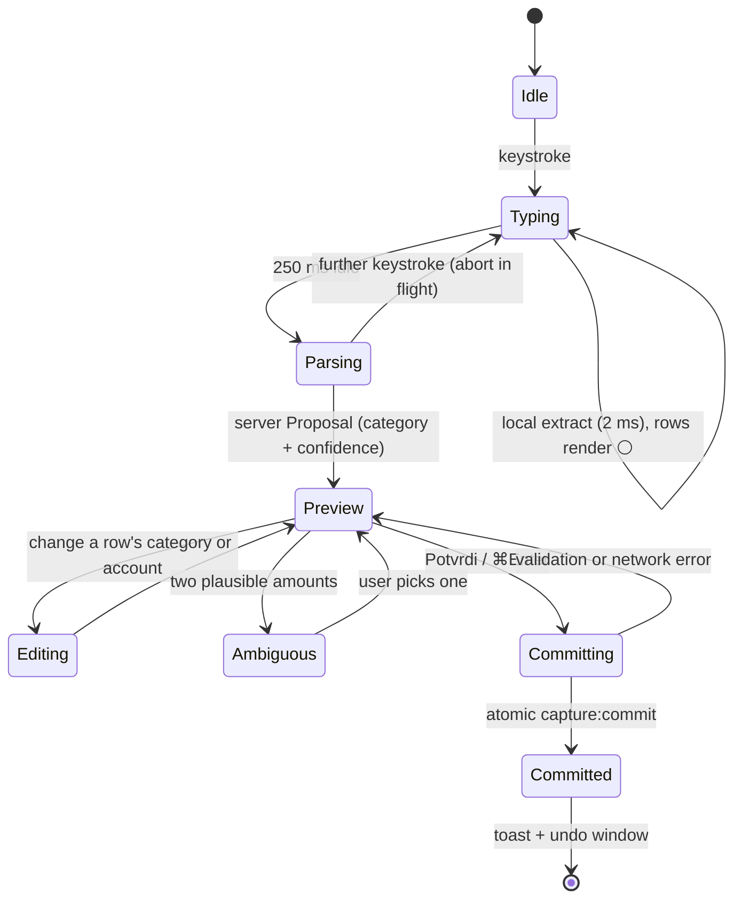
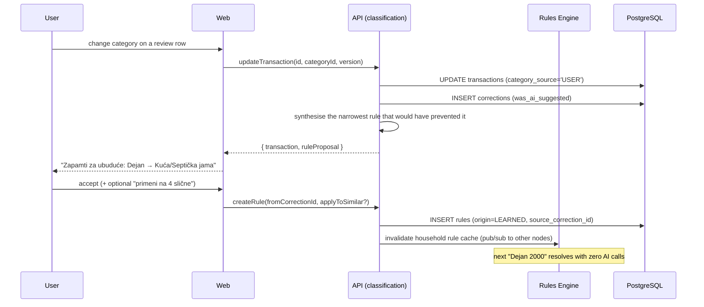
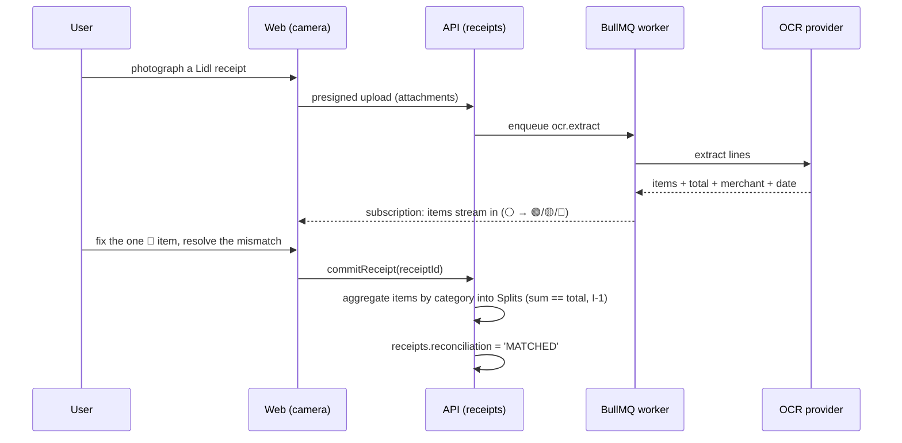

# 02 — UX Flows and Screens

**Status:** Baseline for release 1.0 · **Scope:** every screen, flow, state and string the MVP ships.

This document is the UI truth of the plan. It consumes the vocabulary of [03](03-domain-model.md)
verbatim, the feature IDs of [01](01-product-requirements.md), the pipeline of
[04](04-categorization-and-ai-engine.md) and the feature/module layout of [05](05-architecture.md).
Platform mechanics — breakpoints, offline storage, keyboard plumbing, accessibility testing — belong
to [07](07-platform-strategy-mobile-desktop.md); this document is the UX layer that sits on top and
links to it rather than restating it.

Non-negotiables inherited from the ADR log ([14](14-decisions-and-risks.md)); referenced by number only:

| ADR | Consequence for this document |
|---|---|
| ADR-001 | Every figure on every screen is rendered from a backend-computed value. No client arithmetic, no model arithmetic. |
| ADR-002 | The preview always states which layer decided: `RULE` / `KEYWORD` / `MERCHANT_DEFAULT` / `COUNTERPARTY_DEFAULT` / `AI` / `FALLBACK`. |
| ADR-003 | Money crosses the wire as integer minor units; one component renders it (`ui-money`), one edits it (`ui-money-input`). |
| ADR-004 | Screens map 1:1 onto `apps/web/src/app/features/*`. |
| ADR-005 | Prisma owns persistence; no screen depends on ORM shape. |
| ADR-006 | One Angular SPA, PWA-first, no SSR — every screen below is client-rendered and offline-capable. |
| ADR-007 | AI preferences are per-task routing (`PARSE`/`CLASSIFY`/`NARRATE`/`OCR`/`EMBED`), surfaced in Settings. |
| ADR-008 | Household is the tenancy boundary. v1 is single-household per session: no switcher, no household id in any URL or payload. |
| ADR-009 | The three gates (≥ 0.90 auto / 0.60–0.89 verify / < 0.60 ask) drive every badge and the review-queue lanes. |
| ADR-010 | "Zapamti za ubuduće" synthesises a **Rule**. There is no fine-tuning UI and no "teach the model" copy. |
| ADR-011 | One ledger currency per household; currency selectors are read-only, not broken-looking. |
| ADR-012 | No Open Banking screens, no native-app screens. "Add an account" is manual. |
| ADR-013 | Single-node deployment: no tenant/plan administration UI. |
| ADR-014 | **The name is `FinMate`** (owner decision 2026-09-17; screening outstanding, R-28). **No user-facing string hardcodes a brand** — the shell renders an `APP_NAME` config token, so a rename stays one commit plus a manifest. |

**Vocabulary in copy.** §10 maps canonical terms to Serbian UI words (`Merchant` → **prodavac**). Those
are translations, not aliases: the entity is still `Merchant` in prose, code and the API.

---

## 1. Design principles

Eight principles. Every screen below is justified by one; a screen that cannot be is not shipping.

| # | Principle | Concretely | Features |
|---|---|---|---|
| **DP-1** | **Input-first, not navigation-first** | The capture field is on the dashboard, the transactions list, the assistant and the mobile shell. A user never navigates *to* capture; it is already there. | F-05, F-06 |
| **DP-2** | **Correction is a first-class outcome** | A wrong category is expected, not an error. Fixing it is one tap from the row and is rewarded with a durable Rule. Copy never says *greška* for an uncertain classification. | F-08, F-09 |
| **DP-3** | **Mobile-first, desktop-complete** | 390 px is the design; 1440 px is a strict superset (same routes, actions and data, plus density, keyboard, multi-select). No required feature is desktop-only. | F-26, ADR-006 |
| **DP-4** | **No hidden state changes** | Nothing changes a saved value without announcing it: offline re-classification shows a diff, a learned Rule is proposed, a bulk re-classify is previewed. | ADR-001, ADR-010 |
| **DP-5** | **Uncertainty is visible and cheap to resolve** | Confidence is icon + text + number at row level, with alternatives one keystroke away. Being unsure is a normal state. | F-08, ADR-009 |
| **DP-6** | **Progressive disclosure over forms** | The default capture row shows amount, description, category, confidence. Merchant, Counterparty, Account, date, tags and Splits are one chevron away and pre-filled. | F-05, F-15 |
| **DP-7** | **Every empty state is a job to be done** | It names the next action and performs it in place. Decorative empty states are a defect. | §6 |
| **DP-8** | **The manual path is never degraded** | If AI is unavailable, capture still works, still saves, and falls back to the manual form. Degradation changes convenience, never capability. | ADR-002, [04 §9](04-categorization-and-ai-engine.md) |

Two cross-cutting rules: **the client never computes money** (ADR-001 — totals, remainders,
projections and the split difference all come from the server or from `packages/domain`) and **nothing
blocks capture** (sheets dismiss on swipe, `Esc` and scrim tap; the only non-dismissible surfaces are
household deletion and a version conflict, both of which require a choice).

---

## 2. Information architecture and navigation

### 2.1 Route map

Household is resolved from the session, never the URL (ADR-008).

| Route | Screen | F-IDs | Nav slot |
|---|---|---|---|
| `/sign-in`, `/sign-up`, `/reset-password`, `/verify-email` | Auth | F-28 | — |

> **Build state (5.8).** **All four exist**, and the row above was corrected to the paths that ship: the
> inventory used to name `/auth/verify` and `/auth/reset`, which were never built, while the mails have always
> linked to `/verify-email` and `/reset-password` — the app's convention is a flat kebab-case route beside
> `/sign-in`, and the API's own endpoints are `verify-email`/`reset-password`. So the two screens were added at
> **the paths the emails already carry** rather than renaming the mail template. Both are **unguarded**: the
> reverse guard would bounce a signed-in visitor (exactly who clicks an emailed link) to `/`, and the token — not
> a session — is what authorises the change.
>
> **`/sign-up` also asks for the ledger currency (ADR-045).** §4.18's account shell and this wireframe never
> showed one because the server simply wrote `ledger_currency = 'RSD'`; a Household created in Berlin was born
> with a dinar ledger and the reader was never asked. The form now carries a **Currency** select — every
> currency the ledger can keep, labelled by CLDR through `Intl.DisplayNames` so the names are in the reader's
> current language — **pre-filled from the browser's own locale** via `suggestCurrencyForLocale`, with a hint
> saying what the choice does. The browser's region is used rather than the app's language deliberately: an
> English-speaking reader in Germany should be offered EUR. ⚠️ **The choice is permanent today** — no screen
> and no mutation update `households.ledger_currency` (**R-39**), so the pre-fill and the hint carry the whole
> burden of getting it right.
>
> **`/reset-password` is one route with two questions**: no `token` asks for the address (reachable from
> *Zaboravio si lozinku?* on `/sign-in`), and `?token=…` asks for the new password. The request answer is
> deliberately the same whether or not the account exists, because the API answers `204` for any address; a spent
> or expired token turns into the one action that helps — *Zatraži novi link*. The screen and `/sign-in` were
> formerly one form twice over; the four auth screens now share one style block and one password-policy constant
> (`features/auth/auth.styles.ts`, `password-policy.ts`). **Verified live 17/17** against the production build,
> with Mailhog as the mail source: the link works **while signed in**, the changed password signs in, the demo
> password was restored through the same flow, and a second click on a confirmation link reports the dead link.
>
> ⚠️ **Two gaps this task found and did not close, both named in docs/09's 5.8 row.** (1) `users.email_verified_at`
> is written by `/verify-email` and **read by nothing** — logging in does not require it and no feature is gated on
> it, so the confirmation screen's failure copy says so rather than implying a lockout; deciding what verification
> *should* gate is a product and security decision, not a UI one. (2) There is **no way to re-send a verification
> email**: only signup and the password-reset request issue tokens, so an expired confirmation link has no in-app
> recovery. It costs the user nothing today *because* nothing is gated — the two gaps are the same gap.
>
> **Build note (0.6.6, and a defect fixed after the owner hit it).** `/sign-in` is **two steps** when the
> account has a second factor ([ADR-041](14-decisions-and-risks.md)): the password step returns
> `mfaRequired`, the API sets **no cookie**, and the screen swaps to a code field instead of navigating —
> only the second step mints a session. The field takes any of the three kinds (authenticator, emailed,
> recovery) because the server decides from the challenge, and *Email me a code* appears only when the
> challenge lists that factor (it is sent **on demand**, not with the password step).
>
> ⚠️ **The code step shipped broken, and the form's own shape was the cause.** It bound
> `(ngSubmit)="verify()"` on a `<form>` with **no form directive** — `ngSubmit` is an output of
> `FormGroupDirective`/`NgForm`, so nothing emitted it, and nothing called `preventDefault()` either; the
> browser did a **native GET submit** to the same URL. The owner's report was exactly that: entering a
> correct code "returned to the login page", because the reload threw away the single-use challenge and the
> access token, both of which live only in memory. Measured in the browser: navigation to `/sign-in?`,
> `POST /auth/login/mfa` **never sent**, password form back. The password step was never affected because
> `[formGroup]` binds the directive. The code step is now a reactive form like its sibling, and a spec
> drives the **real submit event** and asserts `verifyMfa` ran *and* the default was cancelled — the
> previous MFA tests called `verify()` directly, which is why none of them could see it (docs/15).
> **Verified live after the fix, 7/7 + 4/4**: a wrong code is refused without leaving the form, a right
> code signs in and the session survives a hard reload, a recovery code works, and an emailed code
> requested by the button arrives and signs in.

| `/onboarding` | Onboarding wizard | F-13 | — |
| `/` | Dashboard | F-19, F-21 | Danas |
| `/capture` | Capture | F-05, F-06, F-14 | ➕ centre action |
| `/transactions` | Transactions list | F-24, F-04, F-25 | Transakcije |
| `/transactions/:id` | Detail / edit + Splits | F-04, F-15, F-12, F-31, F-34 | drill-in |
| `/review` | Review queue | F-08 | Provera |
| `/categories` | Category tree + keywords | F-02, F-03, F-32 | Više › Biblioteka |
| `/merchants`, `/merchants/:id` | Merchants | F-10 | Više › Biblioteka |
| `/counterparties`, `/counterparties/:id` | Counterparties | F-11 | Više › Biblioteka |
| `/rules`, `/rules/:id` | Rules manager | F-09 | Više › Biblioteka |
| `/receipts`, `/receipts/:id` | Receipts | F-14, F-34 | Više › Biblioteka |
| `/pending` | Pending sync (the offline outbox) | F-26 | — (header sync chip) |
| `/budgets` | Budgets | F-17 | Više › Plan |
| `/goals` | Savings goals | F-18 | Više › Plan |
| `/recurring` | Recurring rules | F-16 | Više › Plan |
| `/analytics` | Analytics | F-20 | Više › Uvid |
| `/assistant` | Assistant | F-23, F-30 | Više › Uvid |
| `/notifications` | Notifications centre | F-22 | 🔔 header |
| `/settings` (+ `/ai`, `/accounts`, `/data`, `/alerts`) | Settings | F-32, F-01, F-25, F-27 | Više › Nalog |

### 2.2 Navigation model

Size classes are [07 §3.1](07-platform-strategy-mobile-desktop.md): `compact` < 600 · `medium`
600–1023 · `expanded` 1024–1439 · `large` ≥ 1440. Five destinations only —
**Danas · Transakcije · ➕ Unos · Provera · Više** — and the review slot is the only badged one.

```text
┌──────────────────────────────────────────────────────────────────────────────────┐
│ COMPACT (390 px)             │ EXPANDED / LARGE (1440 px)                        │
├──────────────────────────────┼───────────────────────────────────────────────────┤
│ ┌──────────────────────────┐ │ ┌──────────┬──────────────────────────────────────┐ │
│ │ Danas        🔔³  ◐      │ │ │ Unos     │ Danas           🔔³  ⚙   ◐ Goran    │ │
│ │ ┌──────────────────────┐ │ │ │ ┌──────┐ ├──────────────────────────────────────┤ │
│ │ │ Lidl 2000…        ➤  │ │ │ │Lidl…➤│ │ (content; list + detail at ≥1024,     │ │
│ │ └──────────────────────┘ │ │ └──────┘ │  + Insight rail at ≥1440)             │ │
│ │                          │ │ Danas    │                                      │ │
│ │   (scrolls)              │ │ Transak. │                                      │ │
│ │                          │ │ Provera² │                                      │ │
│ │                          │ │ Plan   ▸ │                                      │ │
│ ├──────────────────────────┤ │ Uvid   ▸ │                                      │ │
│ │ Danas Trans. ➕ Prov.² Više│ │ Bibliot▸ │                                      │ │
│ └──────────────────────────┘ │ └──────────┴──────────────────────────────────────┘ │
└──────────────────────────────────────────────────────────────────────────────────┘
```

- Sidebar groups: **Unos** (pinned capture field) · **Danas** · **Transakcije** · **Provera** ·
  **Plan** (Budžeti, Ciljevi, Ponavljajuće) · **Uvid** (Analitika, Asistent) · **Biblioteka**
  (Kategorije, Prodavci, Osobe, Pravila, Prijemi) · **Nalog** (Podešavanja).
- **The chrome is a frame, not the top of the page.** Every signed-in screen sits in a shell exactly one
  viewport tall, and the **content region is the only thing that scrolls** — so the header and the
  navigation stay where they are while a long ledger moves, and a screen's own sticky element sticks
  below the header rather than under it ([07 §7.4](07-platform-strategy-mobile-desktop.md)'s *"never
  obscured by sticky chrome"*). The sidebar's destination list is what scrolls *inside* the sidebar,
  which is what keeps **Podešavanja** — Nalog's single entry — pinned to the bottom of the column at any
  window height: measured live at 1280×500 px, where sixteen destinations do not fit and the Settings
  row is still on screen. The shell returns the content region to the top on navigation, because the
  router's own `scrollPositionRestoration` moves the window and the window no longer moves.
- `medium` keeps the bottom bar to 840 px, then becomes an icon rail ([07 §3.3](07-platform-strategy-mobile-desktop.md)).
- Header on both: offline chip (offline or stale only), 🔔 unread, ⚙, avatar menu (Profil,
  Podešavanja, Jezik, Tema, Odjavi se).
- The offline chip's `pendingCount` renders as **`Čeka slanje (n)`** and is the entry point to
  `/pending` (ADR-026) — a route without a nav slot, like `/notifications`, so the nav keeps its one
  badged destination (docs/02 §2.3). The tray itself is §4.3's offline half: rows with the raw input,
  local time, attempt count and the last error in plain language, per-row *Pokušaj ponovo* and *Odbaci*,
  *Pokušaj sve*, *Izvezi kao tekst*, and *Pregledaj razlike (n)* when the server classified a queued row
  differently — before → after per row, with the server's *Zašto* line, never applied silently.
- Below the header, above the screen: the **app-update line** (ADR-024) — *"A newer version of the app is
  ready."* with a *Reload* action, shown only when the service worker has a version installed and waiting.
  It has **no dismiss control** (docs/08 §12 wants a forced flow rather than an indefinitely stale shell)
  and it never reloads by itself (docs/10 §8.3 wants a prompt rather than a swap under an active capture),
  so the reload happens only when the user presses it. A second sentence covers the other case — the
  shell's own cache missing a file — where reloading is the only fix and there is no version to activate.
  It is chrome rather than a screen, so it appears over `/onboarding` too, where the nav is hidden.
- The household switcher exists in the avatar menu **disabled with a tooltip** (*Dostupno uz deljenje
  domaćinstva*) — the schema supports it and v2 enables it (F-29, ADR-008). It is never a broken control.

#### Add-to-Home-Screen panel — F-26 (chrome, not a screen)

Built in 4.3.2b to [07 §4.7](07-platform-strategy-mobile-desktop.md#47-install--add-to-home-screen)'s table.
It is chrome for the same reason the update line above is: it opens by itself, on whatever screen the
second confirmed capture happened to be.

| Property | Behaviour |
|---|---|
| Appears | After the **2nd** capture the server **accepted**. Never on first load, never during `/onboarding`, never in `display-mode: standalone`, and never a second time once offered — a *dismissal* is what starts the 30-day clock, and after it the next confirmed capture may offer again |
| Chromium | `beforeinstallprompt` is taken over (`preventDefault`) and held; the panel's *Instaliraj* runs the browser's own prompt. A refusal from the browser is said out loud, with the browser menu named — the panel does not close as if it worked |
| iOS Safari | Instructions, not a button: Share → *Dodaj na početni ekran* → *Dodaj*, then open the app from the Home Screen. There is **no** install verb, because Safari exposes no install API |
| Other browsers | Nothing at all — Firefox and desktop Safari have neither an API nor a menu that matches |
| Placement | Inside `<main>`, under the update line and above the route. **Not** a modal and **not** a bottom sheet yet: §7.4's focus/trap rules describe a sheet the user opened, and 07 §4.7 forbids blocking the app behind an install, so focus is never moved and the background is never inert |
| Verbs | *Instaliraj* + *Ne sada* (Chromium) · *Razumem* (iOS). Keyboard-operable; the panel is a labelled `region`, not a dialog |
| Copy | 07 §4.7's honest CTA — *"Dodaj na početni ekran — dobijaš obaveštenja."* — plus one sentence naming the permission the app still has to ask for separately |
| Telemetry | `install.prompt_shown` / `install.accepted`, recorded **on the device only** — there is no collector (07 §4.7's residual). Acceptance is a measurement (the browser's answer, or a later standalone launch), never a button that claims it |

⚠️ **Not looked at by a human at any width**, like every screen since `/review` (docs/02 §9). The measured
facts are 320/768/1280 px with no horizontal overflow and axe clean; whether the panel belongs at the top
of the content or anchored to the bottom of a phone screen is a judgement for the visual pass.

### 2.3 The review-queue badge

| Property | Behaviour |
|---|---|
| Source | Count of Transactions with `needs_review = true`, `deleted_at IS NULL`, via the partial index in [03 §4](03-domain-model.md). |
| Lanes | **Lane A — "Čeka odluku"**: `needs_review = true` (confidence < 0.60 or `category_id IS NULL`, I-8). **Lane B — "Za proveru"**: `category_source = 'AI'` and `0.60 ≤ confidence < 0.90` ([04 §7](04-categorization-and-ai-engine.md#7-stage-6-confidence-gates) is canonical). The **badge counts Lane A only**; Lane B is a tab inside the queue. |
| Rendering | Hidden at 0, `1`–`9` literal, `9+` above. Never `99+` — the queue is a to-do list, not a metric. |
| Realtime | GraphQL subscription on the count; optimistic decrement when the client resolves a row. |
| Accessibility | Accessible name is *Provera, 3 stavke čekaju* — the count is spoken, not only drawn. |
| Feedback | Clearing Lane A animates to zero and shows one toast, once per session. No celebration loop. |

> **Two-lane model (resolved upstream — see [04 §7](04-categorization-and-ai-engine.md#7-stage-6-confidence-gates)
> and [03 I-8](03-domain-model.md#5-invariants-enforced-in-the-service-layer--tests)).** The blocking lane
> is exactly `needs_review = true` (`confidence < 0.60` or `category_id IS NULL`); the advisory lane is
> derived from `category_source = 'AI'` with `confidence` in `[0.60, 0.90)`. The nav badge counts the
> blocking lane only, because a badge that never clears is a badge users learn to ignore.

---

## 3. The signature interaction: the capture field

One component, `CaptureField`, mounted in the dashboard hero, the transactions list header, the
assistant composer and `/capture` (full-screen, and the only variant that carries the receipt action).

```text
┌──────────────────────────────────────────────────────────────────────────────────┐
│ COMPACT (390 px)             │ WIDE (1440 px)                                    │
├──────────────────────────────┼───────────────────────────────────────────────────┤
│ ┌──────────────────────────┐ │ ┌───────────────────────────────────────────────┐ │
│ │ Šta se danas dešavalo sa │ │ │ Šta se danas dešavalo sa novcem?              │ │
│ │ novcem?                  │ │ │ Lidl 2000, gorivo 3500, Dejan rođa 3600▏      │ │
│ │ Lidl 2000, gorivo…▏      │ │ └───────────────────────────────────────────────┘ │
│ └──────────────────────────┘ │ Pregled pre potvrde         [📷 Račun]  [3 ▸]    │
│ [📷]            [Pregled ▸]  │ 🟢 Lidl      2.000,00 RSD  Hrana      ⌄ ×        │
│ 🟢 Lidl      2.000,00 RSD    │    Tvoje pravilo: lidl → Hrana                  │
│    Hrana              ⌄  ×  │ 🟢 gorivo    3.500,00 RSD  Auto/Gorivo ⌄ ×       │
│ 🔴 Dejan rođa 3.600,00       │ 🔴 Dejan rođa 3.600,00 RSD  ⚠ nisam siguran      │
│    ⚠ [Kuća/Septička ▾]       │    [Kuća/Septička jama ▾] [Porodica/Pokloni]     │
│ [ Potvrdi 2 · 1 na proveru ] │ [ Potvrdi 2 · 1 na proveru ]   ⌘⏎   Esc          │
└──────────────────────────────┴───────────────────────────────────────────────────┘
```

| Aspect | Specification |
|---|---|
| **Local parse** | `packages/nlp` runs **in-browser, synchronously, per keystroke** (~2 ms): segmentation, normalization, amount/date/direction extraction. Structure is visible before any network call ([05 §5.3](05-architecture.md)). |
| **Focus** | Never autofocused on route entry (it would raise the mobile keyboard). Desktop: `n` or `⌘K` ([07 §5.3](07-platform-strategy-mobile-desktop.md)). Mobile: tap the field, or the `➕` action. `Esc` blurs; a non-empty draft requires confirmation to clear. |
| **Debounce** | Server `capture:parse` fires **250 ms after the last keystroke**, is abortable, and supersedes in-flight requests. Local parse is never debounced. |
| **Progressive preview** | A row appears as soon as local extraction yields `amountMinor` + description, in the ⚪ *Računam…* state. The server response fills category, confidence, deciding layer and alternatives; a row never disappears on response, only its badge changes. |
| **Confidence** | `ui-confidence-badge`, four states: 🟢 ≥ 0.90 auto · 🟡 0.60–0.89 verify · 🔴 < 0.60 ask · ⚪ awaiting server (no `ClassificationDecision` yet). Always icon + text + number, never colour alone. |
| **Provenance** | One dim line per row from `classification_decisions.decided_by`: *Tvoje pravilo: lidl → Hrana*, *Poklapanje ključne reči: septička*, *Podrazumevano za Dejan*, *AI predlog, 61 %*. Tapping opens the audit chain (§4.5). |
| **Inline pickers** | Category always; Account when the household has > 1. Merchant, Counterparty, date and tags sit behind the row chevron and are pre-filled. `ui-category-picker` is filtered by `kind`, so an EXPENSE can never take an INCOME category (I-3). |
| **Ambiguity** | With two plausible amount readings (`1.200` → 1200 vs 1.2) both render as chips, higher-probability preselected, and commit is refused until one is chosen — the parser never silently picks ([04 §3.1](04-categorization-and-ai-engine.md)). |
| **Blocked rows** | `< 0.60` is never auto-applied (ADR-009). The button reads **Potvrdi 2 · 1 na proveru**; `⌘Enter` force-confirms by persisting the blocked row as `PENDING, needs_review = true`. Blocking the whole batch is forbidden (F-06). |
| **Bulk confirm** | One `capture:commit` mutation with all rows and **one** `idempotency_key`. Atomic. The Apollo cache normalises by id, so dashboard, list and budget tiles update with no refetch. |
| **Undo** | Toast *Dodato 3 · Poništi* for 10 s; undo soft-deletes the created Transactions in one call with `audit_log` entries and is also reachable later as Restore. Never a hard delete ([03 §3.4](03-domain-model.md)). |
| **Duplicates** | (a) Exact `idempotency_key` replay returns the original rows silently, creating nothing (I-10). (b) Heuristic near-duplicate — same resolved Merchant/Counterparty, identical `amountMinor`, same `occurred_local_date`, within 5 minutes — renders an amber row: *Izgleda kao duplikat · Ipak dodaj · Prikaži postojeću*. Only (a) is silent. |
| **Draft** | Text and uncommitted rows persist to IndexedDB on every change, survive reload and navigation, and clear only on commit or explicit clear. A back gesture never loses a draft. |
| **Offline** | Fully functional: rows classify locally as far as cached rules allow, otherwise stay ⚪ and queue with `client_id` + `idempotency_key` (F-26). |



| Key (capture) | Action |
|---|---|
| `Enter` | Confirm all confirmable rows; if any row is blocked or ambiguous, focus it instead |
| `⌘Enter` / `Ctrl+Enter` | Confirm everything, blocked rows to `PENDING` |
| `Shift+Enter` | Newline in the field |
| `Tab` / `Shift+Tab` | Between rows, then between a row's inline controls |
| `↑` / `↓` in a picker | Move the highlighted category; type to filter; `Enter` selects |
| `⌫` on an empty row | Remove the row from the batch |
| `Esc` | Close an open picker, then blur |

---

## 4. Screen specifications

State behaviour lives in §6, not repeated per screen.

### 4.1 Onboarding wizard — F-13

Eliminates the cold-start before the first entry. Under 3 minutes, skippable at every step,
re-enterable from Settings ([01 §5](01-product-requirements.md)). Progress is stored on the Member so
a killed app resumes at the same step.

| Step | Elements | Seeds | Skip |
|---|---|---|---|
| 1 | Starter tree preview (~40 Serbian nodes), inline rename/delete, *Dodaj kategoriju* | Categories (`is_system = true`) | Empty tree + a note that categorisation stays manual |
| 2 | Currency (read-only — the Household's ledger currency, the one chosen at signup, ADR-011/ADR-045) + account multi-select with optional opening balance | Accounts (`CASH`/`BANK`/`CARD`/`OTHER`) | One `CASH` account, *Gotovina* |
| 3 | *Kome redovno plaćaš?* free text, e.g. `Dejan rođa, septička jama` | Counterparty + alias + a **proposed** Rule | Nothing |
| 4 | *Gde kupuješ?* multi-select from the ~60 shipped global Merchants | Merchant links + aliases | Nothing; the tree's keywords still categorise |
| 5 | Optional monthly income + savings target | Household Budget and/or SavingGoal skeleton | Dashboard shows its no-data states |
| 6 | Guided first entry: the user types a real transaction, one row expands *Zašto ova kategorija?* | First real Transaction | Coach mark on the capture field |

```text
┌──────────────────────────────────────────────────────────────────────────────────┐
│ COMPACT — step 3             │ WIDE — step 1                                     │
├──────────────────────────────┼───────────────────────────────────────────────────┤
│ ┌──────────────────────────┐ │ ┌───────────────────────────────────────────────┐ │
│ │ ‹ Nazad     Korak 3/6    │ │ │ Korak 1 od 6 · Izaberi početne kategorije     │ │
│ │ Kome redovno plaćaš?     │ │ │ ┌─ Troškovi ─────────┬─ Prihodi ──────────┐   │ │
│ │ [Dejan rođa, septička…▏] │ │ │ │ ▸ Hrana            │ ▸ Plata            │   │ │
│ │ Predlozi:                │ │ │ │ ▸ Automobil        │ ▸ Ostali prihodi   │   │ │
│ │ 👤 Dejan                 │ │ │ │ ▸ Kuća  ▸ Porodica │                    │   │ │
│ │    Kuća/Septička jama    │ │ │ └────────────────────┴────────────────────┘   │ │
│ │    [ Dodaj ]             │ │ │ 40 kategorija · menjaš ih kasnije             │ │
│ │ [Preskoči] [Nastavi ▸]   │ │ │ [ Preskoči ]              [ Nastavi ▸ ]       │ │
│ └──────────────────────────┘ │ └───────────────────────────────────────────────┘ │
└──────────────────────────────────────────────────────────────────────────────────┘
```

Step 6 is the only place the app teaches by interruption, and it fires once per household.

> **Corrections (task 2.3.3).**
>
> 1. **Step 4's Skip does not leave the global seeds matching.** It said *"Global seeds still match at
>    classify time"*, and that is false in the built system: `loadContext` loads
>    `merchants WHERE household_id = <household>`, which excludes the `household_id IS NULL` rows, and
>    the tenancy guard's global-read arm cannot widen a predicate the caller already narrowed. Making
>    the globals resolvable is not simply "delete the filter": a Household that has edited a shipped
>    merchant owns a copy-on-write duplicate of it, so the context would contain two entities with one
>    name and resolution would depend on which row won — that needs a precedence rule and its own
>    tests, and it is recorded as a known gap rather than smuggled into this task. The Skip copy now
>    says what is true: skipping step 4 leaves the category keywords to do the work, which they do.
> 2. **Progress is stored on the Household, not on the Member.** `household_members` has no settings
>    column, and in v1 a Household has exactly one Member (F-29 is a `Won't`), so the step is recorded
>    in `households.settings.onboarding`. A per-member step becomes meaningful when sharing lands; see
>    [06 §5.12.1](06-api-specification.md).
>
> 4. **What step 1 ships (task 2.3.3b): a preview, not an editor.** The table above asks for inline
>    rename/delete and *Dodaj kategoriju*. The wizard previews the tree it is about to create and links
>    to `/categories`, which is the shipped tree editor with I-11/I-12 already enforced. A second editor
>    inside the wizard would be a second implementation of the same invariants for one screen's
>    convenience, and the wireframe's own copy says *menjaš ih kasnije*. Rename/delete in step 1 is
>    therefore **not built** and is not a gap in the feature: the editor is one tap away.
> 5. **Step 5 offers a monthly budget, not "monthly income + savings target".** SavingGoal is Phase 3
>    (task 3.3.2) and does not exist, and the budget model is expense-side only, so an income figure has
>    nowhere to go. What step 5 writes is a whole-household monthly `Budget`, which is what the
>    dashboard's safe-to-spend actually reads.
> 6. **Step 3 needs a category picker, and the wireframe does not show one.** The pipeline suggests a
>    category when the *phrase* implies one (`septička jama` does) and suggests nothing for a person's
>    name (`Dejan rođa`), verified live. Without a picker, step 3 could only ever create a rule for a
>    bill — so the F-09 case ("correct `Dejan` once and it is learned") would be unreachable from
>    onboarding. Each card therefore has a category select, seeded with the suggestion when there is
>    one; *Dodaj* creates the Counterparty either way and a Rule only once a category is chosen.
> 7. **The navigation is hidden during onboarding.** The wireframe draws a full-screen wizard with only
>    *Back* and *Step 3 of 6*; a list of ten destinations beside "pick your starting categories" invites
>    the user to leave the one flow that decides whether the product is useful. Every step still has
>    Skip, so this is not a trap.
> 3. **Step 1 is what makes the promise work, and it needs keyword *weights*.** Deciding a category
>    from keywords requires a score of 2.0 ([04 §5.4](04-categorization-and-ai-engine.md)) and the
>    schema default weight is 1.0, so a tree seeded at the default categorises nothing. The shipped
>    tree marks decisive words at 2.0; see [04 §8.1.3](04-categorization-and-ai-engine.md).
> 8. **The wizard serves the Household's own currency, and step 2's Continue is not gated on a count
>    only its own write produces** (found by the 2026-09-21 wizard pass). Two defects, both from the
>    same assumption that `RSD` and "zero accounts" are the normal fresh state:
>    - Step 2's field was the literal `RSD` and step 5 parsed its budget as `RSD`, so an EUR Household
>      was shown a dinar label and a JPY Household's budget was inflated 100×. `onboardingState` now
>      carries `currency` and both steps use it.
>    - Step 2's *Nastavi* was gated on `accountCount > 0`, which is zero precisely because that button
>      is what calls `createAccount`: a fresh Household could only press *Preskoči (koristi gotovinu)*,
>      which ignored the typed name and kind. This is the step-1 deadlock fixed after 2.3.3b, left standing
>      one step later; the gate now also reads the name the step would write.
>    Both are recorded as gotchas in [15](15-implementation-gotchas.md).

### 4.2 Dashboard — F-19, F-21 (+ F-22 feed, F-08 callout)

Answers *can I spend today?* and *will I make it to payday?* in one glance, and is the fastest door
into capture.

```text
┌──────────────────────────────────────────────────────────────────────────────────┐
│ COMPACT (390 px)             │ WIDE (1440 px)                                    │
├──────────────────────────────┼───────────────────────────────────────────────────┤
│ ┌──────────────────────────┐ │ ┌───────────────────────────────────────────────┐ │
│ │ Danas         🔔³  ◐     │ │ │ Unesi: Lidl 2000…                          ➤  │ │
│ │ [Lidl 2000…           ➤] │ │ │ Možeš danas da potrošiš      2.350,00 RSD     │ │
│ │ Možeš danas da potrošiš  │ │ │ 120.000 − 68.450 − 12.000 − 25.000 = 14.550   │ │
│ │ 2.350,00 RSD             │ │ │ ▓▓▓▓▓▓▓░░░ 57 % budžeta potrošeno             │ │
│ │ ▓▓▓▓▓▓▓░░░ 68.450/120.000│ │ │ Predviđanje 144.000 (+24.000) ⚠  Štednja 70 % │ │
│ │ Predviđanje 144.000 ⚠    │ │ │ Uvidi: Hrana 82 % → Budžeti · 8.200 manje nego│ │
│ │ ⚠ 2 za proveru        ›  │ │ │ prošli mesec · Netflix sutra 1.299            │ │
│ │ 🟡 Hrana 82 % → Budžeti  │ │ │ Skorašnje: Lidl −2.000 Hrana · Gorivo −3.500  │ │
│ │ Lidl −2.000 · Dejan ⚠    │ │ │ Auto · Dejan −3.600 ⚠ Čeka odluku      Sve ›  │ │
│ └──────────────────────────┘ │ └───────────────────────────────────────────────┘ │
└──────────────────────────────────────────────────────────────────────────────────┘
```

- **Safe-to-spend disclosure.** The hero expands into a plain-language breakdown listing every input
  (budget, spent, reserved for remaining recurring obligations, savings target, days elapsed) and the
  formula in words. Trust feature, not a tooltip. It carries *podaci od 14:02* when the value came
  from cache (F-26).
- **Pending strip.** While a `PENDING` Transaction exists, a non-blocking strip reads *2 transakcije
  čekaju odluku · ne ulaze u obračun* → `/review`. PENDING rows contribute to no figure (I-7); the
  strip exists so the numbers are never mysterious.
- **Rebuilt from a reference design in ADR-039, with four recorded deviations.** The screen is now a
  greeting, a KPI row (available to spend · income · spent · projected), a spending-by-category donut, a
  daily income/expense chart, saving goals, recent transactions, the assistant card and the alerts rail.
  Where it disagrees with the wireframe above, and why:
  - **The greeting has no name.** The reference reads *"Good evening, Goran!"*; `users.display_name`
    exists but **no operation returns it** — a session carries an id, a household and a role — and
    deriving a name from an email local part would be a fabricated identity. The account block names the
    **role** for the same reason, and exposing the column on `/auth/me` is the one-field API change that
    would let this line read like the reference.
  - **Safe-to-spend did not lose its place.** The wireframe's hero is the safe-to-spend disclosure and the
    reference's first card is the month's *available*, so the hero carries **both**: `available` as the
    figure, the budget as its denominator, the progress bar over the month, and safe-to-spend today on the
    footnote line. Neither number is invented and neither replaced the other.
  - **The breakdown is not expanded on the screen.** §4.2's plain-language disclosure of every input is
    still a docs/02 §4.2 requirement the screen does not meet; the figures and their denominators are
    shown, the formula in words is not.
  - **The panels are a second round trip, and a failure is not an empty chart.** They are asked for over
    the period **the server named** (a month boundary is the Household's local calendar, docs/03 §3.2),
    and with no payload the screen says the breakdowns need a connection rather than drawing an empty
    donut that reads as "you spent nothing" (ADR-027's 4.2.8b amendment).


### 4.3 Capture — F-05, F-06, F-14

The full-screen / sheet variant of §3, with the receipt entry point.

```text
┌──────────────────────────────────────────────────────────────────────────────────┐
│ COMPACT (390 px)             │ WIDE (1440 px) — side sheet                        │
├──────────────────────────────┼───────────────────────────────────────────────────┤
│ ┌──────────────────────────┐ │ ┌───────────────────────────────┬───────────────┐ │
│ │ ✕   Novi unos            │ │ │ (preview identical to §3,     │ Lidl 2000,    │ │
│ │ [Lidl 2000, gorivo…▏]    │ │ │  wide rows: amount left,      │ gorivo 3500…▏ │ │
│ │ 🟢 Lidl      2.000,00 RSD│ │ │  category + badge right)      │ [📷 Račun]    │ │
│ │    Hrana             ⌄ × │ │ │                               │ Datum [danas▾]│ │
│ │ 🟢 gorivo    3.500,00 RSD│ │ │                               │ Račun [Kartica│ │
│ │    Auto/Gorivo       ⌄ × │ │ │                               │        ▾]     │ │
│ │ 🔴 Dejan 3.600,00 ⚠      │ │ │                               │ [Potvrdi 2 ▸] │ │
│ │ [📷 Račun]               │ │ │                               │               │ │
│ │ [Potvrdi 2 · 1 proveru]  │ │ │                               │               │ │
│ └──────────────────────────┘ │ └───────────────────────────────┴───────────────┘ │
└──────────────────────────────────────────────────────────────────────────────────┘
```

Mobile collapses Account and date into one summary chip (*Kartica · danas*); desktop shows them as an
always-visible column.

> **Build state (4.3.1b).** The confirm row ships **inline at the end of the card**, as drawn above. Its
> pinned variant ([07 §4.1](07-platform-strategy-mobile-desktop.md)) is **not built**: `position: sticky`
> on that row computes and does nothing, because the row is the last child of its containing block and has
> no slack to stick into — measured, the button sat 1431 px down on a 720 px viewport. A real pinned bar
> needs this screen to own a scroll container or a fixed bar offset by the bottom nav; scheduled as
> **4.3.1c** rather than faked.

> **Build state (ADR-033's 2026-09-20 amendment): an offline reload opens the app.** [ADR-033](14-decisions-and-risks.md) closed R-27(b), and this amendment widened it. The shell has a **third state** beside the lock screen and the app: an install the lock has **unlocked** whose session could not be restored because *nothing answered* renders the **real shell** — its navigation, the header controls that need no session (theme, language, the queue's sync chip, the bell) and the outlet — with **one persistent line above the content** saying the server is unreachable so the session is not restored and the queued captures will be sent once the user is back online and signed in, plus a *Sign in* action. **Every route is reachable**, so what a person sees is each screen's own offline state: the dashboard serves its snapshot under its `as of` label, `/transactions` its cached ledger, `/capture` queues, and a screen with no local record says it needs a connection. The account block, sign-out and the global search stay hidden — the first two need a session, and the search navigates to a **filtered** read that is deliberately never cached (docs/02 §2: a control that cannot work is not shown). A session the server **refused** (`401`) still stays on `/sign-in` — the classification is one function, `isUnreachable`. Nothing is sent without a session: the flush is skipped without an access token, the tray hides its retry controls rather than offering a button that cannot work, and a `401` is retryable rather than the entry's fault, so a queued capture survives a signed-out reconnect instead of being parked as *cannot be sent*. ⚠️ The app lock is what makes any of this possible: with it **off** nothing is persisted, so there is no snapshot, ledger or queue to serve and the offline state is `/sign-in`.

> **Build state (4.3.6b): the composer works offline, not just in-session.** §3's "fully functional"
> offline row needed one thing the build did not have: an **account**. Offline, the screen's `accounts`
> query fails, `accountId` stayed empty, and `commit()` sent `defaultAccountId: null` — which the server
> refuses for the whole atomic batch (*a row with no accountId needs a defaultAccountId on the request*),
> so a queued capture drained forever and wrote nothing (R-27(a2), measured in 4.3.6). The screen now
> writes and reads **ADR-025 decision 5's taxonomy cache** — the record that already names "the categories
> and accounts the composer needs", and which the `taxonomy` store had carried with no writer since 4.2.2
> — so the account picker, the categories and the preview's category names all survive a failed read.
> Verified live 8/8 against the production build: an airplane-mode `Lidl 2000` queues, drains on
> reconnect, and **writes one transaction carrying the cached account**. Two limits, both honest and both
> named: the cache is written only while the app is **unlocked** (ADR-025 decision 3 — with the lock off
> nothing reaches disk, so a device that has never opened this screen while unlocked still queues without
> an account and is refused in the tray with the server's own message, recoverable from `/pending`); and
> the record expires with the store's **24 h** taxonomy TTL, so a capture after a longer offline stretch
> falls back to that same residue. Whether a *reference* list deserves a longer TTL than a *figure* is a
> decision nobody has made — recorded in docs/09's 4.3.6 row rather than changed here. `📷` moves to overflow when the field is non-empty, so it never competes with
commit.

> **Build state.** The screen ships without the `📷 Račun` affordance, at every size. A photo does not
> belong to a *fragment*: it belongs to a Receipt, which is a separate row with its own lines and its
> own reconciliation, and the receipt flow's entry point shipped as the library's capture action
> (§4.11, task 4.1.5) — the screen that can then itemise what was photographed. Attaching a photo to an
> already-captured Transaction is the sheet's own section (§4.5, 4.1.2).
>
> **The first-use consent sheet lands here** (task 5.2a, docs/08 §6.6, ADR-032): when a preview comes
> back `degraded` — the rules and keywords could not finish the job and a model was needed — and the
> Household has not decided, the sheet opens below the composer. Four conditions, each deliberate: the
> preview must be degraded (a preview the rules finished has no question in it); `askable` must be
> non-null (nothing routed ⇒ nothing to permit, and a decided Household is not asked again); the person
> must not have chosen *Not now* in this visit; and the caller must be the OWNER, who is the only one
> who can decide it (docs/08 §3.7, Q-11) — a MEMBER sees the `degraded` note instead of an interruption
> they cannot act on. *Not now* writes nothing (there is no "asked and unanswered" row to write) and
> suppresses the question for the visit; the way back is `/settings` (§4.18). It is placed **after** the
> composer so the field being typed in never moves under the caret, and at 320 px it adds no horizontal
> overflow — verified live at 320/768/1280 px with all three answers taken.

### 4.4 Transactions list — F-24, F-04, F-25, F-12

```text
┌──────────────────────────────────────────────────────────────────────────────────┐
│ COMPACT (390 px)             │ WIDE (1440 px) — dense table mode                 │
├──────────────────────────────┼───────────────────────────────────────────────────┤
│ ┌──────────────────────────┐ │ ┌───────────────────────────────────────────────┐ │
│ │ Transakcije        🔍 ☰  │ │ │ Lidl 2000… ➤  [Filteri] [Sačuvani prikazi ▾]  │ │
│ │ [Kartica ▾][Oktobar ▾]   │ │ │ ☐ Datum  Opis       Kategorija Račun    Iznos │ │
│ │ [Lidl 2000…           ➤] │ │ │ ☐ 12.10. Lidl       Hrana     Kart.   −2.000 │ │
│ │ ⚠ 2 za proveru        ›  │ │ │ ☐ 12.10. Gorivo     Auto      Got.    −3.500 │ │
│ │ ── 12. oktobar ────────  │ │ │ ☐ 12.10. Dejan rođa ⚠ Čeka    Kart.   −3.600 │ │
│ │ Lidl  −2.000 Hrana       │ │ │ ☐ 11.10. Plata      Plata     Tek.  +145.000 │ │
│ │ Gorivo −3.500 Auto       │ │ │ ▸ 11.10. (grupa)                              │ │
│ │ Dejan  −3.600 ⚠          │ │ │ 4 od 214 · [Izvezi CSV (214)] [Uvezi CSV]     │ │
│ └──────────────────────────┘ │ └───────────────────────────────────────────────┘ │
└──────────────────────────────────────────────────────────────────────────────────┘
```

- Row tap → detail (§4.5). Long-press (mobile) or `x` (desktop) → selection, raising
  `ui-bulk-action-bar`.
- Filters: period presets and range, Account, Category subtree, Merchant, Counterparty, Tag, kind,
  amount range, status, `needs_review`, source. Saved views persist per Member.
- CSV import runs a dry-run diff (*124 redova · 3 moguća duplikata*) before writing (F-25).

> **Build state (task 4.2.8b).** The screen serves the **ledger-rows cache** when a read fails: one
> `podaci od <time>` line above the list, and the rows below it read-only. Four deliberate differences
> from the wireframe in that mode, each because the record does not hold what the live screen does
> (ADR-027's 4.2.8b amendment): **no row tap** (the whitelist has no id, and adding one is a
> data-minimisation decision); **no review flag and no status** (neither is cached); **no create form
> and no CSV export** (both need a connection, and a control that cannot work is not shown); and **no
> filter bar** — with a filter active the cache is neither written nor served, because a subset is not
> the ledger. A split Transaction shows **no category** in this mode rather than "uncategorised": the
> cache holds one category per row, so `null` means either, and the screen claims neither. The mode's
> own sentence says it is a summary, not the ledger. **Not built**: analytics' offline view (an open
> decision — [07 §6](07-platform-strategy-mobile-desktop.md)) and the header chip's ledger half, which
> still shows only the dashboard's provenance and the pending count.

### 4.5 Transaction detail / edit — F-04, F-15, F-12, F-31, F-34

```text
┌──────────────────────────────────────────────────────────────────────────────────┐
│ COMPACT (390 px)             │ WIDE (1440 px) — context pane                     │
├──────────────────────────────┼───────────────────────────────────────────────────┤
│ ┌──────────────────────────┐ │ ┌───────────────────────────────────────────────┐ │
│ │ ‹ Dejan rođa        ⋯    │ │ │ Dejan rođa                     [Sačuvaj]  ⋯    │ │
│ │ −3.600,00 RSD            │ │ │ −3.600,00 RSD · 12.10.2026 · Kartica          │ │
│ │ Iznos [3.600,00 RSD]     │ │ │ Kategorija [Kuća / Septička jama        ▾]    │ │
│ │ Kategorija [Kuća/Sept…▾] │ │ │ Prodavac [—]  Osoba [Dejan ▾]  Oznake [+]     │ │
│ │ Osoba [Dejan ▾]          │ │ │ Račun [Kartica ▾]   Datum [12.10.2026]        │ │
│ │ ▸ Podele (2)   3.600 ✓   │ │ │ Podele (2)  Zbir 3.600,00 ✓                   │ │
│ │ ▸ Zašto ova kategorija?  │ │ │  Kuća/Septička jama 3.000,00 [−]              │ │
│ │ ▸ Istorija izmena (3)    │ │ │  Kuća/Održavanje      600,00 [−] [+ Dodaj]    │ │
│ │ [Poništi]  [Obriši]      │ │ │ ▾ Zašto: AI 0.61 → ti ispravio · pravilo #41  │ │
│ └──────────────────────────┘ │ └───────────────────────────────────────────────┘ │
└──────────────────────────────────────────────────────────────────────────────────┘
```

- **Splits (F-15).** `ui-split-editor` shows the server-computed difference and blocks saving until it
  is exactly zero (I-1). Offered for `EXPENSE`; hidden for `INCOME` in v1. A Split's Category must
  match the Transaction's `kind` (I-3). Splits and receipt-item categorisation together are the
  two-level model of ADR-015 — a mixed basket is never flattened onto the Merchant.
- **Zašto ova kategorija?** renders the `ClassificationDecision` chain (layer, Rule, keyword,
  provider, model, calibrated confidence) and every `Correction` (F-31) in plain language, no ids.
- **Concurrency.** Saving sends `version`; a mismatch returns the server row and opens a field-level
  diff with *Zadrži moje* / *Prihvati novo* per field. Money fields are never silently clobbered.
- **Delete** is a soft delete with an undo toast; Restore lives in the history panel.

> **Build state — the route half of task 1.2.6 (`/transactions/:id`, completed with 4.1.5).** docs/02 §2.1 has listed
> this drill-in since the route map was written, and the sheet shipped without it: the list screen now
> serves it too — same component, same URL contract — and fetches **that** row by id rather than
> hoping it is on the current page, because a posted receipt's Transaction routinely is not. The row is
> selected with the list query's node **verbatim** (a narrower projection compiles and then fails on a
> field the sheet reads), and dismissing the sheet **leaves the URL** when the URL opened it, so a
> reload does not reopen a row the user just closed. docs/07 §(5) draws this as a full page on
> `compact`; the build opens the same edit sheet over the list at every size, which is the detail-pane
> half of that target and not yet the compact one.

> **Build state (task 4.1.2).** F-34 ships as an **attachment section in this sheet**: it shows the photo
> when one is attached, offers *Priloži račun* (camera through `getUserMedia`, a file-input fallback,
> and an explanation rather than a dead button when the camera is denied), runs the
> presign → PUT → `commitAttachment` pipeline with upload progress, and removes with *Ukloni*. The photo
> is linked to **this Transaction**, which is exactly what `commitAttachment(transactionId)` does.
> The wireframe's `📷 Račun` on `/capture` (§4.3) is **still not built**: the receipt flow's entry point
> shipped as the library's own capture action (§4.11, 4.1.5) instead, because a Receipt needs a
> destination to be itemised at, and `/capture` is a one-line composer rather than a shelf. The section
> states plainly that an upload is **not virus-scanned** in this build (`scanState: SKIPPED`) instead of
> showing a reassuring badge it has not earned (docs/08 §9.4).

### 4.6 Review queue — F-08

```text
┌──────────────────────────────────────────────────────────────────────────────────┐
│ COMPACT (390 px)             │ WIDE (1440 px)                                    │
├──────────────────────────────┼───────────────────────────────────────────────────┤
│ ┌──────────────────────────┐ │ ┌───────────────────────────────────────────────┐ │
│ │ Provera                  │ │ │ Provera                                       │ │
│ │ [Čeka odluku 2][Prov. 7] │ │ │ [Čeka odluku 2] [Za proveru 7] [Sve]          │ │
│ │ Dejan rođa 3.600,00      │ │ │ 1 Dejan rođa 3.600,00 🔴 0.61                 │ │
│ │ 🔴 0.61 · AI predlog     │ │ │   [1] Kuća/Septička jama [2] Porodica/Pokloni │ │
│ │ [Kuća/Septička jama ▾]   │ │ │   ☑ Zapamti za ubuduće           [Rešeno ⏎]   │ │
│ │ [1] Kuća/Septička jama   │ │ │ 2 Lidl 2.000,00 🟡 0.74 Hrana ▾               │ │
│ │ [2] Porodica/Pokloni     │ │ │   ☐ Zapamti za ubuduće           [Rešeno ⏎]   │ │
│ │ ☑ Zapamti za ubuduće     │ │ │ 3 Nepoznato 850,00 🔴 0.00 [Izaberi ▾]        │ │
│ │ [ Rešeno ]               │ │ │ 2 čekaju odluku · rešeno 5 danas              │ │
│ └──────────────────────────┘ │ └───────────────────────────────────────────────┘ │
└──────────────────────────────────────────────────────────────────────────────────┘
```

Number keys `1`–`3` apply the listed alternatives, `Enter` resolves, `j`/`k` move — a 20-row queue is
a sub-minute task. Accepting *Zapamti za ubuduće* runs FL-04 and then offers the bounded bulk
re-classify (*Primeni i na 4 slične?*) with a diff preview. The queue never auto-resolves anything.

> **Build state (task 2.3.2b).** `/review` ships **Lane A only**, and the box above is the target.
> Lane B needs the advisory band served by the API, which it is not: `reviewQueue` filters
> `needs_review: true` and `resolveReviewItem` no-ops on a row where that flag is already false, so an
> advisory row is neither listable nor resolvable. A tab that is permanently empty would be worse than
> no tab, so the reasoning is recorded in [06 §4.2](06-api-specification.md#42-review-queue) rather
> than faked. Likewise *"offers the bounded bulk re-classify with a diff preview"*: the count-bearing
> offer **is** the rule backfill (`backfillPreview`, [06 §5.3](06-api-specification.md#53-createrule)),
> which is not built. `applyToSimilar` therefore ships as a per-row opt-in checkbox and reports what
> it swept afterwards. Multi-select (`Shift+J`/`Shift+K`) is not built either; `applyToSimilar` is the
> batch affordance.

### 4.7 Category tree editor with keywords — F-02, F-03, F-32

```text
┌──────────────────────────────────────────────────────────────────────────────────┐
│ COMPACT (390 px)             │ WIDE (1440 px) — master/detail                    │
├──────────────────────────────┼───────────────────────────────────────────────────┤
│ ┌──────────────────────────┐ │ ┌──────────────────────┬────────────────────────┐ │
│ │ Kategorije       + Dodaj │ │ │ Troškovi         +   │ Kuća / Septička jama   │ │
│ │ [Troškovi][Prihodi]      │ │ │ ▾ Hrana              │ Ikonica [🏠] Boja [■]  │ │
│ │ ▾ Hrana                  │ │ │ ▾ Automobil          │ Roditelj [Kuća ▾]      │ │
│ │ ▾ Kuća                   │ │ │ ▾ Kuća               │ AI opis                │ │
│ │   ▸ Septička jama   ◀    │ │ │   ▸ Septička jama ◀  │ [pražnjenje septičke…] │ │
│ │ ▾ Porodica               │ │ │ ▾ Porodica           │ Ključne reči (+ / −)   │ │
│ │ ── Detalji ──────────    │ │ │                      │ +septička +jama        │ │
│ │ Ikonica · Boja · AI opis │ │ │                      │ −poklon                │ │
│ │ Ključne reči (+ / −)     │ │ │                      │ 3 transakcije koriste  │ │
│ └──────────────────────────┘ │ └──────────────────────┴────────────────────────┘ │
└──────────────────────────────────────────────────────────────────────────────────┘
```

Two trees selected by a segmented control (`EXPENSE` / `INCOME`); depth capped at 5 (I-11).
Reparenting is drag-and-drop **and** keyboard (`Alt+↑/↓` reorder, `Alt+→/←` nest) with the new path
announced; an illegal drag (cycle, depth > 5) is refused with an inline reason. Deleting a Category
with Transactions is refused (I-12) and opens *Prebaci 14 transakcija u… [Kategorija ▾]*. Keywords are
polarity chips (`INCLUDE` / `EXCLUDE`) with a match-mode selector; `SUBSTRING` carries a warning that
it is deliberately weak.

### 4.8 Merchants — F-10

```text
┌──────────────────────────────────────────────────────────────────────────────────┐
│ COMPACT (390 px)             │ WIDE (1440 px)                                    │
├──────────────────────────────┼───────────────────────────────────────────────────┤
│ ┌──────────────────────────┐ │ ┌──────────────────────┬────────────────────────┐ │
│ │ Prodavci         + Dodaj │ │ │ Prodavci         +   │ Lidl                   │ │
│ │ 🔍 [lidl             ]   │ │ │ Lidl     Hrana    ›  │ Podrazumevana kat.     │ │
│ │ Lidl      Hrana       ›  │ │ │ Maxi     Hrana    ›  │ [— nije postavljena ▾] │ │
│ │ Maxi      Hrana       ›  │ │ │ Shell    Auto/Gor.›  │ stavke računa imaju    │ │
│ │ Shell     Auto/Gor.   ›  │ │ │ EPS      Kuća     ›  │ prednost               │ │
│ │ (+ 56 iz uvezenog spiska)│ │ │                      │ Aliasi: lidl srbija +  │ │
│ │ [Spoji duplikate]        │ │ │                      │ AI nagoveštaj[...]     │ │
│ └──────────────────────────┘ │ └──────────────────────┴────────────────────────┘ │
└──────────────────────────────────────────────────────────────────────────────────┘
```

Default Category is **optional and labelled as such**; the helper text states that ReceiptItem
classification outranks a merchant default ([04 §6.3](04-categorization-and-ai-engine.md)). Merge
shows the alias union and affected Transaction count before committing.

### 4.9 Counterparties — F-11

```text
┌──────────────────────────────────────────────────────────────────────────────────┐
│ COMPACT (390 px)             │ WIDE (1440 px)                                    │
├──────────────────────────────┼───────────────────────────────────────────────────┤
│ ┌──────────────────────────┐ │ ┌──────────────────────┬────────────────────────┐ │
│ │ Osobe            + Dodaj │ │ │ Osobe            +   │ Dejan                  │ │
│ │ [Sve][Osobe][Firme]      │ │ │ [Sve][Osobe][Firme]  │ Tip [Osoba ▾]          │ │
│ │ Dejan     Osoba       ›  │ │ │ Dejan    Osoba    ›  │ Podrazumevana kat.     │ │
│ │ EPS       Firma       ›  │ │ │ EPS      Firma    ›  │ [Kuća/Septička jama ▾] │ │
│ │ Telekom   Firma       ›  │ │ │ Telekom  Firma    ›  │ Aliasi: dejan rođa [+] │ │
│ │ 14 transakcija · 41.200  │ │ │                      │ Napomena [rođak, jamu] │ │
│ │ Septička jama  −3.600    │ │ │                      │ Transakcije (14)   Sve ›│ │
│ └──────────────────────────┘ │ └──────────────────────┴────────────────────────┘ │
└──────────────────────────────────────────────────────────────────────────────────┘
```

`Dejan rođa` is the canonical case: aliases are free text and accepting a default Category here
offers the same synthesised Rule a correction would (§5 FL-04) — one affordance, one code path.

### 4.10 Rules manager — F-09

```text
┌──────────────────────────────────────────────────────────────────────────────────┐
│ COMPACT (390 px)             │ WIDE (1440 px) — master/detail                    │
├──────────────────────────────┼───────────────────────────────────────────────────┤
│ ┌──────────────────────────┐ │ ┌──────────────────────┬────────────────────────┐ │
│ │ Pravila          + Novo  │ │ │ Pravila          +   │ Dejan → septička jama  │ │
│ │ [Sve][Naučena][Moja]     │ │ │ Dejan → septička ◀ ● │ Prioritet [50]         │ │
│ │ Dejan → septička     ●   │ │ │ Lidl → Hrana     ●   │ ☑ Aktivno ☑ Zaustavi    │ │
│ │  hit 12 · pre 3 d        │ │ │ plata → Plata    ●   │ Uslovi [svi ▾]         │ │
│ │ Lidl → Hrana         ●   │ │ │ gorivo → Auto    ○   │  osoba je Dejan        │ │
│ │  hit 143 · pre 1 h       │ │ │                      │  tekst ne sadrži poklon│ │
│ │ ⚠ 1 možda mrtvo [Pregl.] │ │ │                      │ [+ Uslov] (dubina 2/3) │ │
│ │ ⚠ 1 sudar [Reši]         │ │ │                      │ Test [Dejan 2000] ▸ ✓  │ │
│ └──────────────────────────┘ │ └──────────────────────┴────────────────────────┘ │
└──────────────────────────────────────────────────────────────────────────────────┘
```

`ui-rule-builder` exposes exactly the fields and operators of
[04 §5.2](04-categorization-and-ai-engine.md), with `all`/`any`/`none` groups and a hard stop at depth
3. The **test panel** evaluates the rule locally with the same `packages/rules-engine` the server
runs, showing the resulting Category before saving. Row columns: origin (`USER` / `LEARNED` /
`SYSTEM` / `IMPORT`), priority, `hit_count`, `last_hit_at`, active toggle. Rules with `hit_count = 0`
after 90 days surface for cleanup ([04 §8.2](04-categorization-and-ai-engine.md)).

### 4.11 Receipts — F-14, F-34

```text
┌──────────────────────────────────────────────────────────────────────────────────┐
│ COMPACT (390 px)             │ WIDE (1440 px)                                    │
├──────────────────────────────┼───────────────────────────────────────────────────┤
│ ┌──────────────────────────┐ │ ┌───────────────────────────────────────────────┐ │
│ │ ‹ Račun · Lidl      ⋯    │ │ │ Račun · Lidl · 12.10.2026      ⚠ Ne poklapa se│ │
│ │ [ fotografija ]          │ │ │ Stavka        Kol.  Iznos   Kategorija        │ │
│ │ ⚠ Zbir 2.000 vs 2.050    │ │ │ Meso           1    800,00  Hrana      🟢     │ │
│ │ Meso    800 Hrana   🟢   │ │ │ Šampon         1    500,00  Higijena   🟡     │ │
│ │ Šampon  500 Higijena 🟡  │ │ │ Deterdžent     1    300,00  Kuća       🟢     │ │
│ │ Nepozn. 250 ⚠       🔴   │ │ │ Nepoznato      1    250,00  ⚠ ▾        🔴     │ │
│ │ [Uskladi ručno]          │ │ │ Zbir 2.050,00 · račun 2.050,00 ⚠ −50         │ │
│ │ [Napravi transakciju ▸]  │ │ │ [Uskladi ručno] [Napravi transakciju ▸]       │ │
│ └──────────────────────────┘ │ └───────────────────────────────────────────────┘ │
└──────────────────────────────────────────────────────────────────────────────────┘
```

The banner states the exact difference in money, never a percentage (`reconciliation` ∈ `PENDING` /
`MATCHED` / `MISMATCH` / `MANUAL`; tolerance 1 minor unit, I-6; ADR-015). *Napravi transakciju* aggregates
ReceiptItems by Category into Splits summing to the total (I-1), creates a `CONFIRMED` Transaction
with `source = 'RECEIPT'`, and sets `receipts.transaction_id`; it is enabled within tolerance or after
*Uskladi ručno*. Items stream in with ⚪ badges while OCR runs, and manual itemisation is offered
rather than a spinner page.

> **Build state (tasks 4.1.3–4.1.5).** The **backend** ships: a Receipt is opened over an uploaded attachment
> (`createReceipt`), OCR writes its lines as items and each item is categorised by the Household's own
> rules through the same pipeline a typed fragment uses (`extractReceipt`), the ordinary item mutations
> exist (`addReceiptItem`, `updateReceiptItem`, `removeReceiptItem`), and I-6 is recomputed after every
> change (`reconcileReceipt`). The **screens** ship too: `/receipts` is the library — the list, and the
> capture action that runs 4.1.2's upload pipeline and opens a Receipt over the photo — and
> `/receipts/:id` is this section's mismatch screen. *Napravi transakciju* posts through
> `commitReceipt` (one CONFIRMED Transaction with a Split per Category, refused until I-6 reconciles and
> every line has a Category) and links to the created row through `/transactions/:id`; *Otkači* unlinks
> the photo and leaves the Transaction alone.
>
> **4.1.6 gave the screen its reader, and the reader an endpoint.** *Pročitaj sa sliku* / *Read the photo*
> calls `extractReceipt` and this screen reports the **answer**, not an error state: `{extracted: true,
> itemsWritten: n}` prints how many lines were written (and how many printed lines had no readable amount),
> while a refusal prints the sentence for its cause and the machine reason underneath — `AI_UNAVAILABLE:
> no-provider-configured` when the deployment has no reader (a state, not a fault: the copy points at the
> manual rows below) or `AI_ERROR:…` when a reader ran and failed. Before this, the same API answer was
> **invisible**: nothing called the mutation, so a person saw an empty list and no explanation. There is
> still no ⚪ streaming: one request, one answer, and the manual rows stay the documented fallback
> (docs/04 §9's degradation ladder). The item rows are re-read after a successful read, so the numbers come
> from the API's stored values rather than a client estimate.
> Also **not** built: a per-item `quantity`/`unitPrice` UI; *Uskladi ručno* offers `ADJUST_TOTAL` (the
> **absolute** new total) and `ADD_ROUNDING_LINE` rather than a per-item adjust dialog, and the second
> is offered only while the lines fall **short**, because `receipt_items.amount_minor` cannot be
> negative; the confidence badge reads the **stored** confidence rather than a live estimate; and the
> library reads the **first 50** receipts with no paging control, saying `{count} shown, newest first`
> rather than claiming a total the query does not return (docs/06 §5.9). The capture pipeline is
> **duplicated** between `fm-receipt-attachment` and the library on purpose — the two differ only in the
> presign purpose and whether a Transaction is attached, and the parts that go silently wrong already
> live in `receipts.view.ts` under test; a shared service is the extraction that would remove the copy.
> **Neither screen has had a human pass at 320/768/1280 px** (the standing gap since `/review`).

### 4.12 Budgets — F-17

```text
┌──────────────────────────────────────────────────────────────────────────────────┐
│ COMPACT (390 px)             │ WIDE (1440 px)                                    │
├──────────────────────────────┼───────────────────────────────────────────────────┤
│ ┌──────────────────────────┐ │ ┌───────────────────────────────────────────────┐ │
│ │ Budžeti         + Novi   │ │ │ Budžeti                    + Novi budžet       │ │
│ │ [Oktobar 2026        ▾]  │ │ │ Ukupno            120.000 / 68.450   ▓▓▓▓░░   │ │
│ │ Ukupno 120.000 · 51.550  │ │ │ ▸ Hrana            30.000 / 24.600   ▓▓▓▓▓░82%│ │
│ │ ▓▓▓▓▓░░░ 68.450          │ │ │ ▸ Automobil        15.000 /  6.200   ▓▓░░░░  │ │
│ │ ▸ Hrana  82 % ⚠          │ │ │ ▸ Kuća             25.000 / 25.900   ▓▓▓▓▓▓ ⚠│ │
│ │ ▸ Kuća  Prekoračenje ⚠   │ │ │ Prekoračenje Kuća: 900 · [Uredi]              │ │
│ │ ▸ Pretplate 51 %         │ │ │ Rollover isključen · Podkategorije uključene  │ │
│ │ [Uredi][Prebaci period]  │ │ │ 2 transakcije čekaju odluku · ne ulaze        │ │
│ └──────────────────────────┘ │ └───────────────────────────────────────────────┘ │
└──────────────────────────────────────────────────────────────────────────────────┘
```

Editor: scope (whole household `category_id = NULL`, or a Category), `period`
(`WEEKLY`/`MONTHLY`/`QUARTERLY`/`YEARLY`/`CUSTOM`), `period_start`, `amount_minor` via
`ui-money-input`, `rollover`, `include_subcategories`. Creating a second Budget for the same
`(category, period)` hits the unique scope index and returns an inline *Budžet već postoji. Izmeniti?*
Progress counts only `CONFIRMED`, non-deleted Transactions inside the subtree (I-5), and the screen
states the excluded PENDING count. Over-budget is a notice, never a block — the copy is
*Prekoračenje*, no control is disabled (01 §8).

### 4.13 Savings goals — F-18

```text
┌──────────────────────────────────────────────────────────────────────────────────┐
│ COMPACT (390 px)             │ WIDE (1440 px)                                    │
├──────────────────────────────┼───────────────────────────────────────────────────┤
│ ┌──────────────────────────┐ │ ┌───────────────────────────────────────────────┐ │
│ │ Ciljevi          + Novi  │ │ │ Ciljevi                       + Novi cilj      │ │
│ │ Letovanje                │ │ │ Letovanje          21.000 / 120.000   ▓▓░░░░  │ │
│ │ 21.000 / 120.000 · 17 %  │ │ │ Do 01.06.2027 · potrebno mesečno 16.500       │ │
│ │ ▓▓░░░░░░░░░░░░           │ │ │ Uplate: 10.500 (Kartica) · 7.000 (Gotovina)   │ │
│ │ mesečno 16.500           │ │ │ [Dodaj uplatu] [Uredi] [Arhiviraj]            │ │
│ │ [ Dodaj uplatu ]         │ │ │ Novi auto  0 / 400.000 · mesečno 22.200       │ │
│ │ Novi auto 0 / 400.000    │ │ │ Do 01.03.2028 · bez uplata                    │ │
│ └──────────────────────────┘ │ └───────────────────────────────────────────────┘ │
└──────────────────────────────────────────────────────────────────────────────────┘
```

**Required monthly** is computed by the backend from `(target_minor − contributed) / months remaining`
and is never editable ([03 §6](03-domain-model.md), ADR-001). A goal with no `target_date` shows
progress and no rate, plus a nudge to add a date. Contributions are `goal_contributions`, not
Transactions — stated once inline to prevent double-counting confusion.

> **Build state (task 3.3.2).** `/goals` ships the card list, the create form, an inline edit of the
> target and the deadline, the contribution form with its per-goal history, removing a contribution,
> and archive/restore. Every figure comes from the API — `contributed`, `remaining`, `progress` and
> `requiredPerMonth` are derived on read (docs/03 §6) — and the required monthly amount is **rendered,
> never an input**, which is this section's own rule stated as a type: there is no field for it in the
> create or edit form. The backend recomputes `ACHIEVED` from the contributions on every write, so a
> card cannot read "achieved" with 0 % saved after a mistaken contribution is removed.
>
> **Deliberate differences from the drawing.** The contribution list shows each contribution's **note**
> where §4.13 draws "(Kartica)"/"(Gotovina)": a contribution has no Account column (`goal_contributions`
> carries none, and neither does the SDL), so inventing a method label would claim something nothing
> recorded — the note is free text the user writes, and the wireframe's parenthetical is aspirational.
> The card offers **Archive**, not delete: a soft-deleted goal takes its contribution history out of
> view, and *Arhiviraj* is the wireframe's own action — deleting a goal stays API-only. There is no
> Category on a goal either (the schema has none), so the wireframe's implicit "what am I saving for"
> grouping does not exist. Amounts are read through the capture path's own `parseAmount`, so
> `120.000` means the same thing here as everywhere else; the currency label is the Household ledger
> currency, but the screen can only learn it from a goal the API returned and falls back to `RSD` until
> `activeHousehold` (docs/06 §4.1) or a multi-currency ledger exists — the same gap the budgets screen
> has. **The screen has not been looked at by a human at any width** (docs/02 §9's standing gap).

### 4.14 Recurring rules — F-16

```text
┌──────────────────────────────────────────────────────────────────────────────────┐
│ COMPACT (390 px)             │ WIDE (1440 px)                                    │
├──────────────────────────────┼───────────────────────────────────────────────────┤
│ ┌──────────────────────────┐ │ ┌───────────────────────────────────────────────┐ │
│ │ Ponavljajuće     + Novo  │ │ │ Ponavljajuće                  + Novo pravilo   │ │
│ │ ⚠ Predlozi (2)        ›  │ │ │ Predlozi (2) ⚠                                │ │
│ │ 💳 Netflix  1.299        │ │ │  Netflix 1.299 mesečno, 4× → [Prihvati] [✕]   │ │
│ │ sutra · mesečno          │ │ │  EPS 4.200 mesečno, 3×     → [Prihvati] [✕]   │ │
│ │ ☐ Automatski potvrdi     │ │ │ Aktivna pravila                               │ │
│ │ 🏠 EPS 4.200 · 01.11.    │ │ │  Netflix 1.299 · sutra · mesečno    ☑ auto    │ │
│ │ ☑ Automatski potvrdi     │ │ │  EPS 4.200 · 01.11. · mesečno       ☐ auto    │ │
│ │ Sledećih 30 dana:        │ │ │  Kirija 45.000 · 05.11. · mesečno   ☑ auto    │ │
│ │ 15.10 Netflix · 01.11 EPS│ │ │ Sledećih 30 dana: 15.10 Netflix · 01.11 EPS   │ │
│ └──────────────────────────┘ │ └───────────────────────────────────────────────┘ │
└──────────────────────────────────────────────────────────────────────────────────┘
```

Detected subscriptions appear as **Proposals** with their evidence (*4×, isti iznos*) and require an
explicit accept — never auto-created (`is_detected`,
[04 §8.2](04-categorization-and-ai-engine.md)). The RRULE renders in words; the raw RFC 5545 string is
read-only in an advanced disclosure. `auto_confirm` is explained in one line: unchecked produces a
`PENDING` row that appears for confirmation. Deactivating keeps history.

> **Build state (task 3.3.3).** `/recurring` ships the rule list, the create/edit form with the
> frequency picker, the auto-confirm checkbox with its one-line explanation, activate/deactivate, the
> **next 30 days** summary and the raw RFC 5545 text behind a read-only disclosure, exactly as this
> section draws it. Two things the screen is careful about: the schedule is **said in words** derived
> from the same parse the server expands (a sentence that disagreed with the schedule would be a screen
> that lies about when money moves), and **no date is ever computed on the client** — `nextOccurrenceOn`
> and `upcomingOccurrences` are the API's expansion, flattened into the 30-day line.
>
> **The Proposals section is task 3.3.4 and ships.** Detection runs on request (*Traži pretplate* — the
> `recurring.detect` job needs the worker), and each candidate is drawn with its evidence and two
> answers: *Prihvati* turns it into an ordinary rule, *✕* dismisses it and the detector will not suggest
> that identity again. Nothing is posted until the user accepts — the API stores every candidate as an
> inactive, detected rule, which is what "propose, never auto-create" (docs/04 §8.2) means in the
> schema. There is also no "post it now" button: that is `materialiseRecurring`, the job's own
> entry point, and it belongs with the job's UI rather than as a per-rule action nobody asked for.
> **The screen has not been looked at by a human at any width** (docs/02 §9's standing gap).

### 4.15 Analytics — F-20

```text
┌──────────────────────────────────────────────────────────────────────────────────┐
│ COMPACT (390 px)             │ WIDE (1440 px)                                    │
├──────────────────────────────┼───────────────────────────────────────────────────┤
│ ┌──────────────────────────┐ │ ┌───────────────────────────────────────────────┐ │
│ │ Analitika         ⤓ CSV  │ │ │ Analitika      [Oktobar ▾] [vs Sep ▾]   ⤓ CSV │ │
│ │ [Oktobar ▾][vs Sep ▾]    │ │ │ Potrošnja po kategoriji                       │ │
│ │ ▁▃▅▂▇▄ trend             │ │ │ ████████████████ Kuća     25.900  38 % ⚠      │ │
│ │ Kuća     25.900 38 % ↑   │ │ │ ███████████████ Hrana     24.600  36 % ↑      │ │
│ │ Hrana    24.600 36 % ↑   │ │ │ █████ Automobil            6.200   9 % ↓      │ │
│ │ Auto      6.200  9 % ↓   │ │ │ ███ Pretplate              4.100   6 % →      │ │
│ │ ▸ Vrh prodavaca          │ │ │ Vrh prodavaca: Lidl 8.400 · Maxi 5.100        │ │
│ │ ▸ Odnos prema prošlom    │ │ │ [Otvori u transakcijama]  ▸ tabela sa brojevima│ │
│ └──────────────────────────┘ │ └───────────────────────────────────────────────┘ │
└──────────────────────────────────────────────────────────────────────────────────┘
```

One query drives every chart for the selected period; `[` / `]` move periods on desktop. Every
element drills through to `/transactions` with the exact filters applied and visible as chips. Charts
ship an accessible table alternative ([07 §7.3](07-platform-strategy-mobile-desktop.md)) and a
category with no prior-period data renders *nema osnova za poređenje* rather than a misleading
infinity.

> **Offline (task 4.2.8b).** `/analytics` **needs a connection** and shows its honest error state without
> one. It is the one screen the ledger cache was deliberately *not* extended to: a spending analysis is
> the server's aggregates, and the options were to recompute them from cached rows (forbidden —
> ADR-001, ADR-027's rejected option (a)) or to cache the aggregates themselves (a stale analysis that
> drives no decision, unlike the dashboard's safe-to-spend). docs/07 §6 said 📖 here until 4.2.8b; it
> now says 🌐, and ADR-027's 4.2.8b amendment records why.
>
> **Build state (task 3.3.1).** `/analytics` ships the period picker with `[`/`]`, the monthly
> trend, the category bars with their share and change, the top merchants and the month-over-month
> comparison, each with its table inside `<details>` as docs/07 §7.3 requires. **One GraphQL operation
> per period** carries all four panels — that is what "one query drives every chart" means in
> practice. Four decisions the wireframe does not show, all recorded in docs/06 §4.3: the
> **uncategorised bucket is a row** (`categoryId: null`) and shares are of the range's whole confirmed
> expense, because a Household with a third of its spending uncategorised must not see shares
> describing only the other two thirds; the bars draw the **roots** only, since the API returns a tree
> (a parent carries its children's money) and drawing all of it would count a subtree twice — the
> table below shows the whole tree; a Category with no baseline renders *nema osnova za poređenje*
> rather than `0 %`, and `−1` stays the real "fell by 100 %"; and `period`/`compareTo` are `YYYY-MM`
> while `delta`/`net` are **signed** `Balance` values.
>
> **Deliberate differences from the drawing.** The title is a heading with a subtitle rather than a
> toolbar, and **CSV is not per-section**: it exports the month's transactions (`/api/export/…` with
> the same range the chart used), because an analytics-specific export format is a product decision
> nobody has made. **The uncategorised row carries no drill-through** — `transactions(...)` has no
> "category is null" filter, and a link that opened the whole month under the heading *Neraspoređeno*
> would show rows the figure did not come from. `cashflow` (docs/06 §4.3) is **not fetched**: F-20
> asks for category trends, month-over-month and top merchants, and the wireframe draws no cashflow
> panel. The bars are a labelled, linked list rather than `role="img"` — an image role hides its
> descendants, and these rows carry the drill-through. `[`/`]` are bound to the pager group rather
> than the document, so they cannot steal a keystroke from another screen. **The screen has not been
> looked at by a human at any width** (docs/02 §9's standing gap).

### 4.16 Assistant — F-23, F-30

```text
┌──────────────────────────────────────────────────────────────────────────────────┐
│ COMPACT (390 px)             │ WIDE (1440 px)                                    │
├──────────────────────────────┼───────────────────────────────────────────────────┤
│ ┌──────────────────────────┐ │ ┌───────────────────────────────────────────────┐ │
│ │ Asistent                 │ │ │ Asistent                                      │ │
│ │ [koliko sam potrošio na  │ │ │ Ti: koliko sam potrošio na hranu ovog meseca? │ │
│ │  hranu ovog meseca?    ] │ │ │ Do sada si potrošio 24.600,00 RSD na hranu,   │ │
│ │ Do sada si potrošio      │ │ │ kroz 23 transakcije.                          │ │
│ │ 24.600,00 RSD na hranu,  │ │ │ ▸ na osnovu 23 transakcije, 1–31 okt 2026     │ │
│ │ kroz 23 transakcije.     │ │ │   [Otvori u transakcijama]                    │ │
│ │ ▸ na osnovu 23 trans.    │ │ │ Ti: kako da uštedim 20.000 ovog meseca?       │ │
│ │ [Otvori u transakcijama] │ │ │ Predlog (izračunato): Hrana −7.000 · Gorivo   │ │
│ │ Pitaj: [Koliko danas?]   │ │ │ −3.000 · Ostalo −5.000 · Pretplate −2.000 =  │ │
│ │ [Gde odlazi najviše?]    │ │ │ 17.000 · ostaje 3.000  [Primeni] [Ne, hvala]  │ │
│ └──────────────────────────┘ │ └───────────────────────────────────────────────┘ │
└──────────────────────────────────────────────────────────────────────────────────┘
```

- Every answer carries provenance — an expandable *na osnovu N transakcija, period* linking to the
  filtered list with chips. That is the trust mechanism, not decoration.
- Numbers come from parameterised household-scoped queries and the LLM only narrates
  ([04 §10](04-categorization-and-ai-engine.md); the constrained planner is ADR-017). If the numeric
  validator rejects a narration, the template answer is shown silently — never a regenerate affordance
  that exposes the plumbing.
- Unanswerable questions render *Za to još nemam podatke* plus three answerable suggestions; never a
  guess. F-30 returns a computed table labelled *Predlog (izračunato)* and offers to write the numbers
  into Budgets; it never edits a Budget silently.

> **Build state (task 3.2.4).** `/assistant` ships the composer, the transcript, the answer card with
> its figures, the expandable provenance line and the drill-through link, and it reads its starter chips
> from `assistantSuggestions` (one source with the refusal's suggestions). Three deliberate differences
> from the wireframe: the unanswerable case shows **six** canonical suggestions rather than "three
> closest" (there is no similarity ranking, so a "closest three" would be a claim nobody can compute —
> docs/06 §8.7); the composer is a **question field, not the shared `CaptureField`** §3 and DP-1 want on
> four surfaces (that component is built nowhere, and a question and a transaction fragment are
> different inputs — docs/06 §8.8); and F-30's proposal table **ships without its *Primeni* button**: the
> plan is computed and labelled *Predlog (izračunato)* with its target and shortfall, and the screen says
> "a suggestion only — no budget has been changed", because applying it means deciding what "apply" does
> to a Budget that already exists (docs/06 §8.8). `narrationMode` and `reason` **used to be unrendered**
> and since **4.3.7b** are disclosed inside the provenance panel — always one line saying which path put the
> answer into words, plus the reason in words when this build can name it, plus one visible sentence with a
> link to `/settings` when the fallback was the reader's own withheld consent. The reason the rule changed is
> in docs/06 §8.5: the mode carried no information while every deployment fell back; it is now the only
> statement of which path produced the words. The screen has **not been looked at by a human at
> any width** yet.
>
> ⚠️ **Fixed after a live report (2026-09-17).** *Ask* reloaded the whole page instead of answering: the
> form bound `(ngSubmit)` while the component imports no forms module, so the binding compiled, never
> fired, and the browser's native submit navigated — the account, the goals composer and the recurring
> rule composer had the same defect (docs/15 has the entry). All four now bind the native `(submit)` and
> cancel it, and each screen has a spec that dispatches a cancelable event and asserts `defaultPrevented`
> — a click in jsdom would not catch it. **Verified live 10/10** against the production build: no reload
> on any of the three screens, the question is sent and answered (with an AI-narrated provenance line),
> the goal and the rule are created and listed, and an incomplete rule is refused in place.
>
> **And since B-2b the screen can also *do* one thing** ([16](16-assistant-context-and-actions.md) Part B,
> [ADR-035](14-decisions-and-risks.md), docs/06 §8.16). When the ledger refuses a question that named a
> write — *"dodaj kategoriju Putovanja"* — a **proposal card** appears under the refusal, and it is the
> first thing on this screen that can change the ledger:
>
> - The **backend's sentence** and a **field-by-field diff**, with any value the proposal filled rather
>   than the question stating it marked *chosen for you*. The model never describes a write.
> - A **Confirm** button, and nothing else applies: there is no confidence fast path at any threshold
>   (ADR-035 decision 4). The card says outright that nothing has happened yet.
> - The one editable field is the **`kind` toggle**, offered only where the server flagged the row
>   `defaulted`; choosing one re-proposes, so the id a person confirms always names the action they were
>   shown.
> - After the write, the card quotes **the returned row** and offers **Undo** — the operation that
>   action's own screen uses: `deleteCategory` for a Category, `undoCapture` for a captured entry, with
>   the sentence naming which list the row left and the link going to the row itself (`/transactions/:id`
>   where a per-row route exists). A lapsed offer says so instead of failing under a button that cannot
>   work.
> - **A command is refused as a question, not answered** (B-4a). *"postavi budžet za gorivo na 7000"*
>   names a Category the spend planner can scope, so without this it came back as a *figure* and — because
>   the card appears only after a refusal (B-2b's ordering) — the budget was never offered. The read path
>   now consults the action planner first and refuses with *"That is something I can do rather than answer
>   — confirm it below."*, with **no** suggestion chips: the card is the answer to a command. A question
>   that merely names the same Category is unaffected.
> - **A budget proposal shows its limit through `fm-money`** (B-4a): the Category it resolved, the amount,
>   and the month, with **no** control — nothing here is the app's guess, and the action sets the monthly
>   budget rather than asking which period. Asking for a Category that already has one this month is
>   refused with a link to `/budgets`, because this build cannot restore the amount an overwrite would
>   replace.
> - **A transaction proposal draws its rows** (B-3b): each row's text, its amount through `fm-money`,
>   the Category the pipeline chose, the day it will be filed under, and — when the confidence gate will
>   file it — that it goes to the review queue. The **account** the proposal filled is a `<select>` of
>   the Household's live Accounts, so the preselection `/capture` also makes is correctable here rather
>   than silent; changing it or the `kind` re-proposes, because the API's answer to a changed default is
>   a *new* proposal.
> - **A goal proposal states what it could not fill** (B-4b): the name and the target through `fm-money`,
>   and a *još bez roka* row rather than an invented deadline — relative dates have no parser, so the card
>   says the goal has none instead of offering a date control it could not drive. Nothing else is
>   defaulted, so no toggle and no picker appear.
> - **A tag proposal is one row and nothing else** (B-4c): its name, and no figure, control or guess flag —
>   a Tag is a name. The wording is the **server's**, in the question's own language, so the Serbian card
>   says *oznaka* exactly as `/tags`' title (`Oznake`) and create sheet (*Nova oznaka*) do; the card links
>   to `/tags` and its undo is `deleteTag`, the mutation that screen calls. ⚠️ A refused duplicate says
>   **"something with that name already exists"** and names no noun: the `CONFLICT` error carries no action,
>   and the sentence used to say *category* even for a Tag, sending the reader to the wrong screen.
> - **A rule proposal shows the correction it learned from** (B-5), because that is the one part of it the
>   reader did not say: *"zapamti ovu ispravku"* is a reference, so the card names the entry and the
>   Category the correction changed, and marks that row *chosen for you* — the visible-guess rule the
>   account picker already follows. Below it come the rule's own **clauses**: the condition it will match
>   and the Category it will set, rendered from the document that is about to be saved, with anything the
>   card cannot read shown verbatim as stored rather than guessed at. **No figure appears** — a rule holds
>   no amount — and **no control**, because nothing here is a value the reader supplied. The undo is
>   `deleteRule` and the link goes to `/rules`.
>
> **And the screen now says what it can _do_, not only what it can answer.** The empty state had one chip
> group — six answerable questions — beside a question field, which together said "answers only"; a reader
> who never tried a verb never learned that the assistant proposes writes at all, which is what the whole
> write path exists for. It now shows **two** groups: *Pitaj me nešto* (the same closed question set) and
> *Ili mi reci da uradim nešto* — one example per registered write, from `assistantActionExamples`, with
> the trust sentence underneath ("nothing changes until you confirm — I show you the fields I would write
> first, and you can undo it afterwards"). The subtitle, the field's label and its placeholder name both
> modes too, so the message survives the first question. Action chips carry a dashed accent border: a
> second signal on top of their own heading, never the only one.
>
> Three choices in that block are deliberate and reviewable: the examples appear **only on the empty
> state** (the subtitle carries the message afterwards); `CREATE_RULE_FROM_CORRECTION` has **no** chip (it
> derives from a Correction made earlier, so a fresh Household could only be refused — it is reached by
> typing, and the cue list is unchanged); and the chips are **not filtered** by what the Household can
> currently build, so a brand-new Household's *dodaj trošak kafa 180* chip answers with
> `UNRUNNABLE:accountId` ("create an account first") rather than disappearing. All three are recorded in
> docs/06 §4.4 with the alternative each was chosen over.
>
> ⚠️ **Not the same thing as F-30's *Primeni*.** The savings proposal's button is still unbuilt and still
> its own product decision (docs/06 §8.8): applying *that* means deciding what "apply" does to a Budget
> that already exists. This card applies a **registered action** with a declared undo and no money in it,
> which is why ADR-035 could decide it and §8.8's question could not be answered by it.

### 4.17 Notifications centre — F-22

```text
┌──────────────────────────────────────────────────────────────────────────────────┐
│ COMPACT (390 px)             │ WIDE (1440 px)                                    │
├──────────────────────────────┼───────────────────────────────────────────────────┤
│ ┌──────────────────────────┐ │ ┌───────────────────────────────────────────────┐ │
│ │ Notifikacije       ⚙     │ │ │ Notifikacije                    [Sve pročitano]│ │
│ │ [Sve][Budžet][Upoz.][+]  │ │ │ [Sve][Budžet][Upozorenja][Pozitivno]     ⚙    │ │
│ │ ⚠ Kuća prekoračena       │ │ │ ⚠ Kuća je prekoračila budžet za 900,00 RSD    │ │
│ │ 900,00 RSD · pre 2 h     │ │ │   pre 2 h → Budžeti                           │ │
│ │ 🟡 Hrana je na 82 %      │ │ │ 🟡 Hrana je na 82 % budžeta                   │ │
│ │ pre 5 h                  │ │ │   24.600,00 od 30.000,00 · pre 5 h → Budžeti  │ │
│ │ 🟢 8.200 manje nego      │ │ │ 🟢 Potrošio si 8.200,00 manje nego prošli mes.│ │
│ │ prošli mesec · juče      │ │ │   juče → Analitika                            │ │
│ │ 💳 Netflix sutra 1.299   │ │ │ 💳 Sutra se naplaćuje Netflix 1.299,00        │ │
│ └──────────────────────────┘ │ └───────────────────────────────────────────────┘ │
└──────────────────────────────────────────────────────────────────────────────────┘
```

Every row deep-links to the entity that caused it. `⚙` opens `/settings/alerts`: per-kind toggles
(`BUDGET_THRESHOLD`, `PACE_OVERRUN`, `RECURRING_DUE`, `UNUSUAL_SPEND`, `GOAL_REACHED`), thresholds,
channels (`IN_APP` / `EMAIL` / `WEB_PUSH`) and quiet hours. `severity = POSITIVE` insights have their
own tab and are never styled as warnings. Web-push permission is requested after the first alert the
user opens, not on first load.

> **Build note (4.2.5).** The settings shell does not exist yet, so the preferences live on
> `/notifications`, and the push permission is behind a **device panel** there rather than after the
> first alert the user opens. One sentence states which of six states the device is in (ready,
> subscribed, blocked, iOS-needs-install, deployment-has-no-push, browser-unsupported) and at most one
> button acts on it — so a prompt is never raised unless the user pressed a button, which is a stricter
> reading of the same rule and the only one iOS's gesture requirement allows (docs/07 §4.8). The states
> where push cannot be established offer **email** instead, which docs/07 §4.8's binding consequence (2)
> requires. When the settings shell lands, the panel moves unchanged.
>
> **Build note (3.1.4's check action).** The screen carries a **Check for alerts** button, because the
> producer is a *daily 06:00* job: on a deployment whose worker has not run — or simply before 06:00 —
> the centre is structurally empty and reads as broken, and an empty list cannot distinguish *nothing to
> report* from *nothing ever ran*, which is how "I never get notifications" is actually experienced. The
> button calls the two mutations the API already declares (`runAlerts`, then the `dispatchNotifications`
> drain), reloads, and renders one sentence from the run summary: what arrived, then a rate-limited
> condition (**the only record of one** — a `SUPPRESSED` decision is never persisted, docs/06 §5.14),
> then "nothing new", then the honest *nothing to report right now*. It is deliberately a button and not
> a load-time write: generating insights writes rows, and the user is the one who knows whether the
> numbers are ready. The first check is also what writes the Household's default alert rules, so the
> preferences section beneath it becomes usable at the same moment.

### 4.18 Settings — F-32, F-01, F-25, F-27, F-28

> **Build note (4.2.6b).** The app lock is reachable: `/settings` exists with one section, `Bezbednost`,
> and a link to `/notifications` (which owns its own screen). Arm with the device's screen lock (WebAuthn
> PRF) or a 6-digit PIN, and arming is what turns offline persistence on (ADR-029). The re-auth screen
> replaces the whole shell while locked — no nav and no outlet, because the data key is not in memory, so
> every screen behind it would be empty.
>
> **Build note (R-25a).** The **AI podešavanja** pane above is built, as a section on the same page rather
> than a separate pane — there is one settings page and no section nav yet. It lists every purpose this
> deployment would need permission for, with its current state, and one **Allow**/**Decline** pair while
> the question is open or a **Povuci dozvolu** once permission is held. Four things the wireframe does not
> show, each recorded rather than silent:
>
> - **The disclosure is the server's.** "It goes to {provider}, {region}" is rendered from `aiEgress`, not
>   from client copy — a hardcoded provider name would be a claim, and ADR-031 exists because one such
>   claim was believed. The region is derived from the endpoint registry's own predicates and **fails
>   closed**: anything not shown to be `LOCAL` or `_EU` is reported as outside the EEA.
> - **`EVAL_DATASET` is listed with a note saying nothing reads it yet.** The record is real and the API
>   enforces it; docs/08 §8.7 (the eval-dataset pipeline) is unbuilt, so a row indistinguishable from the
>   other two would be a switch that changes nothing.
> - **A member without OWNER sees the state and is told whose decision it is** (docs/08 §3.7, Q-11): the
>   record is the lawful-basis evidence, so granting and withdrawing are controller-level acts.
> - **Withdrawal is the same section, one tap from the state** — §6.6's two taps from settings.
>
> **Build note (5.2a).** The **first-use sheet is now built**, which closes §6.6's other half and R-25.
> The capture screen opens it when a preview comes back `degraded` and the Household has not decided
> (§4.3); the sheet and the settings card are **one component** (`shared/ui/consent-purpose`) with the
> sheet adding only the question, the three verbs and its own reason sentence — so the two screens cannot
> drift about what somebody is agreeing to, which is the failure mode §6.6's wording invites. The three
> answers are **Allow**, **Decline** and **Not now**: §6.6 makes declining a first-class button, and
> *Not now* defers without deciding, writing **nothing** — `NOT_ASKED` is the absence of a row, and a row
> saying "asked and unanswered" would be evidence of a decision nobody made. It suppresses the question
> for the visit; the way back is this section.
>
> **Built since (task 0.6.7): the shell itself, for the four sections that exist.** `/settings` is now
> `/settings?section=…` with a **wrapping tab strip** — Account, Security, AI and privacy, Notifications —
> and one pane at a time, which is §4.18's *"section list + pane"* drawn as tabs rather than as a
> sidebar (the sidebar is already the app's navigation and a second one inside it would read as a
> different app). The section is **in the URL**, so a section can be linked, refreshed and reached from
> elsewhere — the header's account block opens `?section=account` — and `role="tablist"`/`tab`/`tabpanel`
> with arrow-key navigation sits on top for a screen reader. The strip **wraps** rather than scrolling:
> four short labels fit two rows at 320 px, and nothing ends up off-screen where a thumb cannot reach it.
>
> The content is grouped by **who can get in**, not by which page it used to live on:
>
> | Tab | Cards |
> |---|---|
> | **Account** | display name, email (+ a staged change), password, language |
> | **Security** | two-step verification (ADR-041: an authenticator to scan, an emailed-code toggle, one-time recovery codes), the app lock (ADR-029), active sessions |
> | **AI and privacy** | the consent purposes and their disclosure (docs/08 §6.6, R-25a) |
> | **Notifications** | what the centre is for, and the way to it |
>
> ⚠️ **Two deviations worth naming.** `/profile` — the separate screen 0.6.4 added — is gone, and that
> path now **redirects** to `/settings` because the header, a bookmark or an open tab may still point at
> it. And the **notification preferences are still on `/notifications`**, beside the list they describe
> rather than in this shell: the toggles are much easier to judge next to the alerts they would have
> carried, and moving them needs the preferences card extracted into its own component. That is the one
> §4.18 section this shell links out for instead of owning.
>
> **Still not built**: Domaćinstvo, Prikaz, Podaci and Članovi — 3.1.4/5 work, and `Računi`/`Članovi`
> already have screens or are deferred (F-29). Jezik's control is the shell's own switcher, which is also
> embedded in the Account pane, so a language can be changed without leaving the shell.
>
> **Build note (0.6.7 follow-up, owner-reported).** The shell now fills the content pane like every other
> screen, and the page no longer scrolls beside it. Two separate defects, both measured rather than
> eyeballed at 1280×800: the root carried `max-inline-size: 46rem; margin-inline: auto` from §9's
> reading-measure note, so its cards stopped 240 px short — root **736** in a content box of **952**,
> against `/budgets` at the full 952 — and the Account tab's Language card grew
> `documentElement.scrollHeight` to **903** in an 800 px viewport, which is the second scrollbar the owner
> saw. The cap is gone (the measure moved to the prose, 72ch, and to text inputs, 26rem, where it is read)
> and the document scroll was a **global** defect in the screen-reader-only utility, not a settings one:
> `.fm-visually-hidden` was `position: absolute` with no inset, so a span deep in a page laid out at its
> static position **outside** the content region's clip. Fixed at the class level and swept across
> 20 routes × 320/768/1280 px; the full account is docs/15's.

```text
┌──────────────────────────────────────────────────────────────────────────────────┐
│ COMPACT (390 px)             │ WIDE (1440 px) — section nav + pane               │
├──────────────────────────────┼───────────────────────────────────────────────────┤
│ ┌──────────────────────────┐ │ ┌──────────────┬────────────────────────────────┐ │
│ │ Podešavanja              │ │ │ Profil       │ AI podešavanja                 │ │
│ │ ▸ Profil                 │ │ │ Domaćinstvo  │ Ruting po zadatku              │ │
│ │ ▸ Domaćinstvo            │ │ │ Računi (3)   │ Razdvajanje  [DeepSeek ▾]      │ │
│ │ ▸ Računi (3)             │ │ │ Prikaz       │ Klasifikacija[DeepSeek ▾]      │ │
│ │ ▸ Prikaz                 │ │ │ Jezik        │ Naracija     [Anthropic ▾]     │ │
│ │ ▸ Jezik (sr-Latn)        │ │ │ AI        ›  │ OCR          [Gemini ▾]        │ │
│ │ ▸ AI podešavanja      ›  │ │ │ Obaveštenja  │ Pragovi: auto [0,90] provera   │ │
│ │ ▸ Obaveštenja            │ │ │ Podaci       │ [0,60] · ☑ Pošalji tekst AI    │ │
│ │ ▸ Podaci · ▸ Članovi     │ │ │ Članovi (v2) │ provajderu · ○ Samo lokalno    │ │
│ │ ▸ Odjavi se              │ │ │              │ [Izvezi CSV+JSON][Obriši sve]  │ │
│ └──────────────────────────┘ │ └──────────────┴────────────────────────────────┘ │
└──────────────────────────────────────────────────────────────────────────────────┘
```

| Section | Contents |
|---|---|
| Profil | **The shell's Account and Security tabs** (0.6.4/0.6.6/0.6.7). Account: display name, email + a staged change with its confirmation link, password change (re-auth), language. Security: **two-step verification** (ADR-041) — an authenticator app with a scannable QR plus the key as text, an emailed-code toggle, and recovery codes shown once — the app lock, and active sessions with revoke. `/profile` redirects here |
| Domaćinstvo | Name, `ledger_currency` (**read-only `RSD`**, ADR-011), `iana_timezone` |
| Računi (F-01) | Account CRUD, `kind`, opening balance, archive, sort order |
| Prikaz | Theme, dense table mode, grouping default, number/date format |
| Jezik (F-27) | `sr-Latn-RS` / `sr-Cyrl-RS` / `en`; parsing accepts latin **and** cyrillic regardless |
| AI (F-32) | Per-task routing (ADR-007), confidence thresholds (0.90 / 0.60 defaults), consent toggle, local-only mode, monthly AI budget notice |
| Obaveštenja | §4.17 preferences |
| Podaci (F-25) | CSV import (dry run), CSV + JSON export, purge with typed confirmation |
| Članovi (F-29) | Present, marked *uskoro*, explaining that the household model already exists |

Destructive actions use a typed `OBRIŠI` confirmation stating exactly what is removed (*sve
transakcije, pravila, računi i fajlovi; vraćanje nije moguće*); the purge is a queued job with a
completion receipt ([08](08-security-privacy-and-compliance.md), ADR-013).

---

## 5. End-to-end flows

### FL-01 — First-run onboarding (F-13)

1. `/auth/sign-up` → email + password (argon2id) → verification → verified (F-28).
2. Household created server-side (`ledger_currency = 'RSD'`, timezone from the browser), Member role
   `OWNER`. No household id ever appears in the UI (ADR-008).
3. Redirect to `/onboarding`; the step is recorded so a killed app resumes.
4. Steps 1–5 per §4.1, each posting on *Nastavi* rather than batching, so a skip leaves a coherent
   state. Step 3 is the only step that creates a **Rule**, and it is proposed with an explicit *Dodaj*
   (ADR-010).
5. Step 6 runs the real capture pipeline on a real input and expands one row's provenance once.
6. Completion → `/` with a compact *Šta sada?* card (three actions), which disappears permanently once
   dismissed or once three real Transactions exist.

### FL-02 — Single capture (F-05)

1. Focus the field, type `Lidl 2000`.
2. Client `packages/nlp` extracts `amountMinor = 200000`, kind `EXPENSE`, description `Lidl`; a row
   renders immediately in ⚪.
3. After 250 ms idle the client sends `capture:parse`.
4. Server resolves Merchant `Lidl` → keyword/rule tier → Category `Hrana`, confidence 0.96, layer
   `KEYWORD`, and returns a `Proposal` (never persisted).
5. Row re-renders 🟢 with *Hrana* and the provenance line *Poklapanje ključne reči: lidl*.
6. `Enter` → `capture:commit` with one `idempotency_key` → Transaction `CONFIRMED`,
   `category_source = 'KEYWORD'`, `ClassificationDecision` written (I-9).
7. Optimistic cache update: dashboard tiles, recent activity and budget bars update without a refetch.
8. Toast *Dodao si 1 transakciju · Poništi* (10 s). Median time-to-log ≤ 4 s.

### FL-03 — Bulk capture with one ambiguous row (F-06, F-08)

1. `Lidl 2000, gorivo 3500, Dejan rođa 3600` → three fragments.
2. Rows 1–2 resolve deterministically (🟢). Row 3 resolves Counterparty `Dejan` by exact alias but
   matches no Rule or keyword → AI `CLASSIFY` → `Kuća/Septička jama` 0.61 → 🔴.
3. Primary button reads **Potvrdi 2 · 1 na proveru**; the confident rows are never held hostage.
4. `Enter` commits two `CONFIRMED` and one `PENDING` with `needs_review = true` (I-7, I-8).
5. Toast *Dodato 2 · 1 čeka odluku · Poništi*; the badge increments by 1 via subscription.
6. The PENDING row is excluded from balances and budgets; the dashboard pending strip explains why.

### FL-04 — Correction + "Zapamti za ubuduće" (F-09)



1. The `Correction` is recorded whether or not a Rule is created — the signal is never lost.
2. The synthesised Rule is the narrowest that would have prevented the correction
   ([04 §8.1](04-categorization-and-ai-engine.md)): entity trigger when an entity resolved, otherwise
   a distinctive token plus an `INCLUDE` Keyword.
3. Never auto-created; dismissing still leaves the correction in place (ADR-010).
4. On accept, the bounded bulk re-classify is offered with a diff preview; each changed row writes its
   own `Correction`, so the audit trail stays honest.

### FL-05 — Rule creation conflict handling (F-09)

1. A Rule is submitted from the correction card, the rule editor, or a Merchant/Counterparty default.
2. The server simulates it against every higher-priority Rule and the keyword tier
   ([04 §5.3](04-categorization-and-ai-engine.md)).
3. **No conflict** → saved, household rule cache invalidated, listed with `hit_count = 0`.
4. **Conflict** → save is refused and a comparison card shows the new rule, the conflicting rule, and
   the inputs where they disagree.
5. Resolution options, all explicit: **Izmeni postojeće pravilo** (preferred, and the default focus),
   **Podigni prioritet** (with affected inputs listed), **Suzi uslove** (opens the builder), or
   **Otkaži**.
6. Never silently shadow: a shadowed rule leaves the higher-priority rule permanently dead and the
   rules screen misleading, which is exactly how rule sets rot.

### FL-06 — Receipt capture → reconciled transaction (F-14)



1. Items stream in as extracted; the screen stays usable and offers manual itemisation throughout.
2. Any item below 0.60 is flagged individually and does not block the receipt.
3. The banner shows the exact difference; `MATCHED` requires |difference| ≤ 1 minor unit (I-6),
   otherwise the user edits items or chooses *Uskladi ručno* (`MANUAL`).
4. Commit is refused while the difference is out of tolerance and `reconciliation != 'MANUAL'`.
5. The Transaction carries Splits per Category plus a `ClassificationDecision` per item.

### FL-07 — Budget setup (F-17)

1. `/budgets` → *Novi budžet*.
2. Scope: whole household, or a Category subtree (which exposes `include_subcategories`, default on).
3. `period` + `period_start` + `amount_minor` via `ui-money-input` (numeric keypad on touch).
4. `rollover` toggle with one line of explanation; nothing else.
5. Save → conflict check against the unique `(category, period)` scope → inline *Izmeniti?* if taken.
6. Dashboard tiles and safe-to-spend recompute server-side; PENDING rows are excluded (I-5, I-7) and
   the tile states the exclusion count.

### FL-08 — Goal creation (F-18)

1. `/goals` → *Novi cilj*: name, target amount, target date, optional Account.
2. Save; the backend computes required-monthly and returns it with the goal — the client never divides.
3. Optional first contribution → a `goal_contributions` row.
4. Dashboard shows progress; `GOAL_REACHED` becomes an eligible Alert kind and a positive Insight is
   generated when a month's target is met.

### FL-09 — Assistant question with provenance (F-23)

1. The user asks `koliko sam potrošio na hranu ovog meseca?` or taps a suggested chip.
2. The query planner maps it to a fixed template (`SPEND_BY_CATEGORY`) with slots: period = current
   month, category = `Hrana` subtree. It never emits SQL ([04 §10](04-categorization-and-ai-engine.md)).
3. The repository runs a household-scoped aggregate over `CONFIRMED`, non-deleted Transactions.
4. Facts are formatted server-side (currency, locale, grouping) and passed to `NARRATE` as strings.
5. The numeric validator asserts every numeral in the narration exists in the facts payload; on
   failure, one stricter retry, then the template answer.
6. The answer renders with expandable provenance and a drill-through link that opens `/transactions`
   with the filter chips applied.
7. If no template fits, the assistant says so and offers the canonical answerable questions
   (`SUGGESTED_QUESTIONS`, docs/06 §8.1 — there is no similarity ranking, so they are the closed set
   rather than a "closest three").

### FL-10 — Offline capture, then sync with a reviewable diff (F-26)

```mermaid
sequenceDiagram
    participant U as User
    participant W as Web (IndexedDB outbox)
    participant A as API
    U->>W: "Lidl 2000" with no connectivity
    W->>W: local extract + rule-only classification (cached taxonomy)
    W->>W: outbox {client_id, idempotency_key, payload, localCategory}
    W-->>U: "Čeka slanje (1)"; figures labelled "podaci od 14:02"
    Note over W: further captures are never blocked
    W->>A: reconnect → flush outbox in order
    A->>A: upsert by (household_id, client_id) — replay-safe (I-10)
    A->>A: server-side classification (may differ from local)
    A-->>W: server rows + decisions
    W->>W: diff local vs server
    W-->>U: "Pregledaj razlike (1)" — before/after per row
    Note over W,A: 409 + version on an edited row → money-field diff, never silent clobber
```

1. Pending rows render in a tray with a count, retry and per-row discard. The client-generated
   `client_id` plus outbox model is ADR-016; the UI never assumes a background flush happened.
2. Every offline figure is labelled `podaci od <time>`; an unlabelled stale "safe to spend" is a trust
   bug ([05 §7](05-architecture.md), [07 §6.3](07-platform-strategy-mobile-desktop.md)).
3. The diff sheet always shows the *Zašto* line for the server decision, so the change is explainable
   rather than merely accepted.
4. Failed flushes surface the server error with a retry; nothing is silently dropped.
5. **Where a conflict's explanation comes from (ADR-030, 4.2.7).** Point 3's *Zašto* line belongs to the
   re-classification diff, where the server **accepted** the row and decided something. A version
   conflict is a write the server **refused**, and the API gives no decision to quote — so its panel
   shows the two versions (`izmenjeno iz verzije 6, sada je 7`) and the before → after per field the edit
   carried, and invents no reason. A conflict whose compared fields did not change is still shown, in
   words: the row moved, the user's press did not land. **Built**: the core in 4.2.7a, and in 4.2.7b the
   sheet queues an offline edit (dismissing like a successful save, because the queue now owns the write)
   and the tray renders the panel above the re-classification diffs.
6. **A category change cannot be queued** (ADR-030 decision 9). The correction is the part that teaches a
   rule and its learning signal is bound to the version the user read, so an offline edit that also moves
   the category is **refused** with a sentence rather than queued in half — queueing only the other fields
   would leave the row differing from what the user was shown.

---

## 6. State matrices

Every screen implements all six states (Definition of Done item 3, [09 §8](09-implementation-plan.md)).
`No-data-yet` means the domain has never had data; `Empty` means the current query matched nothing.
**Permission-denied** has three causes rendered by `ui-permission-gate` with distinct copy:
**role-gated** (`VIEWER` attempting a write), **entitlement-gated** (a Pro feature on the free plan,
[12](12-monetization-and-pricing.md)), and **browser-permission** (camera, notifications, storage).
None renders a generic dead end.

| Screen | Loading | No-data-yet | Empty (filtered) | Error | Offline | Permission-denied |
|---|---|---|---|---|---|---|
| Capture (§3) | Never blocks: local rows render, server fields show ⚪ | Helper example + one-tap starter examples | n/a | Row banner *Ne mogu da proverim kategoriju* + *Ručno izaberi*; commit still works | Works fully; rows queue as *Čeka slanje (n)* | `VIEWER`: field read-only, *Nemaš pravo unosa* + role explanation |
| Dashboard (§4.2) | Tile skeletons at final height (no layout jump) | Coach card *Unesi prvu transakciju* + capture field | n/a | Per-tile retry + `requestId`; other tiles unaffected | All figures + `podaci od <time>`; pending strip | Entitlement or role banner replaces the tiles a viewer cannot see |
| Transactions (§4.4) | Virtual rows + group-header skeletons | *Još nema transakcija* + capture field + *Uvezi CSV* | *Nijedna ne odgovara filteru* + *Očisti filtere* + chips | List-level retry, filters preserved | Cached page + `podaci od`; new rows appear as *Čeka slanje* | Edit/bulk/delete hidden with a `VIEWER` note; export still allowed |
| Detail (§4.5) | Pane skeleton | n/a (always has an id) | n/a | Retry; soft-deleted → *Transakcija je obrisana* + *Vrati* | Read-only from cache; edits queue; conflicts diffed | Edit disabled with reason; audit trail still visible |
| Review (§4.6) | Row skeletons, tab counts `…` | *Ništa ne čeka proveru. Sve je sređeno.* + link | *Sve rešeno u ovom filteru* + *Prikaži sve* | Retry, filters preserved; failed resolve keeps the row | Cached rows; resolves queue to the outbox | Tab hidden for roles without write access, explained in Settings |
| Categories (§4.7) | Tree skeleton with depth placeholders | *Napravi svoju strukturu* + *Uvezi početni set (40)* | *Nema kategorije „x“* + *Napravi je* | Stale-tree banner; save errors inline | Read-only; create/edit disabled with reason | Read-only; reassignment dialog still viewable |
| Merchants (§4.8) | List skeleton | *Dodaj prodavce koje koristiš* + shipped list | Search miss → create from query | Per-page retry | Cached read-only | Read-only |
| Counterparties (§4.9) | List skeleton | *Kome redovno plaćaš?* + input (as onboarding step 3) | Search miss → create from query | Per-page retry | Cached read-only | Read-only |
| Rules (§4.10) | List + hit-count skeleton | *Još nema pravila. Naučićemo ih iz tvojih ispravki.* + *Napravi pravilo* | Filter empty | Inline save error; a conflict card is not an error state | Cached list; editing disabled | Read-only + explanation |
| Receipts (§4.11) | Item rows stream with ⚪ | *Fotografiši račun* + camera + *Izaberi fajl* | n/a | *Račun je sačuvan, obrada nije uspela* + retry + manual itemisation | Capture queues; image uploads on reconnect | Camera denied → file-input fallback + explanation, never a dead button |
| Budgets (§4.12) | Progress skeletons | *Postavi prvi budžet* + inline amount-only form | *Nema budžeta za ovaj period* + *Prebaci u novi period* | Tile-level retry | Cached progress + `podaci od`; editing disabled | Read-only for `VIEWER` |
| Goals (§4.13) | Skeleton | *Postavi cilj štednje* + inline form | *Nema aktivnih ciljeva* + *Prikaži arhivu* | Retry | Cached progress; contributions queue with `client_id` | Read-only |
| Recurring (§4.14) | Skeleton | *Dodaj pretplatu ili račun* + tips | No proposals → section hidden, not an empty box | Retry; job failure → *Predlozi trenutno nisu dostupni* | Cached list; toggles disabled | Read-only |
| Analytics (§4.15) | Chart skeletons at final size | *Još nema podataka za analizu* + *Unesi prvu transakciju* (no charts drawn) | *Nema transakcija u ovom periodu* + *Prikaži prethodni* | Per-chart retry, partial degradation | Cached period only, labelled; *poređenje nije dostupno offline* | Read-only |
| Assistant (§4.16) | Answer skeleton with the question pinned; never a blocking spinner | *Pitaj me nešto o svom novcu* + chips valid for an empty ledger | n/a | *Ne mogu sada da odgovorim* + retry, question preserved | *Asistent je dostupan kada si online* + local suggestions | — |
| Notifications (§4.17) | Row skeletons | *Ovde će biti upozorenja i pozitivne vesti* + *Podesi obaveštenja* | *Nema u ovoj kategoriji* + *Prikaži sve* | Retry | Cached list; mark-read queues | Push denied → in-app only, stated once, never re-prompted |
| Settings (§4.18) | Section skeletons | n/a | n/a | Per-section error; purge failure is a blocking modal with the job id | Sections needing the server are read-only; cached values labelled | Entitlement sections show plan copy, not a bare lock |

Cross-cutting rules: **skeletons reserve final geometry** (the capture field and safe-to-spend hero
matter most); **errors name the failed thing**, offer retry and expose a copyable `requestId`; **offline
is a chip, never a modal interruption**; **a `PENDING` Transaction is a normal state, not an error**.

---

## 7. Component inventory (`shared/ui`)

One component per concept; a screen needing a new one adds it here first. Props are the contract, and
variants are the only permitted styling axis.

| Component | Purpose | Props / variants |
|---|---|---|
| `ui-money` | **The only** money renderer (ADR-003) | `minor: bigint`, `currency`, `variant: 'hero' \| 'row' \| 'table' \| 'inline'`, `tone: 'neutral' \| 'auto-sign' \| 'danger' \| 'positive'`, `showCurrency`, `locale`; emits an `aria-label` with the expanded amount |
| `ui-money-input` | Money entry | `minor`, `currency`, `label`, `srLabel`, `keyboard: 'numeric'`, `error`, `min`/`max`; no float ever leaves it |
| `ui-confidence-badge` | Gate state per ADR-009 | `confidence: number \| null`, `state: 'auto' \| 'verify' \| 'ask' \| 'pending'`, `size`, `showPercent`, `srOnlyLabel` |
| `ui-category-picker` | Category selection | `kind: 'EXPENSE' \| 'INCOME'`, `value`, `recent`, `allowCreate`, `excludeIds`, `showPath`; keyboard-first, filter-as-you-type |
| `ui-entity-picker` | Merchant / Counterparty selection | `kind: 'merchant' \| 'counterparty'`, `value`, `allowCreate`, `aliases` |
| `ui-sheet` | Modal surface — **deliberately not built** (4.3.1b): a native `<dialog>` + `showModal()` already gives focus containment, `Esc`, the top layer and an inert background, which is the whole prop list; a wrapper with one consumer would be indirection. The Transaction sheet is the only sheet, and it is a `<dialog>` |
| `ui-toast` | Transient feedback with an action | `variant`, `action`, `duration`, `ariaLive` |
| `ui-bulk-action-bar` | Multi-select actions | `count`, `actions`, `onClear`; sticky on mobile |
| `ui-split-editor` | Splits with a live difference | `totalMinor`, `currency`, `rows`, `showDifference`; blocks save until difference = 0 |
| `ui-tag-chip` / `ui-tag-input` | Tags (F-12) | `name`, `color`, `removable`; create-on-enter |
| `ui-keyword-chip` | CategoryKeyword with polarity | `keyword`, `polarity: 'INCLUDE' \| 'EXCLUDE'`, `matchMode`, `removable` |
| `ui-rule-builder` | Rule conditions and actions | `conditions`, `actions`, `maxDepth: 3`, `testInput`, `onTest`; hosts priority and stop-on-match |
| `ui-audit-timeline` | `ClassificationDecision` + `Correction` history (F-31) | `decisions`, `corrections`, `collapsedByDefault` |
| `ui-provenance` | *na osnovu N transakcija* with drill-through | `count`, `periodStart`, `periodEnd`, `linkFilters`, `expanded` |
| `ui-money-diff` | Before/after for money fields | `beforeMinor`, `afterMinor`, `currency`, `label`; used by conflicts and sync |
| `ui-period-selector` | Period navigation | `value`, `presets`, `min`, `max`, `allowCustom` |
| `ui-progress-bar` | Budget/goal progress | `valueMinor`, `targetMinor`, `currency`, `tone`, `showPace`, `overLabel` |
| `ui-chart` | Chart wrapper | `type: 'line' \| 'bar' \| 'donut'`, `series`, `accessibleTable` (**required**), `drillThrough` |
| `ui-empty-state` | DP-7 enforcement | `title`, `body`, `primaryAction` (**required**), `secondaryAction`, `icon` |
| `ui-error-state` | Failure with recovery | `message`, `onRetry`, `requestId`, `variant: 'inline' \| 'panel' \| 'page'` |
| `ui-skeleton` | Geometry-preserving placeholder | `shape: 'row' \| 'card' \| 'chart' \| 'tree'`, `rows` |
| `ui-offline-chip` | Staleness disclosure | `syncedAt`, `pendingCount` → *podaci od <time>* / *Čeka slanje (n)* |
| `ui-permission-gate` | Role / entitlement / browser permission | `cause`, `featureId`, `fallback` slot |
| `ui-nav-badge` | Count badge | `count`, `max: 9`, `srLabel` |
| `ui-review-row` | Queue row with alternatives | `proposal`, `alternatives`, `rememberToggle`, `onResolve`; number-key accelerators |
| `ui-amount-ambiguity` | Two-reading disambiguation | `candidates`, `onChoose`; blocks commit until resolved |
| `ui-coach-mark` | One-time teaching (onboarding step 6) | `id`, `placement`, `dismissOnInteraction`; once per household |
| `ui-consent-purpose` | One AI purpose, disclosed (docs/08 §6.6, R-25a) | `kind` (required), `record`, `routes` (required), `mayChange`, `saving`, `showActions`; emits `decide: GRANTED \| DECLINED \| WITHDRAWN`. The **only** renderer of the provider/region/never-sent/trade copy — `/settings` and the first-use sheet both use it, so the two cannot drift |
| `ui-consent-sheet` | The first-use question (task 5.2a) | `kind`, `record`, `routes`, `mayChange`, `saving`; emits `decide` and `dismiss` (*Not now*). Delegates the disclosure to `ui-consent-purpose` with `showActions: false` and adds only the heading, the reason, and the three verbs |

---

## 8. Desktop power-user affordances

Desktop is a superset (DP-3): nothing here gates a mobile user. Shortcuts follow
[07 §5.3](07-platform-strategy-mobile-desktop.md); a single-letter shortcut never fires while a text
input, textarea or contenteditable has focus.

| Shortcut | Action |
|---|---|
| `⌘K` / `Ctrl+K` | Command palette (navigate, search, act) |
| `n` | Focus the capture input |
| `/` | Focus search |
| `g` then `d` / `t` / `r` / `b` / `a` | Danas / Transakcije / Provera / Budžeti / Analitika |
| `j` / `k`, `Shift+J` / `Shift+K` | Next / previous row; extend selection |
| `Enter` | Open the focused row (in the capture field: confirm all confirmable rows) |
| `⌘Enter` | Capture: confirm all, blocked rows to `PENDING`. Elsewhere: save and close |
| `e` / `x` / `c` | Edit / toggle selection / set Category on the selection |
| `1`–`3` | Review queue: apply the numbered alternative |
| `⌘Z` / `⌘⇧Z` | Undo the last commit / restore |
| `[` / `]` | Previous / next period (analytics, budgets, transactions) |
| `Shift+D` | Toggle dense table mode |
| `Alt+↑/↓`, `Alt+→/←` | Category tree: reorder, promote/nest |
| `?` / `Esc` | Shortcut reference / close the topmost sheet, then clear selection |

- **Multi-select bulk edit** ([07 §5.4](07-platform-strategy-mobile-desktop.md)): selection is id-based
  and survives scroll, sort and filter; bulk actions set Category, add/remove Tag, assign Merchant or
  Counterparty, set Account, confirm `PENDING` → `CONFIRMED`, and soft delete. A bulk Category change
  on rows with Splits warns that it replaces the Split structure, with a count, before committing.
- **Split panes**: list + detail at `expanded`, plus a context rail (audit or receipt items) at `large`.
  Selection never loses filter state or scroll position. Pane floors are enforced; if they do not fit,
  the layout falls back to a single column rather than compressing both
  ([07 §5.1](07-platform-strategy-mobile-desktop.md)).
- **Hover actions** on a row reveal edit, duplicate, delete and *Zašto*. Every one is duplicated in the
  `⋯` menu, because hover-only affordances are forbidden on touch
  ([07 §5.6](07-platform-strategy-mobile-desktop.md)).
- **Dense table mode** applies to Transactions, Review, Merchants, Counterparties, Recurring and Rules:
  32–36 px rows, tabular numerals so amounts align on the decimal, sticky header and group headers,
  mandatory virtual scrolling. It is a *reading* mode — inline editing of money fields inside a
  virtualised table is forbidden.
- **CSV export honours the current filter** and states the count: *Izvezi CSV (214)*. Export works
  offline (from cache) and for `VIEWER` roles.
- **Undo is global**: the last commit is undoable from anywhere within the toast window.

---

## 9. Accessibility (WCAG 2.2 AA)

Baseline commitments, testing checklist and platform specifics live in
[07 §7](07-platform-strategy-mobile-desktop.md). What follows is the per-flow requirement set; it is
part of Definition of Done ([09 §8](09-implementation-plan.md)), not a later audit.

| Requirement | Implementation |
|---|---|
| **Focus order** | DOM order matches visual order. Sheets trap focus and restore it to the invoker. The capture preview follows the field in DOM order, so `Tab` reaches rows in reading order. |
| **Money fields** | `ui-money-input` carries a visible label plus an `aria-describedby` hint (*Iznos u dinarima, celi brojevi i pare*). `ui-money` emits `aria-label="2.000,00 RSD"` on every figure including table cells; screen readers never hear raw minor units. |
| **Confidence** | Never colour-only: icon + text + number (*🟢 Sigurno 96 %*). Tooltips are supplementary, never the sole carrier of meaning. |
| **Live regions** | Capture preview is `aria-live="polite"` (*Dodao sam 3 stavke u pregled*) and never `assertive` for a successful parse. Conflict cards and destructive confirmations use `role="alert"`. |
| **Errors** | `role="alert"`, associated via `aria-describedby`, with the `requestId` as selectable text. |
| **Reduced motion** | `prefers-reduced-motion: reduce` disables badge animation, chart transitions, sheet easing and toast slide; every state change remains perceivable because it is also textual. |
| **Contrast and targets** | ≥ 4.5:1 text, ≥ 3:1 UI boundaries; targets ≥ 44 × 44 px on `compact`, ≥ 32 px in dense mode with a 44 px hit area. **Measured in 4.3.1d**, across all 20 authenticated routes at 320/768/1280 px and both themes: text contrast was cleaned up by two fixes — `--color-text-subtle` was `#6e6e80`, **3.31:1** on `--color-surface-raised`, used by 153 element-route pairs (hints, row metadata, the role label, account/merchant badges), and **three anchors had no colour at all**, so they rendered the user agent's `#0000EE` at **2.02:1** on `--color-bg`; there is now a global `a { color: var(--color-primary-text) }`, which is what stops a fourth. ⚠️ **4.3.1d's instrument was wrong to report "0 failures": it measured the pairs it knew about, and axe (4.3.4b) found a state it never sampled — the active nav item, whose 14 %-tinted surface made the brand colour-as-text **3.85:1** on *every* route.** That is fixed at the token level (`--color-primary-text`, 6.43:1 on that worst case, 7.55:1 on `--color-bg`; the global link rule and onboarding's textual uses moved with it), and **axe now reports zero critical and zero serious violations across all 20 routes.** 21 moderates remain and are named: the shell renders a `<main id="main">` and several screens render their own `<main class="wrap">`, so `landmark-main-is-top-level`, `landmark-no-duplicate-main` and `landmark-unique` fire on the seven screens that do — open as its own task, because collapsing one of the two landmarks is a shell decision, not a local edit. Two inactive controls are **exempt** (WCAG 1.4.3) and reported rather than silently skipped. ⚠️ **4.3.1e measured the target half, and its first number was wrong in both directions.** A size-only reading had reported **"17 controls under the WCAG 2.2 AA floor of 24 px"**; re-measured with SC 2.5.8's own **exceptions** implemented — inline targets, and the spacing exception in which a 24 px circle centred on a target may not touch another target — the honest count is **0 failures of 2.5.8**: most of the seventeen were visually-hidden native inputs behind labels — the *label* is the target, and it met the floor — and the rest passed by spacing. The **house rule** was the real gap, and it was not what it looked like either: the 44 px floor in `styles.css` had been gated on `(pointer: coarse)` since task 0.8, so a real phone passed while a 320 px desktop window — and every audit run so far, which measured a fine pointer — did not. Fixed as **one token** (`--control-size`: 44 px on a compact layout **or** a coarse pointer, 32 px dense) plus an element-level rule for buttons and a class-level rule for select/input/summary/links/chips; four component rules where a scoped declaration outranked the token. **Measured afterwards: 0 controls below the floor** in 4 contexts (fine/coarse × 320/1280) × 2 households — **3,880 control-route pairs** — with **0 horizontal overflow** and axe still at **0 critical / 0 serious**. The last one was a lone budgets link, which now carries the shared `link` class. **What is still owed is the judgement**: the floor grows small in-row controls (pager arrows, the category tree's twisty, "New rule"), so the human pass looks at the rhythm — it was already scheduled, and this is one more thing it owns. |
| **Zoom and reflow** | Usable at 320 px and 400 % zoom with no horizontal scroll and no loss of function. **Measured (4.3.1a): all 18 authenticated routes at 320/768/1280 px report zero horizontal overflow** — `/settings` and `/notifications` included, 50 route-width pairs in all. It was 48 px on every one of them at 320 px, and the cause was one declaration: the shell's grid had no `grid-template-columns`, so the implicit `auto` track was sized to the bottom nav's 368 px **min-content** (`min-inline-size: 0` on the flex items removes their automatic minimum but not their min-content *contribution*). `minmax(0, 1fr)` fixes the track, and `.topbar__actions` — 336 px of un-wrappable controls — needed the `flex-wrap` the bar above it already had. ⚠️ **What the measurement cannot judge**: whether a screen *looks* right at those widths. That is still the human pass, and it is still owed. |
| **i18n** | All strings externalised (F-27); no manual concatenation of numbers and units — ICU messages plus locale-aware formatters. |
| **Drag-and-drop** | The Category tree, Split ordering and Rule condition ordering all have keyboard equivalents (`Alt+arrows`, plus *Premesti u…*). A pointer-only reorder is a defect. |

| Flow | Focus entry | Announcements | Non-obvious requirement |
|---|---|---|---|
| FL-01 Onboarding | Step heading (`h1`) on change; *Preskoči* is the first tab stop in the footer | *Korak 3 od 6: Kome redovno plaćaš?* | The step-1 tree must be completable by keyboard only; drag is an enhancement |
| FL-02 Single capture | Field is not autofocused; `n`/`⌘K` (desktop) or tap (mobile) | Row change: *Lidl, 2.000,00 RSD, Hrana, sigurno 96 odsto* | Money is spoken grouped, never as digits |
| FL-03 Bulk capture | As FL-02 | *3 stavke: 2 spremne, 1 čeka odluku* | Blocked rows are reachable by keyboard without leaving the field |
| FL-04 Correction | The Category picker takes focus when opened from a row | *Kategorija promenjena u Kuća, Septička jama. Zapamti za ubuduće?* | The remember offer is a labelled checkbox, not a swipe |
| FL-05 Rule conflict | Focus lands on *Izmeni postojeće pravilo* | *Pravilo se sudara sa pravilom Lidl, Hrana* | The comparison is a real table with headers, not a visual diff |
| FL-06 Receipt | Progress region is `aria-live="polite"`; items announce as they arrive | *Stavka 3 od 12: Šampon, 500,00 RSD, potrebna provera* | The mismatch figure is readable as money, with the direction spoken |
| FL-07 Budget setup | First field | Conflict: *Budžet za ovu kategoriju već postoji* | Rollover and subtree toggles have explicit on/off text, not just a switch |
| FL-08 Goal creation | First field | Required-monthly announced when computed: *Potrebno mesečno 16.500,00 RSD* | The computed figure is read-only and not an input in the tab order |
| FL-09 Assistant | Composer takes focus on route entry (it is a chat) | Answer, then provenance: *na osnovu 23 transakcije* | A chart inside an answer still requires its accessible table alternative |
| FL-10 Offline sync | Tray item opens the diff sheet; `Esc` returns focus to the row | *Sinhronizovano 3 stavke. 1 kategorija je promenjena.* | The diff is per-field before/after, never a colour-coded highlight |

---

## 10. Microcopy (English primary → Serbian latin)

> **Direction changed (ADR-019).** English is now the **primary** language and the source of truth
> for the key set; the Serbian strings below are the translations. The table is kept in its original
> SR → EN order for review, but the shipped catalogue is keyed by English and `TranslationKey` is
> derived from it, so a missing Serbian string is a compile error rather than a silent fallback.
> See `apps/web/src/app/core/i18n/translations/`.

Voice: **calm, specific, never congratulatory about money and never scolding.** No exclamation marks,
no "Oops!". Uncertainty is stated plainly. Every amount is produced by `ui-money`, never assembled in
a string.

| Key | SR (latin) | EN | Notes |
|---|---|---|---|
| `capture.placeholder` | Šta se danas dešavalo sa novcem? | What happened with your money today? | The signature line. Never *Dodaj transakciju*. |
| `capture.helper` | npr. Lidl 2000, gorivo 3500, plata 150000 | e.g. Lidl 2000, gorivo 3500, plata 150000 | Examples stay Serbian even in EN — they teach the parser |
| `capture.preview.title` | Pregled pre potvrde | Preview before saving | |
| `capture.confirm.all` | Potvrdi {n} | Confirm {n} | ICU plural |
| `capture.confirm.partial` | Potvrdi {ok} · {n} na proveru | Confirm {ok} · {n} to review | Never blocks the batch |
| `capture.row.ambiguous` | Dva moguća iznosa — koji je? | Two possible amounts — which one? | The parser never guesses |
| `capture.duplicate` | Izgleda kao duplikat · Ipak dodaj · Prikaži postojeću | Looks like a duplicate · Add anyway · Show the existing one | Heuristic warning, not an error |
| `capture.undo` | Dodato {n} · Poništi | Added {n} · Undo | 10 s |
| `capture.queued` | Sačuvano, čeka slanje ({n}) | Saved, waiting to send ({n}) | Offline. **4.2.3 added *sačuvano***: the composer clears exactly as it does on a success, so the sentence has to say the capture is safe — *"čeka slanje"* alone leaves the user unsure whether it was accepted. (*Čeka slanje ({n})* is the **chip's** copy, which is `sync.chip` — a different key for a different fact.) |
| `confidence.auto` | Sigurno | Confident | ≥ 0.90 |
| `confidence.verify` | Proveri | Verify | 0.60–0.89 |
| `confidence.ask` | Potrebna potvrda | Needs confirmation | < 0.60 |
| `confidence.pending` | Računam… | Working… | Pre-server state |
| `confidence.tooltip` | Sigurnost {p}% · odlučeno: {layer} | {p}% confident · decided by: {layer} | Layers localised: pravilo / ključna reč / AI |
| `decision.why` | Zašto ova kategorija? | Why this category? | Opens the audit chain |
| `decision.rule` | Tvoje pravilo: {rule} | Your rule: {rule} | |
| `decision.keyword` | Poklapanje ključne reči: {kw} | Keyword match: {kw} | |
| `decision.ai` | AI predlog, pouzdanost {p}% | AI suggestion, {p}% confidence | Always paired with an alternative |
| `correction.remember` | Zapamti za ubuduće: {trigger} → {category} | Remember this: {trigger} → {category} | The learning loop's only entry point |
| `correction.remembered` | Zapamćeno. Sledeći put ne pitam. | Remembered. I won't ask again. | Plain; no celebration |
| `correction.appliedSimilar` | Primeni i na {n} sličnih transakcija? | Apply to {n} similar transactions too? | Diff preview required |
| `rule.conflict.title` | Ovo pravilo se sudara sa postojećim | This rule conflicts with an existing one | |
| `rule.conflict.action` | Izmeni postojeće pravilo | Edit the existing rule | Default focus; shadowing is never offered first |
| `rule.dead` | Ovo pravilo nije korišćeno 90 dana | This rule hasn't been used in 90 days | Cleanup, not an error |
| `money.safeToSpend` | Možeš danas da potrošiš | Safe to spend today | Not "budget remaining" |
| `money.projection` | Predviđanje za kraj meseca | Projected month end | |
| `money.asOf` | podaci od {time} | as of {time} | Mandatory for any cached figure |
| `money.over` | Prekoračenje {amount} | Over by {amount} | A notice, never a block |
| `pending.strip` | {n} transakcije čekaju odluku · ne ulaze u obračun | {n} transactions awaiting a decision · not counted | Explains I-7 in the UI |
| `review.title` / `review.laneB` | Provera / Čeka odluku · Za proveru | Review / Awaiting a decision · To verify | Lane A is badged; Lane B is a tab |
| `review.empty` | Ništa ne čeka proveru. Sve je sređeno. | Nothing waiting. You're all caught up. | |
| `receipt.mismatch` | Zbir stavki {items} · račun {total} · razlika {diff} | Items {items} · receipt {total} · difference {diff} | Exact money, no percentages |
| `budget.conflict` | Budžet za ovu kategoriju već postoji | A budget for this category already exists | Followed by *Izmeniti?* |
| `goal.requiredMonthly` | Potrebno mesečno {amount} | Required monthly {amount} | Computed, read-only |
| `assistant.noData` | Za to još nemam podatke. | I don't have data for that yet. | Followed by three answerable suggestions |
| `assistant.provenance` | na osnovu {n} transakcija, {period} | based on {n} transactions, {period} | Expandable; links to the filtered list |
| `assistant.proposal` | Predlog (izračunato) | Proposal (computed) | F-30; never applied silently |
| `offline.diff.title` | Kategorija je promenjena pri sinhronizaciji | Category changed during sync | Before/after per field |
| `error.generic` | Nešto je puklo. Pokušaj ponovo. | Something broke. Try again. | Always with a `requestId` |
| `error.offline` | Nema veze sa serverom. | Can't reach the server. | Never blocks capture |
| `empty.filtered` | Nijedna ne odgovara filteru. | Nothing matches the filter. | Followed by *Očisti filtere* |
| `empty.budgets` | Još nema budžeta. | No budgets yet. | Followed by *Postavi prvi* |
| `data.delete` | Trajno obriši domaćinstvo | Permanently delete household | Typed `OBRIŠI` confirmation |
| `ai.consent` | Pošalji tekst transakcija AI provajderu | Send transaction text to an AI provider | Explicit, revocable, per household |
| `ai.localOnly` | Samo lokalni model (podaci ne izlaze) | Local model only (no data leaves) | Degrades accuracy; stated honestly |

**Wording rules.**

1. Never *greška* for a classification the user is about to fix — that is *provera*.
2. Never *AI je odlučio* without stating the confidence and offering the alternative.
3. Never a bare number: every amount is produced by `ui-money` with its currency.
4. Never promise more than the system knows: *nisam siguran* is a complete, acceptable sentence.
5. Never a brand name in copy — the shell renders `APP_NAME`; ADR-014 is decided (`FinMate`) and the rule outlives it, because R-28 may still force a rename.
