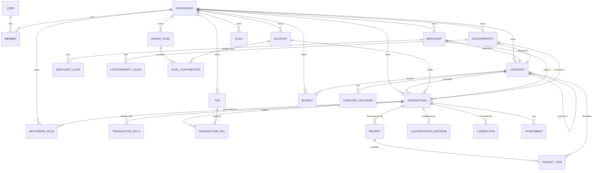

# 03 — Domain Model

**This document is canonical.** Field and entity names defined here are used verbatim in
[04](04-categorization-and-ai-engine.md), [05](05-architecture.md) and [06](06-api-specification.md).
If another document disagrees with this one, this one wins.

---

## 1. Glossary (canonical vocabulary)

Use these terms exactly. The left column is what we say; never use the aliases in prose or code.

| Term | Definition | Never call it |
|---|---|---|
| **Household** | The tenancy boundary. Owns all financial data. Created for every user, even solo ones. | tenant, org, family |
| **Member** | A user's membership in a household, with a role. | account |
| **Account** | A place money sits: cash, bank account, card. | wallet, ledger |
| **Transaction** | A single movement of money. Always one kind and one signed direction. | entry, record, expense |
| **Split** | A portion of a transaction attributed to a different category. Splits of a transaction sum to its amount. | line item |
| **Category** | A node in the household's classification tree. Has a `kind` (expense or income). | bucket, label |
| **CategoryKeyword** | A keyword that routes input toward or away from a category. | tag, rule |
| **Merchant** | A business the household pays or is paid by (Lidl, Shell, EPS). | vendor, shop, store |
| **Counterparty** | A person or organisation in a non-merchant relationship (Dejan, a landlord, an employer). | entity, contact, person |
| **Tag** | A free-form, cross-cutting label orthogonal to category. | keyword, category |
| **Rule** | A deterministic, priority-ordered if/then that assigns classification. | automation, macro |
| **Receipt** | A captured document plus its extracted line items, reconciling to one transaction. | invoice, bill |
| **ReceiptItem** | One line on a receipt, independently categorised. | split |
| **Budget** | A spending limit for a period, scoped to a category subtree or the whole household. | envelope, plan |
| **SavingGoal** | A target amount by a target date, with contributions. | goal, target, fund |
| **RecurringRule** | A template that materialises transactions on a schedule. | subscription, schedule |
| **ClassificationDecision** | The immutable audit record of how one input got its category. | log entry |
| **Correction** | A user's change to a proposed classification, used as a learning signal. | feedback |
| **Insight** | A generated, factual observation about the ledger. | tip, advice |
| **Alert** | A threshold or event condition that produces a notification. | notification |
| **Proposal** | An AI-produced, uncommitted structured suggestion. **Never persisted as truth.** | result |

> **Rule of thumb:** if a value came from a model and has not been through a deterministic
> validation + persistence path, it is a **Proposal**, not data.

---

## 2. Entity relationship overview



---

## 3. Cross-cutting conventions

These are non-negotiable and enforced by shared column types / DB constraints.

### 3.1 Money

```sql
amount_minor  BIGINT NOT NULL CHECK (amount_minor >= 0)
currency      CHAR(3) NOT NULL          -- ISO 4217, e.g. 'RSD'
```

- **Never** floating point. Never `NUMERIC` for money in the hot path (numeric is fine for FX rates).
- `amount_minor` is **always positive**; direction is carried by `kind`
  (`EXPENSE` | `INCOME`). This kills a whole class of sign bugs.
- `1 RSD = 100 para`, so `amount_minor = 2000_00` for `2.000 RSD`.
- A household has exactly one `ledger_currency` in v1; every transaction inherits it and the column
  exists so that multi-currency is a migration, not a rewrite.

### 3.2 Time

```sql
occurred_at         TIMESTAMPTZ NOT NULL   -- the instant
occurred_local_date DATE        NOT NULL   -- the calendar day the user means
```

Both are required. "Which day was this?" is a *local calendar* question and "when?" is an *instant*
question; conflating them breaks month boundaries across timezones and DST. Every household stores an
`iana_timezone` used to derive `occurred_local_date`.

### 3.3 Identity

- Primary keys: `UUID` (v7, time-ordered) generated server-side. Client-generated IDs are accepted
  **only** for offline sync, in a separate `client_id` column with a unique constraint.
- All household-scoped tables carry `household_id UUID NOT NULL` and an index leading with it.
- Every table has `created_at`, `updated_at TIMESTAMPTZ NOT NULL DEFAULT now()`.

### 3.4 Deletion

- Soft delete (`deleted_at TIMESTAMPTZ`) for user-visible financial rows: **Transaction**,
  **Category**, **Merchant**, **Counterparty**, **Tag**, **Receipt**, **Budget**, **SavingGoal**.
- Hard delete only for: **Attachment** blobs (via lifecycle job), and household deletion (full purge,
  GDPR-mandated, [08](08-security-privacy-and-compliance.md)).
- All queries filter `deleted_at IS NULL`; enforced via repository layer + partial indexes.

### 3.5 Idempotency

Every write originating from natural-language or offline input carries an `idempotency_key`
(client-supplied, unique per household). Replays return the original result instead of duplicating.
This is what makes F-26 (offline capture) and F-06 (bulk entry) safe.

---

## 4. Schema (PostgreSQL 16+)

Presented as the authoritative DDL. Migrations are managed with Prisma or Drizzle
(see [ADR-005](14-decisions-and-risks.md)); this is the logical target schema.

```sql
-- ============================================================ identity & tenancy

CREATE TABLE users (
  id                 UUID PRIMARY KEY,
  email              CITEXT NOT NULL UNIQUE,
  email_verified_at  TIMESTAMPTZ,
  password_hash      TEXT,                       -- argon2id; NULL if passkey-only
  display_name       TEXT NOT NULL,
  -- English is the product's primary language (ADR-019); Serbian is a first-class
  -- alternative. This drives server-side copy such as email.
  locale             TEXT NOT NULL DEFAULT 'en',
  status             TEXT NOT NULL DEFAULT 'ACTIVE'
                       CHECK (status IN ('ACTIVE','SUSPENDED','DELETED')),
  created_at         TIMESTAMPTZ NOT NULL DEFAULT now(),
  updated_at         TIMESTAMPTZ NOT NULL DEFAULT now()
);

CREATE TABLE households (
  id                 UUID PRIMARY KEY,
  name               TEXT NOT NULL,
  ledger_currency    CHAR(3) NOT NULL DEFAULT 'RSD',
  iana_timezone      TEXT NOT NULL DEFAULT 'Europe/Belgrade',
  owner_user_id      UUID NOT NULL REFERENCES users(id),
  -- Household-level preferences that are read on the classification hot path.
  -- Documented keys:
  --   aiConfidenceThresholds: {"auto": 0.90, "verify": 0.60}   (ADR-009; per-household tunable)
  --   aiEnabled: boolean            (false => rules + manual only, Q-9)
  --   aiConsentRecordedAt: timestamptz, aiConsentVersion: string
  --   notifications: {quietHours, defaultChannels}
  settings           JSONB NOT NULL DEFAULT '{}'::jsonb,
  created_at         TIMESTAMPTZ NOT NULL DEFAULT now(),
  updated_at         TIMESTAMPTZ NOT NULL DEFAULT now()
);

CREATE TABLE household_members (
  id                 UUID PRIMARY KEY,
  household_id       UUID NOT NULL REFERENCES households(id) ON DELETE CASCADE,
  user_id            UUID NOT NULL REFERENCES users(id) ON DELETE CASCADE,
  role               TEXT NOT NULL CHECK (role IN ('OWNER','ADMIN','MEMBER','VIEWER')),
  created_at         TIMESTAMPTZ NOT NULL DEFAULT now(),
  updated_at         TIMESTAMPTZ NOT NULL DEFAULT now(),
  UNIQUE (household_id, user_id)
);

-- ---- identity: credentials, sessions, tokens (owned by the `identity` module, 05 §3)
-- Primary credentials live on `users` (email + password_hash + email_verified_at).
-- These tables cover session continuity and revocation.
-- Rationale and threat model: [08](08-security-privacy-and-compliance.md) §2.

CREATE TABLE sessions (
  id                 UUID PRIMARY KEY,
  user_id            UUID NOT NULL REFERENCES users(id) ON DELETE CASCADE,
  user_agent_hash    TEXT,        -- hashed, never raw: [08](08-security-privacy-and-compliance.md) §6
  ip_hash            TEXT,        -- hashed, never raw
  created_at         TIMESTAMPTZ NOT NULL DEFAULT now(),
  last_seen_at       TIMESTAMPTZ NOT NULL DEFAULT now(),
  expires_at         TIMESTAMPTZ NOT NULL,
  revoked_at         TIMESTAMPTZ,
  revoked_reason     TEXT CHECK (revoked_reason IN ('LOGOUT','ROTATION_REUSE','ADMIN','PASSWORD_CHANGE','EXPIRED'))
);
CREATE INDEX ON sessions (user_id) WHERE revoked_at IS NULL;
CREATE INDEX ON sessions (expires_at) WHERE revoked_at IS NULL;

CREATE TABLE refresh_tokens (
  id                 UUID PRIMARY KEY,
  session_id         UUID NOT NULL REFERENCES sessions(id) ON DELETE CASCADE,
  token_hash         CHAR(64) NOT NULL UNIQUE,   -- sha256 of the opaque token; the token itself is never stored
  issued_at          TIMESTAMPTZ NOT NULL DEFAULT now(),
  expires_at         TIMESTAMPTZ NOT NULL,
  used_at            TIMESTAMPTZ,                -- non-null => reuse of this token is a theft signal
  rotated_to_id      UUID REFERENCES refresh_tokens(id) ON DELETE SET NULL,
  created_at         TIMESTAMPTZ NOT NULL DEFAULT now()
);
CREATE INDEX ON refresh_tokens (session_id);
CREATE INDEX ON refresh_tokens (expires_at);

CREATE TABLE email_tokens (
  id                 UUID PRIMARY KEY,
  user_id            UUID NOT NULL REFERENCES users(id) ON DELETE CASCADE,
  purpose            TEXT NOT NULL CHECK (purpose IN ('VERIFY_EMAIL','RESET_PASSWORD','CHANGE_EMAIL')),
  token_hash         CHAR(64) NOT NULL UNIQUE,
  expires_at         TIMESTAMPTZ NOT NULL,
  consumed_at        TIMESTAMPTZ,
  created_at         TIMESTAMPTZ NOT NULL DEFAULT now()
);
CREATE INDEX ON email_tokens (user_id, purpose) WHERE consumed_at IS NULL;

-- ---- consent & erasure records (GDPR evidence; [08](08-security-privacy-and-compliance.md) §7)

CREATE TABLE consents (
  id                 UUID PRIMARY KEY,
  user_id            UUID REFERENCES users(id) ON DELETE SET NULL,
  household_id       UUID REFERENCES households(id) ON DELETE CASCADE,
  kind               TEXT NOT NULL
                       CHECK (kind IN ('AI_DATA_PROCESSING','EVAL_DATASET','MARKETING_EMAIL','CLOUD_OCR')),
  granted            BOOLEAN NOT NULL,
  policy_version     TEXT NOT NULL,
  recorded_at        TIMESTAMPTZ NOT NULL DEFAULT now(),
  withdrawn_at       TIMESTAMPTZ,
  evidence           JSONB NOT NULL DEFAULT '{}'::jsonb  -- UI surface, locale, ip_hash
);
CREATE INDEX ON consents (household_id, kind, recorded_at DESC);

CREATE TABLE purge_receipts (
  id                 UUID PRIMARY KEY,
  household_id       UUID NOT NULL,
  requested_by       UUID REFERENCES users(id) ON DELETE SET NULL,
  requested_at       TIMESTAMPTZ NOT NULL DEFAULT now(),
  completed_at       TIMESTAMPTZ,
  scope              JSONB NOT NULL,   -- row counts per table actually destroyed
  object_keys_deleted INTEGER NOT NULL DEFAULT 0,
  status             TEXT NOT NULL DEFAULT 'PENDING'
                       CHECK (status IN ('PENDING','RUNNING','COMPLETE','FAILED'))
);
-- Deliberately NOT foreign-keyed to households: the receipt must outlive the purge it proves.

-- ============================================================ money containers

CREATE TABLE accounts (
  id                 UUID PRIMARY KEY,
  household_id       UUID NOT NULL REFERENCES households(id) ON DELETE CASCADE,
  name               TEXT NOT NULL,
  kind               TEXT NOT NULL CHECK (kind IN ('CASH','BANK','CARD','OTHER')),
  opening_balance_minor BIGINT NOT NULL DEFAULT 0 CHECK (opening_balance_minor >= 0),
  currency           CHAR(3) NOT NULL,
  is_archived        BOOLEAN NOT NULL DEFAULT false,
  sort_order         INTEGER NOT NULL DEFAULT 0,
  deleted_at         TIMESTAMPTZ,
  created_at         TIMESTAMPTZ NOT NULL DEFAULT now(),
  updated_at         TIMESTAMPTZ NOT NULL DEFAULT now()
);
CREATE INDEX ON accounts (household_id) WHERE deleted_at IS NULL;

-- ============================================================ classification tree

CREATE TABLE categories (
  id                 UUID PRIMARY KEY,
  household_id       UUID NOT NULL REFERENCES households(id) ON DELETE CASCADE,
  parent_id          UUID REFERENCES categories(id) ON DELETE RESTRICT,
  name               TEXT NOT NULL,
  kind               TEXT NOT NULL CHECK (kind IN ('EXPENSE','INCOME')),
  icon               TEXT,
  color              TEXT,
  ai_description     TEXT,        -- user-authored hint fed to the classifier
  is_system          BOOLEAN NOT NULL DEFAULT false,
  sort_order         INTEGER NOT NULL DEFAULT 0,
  deleted_at         TIMESTAMPTZ,
  created_at         TIMESTAMPTZ NOT NULL DEFAULT now(),
  updated_at         TIMESTAMPTZ NOT NULL DEFAULT now(),
  CHECK (parent_id IS NULL OR parent_id <> id)
);
-- Exactly one category name per parent per household
CREATE UNIQUE INDEX categories_unique_name
  ON categories (household_id, COALESCE(parent_id, '00000000-0000-0000-0000-000000000000'::uuid), lower(name))
  WHERE deleted_at IS NULL;
CREATE INDEX ON categories (household_id, parent_id);
-- Depth is capped at 5 in the service layer (recursive CTE guard) to keep
-- breadcrumbs, budgets and rollups tractable.

CREATE TABLE category_keywords (
  id                 UUID PRIMARY KEY,
  household_id       UUID NOT NULL REFERENCES households(id) ON DELETE CASCADE,
  category_id        UUID NOT NULL REFERENCES categories(id) ON DELETE CASCADE,
  keyword            TEXT NOT NULL,             -- normalised, lowercased, unaccented
  polarity           TEXT NOT NULL CHECK (polarity IN ('INCLUDE','EXCLUDE')),
  match_mode         TEXT NOT NULL DEFAULT 'WORD'
                       CHECK (match_mode IN ('WORD','PREFIX','SUBSTRING')),
  weight             NUMERIC(4,2) NOT NULL DEFAULT 1.0,
  created_at         TIMESTAMPTZ NOT NULL DEFAULT now(),
  UNIQUE (household_id, category_id, keyword, polarity)
);
CREATE INDEX ON category_keywords (household_id, keyword);

-- ============================================================ counterparties

CREATE TABLE merchants (
  id                 UUID PRIMARY KEY,
  household_id       UUID REFERENCES households(id) ON DELETE CASCADE, -- NULL = shipped global seed
  name               TEXT NOT NULL,
  default_category_id UUID REFERENCES categories(id) ON DELETE SET NULL,
  ai_hint            TEXT,
  is_global          BOOLEAN NOT NULL DEFAULT false,
  deleted_at         TIMESTAMPTZ,
  created_at         TIMESTAMPTZ NOT NULL DEFAULT now(),
  updated_at         TIMESTAMPTZ NOT NULL DEFAULT now()
);
CREATE INDEX ON merchants (household_id) WHERE deleted_at IS NULL;

CREATE TABLE merchant_aliases (
  id                 UUID PRIMARY KEY,
  merchant_id        UUID NOT NULL REFERENCES merchants(id) ON DELETE CASCADE,
  alias              TEXT NOT NULL,             -- normalised
  created_at         TIMESTAMPTZ NOT NULL DEFAULT now(),
  UNIQUE (merchant_id, alias)
);
CREATE INDEX ON merchant_aliases (alias);

CREATE TABLE counterparties (
  id                 UUID PRIMARY KEY,
  household_id       UUID NOT NULL REFERENCES households(id) ON DELETE CASCADE,
  name               TEXT NOT NULL,
  type               TEXT NOT NULL DEFAULT 'PERSON'
                       CHECK (type IN ('PERSON','COMPANY','GOVERNMENT','OTHER')),
  default_category_id UUID REFERENCES categories(id) ON DELETE SET NULL,
  note               TEXT,
  deleted_at         TIMESTAMPTZ,
  created_at         TIMESTAMPTZ NOT NULL DEFAULT now(),
  updated_at         TIMESTAMPTZ NOT NULL DEFAULT now()
);
CREATE INDEX ON counterparties (household_id) WHERE deleted_at IS NULL;

CREATE TABLE counterparty_aliases (
  id                 UUID PRIMARY KEY,
  counterparty_id    UUID NOT NULL REFERENCES counterparties(id) ON DELETE CASCADE,
  alias              TEXT NOT NULL,             -- 'dejan rođa', 'rođa dejan'
  created_at         TIMESTAMPTZ NOT NULL DEFAULT now(),
  UNIQUE (counterparty_id, alias)
);
CREATE INDEX ON counterparty_aliases (alias);

CREATE TABLE tags (
  id                 UUID PRIMARY KEY,
  household_id       UUID NOT NULL REFERENCES households(id) ON DELETE CASCADE,
  name               TEXT NOT NULL,
  color              TEXT,
  deleted_at         TIMESTAMPTZ,
  created_at         TIMESTAMPTZ NOT NULL DEFAULT now()
);
-- Case-insensitive uniqueness per Household. This MUST be a unique INDEX, not a table-level
-- UNIQUE constraint: PostgreSQL does not allow expressions such as lower(name) inside
-- `UNIQUE (...)` in a CREATE TABLE — it raises 42601 syntax error at or near "(".
-- The partial predicate keeps a soft-deleted Tag from blocking reuse of its name.
CREATE UNIQUE INDEX tags_unique_name
  ON tags (household_id, lower(name))
  WHERE deleted_at IS NULL;

-- Household-local embeddings used by stage 3 of the pipeline
-- ([04 §4](04-categorization-and-ai-engine.md#4-stage-3-entity-resolution)).
-- Generated by a LOCAL model only; these vectors are never sent to an AI provider
-- ([08](08-security-privacy-and-compliance.md) §6). Keyed to a taxonomy entity so that
-- renaming or deleting an entity invalidates its vector via CASCADE.
CREATE TABLE entity_embeddings (
  id                 UUID PRIMARY KEY,
  household_id       UUID NOT NULL REFERENCES households(id) ON DELETE CASCADE,
  owner_type         TEXT NOT NULL CHECK (owner_type IN ('MERCHANT','COUNTERPARTY','CATEGORY')),
  owner_id           UUID NOT NULL,
  model              TEXT NOT NULL,      -- e.g. 'local-minilm-l6-v2'
  dims               INTEGER NOT NULL,
  embedding          VECTOR(384) NOT NULL,
  source_text        TEXT NOT NULL,      -- the normalised text that produced the vector
  updated_at         TIMESTAMPTZ NOT NULL DEFAULT now(),
  UNIQUE (owner_type, owner_id, model)
);
CREATE INDEX ON entity_embeddings (household_id);
-- Approximate nearest-neighbour index; lists tuned once a household exceeds ~10k vectors.
CREATE INDEX ON entity_embeddings USING ivfflat (embedding vector_cosine_ops) WITH (lists = 100);

-- ============================================================ the ledger

CREATE TABLE transactions (
  id                 UUID PRIMARY KEY,
  household_id       UUID NOT NULL REFERENCES households(id) ON DELETE CASCADE,
  account_id         UUID NOT NULL REFERENCES accounts(id) ON DELETE RESTRICT,
  kind               TEXT NOT NULL CHECK (kind IN ('EXPENSE','INCOME')),
  amount_minor       BIGINT NOT NULL CHECK (amount_minor > 0),
  currency           CHAR(3) NOT NULL,

  category_id        UUID REFERENCES categories(id) ON DELETE SET NULL,
  merchant_id        UUID REFERENCES merchants(id) ON DELETE SET NULL,
  counterparty_id    UUID REFERENCES counterparties(id) ON DELETE SET NULL,

  description        TEXT NOT NULL,             -- user-facing label, e.g. 'Dejan rođa'
  raw_input          TEXT,                      -- verbatim NL input, for re-parsing & debugging
  note               TEXT,

  occurred_at        TIMESTAMPTZ NOT NULL,
  occurred_local_date DATE NOT NULL,

  status             TEXT NOT NULL DEFAULT 'CONFIRMED'
                       CHECK (status IN ('PENDING','CONFIRMED','VOID')),
  source             TEXT NOT NULL
                       CHECK (source IN ('MANUAL','NATURAL_LANGUAGE','RECEIPT','RECURRING','IMPORT')),
  category_source    TEXT
                       CHECK (category_source IN ('USER','RULE','AI','IMPORT','DEFAULT')),

  -- categorization outcome, denormalised for fast review-queue queries
  confidence         NUMERIC(4,3) CHECK (confidence >= 0 AND confidence <= 1),
  needs_review       BOOLEAN NOT NULL DEFAULT false,

  transfer_peer_id   UUID REFERENCES transactions(id) ON DELETE SET NULL,
  recurring_rule_id  UUID,                      -- FK added after recurring_rules
  idempotency_key    TEXT,
  client_id          TEXT,                      -- offline-originated rows

  version            INTEGER NOT NULL DEFAULT 1, -- optimistic concurrency
  deleted_at         TIMESTAMPTZ,
  created_at         TIMESTAMPTZ NOT NULL DEFAULT now(),
  updated_at         TIMESTAMPTZ NOT NULL DEFAULT now(),

  -- A split transaction keeps its own category NULL and delegates to splits
  CHECK (kind <> 'INCOME' OR transfer_peer_id IS NULL)
);
CREATE INDEX ON transactions (household_id, occurred_local_date DESC) WHERE deleted_at IS NULL;
CREATE INDEX ON transactions (household_id, category_id, occurred_local_date DESC) WHERE deleted_at IS NULL;
CREATE INDEX ON transactions (household_id) WHERE needs_review AND deleted_at IS NULL;
CREATE UNIQUE INDEX ON transactions (household_id, idempotency_key)
  WHERE idempotency_key IS NOT NULL;
CREATE UNIQUE INDEX ON transactions (household_id, client_id)
  WHERE client_id IS NOT NULL;
CREATE INDEX ON transactions (recurring_rule_id) WHERE recurring_rule_id IS NOT NULL;

CREATE TABLE transaction_splits (
  id                 UUID PRIMARY KEY,
  -- Denormalised from the parent Transaction. Splits are AGGREGATED (budget consumption by
  -- category, "how much on meat"), so they need both the tenant predicate and the index —— and it
  -- removes the need for an escape hatch when a Category is deleted and its splits are reassigned.
  household_id       UUID NOT NULL REFERENCES households(id) ON DELETE CASCADE,
  transaction_id     UUID NOT NULL REFERENCES transactions(id) ON DELETE CASCADE,
  category_id        UUID NOT NULL REFERENCES categories(id) ON DELETE RESTRICT,
  amount_minor       BIGINT NOT NULL CHECK (amount_minor > 0),
  note               TEXT,
  confidence         NUMERIC(4,3),
  category_source    TEXT CHECK (category_source IN ('USER','RULE','AI','RECEIPT')),
  created_at         TIMESTAMPTZ NOT NULL DEFAULT now()
);
CREATE INDEX ON transaction_splits (transaction_id);
CREATE INDEX ON transaction_splits (household_id, category_id);

CREATE TABLE transaction_tags (
  transaction_id     UUID NOT NULL REFERENCES transactions(id) ON DELETE CASCADE,
  tag_id             UUID NOT NULL REFERENCES tags(id) ON DELETE CASCADE,
  PRIMARY KEY (transaction_id, tag_id)
);

-- ============================================================ receipts

CREATE TABLE receipts (
  id                 UUID PRIMARY KEY,
  household_id       UUID NOT NULL REFERENCES households(id) ON DELETE CASCADE,
  transaction_id     UUID REFERENCES transactions(id) ON DELETE SET NULL,
  merchant_id        UUID REFERENCES merchants(id) ON DELETE SET NULL,
  captured_at        TIMESTAMPTZ NOT NULL,
  total_minor        BIGINT CHECK (total_minor >= 0),
  currency           CHAR(3),
  ocr_confidence     NUMERIC(4,3),
  reconciliation     TEXT NOT NULL DEFAULT 'PENDING'
                       CHECK (reconciliation IN ('PENDING','MATCHED','MISMATCH','MANUAL')),
  attachment_id      UUID,                      -- FK added after attachments
  deleted_at         TIMESTAMPTZ,
  created_at         TIMESTAMPTZ NOT NULL DEFAULT now(),
  updated_at         TIMESTAMPTZ NOT NULL DEFAULT now()
);
CREATE INDEX ON receipts (household_id, captured_at DESC);

CREATE TABLE receipt_items (
  id                 UUID PRIMARY KEY,
  -- Denormalised from the parent Receipt, for the same reason as transaction_splits: item-level
  -- categorisation is queried across the whole Household ("how much this month on meat").
  household_id       UUID NOT NULL REFERENCES households(id) ON DELETE CASCADE,
  receipt_id         UUID NOT NULL REFERENCES receipts(id) ON DELETE CASCADE,
  line_no            INTEGER NOT NULL,
  raw_text           TEXT NOT NULL,
  normalized_name    TEXT,
  quantity           NUMERIC(10,3),
  unit_price_minor   BIGINT,
  amount_minor       BIGINT NOT NULL CHECK (amount_minor >= 0),
  category_id        UUID REFERENCES categories(id) ON DELETE SET NULL,
  confidence         NUMERIC(4,3),
  needs_review       BOOLEAN NOT NULL DEFAULT false,
  created_at         TIMESTAMPTZ NOT NULL DEFAULT now(),
  UNIQUE (receipt_id, line_no)
);
CREATE INDEX ON receipt_items (household_id, category_id);

-- ============================================================ planning

CREATE TABLE budgets (
  id                 UUID PRIMARY KEY,
  household_id       UUID NOT NULL REFERENCES households(id) ON DELETE CASCADE,
  category_id        UUID REFERENCES categories(id) ON DELETE CASCADE, -- NULL = whole household
  period             TEXT NOT NULL DEFAULT 'MONTHLY'
                       CHECK (period IN ('WEEKLY','MONTHLY','QUARTERLY','YEARLY','CUSTOM')),
  period_start       DATE NOT NULL,             -- first day of the active period
  amount_minor       BIGINT NOT NULL CHECK (amount_minor > 0),
  currency           CHAR(3) NOT NULL,
  rollover           BOOLEAN NOT NULL DEFAULT false,
  include_subcategories BOOLEAN NOT NULL DEFAULT true,
  deleted_at         TIMESTAMPTZ,
  created_at         TIMESTAMPTZ NOT NULL DEFAULT now(),
  updated_at         TIMESTAMPTZ NOT NULL DEFAULT now()
);
CREATE UNIQUE INDEX budgets_unique_scope
  ON budgets (household_id, COALESCE(category_id,'00000000-0000-0000-0000-000000000000'::uuid), period)
  WHERE deleted_at IS NULL;

CREATE TABLE saving_goals (
  id                 UUID PRIMARY KEY,
  household_id       UUID NOT NULL REFERENCES households(id) ON DELETE CASCADE,
  name               TEXT NOT NULL,
  target_minor       BIGINT NOT NULL CHECK (target_minor > 0),
  currency           CHAR(3) NOT NULL,
  target_date        DATE,
  account_id         UUID REFERENCES accounts(id) ON DELETE SET NULL,
  status             TEXT NOT NULL DEFAULT 'ACTIVE'
                       CHECK (status IN ('ACTIVE','ACHIEVED','ARCHIVED')),
  deleted_at         TIMESTAMPTZ,
  created_at         TIMESTAMPTZ NOT NULL DEFAULT now(),
  updated_at         TIMESTAMPTZ NOT NULL DEFAULT now()
);

CREATE TABLE goal_contributions (
  id                 UUID PRIMARY KEY,
  -- Denormalised from the parent SavingGoal: goal progress is a Household-wide sum.
  household_id       UUID NOT NULL REFERENCES households(id) ON DELETE CASCADE,
  goal_id            UUID NOT NULL REFERENCES saving_goals(id) ON DELETE CASCADE,
  amount_minor       BIGINT NOT NULL CHECK (amount_minor > 0),
  contributed_on     DATE NOT NULL,
  note               TEXT,
  -- A contribution is money, so the write is idempotent (I-10): the client mints the key once and a
  -- replay returns the original result instead of adding to the goal a second time. Same shape as
  -- `transactions.idempotency_key`, and partial for the same reason — old rows have none.
  idempotency_key    TEXT,
  created_at         TIMESTAMPTZ NOT NULL DEFAULT now()
);
CREATE INDEX ON goal_contributions (goal_id, contributed_on DESC);
CREATE INDEX ON goal_contributions (household_id);
CREATE UNIQUE INDEX ON goal_contributions (household_id, idempotency_key)
  WHERE idempotency_key IS NOT NULL;

CREATE TABLE recurring_rules (
  id                 UUID PRIMARY KEY,
  household_id       UUID NOT NULL REFERENCES households(id) ON DELETE CASCADE,
  account_id         UUID NOT NULL REFERENCES accounts(id) ON DELETE RESTRICT,
  kind               TEXT NOT NULL CHECK (kind IN ('EXPENSE','INCOME')),
  amount_minor       BIGINT NOT NULL CHECK (amount_minor > 0),
  currency           CHAR(3) NOT NULL,
  category_id        UUID REFERENCES categories(id) ON DELETE SET NULL,
  merchant_id        UUID REFERENCES merchants(id) ON DELETE SET NULL,
  description        TEXT NOT NULL,
  rrule              TEXT NOT NULL,             -- RFC 5545 RRULE
  next_occurrence_on DATE NOT NULL,
  ends_on            DATE,
  auto_confirm       BOOLEAN NOT NULL DEFAULT false,
  is_detected        BOOLEAN NOT NULL DEFAULT false, -- inferred from history vs. user-created
  is_active          BOOLEAN NOT NULL DEFAULT true,
  deleted_at         TIMESTAMPTZ,
  created_at         TIMESTAMPTZ NOT NULL DEFAULT now(),
  updated_at         TIMESTAMPTZ NOT NULL DEFAULT now()
);
CREATE INDEX ON recurring_rules (household_id, next_occurrence_on) WHERE is_active AND deleted_at IS NULL;

ALTER TABLE transactions
  ADD CONSTRAINT transactions_recurring_rule_fk
  FOREIGN KEY (recurring_rule_id) REFERENCES recurring_rules(id) ON DELETE SET NULL;

-- ============================================================ rules & AI audit

CREATE TABLE rules (
  id                 UUID PRIMARY KEY,
  household_id       UUID NOT NULL REFERENCES households(id) ON DELETE CASCADE,
  name               TEXT NOT NULL,
  priority           INTEGER NOT NULL DEFAULT 100,   -- lower wins
  is_active          BOOLEAN NOT NULL DEFAULT true,
  stop_on_match      BOOLEAN NOT NULL DEFAULT true,
  -- conditions: {"all":[{"field":"merchant","op":"eq","value":"lidl"},
  --                     {"field":"text","op":"contains","value":"septička"}]}
  conditions         JSONB NOT NULL,
  -- actions: {"set_category_id":"...","set_counterparty_id":"...","add_tag_ids":["..."]}
  actions            JSONB NOT NULL,
  origin             TEXT NOT NULL CHECK (origin IN ('USER','LEARNED','SYSTEM','IMPORT')),
  source_correction_id UUID,
  hit_count          BIGINT NOT NULL DEFAULT 0,
  last_hit_at        TIMESTAMPTZ,
  deleted_at         TIMESTAMPTZ,
  created_at         TIMESTAMPTZ NOT NULL DEFAULT now(),
  updated_at         TIMESTAMPTZ NOT NULL DEFAULT now()
);
CREATE INDEX ON rules (household_id, priority) WHERE is_active AND deleted_at IS NULL;

CREATE TABLE classification_decisions (
  id                 UUID PRIMARY KEY,
  household_id       UUID NOT NULL REFERENCES households(id) ON DELETE CASCADE,
  transaction_id     UUID REFERENCES transactions(id) ON DELETE CASCADE,
  receipt_item_id    UUID REFERENCES receipt_items(id) ON DELETE CASCADE,
  raw_input          TEXT NOT NULL,
  normalized_input   TEXT NOT NULL,
  decided_by         TEXT NOT NULL
                       CHECK (decided_by IN ('USER','RULE','AI','MERCHANT_DEFAULT',
                                             'COUNTERPARTY_DEFAULT','KEYWORD','FALLBACK')),
  rule_id            UUID REFERENCES rules(id) ON DELETE SET NULL,
  category_id        UUID REFERENCES categories(id) ON DELETE SET NULL,
  confidence         NUMERIC(4,3),
  candidates         JSONB,        -- top-N alternatives with scores
  ai_provider        TEXT,
  ai_model           TEXT,
  prompt_template_id UUID,
  prompt_version     INTEGER,
  latency_ms         INTEGER,
  cost_micros        BIGINT,
  created_at         TIMESTAMPTZ NOT NULL DEFAULT now()
);
CREATE INDEX ON classification_decisions (household_id, created_at DESC);
CREATE INDEX ON classification_decisions (transaction_id);

CREATE TABLE corrections (
  id                 UUID PRIMARY KEY,
  household_id       UUID NOT NULL REFERENCES households(id) ON DELETE CASCADE,
  transaction_id     UUID REFERENCES transactions(id) ON DELETE CASCADE,
  field              TEXT NOT NULL CHECK (field IN ('category','merchant','counterparty','kind','amount')),
  from_value         TEXT,
  to_value           TEXT,
  was_ai_suggested   BOOLEAN NOT NULL DEFAULT false,
  rule_created_id    UUID REFERENCES rules(id) ON DELETE SET NULL,
  created_at         TIMESTAMPTZ NOT NULL DEFAULT now()
);
CREATE INDEX ON corrections (household_id, created_at DESC);

CREATE TABLE ai_provider_configs (
  id                 UUID PRIMARY KEY,
  household_id       UUID REFERENCES households(id) ON DELETE CASCADE, -- NULL = platform default
  task               TEXT NOT NULL CHECK (task IN ('PARSE','CLASSIFY','NARRATE','OCR','EMBED')),
  provider           TEXT NOT NULL CHECK (provider IN ('OPENAI','ANTHROPIC','GEMINI','DEEPSEEK','LOCAL')),
  model              TEXT NOT NULL,
  region             TEXT,
  params             JSONB NOT NULL DEFAULT '{}'::jsonb,
  is_active          BOOLEAN NOT NULL DEFAULT true,
  created_at         TIMESTAMPTZ NOT NULL DEFAULT now(),
  updated_at         TIMESTAMPTZ NOT NULL DEFAULT now(),
  UNIQUE (household_id, task)
);

CREATE TABLE prompt_templates (
  id                 UUID PRIMARY KEY,
  task               TEXT NOT NULL,
  version            INTEGER NOT NULL,
  body               TEXT NOT NULL,
  is_active          BOOLEAN NOT NULL DEFAULT true,
  created_at         TIMESTAMPTZ NOT NULL DEFAULT now(),
  UNIQUE (task, version)
);

-- ============================================================ insights, alerts, files

CREATE TABLE insights (
  id                 UUID PRIMARY KEY,
  household_id       UUID NOT NULL REFERENCES households(id) ON DELETE CASCADE,
  kind               TEXT NOT NULL,   -- BUDGET_PACE, CATEGORY_SPIKE, SUBSCRIPTION_DUE, POSITIVE_TREND...
  severity           TEXT NOT NULL CHECK (severity IN ('INFO','POSITIVE','WARNING','CRITICAL')),
  period_start       DATE NOT NULL,
  period_end         DATE NOT NULL,
  payload            JSONB NOT NULL,  -- computed facts; AI may add a 'narrative' field
  narrative          TEXT,
  is_dismissed       BOOLEAN NOT NULL DEFAULT false,
  created_at         TIMESTAMPTZ NOT NULL DEFAULT now()
);
CREATE INDEX ON insights (household_id, created_at DESC);

CREATE TABLE alert_rules (
  id                 UUID PRIMARY KEY,
  household_id       UUID NOT NULL REFERENCES households(id) ON DELETE CASCADE,
  kind               TEXT NOT NULL,   -- BUDGET_THRESHOLD, PACE_OVERRUN, RECURRING_DUE, UNUSUAL_SPEND, GOAL_REACHED
  threshold          JSONB NOT NULL,
  channels           TEXT[] NOT NULL DEFAULT '{IN_APP}',
  quiet_hours        JSONB,
  is_active          BOOLEAN NOT NULL DEFAULT true,
  created_at         TIMESTAMPTZ NOT NULL DEFAULT now(),
  updated_at         TIMESTAMPTZ NOT NULL DEFAULT now()
);

CREATE TABLE notifications (
  id                 UUID PRIMARY KEY,
  household_id       UUID NOT NULL REFERENCES households(id) ON DELETE CASCADE,
  user_id            UUID NOT NULL REFERENCES users(id) ON DELETE CASCADE,
  insight_id         UUID REFERENCES insights(id) ON DELETE SET NULL,
  channel            TEXT NOT NULL CHECK (channel IN ('IN_APP','EMAIL','PUSH','WEB_PUSH')),
  title              TEXT NOT NULL,
  body               TEXT NOT NULL,
  dedupe_key         TEXT NOT NULL,   -- prevents repeat alerts for the same condition
  sent_at            TIMESTAMPTZ,
  read_at            TIMESTAMPTZ,
  status             TEXT NOT NULL DEFAULT 'QUEUED'
                       CHECK (status IN ('QUEUED','SENT','FAILED','SUPPRESSED')),
  created_at         TIMESTAMPTZ NOT NULL DEFAULT now(),
  UNIQUE (user_id, dedupe_key)
);

CREATE TABLE attachments (
  id                 UUID PRIMARY KEY,
  household_id       UUID NOT NULL REFERENCES households(id) ON DELETE CASCADE,
  storage_key        TEXT NOT NULL,
  mime_type          TEXT NOT NULL,
  byte_size          BIGINT NOT NULL,
  sha256             CHAR(64) NOT NULL,
  purpose            TEXT NOT NULL DEFAULT 'RECEIPT'
                       CHECK (purpose IN ('RECEIPT','TRANSACTION','IMPORT','AVATAR')),
  scan_state         TEXT NOT NULL DEFAULT 'PENDING'
                       CHECK (scan_state IN ('PENDING','CLEAN','INFECTED','FAILED','SKIPPED')),
  created_at         TIMESTAMPTZ NOT NULL DEFAULT now()
);
-- An attachment is only ever linked after scan_state = 'CLEAN' (or 'SKIPPED' for a
-- policy-exempt type). INFECTED attachments are quarantined and purged by files.purge.
CREATE INDEX ON attachments (household_id, created_at DESC);
CREATE INDEX ON attachments (scan_state) WHERE scan_state IN ('PENDING','INFECTED');

ALTER TABLE receipts
  ADD CONSTRAINT receipts_attachment_fk
  FOREIGN KEY (attachment_id) REFERENCES attachments(id) ON DELETE SET NULL;
ALTER TABLE transactions
  ADD COLUMN attachment_id UUID REFERENCES attachments(id) ON DELETE SET NULL;
ALTER TABLE rules
  ADD CONSTRAINT rules_source_correction_fk
  FOREIGN KEY (source_correction_id) REFERENCES corrections(id) ON DELETE SET NULL;

-- ============================================================ audit

CREATE TABLE audit_log (
  id                 UUID PRIMARY KEY,
  household_id       UUID REFERENCES households(id) ON DELETE CASCADE,
  actor_user_id      UUID REFERENCES users(id) ON DELETE SET NULL,
  actor_kind         TEXT NOT NULL CHECK (actor_kind IN ('USER','SYSTEM','AI','JOB')),
  entity_type        TEXT NOT NULL,
  entity_id          UUID,
  action             TEXT NOT NULL,   -- CREATE, UPDATE, DELETE, RESTORE, PURGE, LOGIN...
  before             JSONB,
  after              JSONB,
  ip_hash            TEXT,
  -- Tamper-evidence chain. Populated from Phase 5 onward
  -- ([08](08-security-privacy-and-compliance.md) §9); rows written before that have NULLs
  -- and are treated as the chain's root. Verified by a nightly job.
  prev_hash          CHAR(64),
  row_hash           CHAR(64),        -- sha256(prev_hash || canonical_json(row))
  created_at         TIMESTAMPTZ NOT NULL DEFAULT now()
);
CREATE INDEX ON audit_log (household_id, created_at DESC);
CREATE INDEX ON audit_log (entity_type, entity_id);
```

---

## 5. Invariants (enforced in the service layer + tests)

These are the rules that must hold no matter what the AI layer does. Each maps to a property-based
test in [10](10-testing-and-quality.md).

| # | Invariant |
|---|---|
| I-1 | For every transaction, `sum(splits.amount_minor) == amount_minor` **or** it has no splits and a non-null `category_id`. Never both, never neither. |
| I-2 | `occurred_local_date` is consistent with `occurred_at` in the household's timezone. |
| I-3 | A transaction's `category_id` points to a category with matching `kind` (an expense can never land in an income category). |
| I-4 | Account balance = `opening_balance` + Σ income − Σ expense (± transfers) over non-void, non-deleted transactions. Recomputable at any time; a drift check runs nightly. |
| I-5 | Budget consumption counts only `CONFIRMED`, non-deleted transactions within the period **and** inside the category subtree when `include_subcategories` is true. |
| I-6 | A receipt's items sum to `total_minor` within 1 minor unit, or `reconciliation != 'MATCHED'`. |
| I-7 | No `PENDING` transaction contributes to a budget, balance or insight until confirmed. |
| I-8 | `needs_review = true` ⟺ `confidence < 0.60` or `category_id IS NULL`, unless a user explicitly cleared the flag. **This is the blocking review lane only.** Rows with `category_source = 'AI'` and `confidence` in `[0.60, 0.90)` are *applied and valid* and form a separate **advisory** lane derived from those two columns — they must never set `needs_review`, and the nav badge counts the blocking lane only ([04 §7](04-categorization-and-ai-engine.md#7-stage-6-confidence-gates)). |
| I-9 | Every transaction has **at least one** `classification_decision` row when `source != 'MANUAL'`. |
| I-10 | `idempotency_key` and `client_id` are unique per household; replays are idempotent. |
| I-11 | Category tree depth ≤ 5 and acyclic. |
| I-12 | Deleting a category with transactions is refused; the API returns a reassignment requirement. |

---

## 6. Derived / computed values (never stored as truth)

| Value | Computed from | Cached? |
|---|---|---|
| Account balance | I-4 | Materialised view, nightly reconcile |
| Category spend for period | Transactions + subtree | Yes, rollup table (v1.1) |
| Budget remaining | Budget − consumption | On read, Redis-cached 60 s |
| Safe-to-spend today | Budget − spent − remaining recurring obligations, spread over remaining days | On read |
| Month-end projection | Pace over elapsed days, adjusted for known recurring | On read |
| RecurringRule `generatedCount` | `COUNT(transactions WHERE recurring_rule_id)` | On read |
| RecurringRule `next_occurrence_on` | Advanced by the materialiser to the next unposted occurrence, or pinned to the **last posted** one when the rule finishes | Stored, but derived from the rule plus what it has posted |
| Savings required per month | (target − contributed) / months remaining, rounded **up** | On read |
| SavingGoal `ACHIEVED` | Σ `goal_contributions` ≥ `target`, recomputed on every write that can change it | Stored, but derived — deleting the contribution that crossed the target puts the goal back to `ACTIVE`. `ARCHIVED` is the one status a person chooses and it is never overridden |

**None of these may be produced by an LLM.** The LLM receives them as facts when it needs to narrate
(see [04](04-categorization-and-ai-engine.md#10-the-assistant-qa-path-f-23)).
