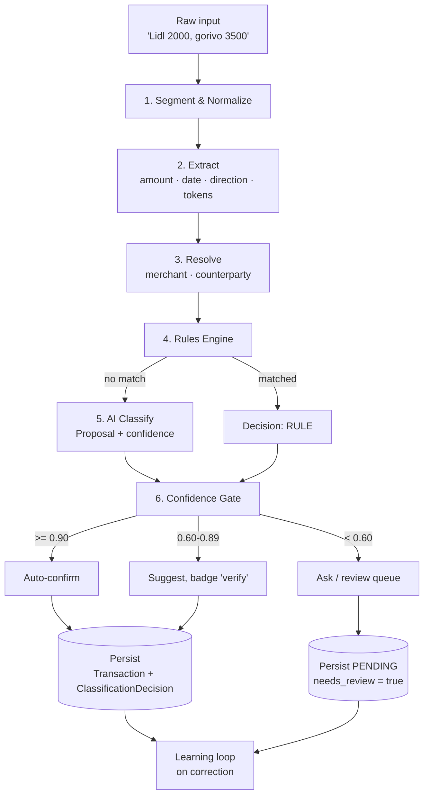
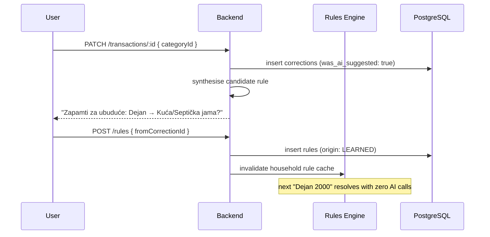
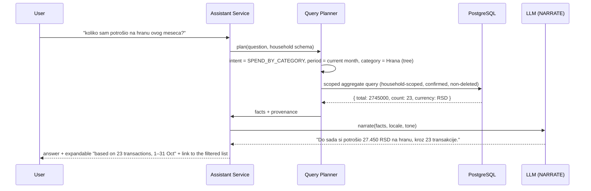

# 04 — Categorization & AI Engine

This is the differentiator. Everything else in the product is table stakes that a competent team can
copy in a quarter; this pipeline and the per-household memory it produces are the moat
([00](00-executive-summary.md)).

**Governing principle:** *cheap, deterministic and explainable first; expensive, probabilistic and
opaque last.* The pipeline is ordered by cost, so the common case costs nothing and returns in
milliseconds.

---

## 1. Design principles

| # | Principle | Consequence |
|---|---|---|
| P-1 | **Rules before models.** | ~70–85 % of real household input resolves deterministically. Deterministic resolution is free, instant, explainable and testable. |
| P-2 | **The model interprets; it never computes or persists.** | The LLM returns a `Proposal` DTO that the backend validates and persists as a `ClassificationDecision` + `Transaction`. |
| P-3 | **Every decision is explainable to the user.** | "Matched your rule *Lidl → Hrana*", "AI suggested, 61 % confident, you confirmed". No black boxes over money. |
| P-4 | **Uncertainty is surfaced, never hidden.** | Confidence is a first-class, calibrated number driving three UI states (auto / verify / ask). |
| P-5 | **Corrections are the primary training signal.** | Every correction optionally synthesises a durable rule; the system improves without retraining a model. |
| P-6 | **Provider-agnostic.** | One interface, five providers, routable per task. A provider outage degrades to rules-only, not to an outage. |
| P-7 | **Fail soft, never silently.** | If the AI is unavailable, the transaction is still saved with `needs_review = true` and the raw input preserved for later re-parse. |

---

## 2. The pipeline



Latency and cost budget per stage (p95):

| Stage | Target latency | Cost | Notes |
|---|---|---|---|
| 1–2 Normalize + Extract | ≤ 5 ms | 0 | Pure functions, unit-testable |
| 3 Resolve | ≤ 15 ms | 0 | Indexed lookups + trigram/embedding cache |
| 4 Rules | ≤ 10 ms | 0 | In-process, rules cached per household |
| 5 AI (when needed) | ≤ 1.5 s | ~$0.0002–0.002 | Small model for parse/classify; batched for bulk input |
| 6 Gate + persist | ≤ 20 ms | 0 | |

---

## 3. Stage 1–2: Segmentation, normalization and extraction

Input is treated as **one or more transaction fragments** separated by comma, newline, `;`, ` i `,
`+`, or ` pa `. Each fragment is parsed independently.

### 3.1 Serbian-specific normalization

These rules are why a generic English classifier performs badly on this market, and they are a real
part of the moat.

```ts
// packages/nlp/src/normalize.ts  (illustrative)

const CYRILLIC_TO_LATIN: Record<string, string> = {
  а:'a', б:'b', в:'v', г:'g', д:'d', ђ:'dj', е:'e', ж:'z', з:'z', и:'i', ј:'j', к:'k',
  л:'l', љ:'lj', м:'m', н:'n', њ:'nj', о:'o', п:'p', р:'r', с:'s', т:'t', ћ:'c', у:'u',
  ф:'f', х:'h', ц:'c', ч:'c', џ:'dz', ш:'s',
};
```

| Concern | Rule |
|---|---|
| **Script** | Cyrillic → latin transliteration, so `Лидл 2000` and `Lidl 2000` hit the same keyword set. |
| **Diacritics** | Fold to ASCII for **matching only** (`septička` ≡ `septicka` ≡ `septichka`); never mutate stored display text. |
| **Orthography** | Serbian has no letter `x`: it is a typographic variant of `ks`, so a **run** folds to one `ks` for matching only (`Maxi` ≡ `Maksi`, `taxi` ≡ `taksi`, `Univerexport` ≡ `Univereksport`, and `Cineplexx` ≡ `Cinepleks` — a doubled `xx` is brand styling, not a longer sound). The fold is symmetric, so a foreign brand spelling and the domestic one meet; the inflected `Maksiju` is *not* the same string and is the planner's case-ending rung, not this fold (task A-10, §8.1.7). |
| **Thousands separator** | `.` and space are thousands: `2.000` → `2000`, `1 200` → `1200`. |
| **Decimals** | `,` is decimal: `2,50` → `2.50`; `1250,50` → `1250.50`. |
| **Currency-suffix forms** | `2000din`, `2.000 rsd`, `1500 dindži`, `20€` → amount + currency hint. |
| **Shorthand** | `2k` → `2000`, `1.5k` → `1500`. Rejected if it would be ambiguous in context. |
| **Relative dates** | `juče`, `danas`, `prekjuče`, `prošli petak`, `1.9.`, `01.09.2026`, `1/9`. |
| **Income markers** | `plata`, `penzija`, `uplata`, `primio`, `refundacija`, `povraćaj`, `povrat`, `honorar`, `rata kredita primljena` ⇒ bias `kind = INCOME`. |
| **Expense markers** | default when no income marker and no counterparty-receipt semantics. |
| **Negation/refund** | `vraćeno`, `storno`, `refund` ⇒ flag for user confirmation rather than guessing a sign. |

**Ambiguity policy:** if two amount interpretations are plausible (e.g. `1.200` vs `1.2`), the parser
returns both with the higher-probability one first and the LLM/UX resolves it. It **never** silently
picks.

### 3.2 Extraction output

```ts
export interface TransactionFragment {
  rawText: string;
  amountMinor: bigint | null;
  currency: string | null;          // inherits household ledger currency if null
  kind: 'EXPENSE' | 'INCOME' | 'UNKNOWN';
  occurredOn: string | null;        // ISO date, local
  description: string;              // text leftover after removing amount/date
  tokens: string[];                 // normalized content tokens
  candidates: { amountMinor: bigint; reason: string }[]; // ambiguity surfacing
}
```

Amount is a `bigint` in minor units from the very first step. **No float ever touches money**, not
even transiently in the parser.

---

## 4. Stage 3: Entity resolution

Resolution order, cheapest first, stopping when a confident hit is found:

```text
1. Exact alias match        (merchant_aliases, counterparty_aliases)  → confidence 1.00
2. Normalized exact match   (lowercase, unaccented, transliterated)   → confidence 0.98
3. Prefix / token match     ("lidl prodavnica" → "lidl")              → confidence 0.90
4. Trigram similarity       pg_trgm similarity > 0.55                 → confidence 0.55–0.85
5. Embedding k-NN           cosine > 0.82 over household's own vectors → confidence 0.60–0.85
6. No match                                                          → unresolved
```

Stage 5 uses embeddings of the household's **own** history, not a global model, which is what makes
`Dejan rođa` resolvable for one household and irrelevant to another. Embeddings are cached per
household in `pgvector` (or Redis for hot items); a free local embedding model is sufficient.

**Steps 1–4 are pure and live in `packages/nlp`** (task 2.1.4); step 5 is I/O and belongs to the
API/worker layer (task 2.3.4). The details the ladder above leaves open, fixed so the caller and the
tests cannot disagree:

| Rung | Exact meaning |
|---|---|
| 1 Exact | The trimmed input equals `name` or a stored alias **character for character**, as supplied. Aliases are stored normalised, so in production a stored alias usually lands on rung 2; rung 1 is what catches a canonical name typed exactly as displayed. Matching the canonical `name` is always allowed, whether or not an alias row exists for it. |
| 2 Normalized | The folded input equals the folded name/alias (`foldForMatching`: Cyrillic → Latin, case, diacritics, whitespace). |
| 3 Prefix / token | Every folded token of the name or an alias occurs among the input's folded tokens. Word order is irrelevant, so `lidl prodavnica` and `prodavnica lidl` both reach `lidl`. A prefix of a *word* (`prod` → `prodavnica`) is deliberately **not** a match: at 0.90 it would auto-apply on an abbreviation. |
| 4 Trigram | `similarity(folded input, folded name/alias) > 0.55`, compared against the folded forms so the SQL `similarity()` over the normalised alias column is the same computation. The default implementation in `packages/nlp` follows the `pg_trgm` definition (two leading and one trailing pad space per word, length-3 windows, `|∩| / |∪|` over the sets); a caller injecting SQL `similarity()` must use that same definition, or the effective threshold drifts silently. |

**Rung 4's confidence mapping (derived).** The band `0.55–0.85` is what §4 fixes; the function is
interpolated linearly and monotonically from the threshold to certainty:

```text
t          = clamp((similarity - 0.55) / (1 - 0.55), 0, 1)
confidence = 0.55 + t * (0.85 - 0.55)
```

The safe reading of [ADR-009](14-decisions-and-risks.md) is therefore the one implemented: a hit that
only just clears 0.55 carries a confidence **below 0.60** and lands in the *ask* lane. This rung never
auto-applies — 0.60 is not reached until similarity 0.625, and 0.90 is outside the band entirely. Rung
4 produces a **candidate with a confidence**, not a decision: the caller's confidence gate decides the
lane, and no second gate belongs in front of the ladder.

**Rung 5's confidence mapping** is interpolated the same way over `0.82 → 1.0`, from §4's band:

```text
t          = clamp((cosine - 0.82) / (1 - 0.82), 0, 1)
confidence = 0.60 + t * (0.85 - 0.60)
```

Its ceiling is **0.85**, so rung 5 cannot auto-apply either — for the same reason and by the same
argument. [ADR-021](14-decisions-and-risks.md) fixes the seam (a provider-injected, LOCAL-only,
inert-by-default resolver) and §8.1.4 records what the implementation got wrong the first time.

**Where rung 5 lives.** Rungs 1–4 are pure and in `packages/nlp`. Rung 5 is I/O, so it is an
`EmbeddingProvider` injected at the API layer (`EMBEDDINGS`) and consumed through
`EntityEmbeddingsService`, which owns `entity_embeddings`. Two properties are structural rather than
incidental:

- **It is consulted only when nothing cheaper matched.** The resolver is a callback the pipeline
  `await`s *after* both lexical ladders came back empty, so a fragment a rule, a keyword or an exact
  name already decided never costs a model call. The tests count invocations.
- **It is inert unless a model is configured.** The provider defaults to `UNCONFIGURED_EMBEDDINGS`
  (`model: 'none'`, `dims: 0`), and a provider whose `dims` is not 384 — the width
  `entity_embeddings.embedding` requires — is treated as no provider at all. Both cases end the ladder
  at rung 4, which is what the shipped build does today.

**Ties** are broken deterministically: confidence descending, then the matched name/alias's length
descending (the more specific match), then `entity.id` ascending. Ids are unique, so the order is
total.

**Merchant vs. counterparty disambiguation:** an entity is a **Merchant** if it appears with retail
semantics (multiple transactions, an amount bracket typical of retail, a known chain alias);
otherwise a **Counterparty**. When ambiguous, the LLM decides once and the answer is remembered as an
alias — the same self-improving pattern as categories. This needs transaction counts, amount brackets
and eventually the model, so it is **not** part of the pure resolver; it attaches in the classification
module (task 2.2.3).

---

## 5. Stage 4: The rules engine

Deterministic, in-process, no I/O. Rules are loaded per household and cached; a household rarely
has more than a few hundred.

### 5.1 Rule shape

```jsonc
{
  "name": "Dejan → septička jama",
  "priority": 50,                       // lower wins
  "isActive": true,
  "stopOnMatch": true,
  "conditions": {
    "all": [
      { "field": "counterparty", "op": "eq", "value": "<uuid>" },
      { "field": "text", "op": "not_contains", "value": "poklon" }
    ]
  },
  "actions": {
    "setCategoryId": "<uuid>",
    "setMerchantId": null,
    "addTagIds": ["<uuid>"],
    "setDescription": null
  },
  "origin": "LEARNED"
}
```

### 5.2 Operators

| Field | Operators |
|---|---|
| `text` / `description` | `contains`, `not_contains`, `equals`, `starts_with`, `regex` (enterprise-only), `in` |
| `merchant`, `counterparty`, `account` | `eq`, `in`, `is_null` |
| `amount` | `eq`, `gt`, `gte`, `lt`, `lte`, `between` |
| `dayOfWeek`, `dayOfMonth` | `in`, `between` |
| `kind` | `eq` |
| `source` | `eq` |

Composite: `all` (AND), `any` (OR), `none` (NOR). Nesting depth ≤ 3 — beyond that it is a program,
not a rule, and the user cannot reason about it.

### 5.3 Conflict resolution

1. Sort by `priority ASC`, then `created_at DESC` (newest user intent wins ties).
2. Collect all matching rules with `stop_on_match = true` → the first is the decision.
3. If only non-stopping rules match, merge their actions in priority order (later rules fill gaps,
   they do not overwrite explicitly set fields).
4. **Category keywords are themselves compiled into an implicit rules tier** at priority 1000, so
   explicit user rules always outrank keywords.
5. A **specificity score** breaks remaining ties: more conditions and `eq` over `contains` wins.
   Record the losing candidates in `classification_decisions.candidates` for debuggability.

**Resolved order of the tie-breaks (implementation note, task 2.1.3).** Steps 1 and 5 are in tension
once step 4 puts keywords in the *same* sort: if `created_at` sat between `priority` and the
specificity score, then a user rule at priority ≥ 1000 and the implicit keyword tier would be ordered
by insertion time, and step 4's guarantee ("explicit user rules always outrank keywords") would depend
on when something was created rather than on what it is. The implemented sort key is therefore:

```text
priority ASC, specificity DESC, created_at DESC, id ASC
```

`created_at DESC` still settles ties between otherwise-identical rules, which is what step 1 is for
("newest user intent wins"); it no longer outranks a strictly more specific rule of equal priority.
`id ASC` is a final total order so evaluation is deterministic for two rules created in the same
millisecond. Priority is always compared first, so specificity can never override it.

The specificity formula itself is not specified above and is defined in
`packages/rules-engine/src/specificity.ts`; the keyword confidence mapping that §5.4 bounds at
0.90–0.97 without giving a function is in `packages/rules-engine/src/keywords.ts`. Both are derived
and tested rather than assumed.

### 5.4 Keyword scoring (the implicit tier)

When no explicit rule matches, keywords score candidate categories:

```ts
score = Σ (matchedKeyword.weight × matchModeWeight × polaritySign)
        ÷ (1 + 0.15 × (matchedTokens - 1))          // penalise over-broad matches
```

- `polarity INCLUDE` adds, `EXCLUDE` subtracts (and an EXCLUDE match hard-blocks that category).
- `matchModeWeight`: `WORD` 1.0, `PREFIX` 0.8, `SUBSTRING` 0.5 (substring is deliberately weak —
  `ulje` inside `ulje za motor` vs. `ulje` in `suncokretovo ulje`).
- If the top score ≥ **2.0** and exceeds the runner-up by ≥ 1.0 → deterministic decision
  (`decided_by = 'KEYWORD'`, confidence mapped to 0.90–0.97).
- Otherwise fall through to AI with the scored candidates attached as context.

---

## 6. Stage 5: AI classification

Only reached when rules and keywords are inconclusive. This keeps the model bill small and the
system fast.

### 6.1 What the model is asked to do

Exactly three things, all structured:

1. **Parse** — fill a `TransactionFragment` when deterministic extraction failed.
2. **Classify** — choose a category from a **provided, closed list** (the household's own tree), with
   a confidence and a one-line rationale.
3. **Propose an entity** — when resolution failed, a name plus type.

It is explicitly **not** asked to compute totals, dates arithmetic, balances, or to invent
categories outside the list.

### 6.2 Structured output contract

Tool/JSON-schema enforced, so a malformed response is impossible rather than merely unlikely:

```ts
export interface ClassifyProposal {
  categoryId: string | null;                 // MUST be one of the supplied ids
  confidence: number;                        // 0..1, calibrated
  rationale: string;                         // <= 140 chars, shown in the UI
  alternatives: { categoryId: string; confidence: number }[];  // top 2-3
  extracted: {
    amountMinor?: string;                    // string: avoids float in JSON
    currency?: string;
    kind?: 'EXPENSE' | 'INCOME';
    occurredOn?: string;
    merchantName?: string;
    counterpartyName?: string;
    counterpartyType?: 'PERSON' | 'COMPANY' | 'GOVERNMENT' | 'OTHER';
    description?: string;
  };
  needsUserInput?: { field: string; question: string }[];  // e.g. "Is this a gift?"
}
```

Any `categoryId` not present in the supplied list is **rejected by validation** and treated as
`null` + low confidence. This single check eliminates the most damaging hallucination class.

### 6.3 Prompt shape (classify)

> **Implementation note (ADR-032).** The §6.3 prompt is rendered by **two layers**, and the split is load-bearing:
> `apps/api`'s `classify-prompt.ts` renders the **instructions** (the rule list, the untrusted-content preamble and
> one task sentence), and `packages/ai`'s adapter renders the **payload** — the closed category list, the known
> entities, the few-shot examples and the redacted fragment. The adapter must be the one that renders the category
> list, because it is also the layer that substitutes every real id for an opaque placeholder (`c1`, `c2`, …) before
> the request ships, so only it can produce a list whose ids the redaction map can resolve back. Rendering that list
> in both layers — which is what shipped until the first live call — offers the model two disjoint id vocabularies
> and produces `categoryId: null` for every answer. A second defect on the same path: `json_object` mode constrains
> syntax and **not** keys, so `withJsonInstruction` now carries the same schema constant the `json_schema` path
> transmits; without it the model invents field names (`{"category_id": …, "reason": …}`) and every field the
> adapter reads is absent. Both are asserted at the composed seam in
> `apps/api/src/modules/classification/ai-classifier.spec.ts`.

```text
SYSTEM
You extract and classify household financial transactions for a Serbian household.
Rules you must follow:
- Choose a category ONLY from the provided list of ids. Never invent an id.
- If you are unsure, return a low confidence and list alternatives. Do not guess confidently.
- Never perform arithmetic. Never compute totals or balances.
- Input may mix Serbian latin and cyrillic, abbreviations and typos.
- "plata", "penzija", "uplata", "povraćaj" indicate INCOME unless context says otherwise.
- Amounts: '.' and space are thousands separators, ',' is the decimal separator.

USER
Household categories (id | path | description):
  c-01 | Hrana / Supermarket | groceries, market, pekara
  c-02 | Kuća / Septička jama | septička, pražnjenje jame, cisterna
  c-17 | Auto / Gorivo | gorivo, benzin, dizel, nafta (NOT ulje, filter, servis)
  ... (top-N candidates retrieved by keyword/embedding prefilter, not the whole tree for large households)

Known merchants: lidl (Hrana/Supermarket), maxi, shell, omv, eps, telekom
Known people: Dejan (default: Kuća / Septička jama; aliases: dejan rođa, rođa dejan)

Recent similar inputs for this household and what the user chose:
  "dejan 3600" -> Kuća / Septička jama      (user-confirmed 2 days ago)
  "lidl 1850"  -> Hrana / Supermarket       (user-confirmed 3 days ago)

Input: "Dejan rođa 3600"
```

Two deliberate design choices in that prompt:

- **Category pre-filtering.** For a household with 200 categories we do not send all 200; we send the
  top ~25 by keyword/embedding retrieval. This cuts cost, raises accuracy, and bounds prompt size.
- **Household-specific few-shot examples drawn from real corrections.** This is the cheapest form of
  personalisation available and it is why the product gets better for *this* household without any
  retraining.

### 6.4 Confidence calibration

Raw model confidence is **not** trustworthy, so we calibrate it against observed outcomes:

- Log `(raw_confidence, was_accepted)` pairs per `(task, model, prompt_version)`.
- Fit an isotonic regression per bucket; apply the mapping before the gate.
- Re-fit weekly from `corrections` + `classification_decisions`.
- **Gate on calibrated confidence**, never raw. If calibration data is insufficient (< 200 samples),
  apply a conservative shrink: `calibrated = raw × 0.85`.

This is a small piece of engineering that directly determines whether the review queue is a
convenience or a nuisance — and a nuisance queue is a churn driver.

---

## 7. Stage 6: Confidence gates

| Calibrated confidence | Decision | UI |
|---|---|---|
| ≥ 0.90 | Auto-apply category | Silent, with an undo affordance |
| 0.60 – 0.89 | Apply, mark for verification | 🟡 badge; one-tap fix; appears in the review queue's **advisory lane** |
| < 0.60 | Save as `PENDING`, `needs_review = true` | 🔴 explicit question, or the review queue's **blocking lane** |
| `null` category (no match at all) | Save uncategorised | Prompts the "create a rule?" flow |

**The two review-queue lanes (canonical).** The review queue has exactly two lanes, and they are not
the same thing:

| Lane | Membership | Meaning | Queue badge |
|---|---|---|---|
| **Blocking** | `needs_review = true`, i.e. `confidence < 0.60` or `category_id IS NULL` (invariant I-8) | Not usable as-is; the user must act | **Counted** |
| **Advisory** | `category_source = 'AI'` and `confidence` in `[0.60, 0.90)` | Applied and usable, but worth a glance | **Not counted** — shown as a secondary tab |

This resolves an ambiguity present in earlier drafts: [03 invariant I-8](03-domain-model.md#5-invariants-enforced-in-the-service-layer--tests)
defines `needs_review` strictly as the blocking set, so the advisory lane is **derived from
`confidence` and `category_source`** and requires no extra column. The nav badge counts the blocking
lane only — a badge that never clears because of advisory rows is a badge users learn to ignore.

Thresholds are per-household tunable in settings (a power user may prefer aggressive auto-apply).
Every threshold change is recorded in `audit_log`.

The override lives in `households.settings` under the key [03 §4](03-domain-model.md) documents:

```jsonc
{ "aiConfidenceThresholds": { "auto": 0.90, "verify": 0.60 } }
```

`resolveLaneThresholds` reads exactly that key and those two field names, and falls back to
ADR-009's defaults when the pair is absent, non-numeric, out of `0..1`, or incoherent
(`verify >= auto`, which would make the advisory band unreachable). It is named here because the
write half of this setting does not exist yet, and a reader of this section is the person most likely
to add it — a *different* key or field names would silently do nothing rather than fail, which is the
worst way for a threshold to be wrong.

**Bulk-input special case:** in a batch of 3 fragments where one is < 0.60, the other two are still
confirmable in one action. Blocking a whole batch on one ambiguous row is the single most annoying
failure mode we can ship, and F-06's acceptance criteria forbid it.

---

## 8. The learning loop



### 8.1 Rule synthesis

From a correction, the backend derives the **narrowest rule that would have prevented it**:

| Correction context | Synthesised rule |
|---|---|
| Resolved counterparty `Dejan`, category changed | `counterparty eq Dejan → setCategory(X)` |
| Resolved merchant `Lidl`, category changed | `merchant eq Lidl → setCategory(X)` |
| No entity, distinctive token `septička` | `text contains "septička" → setCategory(X)` **plus** add `septička` as an INCLUDE keyword on X |
| Same merchant corrected 3× to the same category | Suggest changing the merchant's default category instead of adding a 4th rule |
| Correction contradicts an existing rule | Offer to **edit that rule** rather than shadow it — shadowing rules is how rule sets rot |

#### 8.1.1 What synthesis can and cannot fix (task 2.3.1)

A synthesised rule is only as good as the entity resolution that feeds it, and one case is worth
stating because [01 F-09](01-product-requirements.md) is written in terms of it.

F-09's scenario corrects `Dejan rođa 3600`, and then expects the next input — `Dejan 2000` — to resolve
"via the rules engine with no AI call". The rule is synthesised correctly
(`counterparty eq Dejan → setCategory(X)`), but **the rule cannot fire, because `Dejan` alone does not
resolve `Dejan rođa`.** That is not a defect in the ladder: §4's rung 3 requires *every* folded token of
the name to occur among the input's tokens, precisely so that an abbreviation cannot auto-apply at
0.90. Three ways the shorthand starts working, in the order they are worth reaching for:

1. **An alias.** `dejan` stored as a `counterparty_aliases` row makes rung 3 match, and aliases are
   exactly what F-13's onboarding step 3 creates ("Counterparty + alias"). This works today.
2. **Rung 5, embeddings** (task 2.3.4). §4 says stage 5 "uses embeddings of the household's own
   history, which is what makes `Dejan rođa` resolvable for one household and irrelevant to another" —
   the shorthand is the case that rung exists for.
3. **A keyword**, which the `DISTINCTIVE_TOKEN` trigger already adds when no entity resolves.

The rule itself is not the problem, and weakening rung 3 to make the shorthand resolve would trade a
missing match for a wrong one. Asserted in
`apps/api/src/modules/classification/corrections.integration.spec.ts`.

#### 8.1.2 The entity a row records is the one that *resolved* (fixed in 2.3.2)

`PipelineOutcome` used to carry one `entityId` — the entity a **decision** came from — and the
fragment mapper wrote it to `transactions.merchant_id` unconditionally. Two consequences, both found
while building the review queue:

1. **A Counterparty default wrote a Counterparty id into `merchant_id`**, a column whose foreign key
   points at `merchants`. The commit failed with an opaque FK error, and only when a Counterparty had a
   default category.
2. **A Counterparty that resolved but decided nothing was recorded nowhere.** The row kept no entity
   at all, because the decision entity was `null` — so F-09's counterparty rule could never be learned
   from a capture, which is the path that matters most.

Resolution and decision are different questions, so the outcome now carries both:
`resolvedMerchantId`/`resolvedCounterpartyId` (what the row records, and what synthesis reads) and
`entityId`/`decidedBy` (what the audit trail explains). The preview returns the resolved pair, and the
client **echoes it on the commit row**, because the ledger writes the row it is given and does not
re-run resolution — a client that drops the echo leaves the entity resolved for the preview and absent
from the row.

**Correction (task 2.3.2b): the echo is what a client *may* send, not what it *must*.** Read strictly,
"does not re-run resolution" also meant that a `captureCommit` row with no proposal and no category —
which the ledger classifies anyway, server-side, to get the category — threw away that same
classification's entity. A live check caught the asymmetry: `captureParse` on a text resolved a
Merchant while `captureCommit` on the same text in the same Household stored `merchant_id = null`, so
`applyToSimilar` and a counterparty rule stayed unlearnable for every client that commits without
previewing. The ledger still does not *re-run* anything: it uses the decision it already made. The row
wins when it carries a pair, an **absent** field is filled from that decision, and an explicit `null`
is respected as "there is no entity here". See
[06 §5.5](06-api-specification.md#55-resolvereviewitem).

#### 8.1.3 The shipped tree had to be weighted to decide anything (fixed in 2.3.3)

§5.4 decides a category from keywords only when the top score is **≥ 2.0**, and
`category_keywords.weight`'s schema default is **1.0**. Those two facts together mean something easy
to miss:

> **A keyword written at the default weight scores 1.0 and can never decide a category on its own.**

The shipped starter tree wrote all 137 of its keywords at the default. So the cold start F-13 exists to
remove was still there, one layer down: after onboarding step 1 a Household had a full Serbian tree and
`Lidl 2000` still fell through to the AI — or, with no provider configured, to the blocking lane. The
demo Household hid it completely, because its merchants carry `default_category_id` and a *merchant
default* is a different stage that always decides; only a fresh signup exposed it.

The tree now names each keyword twice:

| List | Weight | Meaning | Examples |
|---|---|---|---|
| `strong` | 2.0 | Decisive alone — one hit clears the threshold exactly | `lidl`, `netflix`, `gorivo`, `struja`, `penzija`, `plata` |
| `include` | 1.0 | Corroborating — needs a second hit | `market`, `kafa`, `voda`, `rata`, `karte`, `jama` |
| `exclude` | 1.0 | Hard-blocks the category (polarity, not score) | `ulje`, `filter`, `gume`, `registracija` on `Gorivo` |

`kafa` is the clearest case for the split: buying coffee is `Kafa i kolači`, but "kafa i mleko" is
groceries. A tree with every word decisive would file the second one wrong; a tree with every word
corroborating files neither.

Two consequences worth keeping:

1. **The weight is content, so it is reviewed like content.** It lives in
   `packages/domain/src/seed/categories.ts` next to the words, and `seed.spec.ts` asserts that every
   category carrying keywords carries at least one decisive one, and that the exit-criterion words
   (`lidl`, `gorivo`, `plata`) are among them.
2. **A Household seeded before this fix repairs itself.** Both writers raise an existing keyword whose
   weight is wrong rather than treating it as already present, so re-entering onboarding (or re-running
   `pnpm db:seed`) fixes an old tree instead of skipping it.

#### 8.1.4 The rung that found an entity carries its confidence (fixed in 2.3.4)

Building rung 5 exposed a defect one rung earlier, and it is worth stating on its own because the two
rungs share the code path.

The resolution stage's output is a **candidate with a confidence** (§4), and the entity-default stage
consumes the candidate. Until 2.3.4 the pipeline dropped the confidence on the way:
`resolutionWinner` returned only the entity, so stage 3.5 wrote **every**
`MERCHANT_DEFAULT`/`COUNTERPARTY_DEFAULT` at confidence `1.00`. An entity found by rung 4 (band
`0.55–0.85`) or rung 5 (band `0.60–0.85`) therefore **auto-applied a category**, which is exactly what
the paragraphs above say cannot happen:

> Rung 4 produces a candidate with a confidence, not a decision: the caller's confidence gate decides
> the lane.

The fix is one wire: `ResolvedEntity` carries the rung's confidence, `fromEntityDefault` returns it,
and stage 3.5 gates on it. Consequences, all three intended:

| Was found by | Confidence a default now carries | Lane |
|---|---|---|
| Rung 1 exact / rung 2 normalized | `1.00` / `0.98` | auto — unchanged |
| Rung 3 prefix | `0.90` | auto, at the boundary §4 fixes — unchanged |
| Rung 4 trigram | `0.55–0.85` | verify (or ask, below 0.60) — **was auto** |
| Rung 5 embedding | `0.60–0.85` | verify — new, and the reason the wire matters |

`needs_review` does **not** change: it stays I-8's blocking lane (`< 0.60` or a `NULL` category), so
these rows are still applied and usable. What changes is the number the user is shown and the number
any lane-aware consumer reads — the 🟡 badge comes from the calibrated confidence itself.

`advisory` also stays `false` for them, deliberately. §7's canonical lane table scopes advisory
membership to `category_source = 'AI'`, and rung 5 is a model's guess about the **entity**, not about
the **category**; the category itself is the Household's own standing preference for that entity. The
distinction is recorded here rather than papered over: if the review queue's advisory tab (Lane B,
unbuilt) should one day include these rows, that is a change to §7's lane table and to the queue's
predicate, not to this wire.

Two more things the task settled:

- **`transactions.merchant_id` receives the resolved entity, and rung 5 resolves like any other rung.**
  The distinction §8.1.2 draws between the entity that *resolved* and the entity that *decided* is what
  keeps a rung-5 Counterparty out of a Merchant column.
- **The audit blob records the cosine and the model** (`entityEmbedding`), so "why this person?" is
  answerable after the fact instead of being an unqualified assertion.

#### 8.1.5 The evaluation harness found two defects on its first run (task 2.3.5)

The Phase 2 evaluation harness ([10 §5](10-testing-and-quality.md#5-ai-evaluation-harness)) runs all
300 v1 golden cases through the real pipeline, with the shipped starter tree and merchant catalogue
seeded by the production writers. Its **first run** produced two defects and a list of knowledge gaps.

**(a) A reversal was auto-categorised, asserting a direction the parser refused to guess.**
`@finmate/nlp` sets `needsDirectionConfirmation` on `Lidl vraćeno 2000`, `storno Lidl 2000`,
`refund Lidl 2000` and their variants, because the *sign* is a question only the user can answer — and
the golden cases pin no `kind` for them. Nothing in the pipeline read that flag. The keyword tier
matched `lidl`, the entity default supplied `Hrana / Supermarket`, and the row was **auto-applied at
0.923** — an EXPENSE Category on a fragment whose direction was explicitly unknown. Every Category
carries a `kind` (§4's tree, invariant I-3), so that decision asserted more than the pipeline knew.

The fix is a **direction gate**: when `needsDirectionConfirmation` is set, no category-implying stage
decides — not rules, not keywords, not the entity default — and the AI is not asked either, because a
model cannot know the user's intent and a 0.6 guess would only move the guess into the verify lane. The
row is left uncategorised and **blocking** (I-8's `null`-category arm), with the direction as the
question to ask. Two things are deliberately preserved: the resolved entity (the review queue, the
correction path and rule synthesis all read it, so the row stays learnable) and the losing candidates
(the audit shows what the pipeline *would* have said — `direction-unconfirmed` marks the reason).

**(b) The seed contradicted itself about Yettel, and the keyword won.** `categories.ts` listed
`yettel` as a `strong` keyword of `Kuća / Internet i TV` while `merchants.ts` gives the `Yettel`
merchant a `Kuća / Telefon` default and a `telenor` alias. A keyword decision outranks an entity
default, so `Yettel 2,50` resolved to *Internet i TV* — the merchant's own default never got a chance.
The merchant catalogue is the more specific artefact and matches the brand (Yettel is a mobile
operator), so the keyword moved to `kuca-telefon`. This is the class of defect a fixture tree would
have hidden: it only appears when the *shipped* content is the one being measured.

**What the run also showed, and deliberately did not fix.** After those two fixes every measurable
gate passed (top-1 100 %, overconfident-wrong 0.28 %, should-ask recall 98.8 %, rule-hit ratio 73.8 %,
p95 39 ms), with nine cases still mis- or un-categorised. They are knowledge gaps, not pipeline bugs,
and they are the input to the next content iteration rather than a rewrite of the ladder:

| Case | What happens | Why |
|---|---|---|
| `popravka` (`bulk-0038`) | `Automobil / Servis` at 0.90 — the **only** overconfident-wrong left | The tree weights `popravka` 2 on `Automobil / Servis` and 1 on `Kuća / Održavanje`, so the engine decides. The label says the text alone cannot say whether the car or the house was repaired; the run surfaces the disagreement rather than hiding it |
| `primio` | uncategorised | `primio` is an `include` (1.0) keyword of `Uplata`, so it cannot decide alone |
| `kafa`, `hleb`, `mleko`, `jogurt`, `sir`, `pivo`, `Indian` | uncategorised | Out-of-vocabulary for the shipped tree. `kafa` and `voda` are deliberately corroborating (§8.1.3) |
| `Лиди` | uncategorised | A Cyrillic *variant* spelling: the seed alias is `лидл`, which folds to `lidl`, and `Лиди` folds to `lidi` |

### 8.2 Guardrails (the user is not always right, and neither are we)

- **Never auto-create rules.** Synthesis always proposes; the user confirms. (P-2, and the source
  transcript's explicit "backend decides when a correction is clear enough".)
- **No rule from a single ambiguous correction** unless the trigger is a resolved entity — a typo'd
  one-off must not become permanent policy.
- **Conflict check** before saving: a new rule must not silently contradict a higher-priority rule;
  surface the conflict and offer to edit.
- **Decay and review:** rules with `hit_count = 0` after 90 days are surfaced for cleanup; a
  "your rules" screen shows hits/misses so the user can prune.
- **Bulk re-classify:** when a rule is created, optionally offer "apply to N existing similar
  transactions?" — with a diff preview. This is a delight feature *and* it retroactively fixes the
  analytics that made the user distrust the app.

#### 8.1.6 No stage reconciled its category with the row's direction (fixed in 2.2.7)

Found on 2026-09-16, minutes after the first live provider was wired (ADR-032), by reproducing a user's
own entry — `Lidl 2000, fuel 3500, salary 150000` — on a Household with the starter tree seeded.

`fuel` and `salary` are English, so the deterministic stages correctly found nothing and the model was
asked. It answered well on the categories: `fuel 3500` → `Gorivo` at 0.807, `salary 150000` → `Plata` at
0.765. Both were then saved with `kind = EXPENSE`. `Plata` is an **INCOME** category.

| input | decidedBy | category | category kind | row kind | needsDirectionConfirmation |
|---|---|---|---|---|---|
| `plata 150000` | KEYWORD | Plata | INCOME | **INCOME** | false |
| `salary 150000` | AI | Plata | INCOME | **EXPENSE** | false |
| `income 150000` | AI | Uplata | INCOME | **EXPENSE** | false |

**Why it happens.** §3.1's income vocabulary is Serbian (`plata`, `penzija`, `uplata`, `povraćaj`) and
it sets `kind` deterministically; an English synonym sets nothing, so the fragment defaults to EXPENSE.
`PipelineCategory` carries `kind` — every Category has one (§4's tree, invariant I-3) — so the pipeline
holds both halves of the contradiction and never looks: the closed candidate list handed to the model is
**not filtered by the fragment's direction**, and the model's choice is **not checked against it**.
`packages/ai`'s `provider.ts` states the intended rule for the amount ("The caller must reconcile it
against the deterministic parser and refuse it when they disagree"); the direction has no equivalent.

**Why this is the mirror of 8.1.5, and not the same defect.** There, a category-implying stage decided
while the direction was *unknown*, and the fix was a gate that refuses to decide. Here the direction is
**known** and a later stage contradicts it — so the fix is a reconciliation, not a refusal, and it is one
place (the AI stage) rather than five. It also slips past the confidence gate rather than through it:
0.765 is the verify lane, so the row is neither blocking nor flagged, and nothing downstream will ever
ask about it.

**The decision (task 2.2.7): refuse the category and ask.** Of the four candidates, this is the one that
keeps the model out of a money-semantics field (rejecting "trust the model and flip `kind`", which
ADR-001/ADR-003 forbid) and reuses the mechanism 8.1.5 already established. Filtering the candidate list
before the model sees it was rejected as *worse than asking*: it removes the model's ability to say "this
is actually income" when the **parser** is the one that is wrong, and the refusal keeps that suggestion in
`candidates` where the review queue can offer it in one tap. Trusting the model over a stated direction
was never a candidate.

**Where the fix lives, and why only once.** In `runPipeline`'s `finish()` — the single function all five
stage arms return through. A per-stage check was rejected because there are five of them and a stage added
later would forget it; `finish` cannot be bypassed. The refusal is 8.1.5's shape exactly: `categoryId:
null`, `decidedBy: FALLBACK` (never `AI` — the model did not decide this row, and saying it did would
corrupt every accuracy metric built on the audit table), the blocking lane, and the refused suggestion as
a `direction-mismatch` candidate. **The AI telemetry is kept** — `ai_provider`, `ai_model`, `latency_ms`
and `cost_micros` are recorded even though the answer was refused, because dropping them would
under-report spend. That call happened; the row simply did not take its advice.

**Three sources, not one, and a hole found while fixing it.** The reconciliation covers every stage,
which matters because the AI was only the loudest instance. Two more:

- **A keyword or an entity default** of the other direction — an `INCOME` row described `Lidl mesec`
  matches `lidl` and lands in the `EXPENSE` category `Supermarket`. This one had been **written** since
  2.2.x; it surfaced when the write path grew the invariant check below, because a pre-existing
  integration test commits exactly that shape.
- **`captureCommit` did not enforce I-3 at all** for the normal preview → confirm flow. Its check was
  `if (row.categoryId)` — the client's *override* — while in that flow a row has none and its category
  comes from the accepted proposal, loaded later in the same method. So the check never ran, and
  committing a preview verbatim wrote an `EXPENSE` row in the `INCOME` category `Plata`. Measured, not
  theorised: the live row existed and violated I-3. Three changes close it — the pipeline reconciliation
  above (a new preview never offers the contradiction), a commit-phase check on the category a **proposal**
  brings (a *stale* decision is refused with `invariant I-3` rather than written), and a guard in the
  write loop itself so any source nobody has thought of yet cannot become a row.
- **`classifyForCommit` classified from `rawText` alone**, so a commit row's *stated* direction never
  reached the pipeline: a row carrying `kind: INCOME` and the description `Lidl mesec` produced a
  fragment the parser read as `UNKNOWN`, and the reconciliation had nothing to compare. `CommitRowClassification`
  now carries `kind`, which the caller knows and states explicitly.

**What this does not change.** A row whose direction and Category agree — the overwhelmingly common case,
including every preview whose client echoes the parser's `kind` — is decided exactly as before, and the
zero-AI-call guarantees of ADR-002 are untouched: the reconciliation runs *after* a stage decided, so a
rule or keyword that already resolved correctly still calls no model. The cost is that an English income
word ("salary") now produces a **blocking** row rather than a wrong-category row — which is the trade
8.1.5 already made for reversals, and the reason `salary 150000` now reads *"Nothing matched; recorded
uncategorised"* with `Plata` offered as the alternative.

---

#### 8.1.7 A fold change is retroactive, so it needs no data migration (task A-10)

Found on 2026-09-17 while closing the last vocabulary gap the assistant battery recorded: *"koliko sam
potrošio u Maksiju"* refused because `Maxi` folded to `maxi` and `Maksiju` to `maksiju` — the two shared
only `ma`, which is not a Serbian case ending, so neither the exact nor the case-ending rung matched.

§3.1 now folds a run of `x` to `ks` (§3.1's **Orthography** row). The question was expected to need a
**re-fold of every stored keyword and alias** — this document said so, and it is the reason the fix was
recorded as "not a one-line change" rather than done. **That expectation was wrong, and measuring it
refuted it.** Folded text is persisted in three places, and every reader re-folds it through the current
folder before comparing:

| Stored folded value | Written by | Re-folded by | Proven by |
|---|---|---|---|
| `category_keywords.keyword` | `CategoriesService.addKeyword`, onboarding's seed writer | `scoreKeywords` → `matchKeyword` (`folder.tokens` / `folder.fold`) | `classification.integration.spec.ts` — a stored `maxi` decides a typed `Maksi 2000` |
| `merchant_aliases.alias`, `counterparty_aliases.alias` | `setMerchantAliases` / `setCounterpartyAliases` | `resolveEntity`'s `matchKeysFor` (`foldForMatching` on every name and alias) | `resolve.spec.ts` — a stored `maxi` alias resolves a typed `Maksi` |
| `rules.conditions` (`text` `contains` `value`) | `rule-synthesis`, `createRule` | `evaluateText` (`options.folder.fold(value)`) | `classification.integration.spec.ts` — a stored `univerexport` rule matches a typed `Univerexport` |

So a value written under the old fold re-folds correctly under the new one — the fold is *idempotent over
its own output*, which is what makes the whole change retroactive. **No migration was written, because
none is needed**, and a migration that "re-folded" rows would have been a no-op with a false history.

**The one thing that does *not* self-heal, and it is not matching.** A **lookup** by folded value
compares against the stored string directly, so a stale row is invisible to it:
`CategoriesService.addKeyword` looks a keyword up by its freshly folded form (`where: { keyword: normalized }`)
to stay idempotent and to refuse an include/exclude contradiction. A Household seeded before A-10 still
holds `maxi`, so the next onboarding visit writes `maksi` beside it — the same meaning twice, and a
contradiction the opposite-polarity check cannot see. It is untidy, not a wrong answer (both rows fold to
`maksi` and both match), it needs no release step, and the honest place to record it is here. This is the
distinction to carry forward: **re-folding happens at match time; identity is the stored string.**

---

## 9. AI provider abstraction

```ts
// packages/ai/src/provider.ts
export interface AiProvider {
  readonly name: 'OPENAI' | 'ANTHROPIC' | 'GEMINI' | 'DEEPSEEK' | 'LOCAL';
  parse(input: ParseInput): Promise<ParseProposal>;
  classify(input: ClassifyInput): Promise<ClassifyProposal>;
  narrate(input: NarrateInput): Promise<string>;
  ocr?(input: OcrInput): Promise<OcrResult>;
  embed?(texts: string[]): Promise<number[][]>;
}
```

Routing is declarative, per task, per household, with a platform default.

**Residency rule (canonical, hard constraint).** `PARSE`, `CLASSIFY`, `NARRATE` and `ROUTE` carry the
user's own free text; `OCR` carries an image of a receipt. Those five may only be routed to a **`LOCAL`
model** or to a provider endpoint **inside an adequacy-covered region (EEA)**. The `_EU` suffix in the table below
is therefore mandatory, not a preference — an endpoint outside the EEA is a GDPR Chapter V transfer and
requires the household's explicit, recorded consent ([08 §6](08-security-privacy-and-compliance.md)).
A provider that cannot offer an EEA endpoint cannot serve those tasks at all. `EMBED` never leaves the
process, because the vectors are built from the household's own names.

```ts
type Endpoint = 'LOCAL' | 'DEEPSEEK_EU' | 'OPENAI_EU' | 'ANTHROPIC_EU' | 'GEMINI_EU' | 'DEEPSEEK_GLOBAL';

const routing: Record<Task, { primary: Endpoint; fallback: Endpoint | null }> = {
  // High volume and latency-sensitive: run locally by default. This is also the cheapest
  // and the privacy-maximising choice, which is a happy coincidence rather than a trade-off.
  PARSE:    { primary: 'LOCAL',       fallback: null           },
  CLASSIFY: { primary: 'LOCAL',       fallback: null           },
  // Quality is user-visible and volume is low, so a stronger EEA-hosted model leads — when a
  // deployment has configured one. ADR-031 made `ANTHROPIC_EU`'s host a required setting.
  NARRATE:  { primary: 'LOCAL',       fallback: null           },
  // The most sensitive payload in the system (an image). Local-first; cloud only on consent.
  OCR:      { primary: 'LOCAL',       fallback: null           },
  // ADR-036's routing rung: which registered intent or action does a sentence mean? It carries the
  // user's own words and **nothing else** — no ledger context, no ids, no figures from the database —
  // and it answers with a member of a compiled-in union or `null`. Local-first and dark by default:
  // with no local model running there is nothing to call, so enabling it is a deliberate act.
  ROUTE:    { primary: 'LOCAL',       fallback: null           },
  EMBED:    { primary: 'LOCAL',       fallback: null           },
};
```

⚠️ **`ROUTE` narrows docs/08 §6.3's redaction in one specific way, deliberately.** Digits in its payload
are **not** stripped, because the text a route returns becomes a slot the *local* parsers read
(`parseAmount`, the calendar): redacting an amount would hand back an action with no amount in it, which
silently breaks every `ADD_TRANSACTION` it touches. What protects this payload instead is that it carries
nothing the Household did not type — no Category or Merchant names, no ids, no computed figure — that it
is capped like narration's question, and that it is consent-gated and EEA-or-local like every other task.
The per-task budget is 2 s, `CLASSIFY`'s, because it is a small JSON classification on a path where
somebody is waiting (ADR-036).

> **Why `CLASSIFY` primary is `LOCAL`, not `DEEPSEEK`.** An earlier draft of this document defaulted
> `CLASSIFY` to a DeepSeek endpoint for cost. That sent household free text (merchant names, and
> person names such as `Dejan rođa`) to a non-adequacy jurisdiction by default, which is a Chapter V
> transfer and not something to be resolved by a config default. Raised as Q-3 in
> [08](08-security-privacy-and-compliance.md); resolved here by making the local model primary and
> requiring the EEA suffix on every fallback.

> **Corrected in ADR-031 (2026-09-16).** The fallbacks this table used to carry were not EEA: the code
> registered `DEEPSEEK_EU` against `https://api.deepseek.com` and `OPENAI_EU` against
> `https://api.openai.com`, and `ANTHROPIC_EU` — the table's `NARRATE` *primary* — was not implemented
> at all. The suffix rule the paragraph below relies on was therefore satisfied by a **name**, so the
> Chapter V transfer this document says it removed was one environment variable away. The table above
> is now `LOCAL`-only with `null` fallbacks, an `*_EU` endpoint must be configured with the EEA host it
> means (there is no default), and DeepSeek's own platform is named `DEEPSEEK_GLOBAL` and reaches a
> Household only with recorded consent.

**A factory's model map is part of the routing table (measured 2026-09-17).** An adapter declares
which tasks it can serve by *listing a model for them* — "a task with no entry is not supported by this
adapter" — and the two cloud factories shipped with `PARSE` and `CLASSIFY` only while `LOCAL` listed all
five. `NARRATE` was implemented, routed and disclosed by `aiEgress`, and still refused at call time with
`TASK_NOT_SUPPORTED`, so `/assistant` fell back to the template on every question. The maps now declare
`NARRATE` as well, and `openai-compatible.spec.ts` asserts each factory declares every chat task. Routing
`NARRATE` to `DEEPSEEK_GLOBAL` is legitimate under the residency rule above (non-EEA, consent-gated) and is
what the dev `.env` does; verified live end to end — `narrationMode: LLM`, a Serbian answer, ~1.2 s and 117
micros, and withdrawing `AI_DATA_PROCESSING` drops the same question to `TEMPLATE_FALLBACK` with
`CONSENT_DECLINED` before any socket is opened.

**A routed task is not a called task, and the consent disclosure says so (ADR-034).** `PARSE` is in the
table above, its primary is validated at boot and `assembleAi` routes it — and nothing in `apps/` invokes it:
a typed fragment is parsed by `packages/nlp` on this node, and `AiClassifier` exposes only `classify`. A
configuration that pointed `PARSE` at a non-EEA endpoint therefore produced a *disclosure* of a Chapter V
transfer that no request could make, and a first-use sheet asking permission for it. `aiEgress` now projects
the routing table onto the tasks a seam can actually call (`AiSeams.calledTasks`, derived from the seams the
composition root builds), a routed-but-uncalled task is logged rather than disclosed, and the card renders
one sentence per destination rather than one per routed task — a live measurement found the same DEEPSEEK /
non-EEA sentence printed twice, since `CLASSIFY` and `NARRATE` shared it and the copy names provider and
region, not task. The task stays routed on purpose: removing it would make `AI_PARSE_PRIMARY` a dead config
key again ([14](14-decisions-and-risks.md), ADR-032 decision 6).

Cross-cutting requirements on every adapter:

- **Timeouts** (2 s parse/classify, 8 s narrate, 20 s OCR) with one retry on transient failure only.
- **Circuit breaker** per provider; open circuit ⇒ fall through to the next provider ⇒ then to
  rules-only degradation.
- **Redaction** before egress: no account numbers, no full names beyond what the input contains, no
  balances. Only the fragment plus the category list. ([08](08-security-privacy-and-compliance.md))
- **Cost and latency recorded per call** into `classification_decisions` (`cost_micros`, `latency_ms`),
  which makes per-household unit economics measurable rather than guessed.
- **Prompt versioning**: every call references a `prompt_template_id` + `version` so an accuracy
  regression can be attributed to a prompt change.
- **Determinism knobs**: temperature 0 for parse/classify; seeded where the provider allows.

### Degradation ladder

```text
Full pipeline → rules + keywords only (AI circuit open)
             → deterministic extraction only (parser failure)
             → manual entry form (everything else fails)
```

The user can always record a transaction. The AI never becomes a hard dependency for correctness —
only for convenience, which is exactly the trade we want.

---

## 10. The assistant Q&A path (F-23)

The single most dangerous surface for hallucinated numbers. The rule:

> **The backend computes. The LLM narrates.**



Implementation notes:

- The **query planner is a constrained intent classifier** over a fixed set of ~30 query templates
  (`SPEND_BY_CATEGORY`, `TOP_MERCHANTS`, `BUDGET_STATUS`, `TREND_VS_LAST_MONTH`, `SAFE_TO_SPEND`,
  `GOAL_PROGRESS`, …). The canonical closed enum is `AssistantIntent` in
  [06 §8](06-api-specification.md); adding a template is a schema change, not a prompt tweak. The
  planner selects a template and slots; it never emits SQL.
- Each template is implemented as a parameterised, household-scoped repository method — so the LLM
  cannot reach data the user is not entitled to, and cannot write SQL.
- Facts are passed to the narrator as **pre-formatted strings** with the currency and locale already
  applied. The model is instructed to reproduce numbers verbatim and is *not given* raw floats to
  reformat.
- Every answer carries **provenance** ("based on 23 transactions, 1–31 Oct") with a link to the
  underlying filtered list. Trust comes from being checkable.
- If no template fits, the assistant says so and offers the closest answerable questions. It never
  improvises a figure (enforced by an output validator that rejects any numeral not present in the
  facts payload — a cheap, effective guard).
- **F-30's savings proposal is a calculator, not a prompt.** "Kako da uštedim 20.000?" selects
  `SAVINGS_PROPOSAL`, the target is read out of the question with the same `parseAmount` the capture path
  uses, and `proposeSavings` (`@finmate/domain`, pure, integer minor units) proposes up to 20 % of each
  Category's own spend, biggest first, reporting the shortfall it cannot cover. The answer is a **plan
  the user has not applied**: nothing writes a Budget (docs/06 §8.8 records why that is a decision and
  not an omission), and the model's only part is the sentence — which is why [08 §6.7](../../docs/08-security-privacy-and-compliance.md)
  can list F-30 as unchanged without AI consent.

**Output numeric validator** deserves emphasis: before returning a narrative, extract all numerals
from the generated text and assert each appears in the facts payload (allowing for locale
formatting). Any unaccounted numeral ⇒ regenerate once with a stricter instruction ⇒ otherwise fall
back to a template-rendered answer with no LLM at all. This one check catches the majority of
plausible-sounding finance hallucinations.

---

## 11. Evaluation harness

A model change must never ship on vibes. Details of the CI wiring are in
[10](10-testing-and-quality.md); the dataset design lives here.

### 11.1 Golden dataset

| Slice | Size (target) | Purpose |
|---|---|---|
| Serbian merchant inputs | 400 | Common-path accuracy |
| Cyrillic-script inputs | 100 | Transliteration correctness |
| Amount-format edge cases | 150 | `.`/`,`/space/k/currency suffix |
| Counterparty/person inputs | 150 | `Dejan rođa`-class ambiguity |
| Bulk multi-transaction lines | 100 | Segmentation correctness |
| Receipt line items | 300 | Item-level categorisation |
| Adversarial / should-ask | 100 | Must return low confidence, not a confident wrong answer |
| Regression set from real corrections | growing | The only slice that matters long-term |

Fixed slices total **1 300 cases**; the regression slice grows without bound.

Ground truth comes from anonymised, consented real usage plus hand-labelling. The regression slice is
built automatically from `corrections` — every correction is by definition a case the system got
wrong, and it is the highest-value test data we will ever have.

**Staged delivery of the dataset (canonical).** The harness ships in Phase 2 with **300 cases** drawn
from the merchant, amount-format and bulk slices ([09 §4](09-implementation-plan.md), task 2.1.2) —
enough to gate the pipeline from the first week it exists. It reaches the full 1 300-case composition
**before the beta launch gate in [09 §7](09-implementation-plan.md)**, which is the point at which
every slice above must be populated. The §11.2 gate thresholds apply unchanged at both stages; only
the dataset size grows. The regression slice is never part of a blocking gate (see
[10 §5.3](10-testing-and-quality.md)) because it is built from failures and therefore starts near 0 %
accuracy by construction.

### 11.2 Gates (blocking in CI)

| Metric | Gate |
|---|---|
| Category accuracy (top-1, calibrated ≥ 0.90 bucket) | ≥ 96 % |
| Category accuracy (top-3) | ≥ 99 % |
| **Overconfident-wrong rate** (≥ 0.90 confidence but incorrect) | **≤ 1.5 %** |
| Should-ask recall (adversarial slice returns < 0.60) | ≥ 90 % |
| Semantic-preservation rate (narration keeps all facts) | 100 % |
| Fabricated-numeral rate in narration | **0** |
| p95 latency, parse+classify | ≤ 1.5 s |
| Cost per classified transaction | ≤ $0.002 |

The overconfident-wrong rate is the most important number in the product. A system that says "I don't
know" is trustworthy; one that is confidently wrong about money is not — and users punish the latter
by churning, not by complaining.

---

## 12. Cost model

Assumes the design above, where rules and keywords absorb the majority of traffic.

| Path | Share of entries (steady state) | Cost / 1k | Notes |
|---|---|---|---|
| Rules / keywords / merchant default | ~70 % | $0.00 | Pure compute |
| Small-model parse+classify | ~25 % | ~$0.20–0.60 | Batched where possible |
| Large-model classify (low-confidence re-ask) | ~4 % | ~$1.50–3.00 | Escalation only |
| Narration (assistant) | ~50 calls/user/month | ~$0.30–1.00 | Not on the entry path |
| Embeddings | amortised | ~$0.02 | Local model ⇒ effectively $0 |

**Effect of the local-first routing in §9.** Because `PARSE`, `CLASSIFY` and `OCR` now lead with a
`LOCAL` model ([§9](#9-ai-provider-abstraction)), most of the per-call spend above converts into
**fixed GPU/host cost** rather than marginal API spend. Two consequences worth stating plainly:

- The marginal cost per entry falls (good for the Free tier and for margin).
- The **fixed** cost rises and must be covered before any of it is saved. Local inference is cheaper
  only above a utilisation threshold; below it, the EEA-hosted API path is cheaper. The break-even is a
  capacity-planning question, not a correctness one, and is tracked in
  [11 §11](11-devops-and-observability.md) alongside the other cost controls. **The privacy constraint
  in §9 is not negotiable for cost reasons** — if local inference is not yet economical, the answer is
  the EEA API endpoint, never a non-EEA one.

**Steady-state estimate: ≈ $0.02–0.05 per active user per month** at 60–100 entries, plus narration.
That supports a 399–599 RSD Pro tier with healthy margin (see
[12](12-monetization-and-pricing.md)). Early on, before memory accumulates, cost is 3–5× higher — this
is an intentional, budgeted customer-acquisition cost, not a surprise.

Cost guards: per-household daily token budget, alerting at 3× the p95 household, and automatic
downgrade to a cheaper model per task when the budget is exceeded (with a user-visible notice on the
settings page rather than a silent quality drop).
