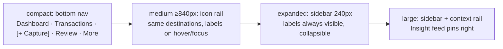

# 07 — Platform Strategy: Mobile & Desktop

**Status:** Baseline · **Depends on:** [01](01-product-requirements.md), [03](03-domain-model.md), [05](05-architecture.md), [09](09-implementation-plan.md)

---

## 1. Why this document exists

The product must genuinely serve **both** a phone and a desktop browser — a first-class requirement, not a
responsive afterthought, because the two platforms serve different jobs for different personas and the
product fails if either is second-class.

| | Mobile | Desktop |
|---|---|---|
| Persona / job | **P1 "Goran"**, ~80 % of captures: JTBD-1 (record in < 5 s), JTBD-2 (Receipt → OCR), JTBD-7 (Alert on the go) | **P1** reviewing, **P2 "Jelena"** configuring: JTBD-9 (bulk-fix and audit), JTBD-6 (where did it go), JTBD-8 (plan a goal) |
| Session shape | 20–40 s, one-handed, often mid-task, often offline | 10–30 min, seated, keyboard, multi-tab |
| Friction tolerance | **Zero** — one extra tap loses the capture | Higher — density and precision are worth clicks |
| Feature load | Narrow and deep: capture, review, safe-to-spend | Wide and dense: tables, bulk edit, analytics, CSV, print |
| The failure that kills us | Capture is slow, or a notification never arrives | Bulk correction is tedious, or the month cannot be closed |

Binding consequences: (1) **one Angular application, two felt experiences** — [ADR-004](14-decisions-and-risks.md)
and [ADR-006](14-decisions-and-risks.md) fix a single responsive codebase, and divergence is layout,
navigation and density, never forked features; (2) **capture ([F-05](01-product-requirements.md),
[F-06](01-product-requirements.md)) is phone-first** because that is where it is hardest and where the
thesis lives ([05 §5.3](05-architecture.md#53-the-capture-path-performance-critical)), while **the audit path
([F-24](01-product-requirements.md), [F-25](01-product-requirements.md), [F-08](01-product-requirements.md))
is desktop-first**; (3) **offline ([F-26](01-product-requirements.md)) is a mobile concern desktop
inherits**, and **no feature is mobile-only or desktop-only unless §3.5 says so** — every screen has a
defined layout at every size class.

---

## 2. The delivery-route decision

Options: **A** responsive web only · **B** PWA-first · **C** Capacitor shell · **D** native Kotlin + Swift.
Scores are for *our* situation — 1–2 engineers ([09 §10](09-implementation-plan.md#10-staffing-shapes)),
Serbian launch, a forms-and-lists workload — not in the abstract.

| Criterion | A — Web | **B — PWA (chosen)** | C — Capacitor | D — Native |
|---|---|---|---|---|
| **Time to first release** | 0 | **0 (already in [Phase 4](09-implementation-plan.md#6-phase-4--receipts--mobile-weeks-1214-28-pd))** | +2–3 wk | +12–16 wk/platform |
| **Update latency** | Instant | **Instant** (SW version bump) | JS instant; shell needs review | 1–7 day review |
| **Store discovery** | None | **None** — install is earned | Play + App Store | Best |
| **Camera / OCR access** | `getUserMedia`, HTTPS + gesture | **Good enough** (+ file-input fallback) | Native camera, no gesture | Best |
| **Push reliability** | Poor | **Android good** · **iOS conditional** (§4.8) | FCM/APNs reliable | Best |
| **Offline** | None | **Good** — SW + IndexedDB, evictable | Web layer + native storage | Full control |
| **Biometric auth** | WebAuthn, awkward UX | **Acceptable** (passkeys, [F-28](01-product-requirements.md) *Could*) | Keystore / Keychain | Native |
| **Background jobs** | None | **Poor** — Chromium-only, opportunistic, iOS none | OS-throttled plugins | WorkManager / BGTaskScheduler |
| **Performance, low-end Android** | Baseline | **Acceptable** — WebView + JS boot cost | Same engine, no chrome | ~2–3× headroom we don't need |
| **Maintenance cost** | 1 codebase | **1 codebase, 0 shells** | +2 shells, plugins, SDK churn, privacy manifests | 3 codebases |

> **Recommendation: Option B, PWA-first**, exactly as [ADR-006](14-decisions-and-risks.md) states. No native
> shell in v1; [ADR-012](14-decisions-and-risks.md) defers native apps and Open Banking
> ([F-33](01-product-requirements.md)) for the same reason — expensive, and unevidenced.

**We are not choosing PWA because it beats native.** We choose it because it is sufficient for the v1 jobs
and costs the team nothing extra; the accepted risks are enumerated in §4.8–§4.10 and §9, not hidden. Two
rules keep the option open: **Capacitor is a shell, not a rewrite** — no code path may depend on a
native-only capability without a web fallback, so every platform call goes through one thin
`PlatformCapability` service (`camera`, `push`, `storage`, `biometrics`) whose web implementation ships
today, the same discipline as the `AiProvider` boundary in
[05 §4](05-architecture.md#4-the-ai-layer-as-an-architectural-boundary); and **no web-only dead ends**.

### Measurable triggers for Capacitor/native in v2

A pre-committed threshold evaluated at the end of a release cycle using telemetry we already collect
([05 §10](05-architecture.md#10-observability-hooks-built-in-from-day-one)) — not a matter of taste.

| # | Trigger | Measurement | Threshold |
|---|---|---|---|
| **T1** | Capture not fast enough on real hardware | `capture.time_to_log` p50, and the share in `app.boot.duration` | p50 > **5.0 s** for 2 weeks, **≥ 40 %** of it boot |
| **T2** | Push undependable on iOS | Delivered / dispatched to iOS A2HS users, 30 days | < **85 %** |
| **T3** | iOS users never install, so never get push | A2HS conversion among iOS users completing [F-13](01-product-requirements.md) | < **75 %** within 14 days |
| **T4** | Camera path unreliable on iOS | Receipt ([F-14](01-product-requirements.md)) captures that never produce an uploaded Receipt | > **12 %** |
| **T5** | Store discovery is the missing channel | Signups citing app-store search; or paid CAC on web | > **30 %** of signups, or CAC > **1.8×** target |
| **T6** | Janky with real data | INP p75 on the transaction list ([F-24](01-product-requirements.md)) with > 5 000 Transactions | > **200 ms** sustained |
| **T7** | A required capability is unreachable | e.g. on-device ML barcode/edge detection becomes committed scope | Capability gap, evidenced |
| **T8** | Support volume says "not an app" | Share of tickets "can't find it in the store" / "no notifications on iPhone" | > **15 %** |

**Decision rule:** → **Capacitor** when **≥ 2 triggers** hold across a full release cycle **and** the fix is
not deliverable in the web layer within 2 sprint-weeks; → **Native** only when a capability Capacitor cannot
provide is required; → **Stay on PWA** otherwise. Record the evaluation in
[14](14-decisions-and-risks.md) either way. **Non-triggers:** wanting an App Store listing, a competitor
having an app, stakeholder preference, one loud ticket. **Not in v1:** native shells
([ADR-012](14-decisions-and-risks.md)); an in-app marketing surface (behind auth, SSR explicitly out —
[ADR-006](14-decisions-and-risks.md)); server-side PDF rendering (no headless Chrome;
[ADR-013](14-decisions-and-risks.md) keeps production single-node); tablet split-view beyond §3.4;
wearables, widgets and quick-add shortcuts.

---

## 3. The shared responsive system

### 3.1 Breakpoint tokens — container queries, not media queries

Container queries are the source of truth, as [05 §5.4](05-architecture.md#54-design-system) requires,
because a list-detail pane must respond to *pane* width. Media queries are reserved for genuinely
viewport-scoped concerns: print, `prefers-reduced-motion`, safe-area insets.

```css
@layer tokens {           /* the ONLY breakpoint vocabulary in the codebase */
  --bp-compact:  599px;   /* 320–599   phone portrait                */
  --bp-medium:  1023px;   /* 600–1023  phone landscape, small tablet */
  --bp-expanded:1439px;   /* 1024–1439 laptop, tablet landscape      */
  /* large = above --bp-expanded : desktop */
  --nav-bottom-h: 56px;  --nav-sidebar-w: 240px;  --nav-rail-w: 64px;  --content-max-w: 1600px;
}
.app-content { container: layout / inline-size; }
@container layout (min-width: 600px)  { /* medium   */ }
@container layout (min-width: 1024px) { /* expanded */ }
@container layout (min-width: 1440px) { /* large    */ }
```

Names follow the Material size-class vocabulary so nobody invents a fifth; a component needing an
intermediate value uses `clamp()`/`minmax()`, **not** a new breakpoint. **JS mirror:** structural decisions
CSS cannot make ("do we mount a second `router-outlet`?") go through one `LayoutService` backed by
`BreakpointObserver` using the **same** class names — a different notion of "desktop" in TypeScript than in
CSS is a bug class we refuse to create.

### 3.2 Layout patterns per size class

| Size class | Grid | Navigation | Density | Capture affordance |
|---|---|---|---|---|
| **compact** (< 600) | 1 column, 16 px gutters | Bottom nav, 4 items + centre action | Comfortable; 44 px targets | Pinned input bar above the nav |
| **medium** (600–1023) | 1 column, 24 px gutters, max 720 px | Bottom nav → icon rail at ≥ 840 px | Comfortable | Pinned bar, or header field in landscape |
| **expanded** (1024–1439) | List + detail (list 380–440 px) | Sidebar 240 px, collapsible to rail | Compact rows, 32–36 px | Always-visible header input (`n` / `⌘K`) |
| **large** (≥ 1440) | Sidebar + list + detail + optional Insight rail | Sidebar + rail | Dense; table mode (§5.2) | Header input, multi-line paste |

```text
compact                medium                 expanded                large
┌───────────┐          ┌──────────────┐       ┌──┬────────┬────────┐   ┌──┬──────┬────────┬──────┐
│  content  │          │    content   │       │▐▌│  list  │ detail │   │▐▌│ list │ detail │ rail │
├───────────┤          ├──────────────┤       │▐▌│        │        │   │▐▌│      │        │      │
│ Dashboard │          │ ▐ Dashboard  │       └──┴────────┴────────┘   └──┴──────┴────────┴──────┘
│ Txns [ + ]│          │ ▐ Txns       │        sidebar 240px,           + Insight / context rail
│ Review ③  │          │ ▐ Review  ③  │        collapses to 64px
│ More      │          │ ▐ More       │
└───────────┘          └──────────────┘
```

### 3.3 Navigation transformation



(1) **The destination set never changes** across size classes — only its rendering: learn it on a phone, find
it on a desktop. (2) **The review-queue badge** ([F-08](01-product-requirements.md)) is on the nav at every
size; it is the retention mechanic and never hides behind "More". (3) **Capture is never a destination that
loses state** — compact: centre action focusing the pinned input; expanded: header field; all sizes: `⌘K` /
`n` focuses it. (4) **"More" is a grouped, searchable sheet** (Settings, Categories, Merchants,
Counterparties, Budgets, Goals, Recurring, Rules, Export) identical to the sidebar's lower section.
(5) **Deep links are identical at all sizes** — `/transactions/:id` is full-page on compact, a detail pane on
expanded; the URL is the contract, layout is presentation.

### 3.4 When a screen becomes two-pane

Promote a list→detail route only when **all** hold: (1) container ≥ **1024 px**; (2) the task is
browse-and-inspect, not create (wizards, Receipt capture, onboarding and the Assistant stay single-column at
every size — they are linear flows); (3) the detail view is non-modal and safe to leave, with no unsaved
money edit lost on selection change; (4) the route already carries both ids, so a resize or shared link never
loses selection; (5) the list is keyboard-traversable (§5.3). Otherwise it stays single-column even at
2560 px — **a cramped two-pane is worse than a clean single column**, and a 420 px detail pane at 1440 px is
a bug, not a feature.

### 3.5 Screen → layout matrix

| Screen (feature) | compact < 600 | medium 600–1023 | expanded 1024–1439 | large ≥ 1440 |
|---|---|---|---|---|
| **Onboarding** ([F-13](01-product-requirements.md)) | Full-page stepper | Centred card, 1 step/screen | Centred card, max 720 px | Same — never split |
| **Dashboard** ([F-19](01-product-requirements.md), [F-21](01-product-requirements.md)) | Stacked tiles, pinned capture | 2-column tiles | 3-column tiles + list | 3 columns + Insight rail |
| **Capture / preview** ([F-05](01-product-requirements.md), [F-06](01-product-requirements.md)) | Bottom sheet from pinned bar | Wider bottom sheet | Inline header panel, rows as a table | Inline panel + live ledger preview |
| **Transaction list** ([F-24](01-product-requirements.md)) | Cards grouped by date | Cards, grouped | Two-pane: list + detail | Two-pane + rail, dense table |
| **Transaction detail / Splits** ([F-04](01-product-requirements.md), [F-15](01-product-requirements.md)) | Full-page route | Full-page route | Detail pane | Detail pane |
| **Review queue** ([F-08](01-product-requirements.md)) | Full-page list + bulk bar | Full-page list | Two-pane + confidence context | Two-pane + keyboard batch resolve |
| **Receipt capture** ([F-14](01-product-requirements.md)) | Full-page camera + overlay | Full-page | Full-page (needs the viewport) | Full-page |
| **Receipt itemisation** ([F-14](01-product-requirements.md)) | Cards, reconciliation sticky | Full-page | Two-pane: ReceiptItem + edit | Two-pane + reconciliation rail |
| **Category tree** ([F-02](01-product-requirements.md), [F-03](01-product-requirements.md)) | Tree, drill-in per node | Full-page tree | Two-pane: tree + node editor | Two-pane + keywords table |
| **Merchants / Counterparties** ([F-10](01-product-requirements.md), [F-11](01-product-requirements.md)) | List → detail | List → detail | Two-pane | Dense table + detail |
| **Tags** ([F-12](01-product-requirements.md)) | Sheet | Sheet | Inline panel | Inline panel |
| **Budget editor** ([F-17](01-product-requirements.md)) | Full-page form | Full-page form | Two-pane: Budget list + editor | Two-pane, wide form |
| **Goals** ([F-18](01-product-requirements.md)) | Cards + contribution sheet | 2-column cards | Two-pane | Two-pane + projection chart |
| **Recurring & upcoming** ([F-16](01-product-requirements.md)) | Full-page list | Full-page list | Two-pane | Dense table + calendar strip |
| **Insights / analytics** ([F-20](01-product-requirements.md)) | Stacked charts, 1 per row | 2 charts per row | 2–3 charts + table | Wide grid + data table (§5.7) |
| **Assistant** ([F-23](01-product-requirements.md)) | Full-page chat | Full-page chat | Chat + facts panel | Chat + facts + drill-through list |
| **Rules** ([F-09](01-product-requirements.md), [F-07](01-product-requirements.md)) | List → editor | Full-page | Two-pane | Dense table + editor |
| **Notifications centre** ([F-22](01-product-requirements.md)) | Full-page feed | Full-page feed | Feed + detail | Feed + detail |
| **CSV import** ([F-25](01-product-requirements.md)) | Full-page wizard | Full-page wizard | Full-page wizard (drop zone) | Full-page wizard |
| **Settings** ([F-27](01-product-requirements.md), [F-32](01-product-requirements.md)) | Full-page sections | Full-page sections | Sidebar + section pane | Sidebar + section + rail |

A screen may be two-pane only if this table says so; changing it is a change to this document.

---

### 3.6 The visual system, both themes (ADR-039)

**One token layer, two themes, one writer.** Every colour role is declared twice in
`apps/web/src/styles.css` — dark in `:root`, light in `:root[data-theme='light']` — and `ThemeService`
(`core/theme/`) is the only thing that writes the attribute. It holds a **preference**
(`system | light | dark`, persisted under `fm.theme`) and a **resolved** theme; while the preference is
`system` it follows `prefers-color-scheme` and re-resolves when the OS flips. It also repaints
`<meta name="theme-color">` and sets `color-scheme`, without which a light theme still draws dark
scrollbars and dark autofill. A four-line script in `index.html` applies the stored value **before first
paint**, because a signal-driven effect runs after the bundle boots — late enough for a dark-theme user to
see a white flash on every load. `system` with no OS signal resolves to **dark**, which keeps the
house default.

**Roles, not palette entries.** Components reference `--color-surface`, `--color-text-muted`,
`--color-primary-text` and so on; `--chart-1…7`, `--gradient-hero` and `--color-*-soft` exist so a chart,
the hero card and a status chip cannot invent a colour. Three rules the file states in its own header and
this document repeats because they are the ones broken by accident: money is **ink, never colour** (a
tile's chip may be tinted; the amount may not — docs/13 §9); `--color-primary-text` is the brand as
**text** and `--color-primary` is the brand as a **fill**, because the fill is 4.14:1 on its own tinted
active state; and the two hero inks are measured against **every** gradient stop, because a gradient has
no single background to measure.

**Contrast is a test.** `apps/web/src/styles.tokens.spec.ts` reads `styles.css` and re-measures every
text pair in both themes at WCAG AA, including text on the 10–14 % brand tint, the badge count on its
danger fill, the chart axis and tooltip, and the hero's ink over each gradient stop. 4.3.1d and 4.3.4b
each shipped one token value that made text unreadable and that no other test could see; this is the
guard that makes the next one fail in CI.

**Icons are paths, not glyphs.** `shared/ui/icon` holds ~40 stroke paths on one 24×24 grid, drawn inline
so they inherit `currentColor`, need no request in an offline-first app, and cannot drift in weight the
way a platform's emoji can. `NavItem.icon` is typed as an icon name, so a rename fails the build. An icon
is `aria-hidden` by default and becomes a named image only when it is a control's whole meaning (the theme
toggle, the bell).

**Primitives are global classes.** `.fm-card` (with `--brand`, `--tight`, `--flush`, `--interactive`),
`.fm-page`/`.fm-page__head`/`.fm-page__title`, `.fm-btn`, `.fm-chip`, `.fm-icon-btn`, `.fm-progress`,
`.fm-skeleton`, `.fm-table`, plus the components `fm-icon`, `fm-avatar`, `fm-progress`, `fm-sparkline`,
`fm-donut`, `fm-bar-chart` and `fm-theme-toggle`. They are deliberately **not** encapsulated component
styles: twenty screens had each rolled a slightly different `.card`, and a class a screen can vary is what
stops that returning.

**Charts carry no money formatting.** `fm-donut`, `fm-bar-chart` and `fm-sparkline` take ratios, drawing
coordinates, token names and **pre-formatted strings**; they never divide two amounts and never render a
currency (ADR-003). Every derived figure they show is either the server's (`shareOfTotal`,
`SavingGoalModel.progress`, `BudgetModel.usedRatio`) or `@finmate/domain`'s (`changeRatio`,
`shareOfTotal`), which is the same code the API's calculators use.

**Wide screens are a layout of their own, not a stretched one.** Three rules were learned at 1920 px, and
each is a mistake that looks like a cosmetic nit until it is measured:

- **A grid item must not span the rows it is sized against.** The dashboard's rail (assistant + alerts)
  was placed with `grid-row: 1 / -1` beside a two-row main column. Because the panel column already
  exceeded the rail's height, the grid charged the **whole** rail height to row 1 — 497 px for a 205 px KPI
  row — and left 290 px of empty background between the tiles and the charts. The fix is structural: the
  KPI row and the panels live in one wrapper, and the rail is its **sibling** column.
- **A reading measure has to be centred, and the cap relaxed once the window can carry it.** The content
  column carried `max-inline-size: 1440px` with no `margin-inline: auto`, so at 1920 px the whole page sat
  against the sidebar with 216 px of empty background on the right — a layout that had failed to fill
  rather than a measure. It is centred, and 1600 px from 1600 px up. The wide rule must come **after** the
  1024 px block or the narrower cap wins (this bit once, exactly as it did with the pinned compact bar).
- **A panel should hand its spare height to its content.** Cards in a row are equal height by design, so
  the chart's card was 342 px tall with a 190 px plot and 150 px of empty card under it. `fm-bar-chart`
  now grows its plot to whatever the card gives it, keeping `height` as the floor.

**Where the reference is deliberately not followed.** The account block names the **role**, not a person's
name — `users.display_name` exists but no operation returns it, and inventing one from an email local
part would be a fabricated identity. The greeting has no name for the same reason. The sidebar footer carries the
settings entry rather than a marketing line, because a control that works is worth more than a sentence
that does not. The search field performs a **real** search: it navigates to `/transactions?search=…`, a
key `FILTER_QUERY_KEYS` now carries, because docs/02 §2 forbids a control that only looks like one.

---

## 4. Mobile-specific concerns

### 4.1 Thumb-zone reachability

Primary actions live in the **lower third**: on compact, the pinned capture bar, the bottom nav and a bottom
sheet's confirm button are reachable without shifting grip. Destructive actions never sit under the resting
thumb — delete/discard is at the top of a sheet or behind an explicit confirm, never a bare left-swipe.
**Swipe is always a shortcut, never the only route** (row swipe also exists in the long-press menu and in
bulk edit — [F-08](01-product-requirements.md)), which also satisfies WCAG 2.2 **2.5.7**. Top-of-screen
chrome is for context, not for the actions a user performs every session.

> **Build state (4.3.1b).** **Done**: a sheet's dirty state now guards every dismissal route, and
> swipe-down-to-dismiss exists. The three routes — the close button, `Esc` and a downward flick — end in
> one guard: a form whose record fields differ from what it loaded raises an in-sheet `alertdialog`
> (*Discard changes* / *Keep editing*) instead of losing the edit, and a flick over a clean sheet closes
> it. `planEdit` is deliberately not the dirty test: it compares a **parsed** amount, so a half-typed
> `12,` reads as unchanged there — which is exactly the edit a guard exists for. `remember` is excluded,
> because it is not part of the record, only a modifier of the save. The gesture is a shortcut only:
> the close button and `Esc` remain, all three pass the same guard (WCAG 2.2 SC 2.5.7), and the threshold
> is a tested constant (`shared/ui/sheet-drag`).
>
> **Not done**: **the pinned capture bar.** `position: sticky; inset-block-end: 0` was tried, measured and
> removed — it computes but does nothing when the bar is the **last child of its containing block**, which
> has no slack below it to stick into: the confirm button still measured **1431 px down on a 720 px
> viewport**, and only *looked* pinned at the end of a scroll because that is where it naturally is. A
> real pinned bar needs the preview list to own its own scroll container (so sticky has slack) or a fixed
> bar offset by the bottom nav's height; both restructure `/capture`, so it is scheduled as **4.3.1c**
> with the measurement rather than shipped as CSS that does nothing. Note also that docs/02 §4.3's
> wireframe draws the confirm **inline at the end of the card**, which is what ships — the two documents
> disagree, and this note is where the disagreement is recorded rather than silently resolved.

### 4.2 Bottom sheet vs full page

| Bottom **sheet** when… | Full **page** when… |
|---|---|
| ≤ 5 fields, no nested navigation | The view has its own route / needs a deep link |
| Dismissible with no unsaved money edit | A multi-step flow (onboarding, CSV import, Receipt capture) |
| Originates from a row the user just touched | It contains an independently scrolling list or a chart |
| ≤ 90 `dvh`, draggable, visible grabber | A long form or dense editor (Category tree, Budget editor) |
| A confirm or a quick pick | Something the user returns to via back-navigation |

**Dialogs are reserved for destructive confirmation**: `role="alertdialog"`, no forms inside, always naming
the object at risk. Sheets must be draggable-to-dismiss, trap and restore focus (§7.4), set the background
`inert`, and — when dirty — turn a swipe-down into a discard confirm rather than losing a money field.
> **Build state (4.3.1b).** The Transaction edit sheet is a **native `<dialog>`** opened with `showModal()`,
> which is what provides focus containment, `Esc`, the top layer and the page behind it being inert — a
> div-based modal reimplements all four and usually gets one wrong. `Esc` and the swipe now go through the
> dirty guard described in §4.1's note. What is **not** here: a general `ui-sheet` primitive. docs/02 §7
> lists one, and it stays unbuilt on purpose — with `showModal()` the platform *is* the primitive, and a
> wrapper with a single consumer would be indirection. If a second sheet appears, that decision is worth
> revisiting.

### 4.3 Safe-area insets and notches

Set `viewport-fit=cover` in the viewport meta, then use `env(safe-area-inset-*)` on every fixed-edge
element: `padding-bottom: calc(12px + env(safe-area-inset-bottom))` on the pinned bar and bottom nav,
`padding-top: env(safe-area-inset-top)` on installed full-page headers. **Use `dvh`, never `vh`** — `100vh`
on mobile Safari is the URL-bar-expanded height and clips a sheet or hides a confirm button; sheets use
`max-height: 90dvh`. Keep ≥ 8 px clearance above the home indicator, and in landscape keep charts and pin
pads away from the top inset (the notch is on the *side*). Set `theme-color` for both themes so the status
bar does not flash white on launch.

> **Build state (4.3.1a).** Implemented: `viewport-fit=cover` (`index.html`); `env(safe-area-inset-top)` on
> the header, which is the topmost element on every authenticated screen and on the lock screen;
> `env(safe-area-inset-bottom)` on the bottom nav, the element that actually meets the home indicator
> (the content region keeps its own inset because the nav is absent on `/onboarding` and while locked);
> and `dvh` everywhere — `100vh` in the Transaction sheet's `max-height` was clipping its own footer on
> Safari, and the lock screen's vertical offset was the other one. The sheet now uses
> `min(90dvh, calc(100dvh - 2rem))`, so it is never taller than the doc's 90dvh and still keeps its
> margin when there is room. **Measured**: zero horizontal overflow on all 18 authenticated routes at
> 320/768/1280 px; the shell previously overflowed 48 px at 320 px (docs/02 §9). **Not yet done** in this
> task: drag-to-dismiss, the `inert` background and the dirty-swipe guard on sheets — that is 4.3.1b,
> with the pinned capture bar that makes the primary action thumb-reachable on compact.

### 4.4 iOS keyboard quirks and the money input

The money field ([F-05](01-product-requirements.md)), rendered only by `ui-money`
([05 §5.4](05-architecture.md#54-design-system)), is the most-touched control in the product.

- **`type="text"` + `inputmode="decimal"`. Never `type="number"`** — it discards the caret, rejects the
  Serbian decimal comma and shows spinners; `type="number"` for money is a correctness bug.
- **Font size ≥ 16 px on the focused field**, or iOS auto-zooms on focus and breaks the layout exactly when
  the user is typing. Add `enterkeyhint="done"`, `autocomplete="off"`, `autocorrect="off"`.
- **Accept both separators.** `2.000`, `2000`, `2 000`, `2000,50`, `2000.50` and a trailing `RSD`/`din`/
  `dinara` all parse to one `amount_minor`. Ambiguity rule: a `.` followed by exactly three digits with no
  `,` present is a **thousands separator** (`2.000` → 2000, not 2.0); golden-dataset cases cover this
  ([09 §2.1.2](09-implementation-plan.md#sprint-21-week-6--parser--rules-12-pd)).
- **Format on blur, never mid-typing** — reformatting under the caret is the fastest way to make a numeric
  field infuriating.
- **Never rely on `position: fixed` for the pinned bar.** iOS moves the *visual* viewport; subscribe to
  `visualViewport.resize`/`scroll` and translate, or anchor with `dvh`. The "no layout jump" DoD item
  ([09 §4.3.3](09-implementation-plan.md#sprint-43-week-14--mobile-ux-polish-7-pd)) is this.
- **Bulk input keeps the keyboard open across confirm** — `Lidl 2000, gorivo 3500` → confirm → next needs no
  re-tap, a measurable part of the ≤ 4 s target.

### 4.5 Camera capture for Receipts ([F-14](01-product-requirements.md))

```text
tap "Slikaj račun"
  ├─ getUserMedia({ video: { facingMode: 'environment' } })  ← live preview + guide frame
  │     └─ capture frame → canvas → downscale → JPEG q0.8 → queue upload
  └─ fallback: <input type="file" accept="image/*" capture="environment">
        when getUserMedia is missing, permission denied, a WebView blocks it, or "Iz galerije"
```

**HTTPS and a user gesture are both required** — a capture without a tap fails silently on iOS, so the
button *is* the gesture. Request ≥ 1280×720 and downscale the longest edge to 2048 px before upload; bigger
does not improve OCR enough to justify 4G upload time. **Always offer the file input** — it is also the
gallery path and the only path in in-app browsers (Instagram/Facebook WebViews), which have no push and
inconsistent media permissions. **Uploads must be resumable or re-queueable**: iOS suspends a backgrounded
PWA, so an unfinished Receipt photo stays in the outbox and retries (§6) rather than being lost. Torch/flash
is supported *if* `getPhotoCapabilities` reports it, never required.

### 4.6 Share-target ingestion

Web Share Target lets another app share a photo, PDF or text into capture — the highest-leverage mobile entry
point after the pinned input. Declared in `manifest.webmanifest` (`share_target`); **Android Chromium,
installed PWA only**. `POST /share` (multipart) routes a photo to a pending Receipt and pre-fills text into
the capture field, and **nothing auto-commits** — a shared string is a `Proposal` until confirmed
([ADR-001](14-decisions-and-risks.md)). **iOS has no equivalent and this is unfixable in v1** (§9); the
honest mitigation is that the install sheet (§4.7) teaches copy → paste and the pinned input accepts
multi-line paste ([F-06](01-product-requirements.md)), making it two taps.

### 4.7 Install / Add-to-Home-Screen

On iOS install is not a nicety — **it is the precondition for push** (§4.8). Treat it as a funnel.

| Platform | Mechanism | When we ask |
|---|---|---|
| Android Chromium | `beforeinstallprompt` → our own sheet with a real "Instaliraj" button | After the **2nd** confirmed capture, never on first load |
| iOS Safari | No API — instructional sheet with Share → "Add to Home Screen" steps and a screenshot | After the **2nd** confirmed capture; suppressed 30 days if dismissed |
| Already installed | `display-mode: standalone` match | Never shown |

Never block the app behind install; never prompt during onboarding ([F-13](01-product-requirements.md)); be
honest in the CTA ("Dodaj na početni ekran — dobijaš obaveštenja"); record `install.prompt_shown` /
`install.accepted` so T3 is measurable.

> **Built in 4.3.2a — the install itself.** `public/manifest.webmanifest`, four generated icons (the
> maskable variant keeps the glyph inside Android's 80 % safe-zone circle; iOS gets a bleeding
> `apple-touch-icon` plus the three legacy `apple-mobile-web-app-*` tags it reads instead of the manifest),
> and the manifest and icons added to the service worker's `app` asset group so an installed app has them
> offline. `pnpm icons:generate` writes them with a **dependency-free** PNG encoder over `node:zlib`.
> **Verified against Chrome rather than against the files**: CDP `Page.getInstallabilityErrors` returns
> **none**, the worker is `activated` at `/`, and every icon is fetched and its PNG header decoded rather
> than trusted. ⚠️ The brand is now written in `index.html`, the manifest and the apple title as well as in
> `APP_NAME`/`app.name`: a static asset cannot read a config token, so a rename is a search over five
> places, not one.
>
> **Built in 4.3.2b — the funnel above.** `apps/web/src/app/core/install/` holds the decision
> (`install.view.ts`, pure: every gate in the table is asserted in its spec), the seam the two events go
> to (`install-events.ts`) and the one object that touches the window (`install.service.ts`);
> `shared/ui/install-sheet/` is the sheet, rendered by the **shell** beside the update line because
> `beforeinstallprompt` fires once, early, and long before anybody reaches `/capture`. Records:
>
> - **The trigger is a capture the server accepted.** A queued offline batch is a *promise*, and a replayed
>   commit carries the same `idempotencyKey` — neither counts. `capture.component.ts` reports the one case
>   that does.
> - **`offeredAt` is a timestamp and not a flag, and that is the whole of the "When we ask" column.** An
>   offer that was never answered is not repeated; a **dismissal** is a 30-day pause and nothing more, so
>   the funnel can come back once the window passes — which a boolean `shown` could not express without
>   either suppressing for ever or reappearing on every capture (the shape a first draft had).
> - **Acceptance is measured, never asserted.** Chromium answers through `userChoice`/`appinstalled`; iOS
>   has no API at all, so its only evidence is a later launch in `display-mode: standalone` — recorded once,
>   and attributed only if a sheet was actually shown (an install from the browser's own menu is marked
>   installed and invents no event). There is no "I installed it" button for the same reason, and the event
>   set is therefore exactly the two §4.7 asks for: *shown without accepted* **is** the T3 gap.
> - **Which sheet is decided by what the platform can do, not by its name.** A deferred
>   `beforeinstallprompt` means the real button (Chromium, desktop included — §4.7's row says *Android*
>   because that is where the funnel matters, not because a desktop Chromium cannot install); iOS without
>   one gets the instructions; and a browser with neither — Firefox, desktop Safari — gets **nothing**,
>   because instructions for a menu that does not exist are worse than silence.
> - **It is not modal and it moves no focus.** §7.4's focus rules are written for a sheet the *user*
>   opened, and §4.7's prose is explicit that install must never block the app. The panel sits in the
>   content flow, labels itself as a `region`, and leaves the caret where it was.
>
> **Verified live 25/25** against the served production build (both platforms, the dismissal window, the
> standalone gate, three widths, and the button reached **with Tab**), axe reports **0 violations** with the
> sheet open at 320 and 1280 px, and the shell budget moved 137.9 → **140.6 KB** of 150.
> ⚠️ **The residual this task owns:** `install.prompt_shown` and `install.accepted` have **no sink**. The
> web client has no telemetry transport at all — the same is true of §11's RUM and of `sync.pending_age` in
> [05 §10](05-architecture.md#10-observability-hooks-built-in-from-day-one) — so the two events are typed,
> emitted at the right moment, and written to a bounded on-device log that a transport can drain, and T3 is
> **not measurable until one is wired**. `INSTALL_EVENT_SINK` is the one provider override that fixes it.
> **Also not built**: nothing distinguishes a member who ignored the sheet from one who never saw it.

### 4.8 iOS PWA push limitations — stated plainly

The weakest link in the PWA strategy. Better to design around it than to pretend.

| Limitation | Reality |
|---|---|
| OS floor | Web Push needs **iOS/iPadOS 16.4+**. Below that, no push at all. |
| Install requirement | Works **only** in a PWA added to the Home Screen; in a Safari tab `PushManager` does not exist. |
| Permission gesture | `Notification.requestPermission()` must come from a user gesture; a page-load prompt is ignored. |
| Silent / background data push | Not supported — we cannot wake the app to sync. |
| `badge` / `renotify` | Inconsistent; build no UI that depends on them. |
| Delivery timing | Delayed by Focus, Low Power Mode, OS batching. Push is **not** a timer. |
| Subscription drift | `pushsubscriptionchange` is unreliable → **re-subscribe on every app start** when permission is granted. |

**Binding consequences:** (1) the in-app notification centre ([F-22](01-product-requirements.md)) is the
source of truth and is complete without push; (2) **email is the reliable fallback channel on iOS** —
`notifications.channel` already has `EMAIL` ([03 §4](03-domain-model.md#4-schema-postgresql-16)), and a user
whose subscription cannot be established gets a one-time offer; (3) no Alert is load-bearing — dedupe and
quiet hours stay server-side ([05 §9](05-architecture.md#9-notification-pipeline)) and a dropped delivery
changes nothing about the ledger; (4) delivery status is recorded from day one, so T2 is evidence-based.

> **Built in 4.2.5.** The client half implements this table as a six-state device panel on
> `/notifications` (`apps/web/src/app/core/push/`): `READY`, `SUBSCRIBED`, `BLOCKED`, `IOS_INSTALL`
> (iOS outside an installed PWA — the row above that would otherwise read as "unsupported"),
> `SERVER_OFF` (no VAPID pair) and `UNSUPPORTED`. Nothing prompts without a button press, which is the
> gesture requirement; the states where a subscription cannot be established offer email, per
> consequence (2); and `PushService.syncOnStart` re-registers an existing subscription once per app
> start, which is the last row of the table. The A2HS install funnel itself (`T3`) is **built in 4.3.2b**
> — §4.7's panel, which this screen's `IOS_INSTALL` state is what makes actionable; ⚠️ the cross-reference
> this note used to carry (docs/02 §4.1) was wrong: §4.1 is the onboarding wizard and never had an install
> prompt, so the panel's screen-level record now lives in docs/02 §2.

### 4.9 Storage eviction risk (IndexedDB)

IndexedDB is **not durable storage**; treating it as such is how offline capture silently loses data. iOS
Safari (non-installed) applies ITP-style 7-day caps on script-writable storage — treat non-installed iOS as
volatile rather than relying on specifics. An installed iOS PWA is materially better but **still
best-effort**. Android Chrome evicts under storage pressure. Mandatory mitigations: **(1)** request
`navigator.storage.persist()` at first capture and record the answer; **(2)** keep the outbox small and
short-lived, flushing on app start, `online`, `visibilitychange → visible` and after each local write
(debounced); **(3)** never treat a local-only row as safe past 24 h — `sync.pending_age`
([05 §10](05-architecture.md#10-observability-hooks-built-in-from-day-one)) drives an escalating in-app
warning and, past 7 days, a blocking prompt with export-as-text; **(4)** surface
`navigator.storage.estimate()` in Settings → Diagnostics; **(5)** nothing exists *only* locally —
attachments upload when possible, and a Receipt photo is the one flagged exception with its own retry.

### 4.10 Background sync limits

`SyncManager` is Chromium-only and absent on iOS; `PeriodicBackgroundSync` requires an installed PWA plus an
engagement heuristic, and its interval is a **hint** (Chrome enforces roughly ≥ 12 h); iOS has no background
sync of any kind. **Binding rule: background sync is opportunistic and never required for correctness** —
every background flush has a foreground equivalent and the app is fully correct if background execution
never happens, the same philosophy as the AI fallback chain in
[05 §4](05-architecture.md#4-the-ai-layer-as-an-architectural-boundary) where `null` is always handled.

### 4.11 Mobile performance budgets — mid-range Android

**Reference device (the floor for every device-lab number in this plan):** Galaxy A13/A15 or Moto G-class,
Android 12–14, ~4 GB RAM, entry-tier SoC, Chrome stable, throttled 4G profile.

| Metric | Budget |
|---|---|
| Cold start → interactive shell | ≤ 2.5 s |
| Capture field focusable after cold load | ≤ 1.5 s |
| Local segmentation/extract per keystroke (`packages/nlp`, in-browser) | ≤ 20 ms p95 |
| Input → optimistic local row visible | ≤ 100 ms |
| Input → parsed preview (rule-only) | ≤ 300 ms after the 250 ms debounce |
| Confirm → Transaction committed | ≤ 2 s p95 |
| **`capture.time_to_log`** | **p50 ≤ 4 s**, p90 ≤ 6 s ([09 §6](09-implementation-plan.md#6-phase-4--receipts--mobile-weeks-1214-28-pd)) |
| Transaction list scroll, 5 000 rows, virtualised | ≥ 50 fps sustained |
| Receipt JPEG (≤ 3 MB) upload on 4G | ≤ 6 s to accepted, then async OCR |
| JavaScript on the capture route, gzipped | ≤ 180 KB |

Missing a budget on the reference device means the feature is not done — a fast desktop and a slow phone is
precisely the outcome this document exists to prevent.

---

## 5. Desktop-specific concerns

### 5.1 Multi-pane layouts

The sidebar (240 px) collapses to a 64 px icon rail on demand and remembers the choice per Member. Two-pane
opens at `expanded` per §3.4; a third region (Insight/context rail) opens only at `large` and only on screens
that declare one in §3.5. Pane widths use `minmax()` with floors (list ≥ 360 px, detail ≥ 520 px) and **fall
back to single column rather than compressing both**. Each pane scrolls independently with
`overscroll-behavior: contain`. Content caps at `--content-max-w: 1600px`; 2560 px gets *more columns*, never
a stretched single column.

### 5.2 Dense table mode

Available at `expanded`/`large` for Transaction list, Review queue, Merchants, Counterparties, Recurring and
Rules. Rows 32–36 px, 13–14 px type, tabular numerals so amounts align on the decimal. Columns are
user-toggleable and persist per Member per screen, with a deliberately small default set (date, description,
Category, Account, amount). Sticky header, sticky first column on horizontal scroll, sticky group header per
`occurred_local_date`. **Virtual scrolling is mandatory**
([09 §1.2.5](09-implementation-plan.md#sprint-12-week-4--taxonomy--entry-ux-11-pd)) and DOM node count is
capped regardless of row count. Income vs expense is distinguished by **sign and label**, never colour alone
(§7.2). Dense mode is a *reading* mode: editing opens the detail pane or a sheet, because inline editing of
money fields in a virtualised table is forbidden.

### 5.3 Keyboard shortcuts and command palette

| Shortcut | Action | Shortcut | Action |
|---|---|---|---|
| `⌘K` / `Ctrl+K` | Command palette | `Enter` / `e` | Open / edit |
| `n` | Focus capture ([F-05](01-product-requirements.md)) | `x` | Toggle selection |
| `/` | Focus search ([F-24](01-product-requirements.md)) | `c` | Set Category on selection |
| `g` then `d`/`t`/`r`/`b`/`a` | Dashboard / Transactions / Review / Budgets / Analytics | `⌘Enter` | Save and close |
| `j` / `k` | Next / previous row | `Esc` | Close topmost sheet / clear selection |
| `Shift+J` / `Shift+K` | Extend selection | `?` | Shortcut reference sheet |

A single-letter shortcut never fires while a text field, textarea or contenteditable has focus (guard on
`event.target`). Shortcuts are discoverable via `?` and tooltips, and nothing is keyboard-only — every
shortcut has a visible control and every control is reachable without it
([01 §7](01-product-requirements.md)). The **command palette** is the desktop power surface: fuzzy search over
Transactions (description, Merchant, Counterparty), navigation targets and actions ("Dodaj trošak", "Novi
Budget", "Izvezi CSV"), results labelled by kind, keyboard-first and fully mouse-usable.

### 5.4 Multi-select bulk editing

The desktop answer to JTBD-9 and the reason a month closes in minutes. Selection is **id-based**, so it
survives scroll, sort and filter, with a visible count chip. Inputs: checkbox column, `x`, `Shift+click`
range, `⌘/Ctrl+A` for the visible page only (never a silently filtered whole set). Actions: set Category,
add/remove Tag, assign Merchant, assign Counterparty, set Account, confirm (`PENDING` → `CONFIRMED`), soft
delete. The bar states the count precisely — *"37 izabrano — Postavi kategoriju · Dodaj tag · Obriši"*.
**Destructive bulk operations require typed confirmation above 20 rows.** Bulk Category assignment offers the
same "Zapamti za ubuduće" affordance ([F-09](01-product-requirements.md)), which synthesises a `Rule`
**server-side** ([ADR-010](14-decisions-and-risks.md)) — never client-side. One atomic request, partial
success reported per row, never a silent partial.

### 5.5 Drag-and-drop CSV import ([F-25](01-product-requirements.md))

```text
drop .csv ─► column mapping (auto-detected, user-correctable)
          ─► dry run: first 50 rows validated, rejects listed with reasons
          ─► commit as a background job with progress
          ─► results: N imported · M skipped (reasons) · downloadable error report
```

The drop zone has a **click-to-pick equivalent** (WCAG 2.2 **2.5.7**) and a file can be chosen mid-drop.
**Dry run is mandatory** — we never import a file whose rejects the user has not seen. Rows create
Transactions with `source = 'IMPORT'` and `category_source = 'IMPORT'`
([03 §4](03-domain-model.md#4-schema-postgresql-16)); `Rule`s still run where the file has no category.
**Idempotency by file hash** prevents double import and, with `(household_id, idempotency_key)`, upholds
invariant I-10. Import is the migration path *in*; CSV/JSON export is the data-ownership guarantee *out*,
both reachable from Settings at every size class.

### 5.6 Hover-only affordances are forbidden on touch

A `:hover`-revealed control is **an enhancement, never the only route**: the base state (touch, keyboard)
always shows the affordance, and hover may only reduce its visual weight on pointer devices. Implementation:
the hover rule is wrapped in `@media (hover: hover) and (pointer: fine)`, the base rule unconditional, and
`:focus-within` gets what mouse users get. Row actions must be tappable on a hybrid touchscreen laptop — test
with `@media (hover: none)` (§10). Hover-revealed content is never the only place a value appears ("hover to
see the amount" is a bug), and tooltips are supplements, never containers of required information.

### 5.7 Wide-screen analytics layouts ([F-20](01-product-requirements.md))

Charts sit in a responsive grid with a ~360 px minimum tile and a maximum content width; a single donut
stretched to 2560 px is not a layout. **Precision pairs with shape:** every chart tile can expand into a data
table (also the accessible alternative, §7.3), and wide screens show chart and table side by side — that is
the real desktop advantage. Month-over-month comparisons render as small multiples, not 8-colour overlays.
Colour is never the only channel. Charts read backend-computed figures only
([ADR-001](14-decisions-and-risks.md)); no chart aggregates a raw list client-side.

### 5.8 Print / PDF export of a monthly report

Route `/reports/month/:yyyy-MM`, reachable from analytics and Settings. A dedicated `@media print` stylesheet
hides navigation, chrome, the capture bar and toasts, **forces light semantic tokens regardless of theme**,
expands collapsed panels, and avoids breaks inside a table row (`break-inside: avoid`). The printed artefact
always carries the Household name, the period, the household `iana_timezone`, an explicit **"generated at"**
timestamp, and the **`as of`** label for every figure drawn from a snapshot (§6). **`ui-money` has a
print-safe format** — sign plus label, never colour alone, so an income row and an expense row are
distinguishable in greyscale; charts print as static SVG on a light background with the data table appended
where precision matters. **Browser print is the v1 mechanism; server-side PDF is not** (no headless Chrome
service; [ADR-013](14-decisions-and-risks.md)), and because `@page` margins and header/footer handling differ
between Chrome, Firefox and Safari the report is validated in all three rather than trusted to look
identical (§9). Print output contains financial data and is never sent anywhere by us.

### 5.9 Multi-tab and multi-window behaviour

| Concern | Behaviour |
|---|---|
| **Refresh-token rotation** | Rotating tokens + two tabs = a race that logs the user out. All refreshes serialise through `navigator.locks.request('auth.refresh')`; exactly one tab rotates and the others adopt the result. Without this, multi-tab is broken by design. |
| **Logout** | Logging out in one tab logs out all tabs (BroadcastChannel). |
| **Rule / Correction / Category change** | Broadcast invalidates other tabs' caches; a tab mid-edit gets a conflict prompt rather than overwriting (§6). |
| **Ledger writes** | Affected ids are broadcast so other tabs update in place instead of refetching the dashboard. |
| **Staleness** | A tab hidden > 30 min revalidates on focus, showing a brief "osvežavam" state — it never presents stale money silently. |
| **Outbox ownership** | **Exactly one leader tab owns the outbox flush** (Web Locks election). Two tabs flushing one outbox is the classic duplicate-write bug; `idempotency_key` is the safety net, not the plan. |
| **Offline here, online there** | Allowed. The leader owns the flush; non-leaders show the pending tray read-only. |
| **Windows / side-by-side** | Treated as two tabs. No window-name coupling; `window.opener` is never relied on. |

---

## 6. Offline behaviour across both platforms

This implements [F-26](01-product-requirements.md) and **must not contradict
[05 §7](05-architecture.md#7-offline--multi-device-sync-f-26)**: 05 states the policy, this states the
platform behaviour. Legend: ✅ works offline · 📖 read-only offline · ⏳ partial · 🌐 requires network.

The shell these capabilities live in is cached by the service worker
([ADR-024](14-decisions-and-risks.md)): it holds the document, the bundles and the icons, **never** a
response from the API, so a row marked 📖 below is read from the encrypted IndexedDB snapshot and not
from anything the worker kept. Until 4.2.2 lands there is no snapshot at all, so a 📖 row is not even
that yet: the shell opens and the screen shows its own failure.

| Capability | State | Notes |
|---|---|---|
| Capture single / bulk ([F-05](01-product-requirements.md), [F-06](01-product-requirements.md)) | ✅ | Local segmentation via `packages/nlp`; committed to the outbox with `idempotency_key` + `client_id` |
| Manual create/edit ([F-04](01-product-requirements.md)) | ✅ | **Create** queues as a whole `captureCommit` batch (4.2.3); **edit** queues as a version-checked `updateTransaction` and a refusal surfaces as a before → after diff (4.2.7a/b, [ADR-030](14-decisions-and-risks.md)). One exception, deliberate: an edit that moves the **category** is refused offline, because the correction teaches a rule and its signal is bound to the version the user read |
| Category / Tag / Merchant / Counterparty assignment | ✅ | From the cached taxonomy snapshot; new taxonomy nodes need network |
| Ledger snapshot | 📖 | Last synced state, `as of` labelled. **Built**: the `Dashboard` read model (4.2.4) and the **ledger-rows** record — the current period plus 45 days, capped at 200 rows, through the same whitelist and the same store, with its own `staleAt` so it cannot make the dashboard's figures look fresher than they are (ADR-025 decision 5). **Served since 4.2.8b by `/transactions`**: a successful *unfiltered* read writes the cache, and a failed one serves it with one `podaci od <time>` line, read-only — a cached row has no id to open and the record carries no status, review flag or splits (ADR-027 decision 2, docs/15). Two limits are deliberate: a **filtered** read is never cached and never served (a subset is not the ledger), and **analytics and the assistant do not read this record at all** — the assistant must never answer from a stale snapshot (ADR-027's rejected option (f)), and analytics' offline view is an open question with its own answer owed (docs/14 ADR-027's 4.2.8b amendment) |
| Review queue ([F-08](01-product-requirements.md)) | 📖 / ⏳ | View offline. **Resolving does not queue yet** — the matrix's ✅ was aspirational: only capture and (since 4.2.7a) edits are queued, and `correctTransaction` is deliberately not, because the learning signal is recorded against the version the user read ([ADR-030](14-decisions-and-risks.md)). A resolution needs network |
| Receipt capture ([F-14](01-product-requirements.md)) | ✅ / ⏳ | Photo retained and uploaded on reconnect; extraction and reconciliation are server-side |
| Safe-to-spend ([F-19](01-product-requirements.md)) / projection ([F-21](01-product-requirements.md)) | 📖 | **Built (4.2.4)**: shown from the snapshot with `as of`; **never recomputed client-side** ([ADR-001](14-decisions-and-risks.md), [ADR-027](14-decisions-and-risks.md)). With no snapshot the tile keeps its error state — no zero, no extrapolation |
| Analytics ([F-20](01-product-requirements.md)) / Assistant ([F-23](01-product-requirements.md)) | 🌐 | **Requires a connection**, and this row said 📖 until 4.2.8b — corrected rather than faked. A spending analysis has no honest offline form: its whole content is the server's aggregates, and recomputing them from a row cache is forbidden (ADR-001, ADR-027's rejected option (a)). A cached *view* would be staler than safe-to-spend and would drive no decision the way that one figure does, so neither screen gets a record and both keep their honest error states. The plan's note that "analytics' cached period follows the same rule" as the ledger cache was the outlier: it contradicted this matrix and ADR-027's rejected option (f), and [ADR-027's 4.2.8b amendment](14-decisions-and-risks.md) resolves it in this row's favour. The assistant is excluded for its own reason — it must never answer from a stale snapshot |
| CSV export of full history ([F-25](01-product-requirements.md)) | 🌐 | Server-generated for completeness |
| Sign-in / account lifecycle ([F-28](01-product-requirements.md)) | 🌐 | An unexpired access token permits read-only use; no offline sign-in |
| Alerts and notifications ([F-22](01-product-requirements.md)) | 🌐 | Generated server-side; the in-app centre shows what was delivered |
| AI consent — the first-use sheet and `/settings`' section (5.2a, docs/08 §6.6) | 🌐 | Both the *state* and the *disclosure* are the server's (`aiConsents` + `aiEgress`), which is the point: a client that cached a grant would show a permission the API no longer holds, and one that hardcoded the provider would be making a claim ([ADR-031](14-decisions-and-risks.md)). Nothing is asked offline because nothing offline asks the question — an offline capture queues *without* parsing, so no `degraded` preview exists to open the sheet. Withholding the decision loses nothing: rules-only is the default path, not a degraded one |

### The outbox and the pending tray

```text
local write
   ├─ assign client_id (UUIDv7) + idempotency_key
   ├─ append to the outbox (FIFO, persisted in IndexedDB)
   ├─ render optimistically, marked "čeka sinhronizaciju"
   └─ a PENDING Transaction does NOT count toward Budget consumption (invariant I-7)
        ▼
   flush (leader tab only) on: app start · online · visibility→visible · after each write
   ├─ success → reconcile with the server response, clear the row
   ├─ 409     → conflict flow (below)
   ├─ retryable (5xx, timeout) → exponential backoff, capped, attempt count surfaced
   └─ permanent (4xx validation) → stays in the tray as "ne može se poslati", never dropped
```

Tray requirements: a count visible at **every size class** (never a hidden queue); each row shows the raw
input, local time, attempt count and the last error class in plain language; per-row retry plus "Pokušaj
sve" plus "Izvezi kao tekst" (a last-resort escape hatch no user should need — which is exactly why it
exists); reachable from the offline banner and Settings. **ADR-026 corrects the count's home**: it is the
header's **sync chip** (`Čeka slanje (n)` → `/pending`), not a second badged nav destination, because
[02 §2.3](02-ux-flows-and-screens.md) deliberately keeps the review slot as the only badged one and two
badges on a five-slot bar is how a count stops meaning anything. The tray is a route without a nav slot,
the same shape as `/notifications`.
<!-- Superseded wording, kept because it is what the build was measured against: "a badge count on the nav
     at every size class". --> Server-side re-classification of an
offline row surfaces as a **reviewable diff** in the review queue, exactly as
[05 §7](05-architecture.md#7-offline--multi-device-sync-f-26) requires, and `sync.pending_age`
([05 §10](05-architecture.md#10-observability-hooks-built-in-from-day-one)) is the telemetry that says
whether the design works.

### Stale-figure labelling (`as of <time>`)

**Showing a stale safe-to-spend without a timestamp is a trust bug**
([05 §7](05-architecture.md#7-offline--multi-device-sync-f-26)). (1) Every server-computed figure carries
`syncedAt` and renders with a label (`od 14:32`). (2) Relative under one hour (`pre 12 min`), absolute time
within today, date + time beyond. (3) Past **24 hours** the label switches to a warning treatment ("podaci su
stari 2 dana"), because a day-old Budget position is not a decision input. (4) The label attaches to the
*number*, not the page, so a screenshot of one tile carries the caveat. (5) Live server figures carry no
label — if everything is labelled, the label stops meaning anything. (6) Times render in the household's
`iana_timezone`, not the device's (§8).

### How conflicts are surfaced

| Field class | Policy | User-visible behaviour |
|---|---|---|
| Scalar, non-money (`description`, `note`, `category_id`, `merchant_id`, `counterparty_id`, Tag set) | Last-write-wins guarded by `version` ([03 §3](03-domain-model.md#3-cross-cutting-conventions)) | Silent when the server accepted the write; a reviewable diff when the server mutated the same row |
| **Money fields** (`amount_minor`, `kind`, `occurred_local_date`, `account_id`) | **Never auto-clobber** | Server state fetched and shown as a **diff**: "Zadrži moje / Zadrži sa servera / Sačuvaj kao novi unos" |
| Row deleted elsewhere (soft delete) | Never resurrected silently | "Ovaj unos je obrisan na drugom uređaju — Vrati / Odbaci" |
| Categorisation changed server-side after an offline capture | Surfaced, not applied silently | Appears in the review queue with both values and a "Zapamti za ubuduće" affordance ([F-09](01-product-requirements.md)) |
| Attachment still uploading while the Transaction syncs | Allowed | The Transaction syncs; the Attachment continues in its own queue and links on completion |

A conflict is **never** resolved by discarding the user's input without telling them. Silent data loss in a
money app ends the product.

---

## 7. Accessibility

### 7.1 Commitment: WCAG 2.2 AA

A release gate, not an aspiration ([01 §7](01-product-requirements.md)). The criteria that actually bite:

| Criterion | Obligation here |
|---|---|
| **1.4.3 / 1.4.11 Contrast** | ≥ 4.5:1 body, ≥ 3:1 large text and UI boundaries, in **both** themes, enforced on semantic tokens |
| **1.4.10 / 1.4.12 Reflow / Text Spacing** | No horizontal scroll at 320 px or 200 % scaling; no fixed-height text containers |
| **2.1.1 / 2.1.2 Keyboard** | Every desktop flow keyboard-complete; no keyboard trap (sheets and the Assistant included) |
| **2.4.7 / 2.4.11 / 2.4.13 Focus** | Visible, never obscured by sticky chrome or a sheet; scroll-into-view on focus; ≥ 2 px ring at ≥ 3:1 |
| **2.5.7 Dragging Movements** | Every drag has a non-drag equivalent: swipe actions exist in menus, CSV supports click-to-pick, reorder is keyboard-capable |
| **2.5.8 Target Size** | ≥ 24×24 CSS px baseline; **our rule is 44×44 on touch**, 32×32 in dense desktop tables |
| **3.3.7 Redundant Entry** | Onboarding ([F-13](01-product-requirements.md)) is resumable and never re-asks currency, timezone or household name |
| **3.3.8 Accessible Authentication** | No cognitive test: paste enabled in password fields, no memory-based OTP, email-link verification ([F-28](01-product-requirements.md)) |
| **4.1.2 / 4.1.3 Name, Role, Value / Status** | Every control named; async outcomes (saved, queued, sync failed) announced via `aria-live`, not only visually |

### 7.2 Money fields and financial values

**`ui-money` is the only renderer of an amount** ([05 §5.4](05-architecture.md#54-design-system)) — a
correctness control *and* the a11y control, because there is one place to format and one place to label. The
accessible name includes currency and direction (*"Iznos u dinarima, rashod"*), never a bare "Amount", and
screen readers hear a **formatted currency string** ("dve hiljade dinara"), never raw minor units
("200000"). Direction is announced in words (`rashod` / `prihod`), not inferred from a minus sign. **Never
colour-only:** income and expense differ by sign *and* label *and* (optionally) colour, which is what makes
greyscale print (§5.8) and forced-colors mode correct. Validation is `aria-live="polite"` with
`aria-invalid` and `aria-describedby`; errors are never a red border alone. Separators are applied on blur
only, so the announced value is what the user typed. Dense tables use `tabular-nums`, which also stabilises
reading order.

### 7.3 Charts and data visualisation

**Every chart has a table equivalent** — a "Prikaži tabelu" toggle always exists, and wide screens show it
alongside (§5.7). Charts expose `role="img"` with an `aria-label` stating the *takeaway*, not the chart type:
*"Hrana 32.000 RSD, 27 % potrošnje, 12 % više nego prošlog meseca"*; the SVG is `aria-hidden="true"` where
the summary carries the meaning. Series are distinguished by more than colour (direct labels, patterns,
ordering) and the palette passes 3:1 against the plot background in both themes. Charts are **not** focus
traps: data points are focusable only when they carry an action (drill-through to the filtered Transaction
list). Animations honour reduced motion and never gate comprehension. Sparklines carry an accessible name or
are `aria-hidden` beside a textual figure.

### 7.4 Focus management in sheets and dialogs

| Case | Behaviour |
|---|---|
| Sheet / dialog opens | Focus moves to the first meaningful control (the heading for an `alertdialog`); never stays on the invoker |
| While open | Focus trapped; background `inert`, so Tab and screen readers cannot reach it |
| `Esc` | Closes when dismissible without data loss; otherwise opens the discard confirm |
| Sheet closes | Focus returns to the **invoking element by reference**, not by re-querying a selector |
| Two-pane detail promotion (§3.4) | **Not** a dialog: no trap, no `aria-modal`. Focus moves to the pane heading; closing returns focus to the originating list row |
| Route change | Focus moves to the new page `h1`; a skip link precedes the nav at every size class |
| Scroll lock | Implemented without moving focus to `<body>` (the classic scroll-lock regression) |
| Toast | `role="status"`, non-focusable, never the only place an outcome is reported |

### 7.5 Screen-reader support (TalkBack and VoiceOver)

Both are tested on real hardware every release (§10). Verify: the **bottom nav reads as a tab list** with the
selected destination announced, and the review badge reads as a count ("Red za proveru, 3 stavke"), not a
stray "3"; **emoji are `aria-hidden` with a text alternative**, so the confidence badge
([F-08](01-product-requirements.md)) reads *"sigurnost 61 procenat, potrebna provera"*, never "yellow
circle"; **parse-preview rows are individually navigable** and announce amount, Category, Merchant or
Counterparty, then confidence; the **`ui-money` field** announces label, value and validation under iOS
VoiceOver with the decimal keypad and accepts the comma separator (§4.4); the **install sheet** (§4.7) is
readable as a bottom sheet on iOS; **offline and pending states are announced** via `aria-live`, because a
sighted-only "pending sync" indicator is a silent failure. Test with the screen curtain / blank screen
enabled so nothing depends on residual vision.

### 7.6 Dynamic type and text scaling to 200 %

All type uses `rem`; no `px` font sizes in components. The layout must remain **complete and operable at
200 % text scaling** on iOS (Larger Text, max accessibility sizes) and Android (Font size 200 % + Display
size Large): no clipped `ui-money`, no truncated primary action, no overlap with the bottom nav. Navigation
labels grow the nav rather than truncating; if a label must truncate, the full text remains available to
assistive tech and on focus. Fixed heights on text-bearing containers are forbidden. Dense desktop tables are
the one accepted degradation: at 200 % they switch to the card/list presentation used on compact rather than
becoming horizontally scrollable.

### 7.7 Reduced motion

`prefers-reduced-motion: reduce` disables sheet slide/scale transitions (opacity or instant instead), chart
entry animations, skeleton shimmer, the service-worker update toast animation, list insert/remove animation
and any parallax. Motion is never required to understand a state change — the outcome is always also textual.

### 7.8 Accessibility testing checklist (per release)

| # | Check | How |
|---|---|---|
| 1 | Keyboard-only completion of every desktop route | Manual, tab/shift-tab, no mouse |
| 2 | Focus visible and never obscured by sticky chrome | Manual, plus focus-order review of each new screen |
| 3 | Screen-reader pass on six critical flows: sign-in · single capture · bulk capture · Correction + "remember this" · Receipt capture · reading safe-to-spend | VoiceOver (iOS) **and** TalkBack (Android), real devices |
| 4 | 200 % text scaling at 320 px width | iOS Larger Text, Android font/display size, browser 200 % zoom |
| 5 | Contrast of semantic tokens in both themes | Automated token check + manual review of any new colour |
| 6 | Target size audit (44 px touch / 32 px dense) | Manual + a scripted audit over the component library |
| 7 | No hover-only affordance | `@media (hover: none)` sweep on touch-capable routes |
| 8 | `axe-core` on every route | Automated in CI; **zero critical and zero serious** required |
| 9 | Charts have a table equivalent and a meaningful `aria-label` | Manual, per new chart |
| 10 | Reduced-motion and forced-colors modes render correctly | DevTools emulation, both themes |

> **Build state (4.3.1e).** The three automated items here have all run, with two caveats worth having
> in writing. **Item 6** was built for 4.3.1e as a scripted sweep over all 20 routes that implements
> SC 2.5.8's own exceptions rather than comparing boxes: the earlier "undersized" list was mostly hidden
> native inputs whose **label** is the target, plus inline links, and the rest satisfied the **spacing**
> exception — a 24 px circle centred on each target that touches nothing else. It measured fine and coarse pointers at 320 and 1280 px in two households and
> found **0 controls below the floor** after the token landed. The trap it also recorded: Playwright's
> `hasTouch: true` does **not** make `(pointer: coarse)` match — a harness without `isMobile` measures a
> desktop pointer at 320 px, which is a real case but not the phone the rule was written for.
> **Item 8** (`axe-core` on every route) is **run by hand, not automated in CI** — [09](09-implementation-plan.md)'s
> 4.3.4 row records why the CI job is deferred, and this row's "Automated in CI" is the target rather than
> the state. **Item 5** (contrast of the semantic tokens in both themes) is the instrument 4.3.1d and
> 4.3.4b both built on, and it is what found the two contrast defects. Items 3 and 4 — screen readers on
> six flows, and 200 % text scaling — still need a device.

Automation catches roughly a third of real issues; items 1–4 and 9 need a human, and they are the ones
historically skipped.

---

## 8. Internationalisation and localisation ([F-27](01-product-requirements.md))

**Shipped locales:** `sr-Latn-RS` (default, the language the product is designed in), `sr-Cyrl-RS` (script
variant of the same language, shared catalogue with script-specific overrides only), and `en` (a full
translation, not a fallback of last resort). `users.locale` already defaults to `sr-Latn-RS`
([03 §4](03-domain-model.md#4-schema-postgresql-16)), and locale is a per-**Member** setting, so one Member
may read Cyrillic while another reads Latin.

### Script-tolerant search and input

Serbian is written in two scripts and users mix them freely, often inside one input line; tolerance is a
**parser requirement**, not a UI nicety ([01 §3.4](01-product-requirements.md)). Normalisation lives in
`packages/nlp` and therefore runs in **both** the browser and the server from one implementation
([05 §5.3](05-architecture.md#53-the-capture-path-performance-critical)):

```text
input  "Ćevap, септичка 2000"
  → lowercase (locale-aware, sr-Latn)
  → diacritic folding   č ć ž š đ → c c z s dj
  → Cyrillic → Latin     септичка → septicka
  → collapse whitespace / normalise separators
result "cevap, septicka 2000"
```

Search ([F-24](01-product-requirements.md)) therefore matches regardless of the script typed — `septicka`,
`septička`, `септичка` and `СЕПТИЧКА` are one query. `CategoryKeyword.keyword` is documented as
**normalised, lowercased, unaccented** ([03 §4](03-domain-model.md#4-schema-postgresql-16)) and is written
by the same normaliser, so include **and exclude** lists work across scripts — otherwise `ulje` leaks into
`Gorivo` when someone types `уље`. Merchant and Counterparty aliases are stored normalised and matched with
`pg_trgm` ([05 §1](05-architecture.md#1-stack-decision)). **Results display the string as the user wrote
it** — the normalised form is an index, never a display value, because showing "септичка" to someone who
typed "septička" is a visible bug. The assistant ([F-23](01-product-requirements.md)) answers in the locale
of the question, and narration prompts ([04](04-categorization-and-ai-engine.md)) carry the locale so a
Serbian answer never arrives wrapped in English scaffolding.

### Number, date and currency formatting for RSD

All formatting goes through `Intl` with an explicit locale tag — never hand-rolled string building.

| Thing | Rule |
|---|---|
| Currency | `Intl.NumberFormat('sr-Latn-RS', { style: 'currency', currency: 'RSD' })` |
| Minor units | RSD has 2 minor units (`para`); `amount_minor = 2000_00` → `2.000,00 RSD` ([03 §3.1](03-domain-model.md#31-money)) |
| Separators / grouping | Serbian uses `.` for thousands and `,` for decimals (`1.234.567,89`); do not special-case 4-digit amounts |
| Symbol placement | In `sr` the currency suffix is trailing (` RSD`). **Verify against the shipped ICU version** rather than assuming — and keep it in `ui-money` so a surprise is fixed in one place |
| Input parsing | Accept `.`, `,`, space and trailing `RSD`/`din`/`dinara`; `2.000` = two thousand |
| Dates | Display: SR `dd.MM.yyyy.` (trailing dot) · EN `d MMM yyyy`. Input: always an explicit control (picker + typed fallback), never a locale-guessing text field |
| Relative time | `Intl.RelativeTimeFormat` → `pre 2 h` / `2 h ago`; used for sub-hour `as of` labels (§6) |
| Percentages | `Intl.NumberFormat(..., { style: 'percent' })`; budget thresholds shown as `82 %` |
| Plurals | ICU `{count, plural, one/few/other}` — Serbian has `one` (1 dan), `few` (2 dana), `other` (5 dana). Test 1, 2, 5, 11, 21 |

Server-rendered strings (notification titles and bodies, CSV headers) use the same rules via shared
formatting helpers in `packages/contracts`.

### Timezone handling

The domain already separates the two questions ([03 §3.2](03-domain-model.md#32-time)): **`occurred_at`** is
the instant the server stores and orders by, and **`occurred_local_date`** is the calendar day the *user*
means, which month boundaries, Budget periods and grouping use.

1. The device timezone may differ from `households.iana_timezone` (default `Europe/Belgrade`); the client
   sends both `occurred_at` and the `occurred_local_date` it believes.
2. The server **validates** they agree in the household timezone
   ([invariant I-2](03-domain-model.md#5-invariants-enforced-in-the-service-layer--tests)); when they do not,
   it corrects `occurred_local_date` and records the adjustment — an auditable correction, never a silent
   rewrite.
3. Every period computation ("this month", Budget consumption, month-end projection, the assistant's "ovog
   meseca") resolves in the **household** timezone, never UTC and never the device's zone.
4. `as of` labels and the printed report render in the household timezone, with an explicit offset wherever
   ambiguity is possible, and DST transitions are tested around `Europe/Belgrade` changeover dates — a
   Transaction captured at 02:30 on the changeover day is exactly the case naive code gets wrong.

### RTL-readiness stance

**Not supported. Not scheduled. Deliberately so.** All three shipped locales are LTR, there is no RTL market
in the target segment, and full RTL is not a translation task — it is mirrored layouts, mirrored charts,
bidi-correct money strings and a second visual QA pass. Two habits are adopted now because they are nearly
free and prevent a later rewrite: **CSS logical properties** in the design system (`margin-inline-start`,
`padding-inline-end`, `inset-inline`) instead of physical left/right, and **`dir="auto"` on user-generated
text** (`description`, `note`, Category, Merchant, Counterparty and Tag names). That is the entire
commitment; a real RTL effort requires a new ADR in [14](14-decisions-and-risks.md).

### String management workflow

- **All strings externalised** ([09 §8](09-implementation-plan.md#8-definition-of-done-applies-to-every-story),
  DoD item 5); no hardcoded user-facing Serbian or English in a component, enforced by lint.
- **Runtime catalogue, not build-time i18n** — because switching UI script Latn ↔ Cyrl must not require a
  rebuild, `sr-Latn`/`sr-Cyrl` are script variants we switch at runtime, and the app has no SEO surface so
  per-locale bundles buy nothing ([ADR-006](14-decisions-and-risks.md)).
  → **Recorded as [ADR-019](14-decisions-and-risks.md#adr-019--runtime-i18n-catalogue-with-script-variants-rather-than-build-time-locale-bundles).**
- **Keys namespaced by feature** (`capture.confirmButton`); **no string concatenation** — whole sentences
  with ICU placeholders, because Serbian case and gender agreement make fragment assembly produce nonsense.
- **CI gates:** a missing key in `sr-Latn-RS` or `en` fails the build; unused keys are reported; a key in one
  locale but not another is an error, not a warning.
- **`sr-Cyrl` generated where safe, overridden where not** — literal Serbian is transliterated, while a
  whitelist excludes brand names, currency codes and abbreviations (`Lidl`, `RSD`, `IBAN`, `CSV`), wrapped in
  `translate="no"` where they appear inline.
- **Native-speaker review** of both scripts before each release; the translator sees the screen, not just the
  string table. **User-generated content is never translated** — it is data.
- **AI narration follows `users.locale`**, with prompts versioned in `prompt_templates`
  ([03 §4](03-domain-model.md#4-schema-postgresql-16)) per locale, so a bad translation is a rollback and not
  a hotfix.

---

## 9. Device and browser support matrix

The floor is one number: **iOS 16.4**. Below it there is no Web Push, so Alerts
([F-22](01-product-requirements.md)) cannot exist; everything else is comfortably older.

| Platform | Minimum | Recommended | Notes |
|---|---|---|---|
| **Android** | Chrome **111+** | Current stable | Baseline for container queries, `:has()`, `dvh`, Web Locks |
| Android | Samsung Internet **21+** | Current stable | Second browser in RS; test A2HS and push here |
| Android | Firefox **111+** / Edge **111+** | Current stable | Best-effort: no A2HS prompt, no Web Share Target |
| **iOS / iPadOS** | Safari **16.4+** | iOS 17+ | **16.4 is the hard floor** — Web Push, `dvh`, container queries |
| iOS | Chrome / Firefox / Edge | — | WebKit wrappers: no added capability, no A2HS prompt, no Share Target, no push unless installed via Safari |
| **Desktop** | Chrome / Edge **111+** | Current stable | Primary desktop target |
| Desktop | Firefox **111+** | Current stable | No install prompt on desktop; container queries fine |
| Desktop | Safari **16.4+** (macOS 13+) | Current stable | Required for the print/PDF validation pass (§5.8) |
| Screens | **320**–**2560 px** CSS width | — | [01 §7](01-product-requirements.md): fully usable from 320 px |
| Viewport height | ≥ **568 px** (iPhone SE class) | — | Floor for pinned capture bar + keyboard |

Unsupported browsers get an **explicit, honest screen** ("Ažuriraj pregledač ili iOS na 16.4+ da bi
obaveštenja radila") rather than a silently broken app, and runtime feature detection gates individual
capabilities — camera, push, share target, persistence — never a user-agent string.

### Known-unfixable limitations per platform

Not bugs to schedule: properties of the platform that the product is designed around.

| Platform | Limitation | Our response |
|---|---|---|
| **iOS** | No Web Share Target — nothing shares *into* the app | Accept it; paste-into-capture (§4.6) |
| iOS | No `beforeinstallprompt` — install cannot be offered programmatically | Instructional sheet with a screenshot (§4.7) |
| iOS | Push only when installed to the Home Screen, 16.4+ | In-app centre is the source of truth; email fallback (§4.8) |
| iOS | No background sync, no periodic sync, no silent push | Every background flush has a foreground equivalent (§4.10) |
| iOS | IndexedDB evictable; ITP-style caps on non-installed sites | Small short-lived outbox, `persist()`, escalating warnings (§4.9) |
| iOS | A backgrounded PWA may not finish an upload | Resumable / re-queueable Receipt upload (§4.5) |
| iOS | `visualViewport` keyboard behaviour differs from Android | `dvh` + `visualViewport` handling, never `vh` (§4.4) |
| iOS | Browser choice is cosmetic — everything is WebKit | Test the *installation mode*, not the browser brand |
| **Android** | `PeriodicBackgroundSync` is an engagement-gated hint (~12 h min in practice) | Never a scheduler; opportunistic only (§4.10) |
| Android | Web Share Target requires installation | Paste path always available |
| Android | IndexedDB evictable under storage pressure | Same mitigations as iOS (§4.9) |
| Android | In-app WebViews (Instagram/Facebook): no push, flaky media permissions | Nudge to a real browser; file-input fallback always present (§4.5) |
| Android | Push delivery depends on OEM battery optimisation | Server-side dedupe; no Alert depends on delivery ([05 §9](05-architecture.md#9-notification-pipeline)) |
| **Desktop** | Safari and Chrome disagree on `@page` margins and print headers | Validate in all three engines; accept a different look (§5.8) |
| Desktop | Firefox has no desktop install prompt | The app is fully usable without installation |
| Desktop | Multi-tab refresh-token races are inherent to rotating tokens | Web Locks serialisation, leader-owned outbox (§5.9) |
| Desktop | Browser zoom changes the effective viewport unpredictably | Container-query layout; tested at 200 % (§7.6) |
| **All** | No true offline for OCR, AI classification or any server-computed figure | Read-only snapshot with `as of` labelling; `Proposal`s only when online ([ADR-001](14-decisions-and-risks.md)) |

---

## 10. Testing matrix

### Tier 1 — real hardware, every release (blocking)

| # | Target | Verified |
|---|---|---|
| 1 | **Mid-range Android** (Galaxy A13/A15 or Moto G class), Android 12–14, Chrome stable — the performance floor, without which §4.11 is meaningless | Time-to-log, cold start, scroll on 5 000 rows, A2HS, Share Target, push |
| 2 | **iPhone, iOS 17/18, Safari, installed to Home Screen** — the hardest platform | Capture, push delivery, A2HS funnel, safe-area insets, camera permission, Receipt upload |
| 3 | **Desktop Chrome, 1920×1080** | Command palette, keyboard-only flow, dense table, bulk edit, CSV drag-drop |
| 4 | **Desktop Safari (macOS)** — the one engine with different print and storage semantics | Print/PDF report, container queries, Web Locks multi-tab, IndexedDB behaviour |
| 5 | **320 px reflow + 200 % text scaling** ([01 §7](01-product-requirements.md), WCAG 1.4.10/1.4.4) | No horizontal scroll, no clipped `ui-money`, complete functionality |

**Tier 2 (release-candidate sign-off, non-blocking if Tier 1 is green):** Samsung Internet on the reference
Android (A2HS, push); desktop Firefox (container queries, no install prompt, print differences); iPad
landscape (two-pane promotion at `expanded`, split-view); Android tablet (`medium`/`expanded` boundary); iOS
16.4 on the oldest supported device (the Web Push floor).

### What may be simulated — and what may not

| Simulation is acceptable | Tool | Caveat |
|---|---|---|
| Every screen at every size class (§3.5) | Device emulation | Layout only — not touch reachability, not keyboard |
| Offline capture and outbox retry | DevTools Offline + throttling | Confirm with one real airplane-mode pass per release |
| Slow-network behaviour | Slow 4G / 4G presets | Not a substitute for the device-lab time-to-log number |
| Reduced motion, forced colors, 200 % zoom | DevTools emulation | Print cannot be simulated this way |
| Lighthouse budgets, bundle sizes | CI | A **regression guard**, never the authoritative number |
| IndexedDB eviction | Clear-site-data / synthetic eviction | **Not** equivalent to iOS ITP — the real risk is on-device only |

**Never simulated:** iOS A2HS + push delivery + Focus/quiet behaviour (the point of §4.8; only real delivery
numbers drive T2) · iOS keyboard / `visualViewport` / zoom-on-focus (the most common capture-path regression)
· TalkBack and VoiceOver (emulators do not represent real navigation order) · low-end Android scroll jank and
cold start · print output (engine differences are the entire risk, §5.8) · camera permission UX, torch and
share-sheet ingestion.

**Cadence.** *Per release:* Tier 1, the §7.8 checklist, and the reference-device performance measurement
recorded in the release checklist (the
[09 §6](09-implementation-plan.md#6-phase-4--receipts--mobile-weeks-1214-28-pd) exit criterion depends on
that number). *Per minor:* Tier 2. *Before the public-beta gate
([09 §7](09-implementation-plan.md#7-phase-5--hardening--beta-weeks-1516-14-pd)):* the full device-lab pass
plus a 1-week closed test, producing the crash-free-session and push-delivery numbers that feed both the
launch gates and the §2 trigger baseline.

---

## 11. Performance budgets and CI enforcement

**Bundle size per route** (gzipped, production build):

| Route / artefact | Budget | Loading |
|---|---|---|
| App shell + boot | ≤ 156 KB | Eager |
| Capture ([F-05](01-product-requirements.md), [F-06](01-product-requirements.md)) | ≤ 180 KB | Eager (critical path) |
| Dashboard ([F-19](01-product-requirements.md), [F-21](01-product-requirements.md)) | ≤ 220 KB | Eager after auth |
| Transaction list ([F-24](01-product-requirements.md)) | ≤ 260 KB | Eager after auth |
| Review queue ([F-08](01-product-requirements.md)) | ≤ 220 KB | Lazy |
| Receipts ([F-14](01-product-requirements.md)) | ≤ 240 KB | Lazy |
| Analytics ([F-20](01-product-requirements.md)) | ≤ 300 KB | `@defer` on view |
| Assistant ([F-23](01-product-requirements.md)) | ≤ 280 KB | `@defer` on view |
| `packages/nlp` (ships to everyone, runs before the network) | ≤ 40 KB | In the shell |
| **Total initial JS, cold visit to capture** | **≤ 320 KB** | — |

**Core Web Vitals** (p75, mobile 4G, reference device class): **LCP ≤ 2.5 s**, **INP ≤ 200 ms**,
**CLS ≤ 0.1**, **TTFB ≤ 200 ms**.

| Product metric — the numbers the thesis rests on | Mobile | Desktop |
|---|---|---|
| **Time-to-log a Transaction** (input focus → confirmed row visible) | p50 ≤ 4 s · p90 ≤ 6 s | p50 ≤ 2 s |
| Capture field interactive after cold load | ≤ 1.5 s | ≤ 1 s |
| Rule-only parse preview | ≤ 300 ms after debounce | ≤ 200 ms |
| Offline capture save (local only) | ≤ 100 ms | ≤ 100 ms |
| Transaction list scroll, 5 000 rows | ≥ 50 fps | ≥ 55 fps |
| Lighthouse Performance (throttled mobile) | ≥ 90 | ≥ 95 |

These align with [01 §7](01-product-requirements.md) (p95 API ≤ 300 ms, rule-only ≤ 100 ms, AI-assisted
≤ 2 s p95) and the measurements already defined in
[05 §10](05-architecture.md#10-observability-hooks-built-in-from-day-one).

**What is enforced today — task 4.3.4a.** `apps/web/tools/bundle-budget.mjs` (`pnpm bundle:budget`,
run in CI right after the suite) reads the `stats.json` the application builder writes and measures each
route's **cold cost**: the eager shell plus every chunk the route pulls that the shell has not already
delivered. Two reading decisions are load-bearing, both learned by measuring — see
[15](15-implementation-gotchas.md):

- `ng build` defaults to the **`development`** configuration (`defaultConfiguration` in `angular.json`).
  The tool refuses a build that emits source maps or whose shell chunk is over 500 KB raw, because an
  unoptimised measurement reports numbers 2–3× too large and names the wrong problem.
- A chunk's `imports` mix **static and dynamic** edges. The entry lists every lazy route as a
  `dynamic-import`, so following all edges makes the whole application "the shell" and every route's
  marginal cost zero. Only `import-statement` edges are followed.

Measured at ADR-039's visual pass (production, gzipped — the numbers this table's budgets are read against).
The 4.3.4a figures are in parentheses where they moved, so the cost of the design system is visible rather
than inferred:

| Route | Cold cost | Budget |
|---|---|---|
| App shell + boot | **150.9 KB** (was 137.9 — the icon registry, the theme service, the account block, the shared field primitive and the shell's own styles; 97 % of the raised budget) | ≤ 156 KB |
| Capture | 172.2 KB (was 159.9) | ≤ 180 KB |
| Transaction list | 187.0 KB (was 174.9) | ≤ 260 KB |
| Dashboard / Review / Receipts / Analytics / Assistant | 168.6 / 162.7 / 162.7 / 166.4 / 167.9 KB | 220 / 220 / 240 / 300 / 280 KB |
| The 17 routes §11 does not name | 163–190 KB | held to the 320 KB total |
| `packages/nlp` | **2.7 KB** (one chunk, fetched with the first route that needs it — not eagerly) | ≤ 40 KB |

**The shell budget moved 150 → 156 KB, and this is the stated reason.** It was first *used* rather than
raised: fourteen unused icon paths were deleted to bring 150.3 KB back under 150. Then the ADR-039 audit
found that the registry was **incomplete** — `chevronDown` (the shell's account block) and `chevronRight`
(the dashboard's View-all chips) were rendered by templates and had no path at all, and `calendar`, `globe`
and `logout` had been deleted by a careless regex while trimming. Restoring those five and adding the two
the screens needed (`chevronLeft`, `close`) plus `lock` for the app-lock section is a **bug fix, not
growth**, and it cost ~0.3 KB; the rest of the 0.9 KB is the shared `.fm-field*` primitive, `.fm-btn--danger`,
`accent-color` for native controls, the file-picker theme and the extracted `fm-brand` component — all of
them design-system infrastructure in the eager chunk because the shell renders them.

Every path in `shared/ui/icon` lands in the initial chunk, because the shell renders `fm-icon`. The next
addition should either move the lazy-chunk icons (the dashboard's charts, sparkles, chevrons) behind a
dynamic import **or** raise this number here again with a stated reason. It is a regression guard, not a
freeze on the design system — but a raise without a reason in this table is the thing it exists to stop.

**4.3.4b measured the accessibility half with axe** (injected from a fetched copy, so the client takes
no dependency) across all 20 routes of the served production build: it found **20 serious
`color-contrast` violations — the active nav item on every route**, where the 14 %-tinted surface made
the brand colour-as-text **3.85:1**. 4.3.1d's instrument had reported "0 contrast failures" because it
measured the pairs it knew about. Fixed at the token level (`--color-primary-text`: 6.43:1 on the worst
case, 7.55:1 on `--color-bg`), after which axe reports **zero critical and zero serious** on every route.
**21 moderates remain and are named**: `landmark-main-is-top-level`, `landmark-no-duplicate-main` and
`landmark-unique` on the seven screens that render their own `<main>` inside the shell's — left as their
own task because collapsing one landmark is a shell decision. ⚠️ **Lighthouse itself could not run in
the 4.3.4b session**: `chrome-launcher` insists on creating its temp directory under
`/mnt/c/Users/Goran/AppData/Local/`, which the agent's file sandbox denies (`EACCES`), and pointing it at
a self-launched Chrome did not take. That is an environment limitation, not a product result — the
numbers belong with the CI job (a Linux runner has a writable temp dir), which is why that job is the
deferred half of 4.3.4b rather than a locally-recorded number.

⚠️ **Residual, recorded rather than hidden:** §11 names eight routes and the router has twenty-six (task 5.8's
`/reset-password` and `/verify-email` are the newest two), so
the rest are held to the single documented *total* (320 KB) through an explicit `UNLISTED` list in the
tool. That list is what gives rule 7 teeth — a route in neither list fails the build — but naming a
ceiling per route is a performance decision this task did not take. Also not built: the per-PR **delta
versus `main`** (rule 1's second half) needs a baseline artefact the pipeline does not produce, and
`axe-core` (rule 4) and Lighthouse CI (rule 3) run locally for now (4.3.4b) because a shared-runner
performance gate flakes for reasons unrelated to the change.

**How the budgets are enforced.** (1) **Per-route bundle budget check** on the production build, in CI on
every PR: warning at 90 %, **failure at 100 %**, with the delta versus `main` posted on the PR.
(2) **`packages/nlp` size limit** (40 KB), isolated — it is on the pre-network path for every user.
(3) **Lighthouse CI** on the five key routes with a throttled mobile profile. (4) **`axe-core` on every
route** in the same job: zero critical, zero serious. (5) **Device-lab time-to-log run** on the reference
Android, pre-release and recorded; a regression > 20 % versus the last release **blocks the release**.
(6) **RUM from the field** — `capture.time_to_log`, `app.boot.duration`, `sync.pending_age`, CWV — reviewed
weekly; this is the **authoritative** number, CI is only a regression guard, and a budget that exists in CI
but not in RUM is theatre. (7) **Budget completeness**: a new route without a budget entry fails the build.
(8) **Exception process**: a deliberate increase needs written justification and an ADR entry in
[14](14-decisions-and-risks.md), or budgets drift until they mean nothing.
