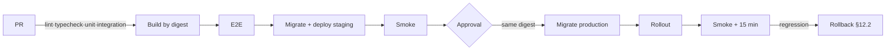

# 11 — DevOps & Observability

**Status:** Baseline for Phase 0 · **Consumes:** [03](03-domain-model.md) (canonical vocabulary, used verbatim),
[04](04-categorization-and-ai-engine.md), [05](05-architecture.md), [09](09-implementation-plan.md).
**ADRs by number** (defined in [14](14-decisions-and-risks.md)): ADR-001 … ADR-014.

Written so one engineer, alone, at 02:00, can execute any runbook in §12 without re-reading the plan.

**Planning assumptions** (change here, not in runbooks): single node + Docker Compose ([ADR-013](14-decisions-and-risks.md));
EU region, EUR; AI ≈ $0.02–0.05 per active Household/month steady state, 3–5× higher before memory
accumulates ([04 §12](04-categorization-and-ai-engine.md)); **FX canonical from
[12 §1](12-monetization-and-pricing.md): 1 EUR = 117,32 RSD, 1 USD = 100,68 RSD**; Receipt images ≤ 2 MB
after client-side downscale.

---

## 1. Environments

| Dimension | Local | CI | Staging | Production |
|---|---|---|---|---|
| Purpose | Build fast | Prove the change | Prove the *release* | Serve Households |
| Data | Seeded `demo` Household, known month | Ephemeral Testcontainers | Synthetic/anonymised, prod-shaped | Real |
| Real Household data | Never | Never | Never | Yes |
| Secrets | `.env` (gitignored) | CI store, test values | Secret manager | Secret manager |
| AI providers | Deterministic stub; live optional | **Recorded fixtures, zero live calls** | Cheap providers + one live smoke | Routing from [04 §9](04-categorization-and-ai-engine.md) |
| Flags | Risky flags **on** | Forced deterministic per job | Prod defaults + canary cohort | Risky flags **off**; enabled per §14.3 |
| Migrations | `prisma migrate dev` | `migrate deploy` from empty **and** from the previous release schema | Separate job, before app deploy | Separate job, approval-gated, before rollout |
| Deploy trigger | `pnpm dev` | Every push/PR | Auto on merge to `main` | Manual approval after staging smoke |
| Observability | Console; `obs` profile optional | Job summary | Full stack, lower retention | Full stack |
| Backups | None (reseed) | None | Nightly, 7-day | §7 |

> **The image-identity rule: staging runs the same container images as production — byte-identical,
> deployed by digest.** Config differs; the image does not. No `Dockerfile.staging`, no
> `--build-arg ENVIRONMENT`, no second build path. Promotion is reference, not rebuild:

```bash
docker buildx build --target api -t ghcr.io/<org>/finmate-api:sha-$(git rev-parse --short HEAD) --push .
DIGEST=$(docker buildx imagetools inspect ghcr.io/<org>/finmate-api:sha-abc1234 --format '{{.Manifest.Digest}}')
API_IMAGE=ghcr.io/<org>/finmate-api@${DIGEST} docker compose -f infra/docker/compose.prod.yml up -d --no-deps api worker web
```

If staging passes and production fails, the cause is config or data. **What may never differ:** the
image; the migration set (staging first, same order); the prompt templates and routing (config rows, so
an accuracy regression is reproducible — [04 §9](04-categorization-and-ai-engine.md)); tenancy
enforcement (no "tenancy off in dev" mode — [05 §6](05-architecture.md)).



---

## 2. Local development

### 2.0 ✅ Docker — RESOLVED (was a Phase 0 blocker)

**Status: cleared.** Docker Desktop WSL integration was enabled for this distro on 2026-09-14.
Verified on the machine:

```text
$ docker --version          →  Docker version 29.7.2, build a7dcaa6
$ docker compose version    →  Docker Compose version v5.5.0
$ docker info --format ...  →  29.7.2 / Docker Desktop / linux      (daemon reachable)
$ docker run --rm alpine:3.20 uname -s -m  →  Linux x86_64          (containers execute)
$ docker images             →  postgres:16-alpine already pulled locally
```

Linux containers, not Windows containers — which is what every image in this plan assumes.

**Why it mattered.** [09 §2](09-implementation-plan.md) task **0.2** is "Docker Compose: Postgres 16
(+`pg_trgm`, `pgvector`), Redis, MinIO, Mailhog"; the Phase 0 exit criterion is *"`pnpm dev` boots the
whole stack locally with one command"*; [ADR-013](14-decisions-and-risks.md) makes Compose the
deployment mechanism; the integration stage (§5) uses Testcontainers. Three Phase 0 deliverables
depended on this one thing, and all three are now unblocked.

**Environment baseline (confirmed):** Node **v24.20.0**, pnpm **11.7.0**, Go **1.27.0**,
Docker **29.7.2** + Compose **v5.5.0**, Ubuntu 20.04 LTS on WSL2 (kernel 6.18.33.2).

Two residual notes, neither blocking:

- **Ubuntu 20.04 is past standard support.** It works, but `pgvector` has no distro package, so the
  plan depends on the `pgvector/pgvector:pg16` image rather than a native install. That is already the
  intended approach for Compose, so nothing changes — but a future move to `Ubuntu-24.04` would remove
  a sharp edge and should be done outside a delivery phase, not during one.
- **`citext`, `pg_trgm` and `vector` must be verified as available** in the chosen Postgres image as
  part of task 0.2. The canonical schema requires all three ([03 §4](03-domain-model.md)). Prefer an
  image with `pgvector` preinstalled (for example `pgvector/pgvector:pg16`) over installing the
  extension at container start, so a cold start does not depend on a network fetch.

```bash
# the task 0.2 acceptance check — run before calling it done
docker compose up -d
docker compose exec db psql -U postgres -c \
  "CREATE EXTENSION IF NOT EXISTS citext; CREATE EXTENSION IF NOT EXISTS pg_trgm; CREATE EXTENSION IF NOT EXISTS vector;"
docker compose exec db psql -U postgres -c "SELECT extname FROM pg_extension ORDER BY 1;"
```

**Historical note (kept deliberately).** This section previously recorded Docker as absent from the
WSL distro and listed three remediations; option 1 (Docker Desktop WSL integration) was the one taken.
The record is retained because the *reasoning* — why a native Postgres install is not an acceptable
workaround — still governs the image choice above.

### 2.1 The `pnpm dev` experience

`.nvmrc` pins Node `24`, `packageManager` pins `pnpm@11.7.0`, corepack enforces both — a mismatch fails
in 5 seconds rather than as a mysterious build error. `pnpm dev` runs
`docker compose -f infra/docker/compose.dev.yml up -d --wait && nx run-many -t serve --parallel=3`,
giving one prefixed terminal per app so a NestJS stack trace sits beside an Angular compile error.

| Command | Does |
|---|---|
| `pnpm dev` · `dev:obs` · `dev:reset` | Boot stack (`--wait` blocks on healthchecks) · + observability profile · nuke volumes, re-migrate, re-seed |
| `pnpm db:migrate` · `db:seed` · `db:studio` | Prisma migrate · deterministic seed (§2.3) · Studio |
| `pnpm lint` · `typecheck` · `test` · `test:int` · `e2e` | Exactly what CI runs; `test:int` uses Testcontainers |
| `pnpm eval` · `pnpm doctor` | Golden-dataset AI evaluation ([04 §11](04-categorization-and-ai-engine.md)) · environment assertion (§2.4) |

### 2.2 Docker Compose topology

| Service | Image | Ports | Volume | Healthcheck | Purpose |
|---|---|---|---|---|---|
| `api` | `apps/api` dev target | 3000 | — | `/health/ready` | GraphQL + REST |
| `web` | `apps/web` dev target | 4200 | — | `/` | Angular dev server, HMR |
| `worker` | `apps/worker` dev target | **none** | — | BullMQ heartbeat | All jobs in [05 §8](05-architecture.md) |
| `postgres` | `postgres:16` + `pgvector` | 5432 | `pgdata` | `pg_isready` | The only source of truth |
| `redis` | `redis:7-alpine` | 6379 | `redisdata` | `redis-cli ping` | Rule cache, BullMQ, idempotency, breaker state |
| `minio` | `minio/minio` | 9000 / 9001 | `miniodata` | `mc ready local` | Attachment blobs (`storage_key`) |
| `mailhog` | `mailhog/mailhog` | 1025 / 8025 | — | TCP 8025 | Dev SMTP sink for `EMAIL` |
| `otel-collector` · `prometheus` · `grafana` · `loki` · `tempo` | upstream | 4317/4318, 9090, 3030, 3100, 3200 | per-service | — | `profile: obs` (§8) |

`web → api → {postgres, redis, minio, mailhog}`; `worker → {postgres, redis, minio}`; `api` and `worker`
export OTLP to the collector, which feeds Prometheus, Loki and Tempo, read by Grafana. Observability is
a **profile, not a default** (~1 GB RAM): on for classification, jobs and performance work; off for
design-system work. Ports bind to `127.0.0.1` only. Extensions are installed by
`infra/docker/postgres/init/00-extensions.sql` (`citext`, `pg_trgm`, `vector`) **and asserted by a
test** — a silently missing `vector` would degrade embedding resolution to "no match" rather than fail
loudly ([04 §4](04-categorization-and-ai-engine.md)).

### 2.3 Seed data

Two idempotent, versioned layers, both run by `pnpm db:seed`:

**Layer 1 — platform seed (ships everywhere, including production):** global `Merchant` rows
(`household_id IS NULL`, `is_global = true` — the ~60 local merchants from [F-13](01-product-requirements.md)),
the default ~40-node Serbian `Category` tree, and `prompt_templates`. Content, not fixture: versioned in
git under `packages/domain/seed/`, so a bad change is a reviewable PR.

**Layer 2 — demo fixture (local and CI only):** one Household reproducing a **known month**, exactly
what [09 §3](09-implementation-plan.md)'s Phase 1 exit criterion requires.

| Fixture | Entity | Why |
|---|---|---|
| `demo` Household: `ledger_currency = RSD`, `iana_timezone = Europe/Belgrade` | Household | [ADR-011](14-decisions-and-risks.md) |
| 3 Accounts with opening balances | Account | F-01, invariant I-4 |
| Category tree incl. `Kuća / Septička jama` with keywords `septička, septicka, jama, cisterna` | Category, CategoryKeyword | F-02, F-03 include/exclude |
| Counterparty `Dejan`, aliases `dejan rođa`/`rođa dejan`, one `LEARNED` Rule | Counterparty, Rule | F-11, F-09 |
| ~120 Transactions across the month, `EXPENSE` and `INCOME`, hand-computed totals | Transaction | Fixtures for F-19/F-21 calculators |
| One Lidl Receipt totalling 2.000 RSD, ReceiptItems spanning Hrana/Higijena/Kuća | Receipt, ReceiptItem | F-14, invariant I-6 |
| One `PENDING` row with `needs_review = true`; one offline row with `client_id`; one Budget; one SavingGoal | Transaction, Budget, SavingGoal | F-08/I-8, F-26/I-10, F-17, F-18 |

**Determinism:** UUIDs are literals, `occurred_local_date` values are fixed calendar dates, nothing
asserted in a test is relative to `now()`. A seed that produces different data on Tuesday produces
flaky tests. **Safety guard:** the fixture refuses to run outside `development`/`test`.

### 2.4 Day one: clone to `Lidl 2000` in 60 minutes

| Time | Action |
|---|---|
| 0:00 | Docker prerequisite resolved (§2.0) — **pre-arranged as a first-day blocker ticket** |
| 0:05 | `git clone`, `corepack enable`, `pnpm install`; `cp .env.example .env` (works unedited — no secrets needed for rules-only work) |
| 0:12 | `pnpm dev` → containers healthy, migrations applied, apps serving; `pnpm db:seed` |
| 0:30 | Read [03 §1](03-domain-model.md) (glossary) and [03 §5](03-domain-model.md) (invariants) — 15 min, non-negotiable |
| 0:45 | `pnpm test` green; one `pnpm test:int` run; type `Lidl 2000` and see the Proposal, badge and saved Transaction |
| 1:00 | Correct it, tick "Zapamti za ubuduće", retype the same input, watch it resolve via the rules engine with **zero AI calls** |

That last row is the real onboarding test — it is the product's core loop ([F-09](01-product-requirements.md)).
If a new engineer cannot execute it in hour one, the environment is broken, not the engineer.

---

## 3. Containerisation

### 3.1 Dockerfile strategy for the Nx monorepo

One Dockerfile per app, five stages: `base` (pinned `node:24-bookworm-slim` + corepack) → `deps`
(manifests + lockfile only, `--frozen-lockfile`, BuildKit cache mount) → `build`
(`nx build <app> --configuration=production`) → `prune` (`pnpm --filter @finmate/<app> deploy --prod`)
→ `runtime` (pruned output only, non-root, `tini` as PID 1). Pruning keeps another app's code out of
this image: an `api` image containing the Angular bundle has a larger CVE and review surface for no benefit.

```dockerfile
# syntax=docker/dockerfile:1.7
FROM node:24-bookworm-slim@sha256:<pinned> AS base
ENV PNPM_HOME=/pnpm PATH=/pnpm:$PATH
RUN corepack enable && apt-get update \
 && apt-get install -y --no-install-recommends openssl ca-certificates tini && rm -rf /var/lib/apt/lists/*
WORKDIR /workspace
FROM base AS deps
COPY pnpm-lock.yaml pnpm-workspace.yaml package.json nx.json ./
COPY apps/api/package.json apps/api/          # …one COPY per workspace manifest
RUN --mount=type=cache,id=pnpm,target=/pnpm/store pnpm install --frozen-lockfile
FROM deps AS build
COPY . . && RUN pnpm nx build api --configuration=production
FROM build AS pruned
RUN pnpm --filter @finmate/api deploy --prod --legacy /out
FROM base AS api
ENV NODE_ENV=production
COPY --from=pruned --chown=node:node /out /app
USER node
EXPOSE 3000
HEALTHCHECK --interval=15s --timeout=3s --start-period=20s --retries=3 \
  CMD node -e "fetch('http://127.0.0.1:3000/health/ready').then(r=>process.exit(r.ok?0:1)).catch(()=>process.exit(1))"
ENTRYPOINT ["/usr/bin/tini","--"]
CMD ["node","/app/dist/main.js"]
FROM base AS worker
ENV NODE_ENV=production
COPY --from=pruned --chown=node:node /out /app
USER node
# No EXPOSE: the worker must never be reachable from outside the compose network.
ENTRYPOINT ["/usr/bin/tini","--"]
CMD ["node","/app/dist/worker.js"]
```

**Web** is static — [ADR-006](14-decisions-and-risks.md) means no SSR process: `nx build web`, then
`COPY dist/apps/web/browser` into `nginxinc/nginx-unprivileged:1.27-alpine`, `USER 101`.

**distroless or slim?** Start on **`node:24-bookworm-slim` with a non-root user and `tini`**: it is
debuggable (`docker exec` gives a shell, which matters enormously in the first production incident) and
carries current `openssl` for Prisma's engine. Move to `gcr.io/distroless/nodejs24-debian12:nonroot`
only once (a) staging proves the Prisma engine loads without a shell and (b) there is a debugging story
that does not need `docker exec` — a hardening upgrade, not a Phase 0 blocker, and never in the same
week as a schema migration. Non-root always: the API will handle untrusted uploads ([F-14](01-product-requirements.md)).
`.dockerignore` excludes `node_modules`, `dist`, `.git`, **`.env*`**, `*.log`, `coverage`, `.nx`,
`docs/` — the mechanism that stops a stray `.env` entering a layer (§4.4).

### 3.2 Tagging and provenance

| Tag | Mutable | Purpose |
|---|---|---|
| `:sha-9f3c1ab` | No | Human handle for a build |
| `@sha256:…` | No | **What is deployed** (§1) |
| `:v1.4.0` | No | A shipped release, for the changelog |
| `:staging` / `:production` | Yes | Convenience only; never used in a deploy command |
| `:latest` | — | **Banned in every deployment manifest** |

OCI labels (`org.opencontainers.image.revision/.version/.created/.source`) make provenance a
`docker inspect` away; builds are reproducible (same commit → same digest). Renovate opens weekly
base-image PRs and a weekly scheduled rebuild keeps CVEs patched even when application code is
unchanged. Private GHCR, retaining the last 50 tags plus every `v*` — the retention window must exceed
the rollback window (§12.2) by a wide margin, 90 days minimum.

### 3.3 The worker is a separate process, not a separate codebase

`apps/worker` boots the **same NestJS modules** as `apps/api` (same `ledger`, `classification`,
`notifications`, `taxonomy` services) with its own entrypoint and container — the split is at the
**process** boundary, not the module boundary, so [ADR-004](14-decisions-and-risks.md)'s modular
monolith is intact and `apps/worker` is a composition root like `apps/api`.

| Reason | Consequence |
|---|---|
| Independent scaling | A `notifications.dispatch` backlog scales the worker, not the API |
| Independent failure domain | An OCR job OOM-killing the worker does not drop an in-flight request |
| No inbound surface | No `EXPOSE`, no published port, unreachable from outside the network |
| No event-loop contention | A 20 s OCR job cannot add latency to a 30 ms `capture.parse` |
| Migration coordination | `docker compose stop worker` lets a migration run with no job writing mid-schema |

| Queue | Schedule | Concurrency | Backlog alert |
|---|---|---|---|
| `recurring.materialise` | hourly | **1** (single runner, §13.2) | depth > 500 or age > 10 min |
| `recurring.detect` · `budget.rollups` | daily / hourly | 2 | failure / depth > 200 |
| `insights.generate` | daily 06:00 local | 4 | age > 45 min at 07:00 |
| `notifications.dispatch` | every minute | 8 | depth > 1,000 for 10 min → §12.6 |
| `ledger.reconcile` | nightly | 1 | **any** run with drift ≠ 0 → P1 |
| `classification.calibrate` · `rules.audit` | weekly | 1 | failure |
| `ai.embed.refresh` · `files.purge` · `evals.nightly` | daily/nightly | 1–2 | failure; `evals` → P2 |
| `gdpr.purge` · `backfill.run` | on demand | 1 | **failure → P1** / §6.4 |

---

## 4. Configuration and secrets

### 4.1 Typed config validation at boot

```ts
// packages/config/src/env.ts  (abridged)
export const envSchema = z.object({
  NODE_ENV: z.enum(['development','test','staging','production']),
  DATABASE_URL: z.string().url(), REDIS_URL: z.string().url(),                        // fatal
  JWT_ACCESS_SECRET: z.string().min(32), JWT_REFRESH_SECRET: z.string().min(32),
  S3_ENDPOINT: z.string().url(), S3_BUCKET: z.string(), S3_ACCESS_KEY_ID: z.string(), S3_SECRET_ACCESS_KEY: z.string(),
  AI_OPENAI_API_KEY: z.string().optional(), AI_ANTHROPIC_API_KEY: z.string().optional(),   // degrading (ADR-007)
  AI_DEEPSEEK_API_KEY: z.string().optional(), AI_GEMINI_API_KEY: z.string().optional(),
  OTEL_EXPORTER_OTLP_ENDPOINT: z.string().url().optional(),   // optional — telemetry is never a dependency
  AI_GLOBAL_DISABLED: z.coerce.boolean().default(false),
  AI_HOUSEHOLD_DAILY_TOKEN_CAP: z.coerce.number().default(150_000),
  AI_HOUSEHOLD_MONTHLY_COST_MICROS_CAP: z.coerce.number().default(50_000),
  LOG_LEVEL: z.enum(['debug','info','warn','error']).default('info'),
});
export const env = envSchema.parse(process.env);   // throws at boot, not at first request
```

`env` is injected; a lint rule bans `process.env` outside `packages/config`. Failing fast means the
healthcheck never sees a "healthy" process that fails on request one.

| Class | Examples | If missing | Rationale |
|---|---|---|---|
| **Fatal** | `DATABASE_URL`, `REDIS_URL`, `JWT_*`, `S3_*` | Refuse to boot | No correct way to run without them |
| **Degrading** | `AI_*_API_KEY`, `SMTP_URL` | Boot with a warning; that route leaves the chain; rules-only still works | [ADR-002](14-decisions-and-risks.md), [ADR-007](14-decisions-and-risks.md) |
| **Optional** | `OTEL_EXPORTER_OTLP_ENDPOINT` | Boot untraced | Telemetry must never take the product down |
| **Behavioural** | caps, thresholds, `AI_GLOBAL_DISABLED` | Boot with defaults | Operational levers |

### 4.2 `.env` conventions

| File | Committed | Contains |
|---|---|---|
| `.env.example` | **Yes** | Every key with a safe placeholder and a comment — the environment contract |
| `.env` | No | Local values; `cp .env.example .env` must work unedited |
| `.env.test` | Yes | Non-secret test values, throwaway `DATABASE_URL` |
| `.env.<env>.local` | No | Personal overrides, never referenced by CI |

`SCREAMING_SNAKE_CASE`, domain prefixes (`AI_`, `S3_`, `OTEL_`, `SMTP_`), booleans as `"true"`/`"false"`.
The API and worker read the same schema and the same source, so a variable cannot exist for one and be
missing for the other — a failure that presents as "insights never generate".

**The browser-bundle rule.** Angular's `environment.ts` ships verbatim to the client, so it may hold
only API URLs, public flag defaults and locale settings — never a provider key, S3 secret, JWT secret or
database URL. A CI denylist check fails the build on a match inside `dist/apps/web`.

### 4.3 Storage and rotation

| Secret | Storage | Rotation | Blast radius | Procedure |
|---|---|---|---|---|
| Postgres password · Redis password · S3 keys | Secret manager → env | 90 d | Ledger / cache+queue / blobs | New credential, deploy with both valid, switch, revoke old |
| JWT access / refresh secrets | Secret manager → env | 180 d | Session forgery | `kid` overlap: publish new, accept both, retire after max TTL; force re-login if compromise is suspected |
| AI provider keys | Secret manager → env | 90 d or on suspicion | Billing abuse, egress | New key at provider, deploy, revoke, watch `ai_cost_micros_total` |
| SMTP credentials | Secret manager → env | 180 d | Phishing from our domain | Provider rotate, deploy, send a test notification |
| **Backup encryption key** | **Offline + escrowed** | **Rarely** | **Every backup, past and future** | Rotating requires re-encrypting all retained backups, **or** retaining every historical key indexed by backup date. Prefer key retention. Losing this key is the worst outcome in this document |

No engineer has standing read access to the production backup key; secret-manager access is audited.

### 4.4 No secret in an image — ever

> **No secret is ever in an image, a layer, a build argument, or a build log.**

1. `.dockerignore` includes `.env*` — the mechanism by which a secret would otherwise enter a layer.
2. **No secrets as build args** — `--build-arg` values are recorded in `docker history`, public to
   anyone who can pull the image. If a build genuinely needs a credential, use `RUN --mount=type=secret`.
3. No `ENV SECRET=` and no `COPY` of a credential file in any Dockerfile.
4. `gitleaks` in CI on the diff, nightly on full history. A history hit triggers **rotation**, not a rewrite.
5. An image-config and layer scan for high-entropy strings before push.

Runtime secrets arrive by environment injection at container start. Verify before every production deploy:

```bash
docker history --no-trunc ghcr.io/<org>/finmate-api@${DIGEST} | grep -iE 'secret|token|key|password' || echo clean
docker run --rm --entrypoint sh ghcr.io/<org>/finmate-api@${DIGEST} -c env | grep -iE 'KEY|SECRET|PASSWORD' || echo clean
```

---

## 5. CI/CD pipeline

### 5.1 Ordered stages

Cheap, fast, high-signal first: a lint failure costs 90 seconds, a build failure 12 minutes.

| # | Stage | Typical | Blocks | Protects |
|---|---|---|---|---|
| 1 | Install & cache (`--frozen-lockfile`) | 60 s | all | Reproducible resolution |
| 2 | Secrets scan (`gitleaks`) | 10 s | all | §4.4 |
| 3 | Lint (`nx affected -t lint`) | 40 s | merge | Style + `eslint-plugin-boundaries` module rules ([05 §2](05-architecture.md)) |
| 4 | Format check | 10 s | merge | Diff noise |
| 5 | Typecheck (TS strict) | 90 s | merge | Types, incl. `process.env` misuse |
| 6 | Unit tests (+ coverage) | 2 min | merge | `packages/domain` money maths, `nlp`, `rules-engine`, calculators |
| 7 | Property tests | 40 s | merge | Invariants I-1…I-12 expressible as properties ([03 §5](03-domain-model.md)) |
| 8 | Integration (Testcontainers, `cache: false`) | 5 min | merge | Real Postgres+Redis: migrations, tenancy extension, invariants |
| 9 | **Cross-tenant suite** | 60 s | merge | [05 §6](05-architecture.md) — every PR, never `affected`-gated |
| 10 | AI evaluation (`pnpm eval --gate`) | 4 min | merge | [04 §11.2](04-categorization-and-ai-engine.md) gates incl. overconfident-wrong ≤ 1.5 % |
| 11 | Build (`nx affected -t build` + `buildx bake` api/worker/web) | 6 min | deploy | The artifact |
| 12 | E2E (Playwright on ephemeral stack) | 8 min | deploy | The ten MVP statements in [01 §4](01-product-requirements.md) |
| 13 | Migrate staging (separate job) | 30 s | deploy | §6.3 |
| 14 | Deploy staging by digest | 90 s | deploy | §1 |
| 15 | Smoke staging | 60 s | promotion | Health, login, capture, safe-to-spend, assistant |
| 16 | **⬛ Manual approval** | — | production | A human reads the changelog and migration diff |
| 17 | Migrate production (separate job) | 30 s | rollout | §6.3 |
| 18 | Deploy production, same digest, rolling per §12.1 | 2 min | — | — |
| 19 | Smoke + 15 min watch | 15 min | auto-rollback | §12.1–12.2 |

Two deliberate exceptions: **9** is cheap and its silent failure is catastrophic, so it is never
affected-gated; **10** is a release gate, not a report — the AI evaluation blocks a merge exactly as a
failing unit test does.

### 5.2 Nx affected-graph optimisation

```bash
export NX_BASE=$(git merge-base HEAD origin/main); export NX_SHA=$(git rev-parse HEAD)
pnpm nx affected -t lint typecheck test build --base=$NX_BASE --head=$NX_SHA --parallel=4
```

- **Remote cache:** self-hosted Nx cache on the same MinIO instance as attachments ([ADR-013](14-decisions-and-risks.md)
  keeps this off a SaaS). Content-addressed, and **fork PRs never write to the shared cache** — the
  standard cache-poisoning defence.
- **`inputs` correctness is everything**: `affected` is only as good as its declaration. A change to
  `prisma/schema.prisma` or `packages/domain/seed/**` must invalidate every dependent target. Getting
  this wrong yields the worst outcome — green CI on a change that breaks the schema.
- **Integration and e2e are never cached** (`"cache": false`): they touch real containers and real clocks.
- **Affected is an optimisation, not a safety mechanism.** The full suite runs nightly on `main` and on
  every release branch; if the graph is ever suspected, run everything until it is trustworthy again.

Other caches: pnpm store (lockfile hash + BuildKit cache mount), Docker layers
(`--cache-from type=registry,ref=…:buildcache`), Nx cache. **Cache correctness beats cache hit rate** —
a stale cache that produces a false green is worse than no cache.

### 5.3 Branch policy

| Rule | Detail |
|---|---|
| Model | Trunk-based; `main` always deployable; branches ≤ 2 working days, rebased daily |
| `main` | Protected, no direct pushes, no force-push, squash merge |
| Required | Stages 2–12 green; 1 approval, 2 for `ledger`, money maths, tenancy, auth, migrations |
| PR size | ≤ 400 changed lines; larger needs a stated reason |
| Migration PRs | Labelled; body states expand/contract phase, lock risk, duration, rollback plan |
| Staging / Production | Automatic on merge to `main` / manual approval, from a green commit ≥ 30 min on staging |
| Hotfix | Branch from the deployed SHA, same checks, then **merge back to `main` immediately** |

### 5.4 Rollback

| Situation | Mechanism | Time |
|---|---|---|
| Bad application behaviour, no schema change | Redeploy the previous digest | < 2 min |
| Risky feature misbehaving | Flip the flag off | **seconds** (§14.3) |
| Bad prompt or model | Reactivate the previous `prompt_templates` version | < 1 min ([04 §9](04-categorization-and-ai-engine.md)) |
| Expansion-only migration | Roll back the app; leave the schema | < 2 min |
| Destructive migration | Forward-fix with a compensating migration | 30–120 min (§6.2's two-release rule exists so this does not arise) |
| Data corruption | Restore + replay | §12.3 |

> `prisma migrate down` is **not** a rollback strategy. It is never run in production. An applied
> migration is history; the way back is a new forward migration.

---

## 6. Database migrations

### 6.1 Principles

| Principle | In practice |
|---|---|
| Forward-only | Applied in order everywhere; `migrate deploy` only moves forward |
| Immutable | CI verifies every applied migration's checksum; editing a merged migration is a blocking error |
| Reviewed as SQL | Prisma generates, a human reviews — the generated form is sometimes lock-hostile; the `migrate diff` output is in the PR |
| Named for intent | `20261014_143000_add_transactions_needs_review_index` |
| Separate from the app | Own job; **never on app boot** in staging or production |
| Rehearsed | Every migration runs against a prod-shaped staging database first |
| Time-bounded | Every migration sets `lock_timeout`, so it can never queue behind a long query and block a table |

Migrations are managed with **Prisma** ([ADR-005](14-decisions-and-risks.md)), which is why every
mechanism below is expressed as a `prisma migrate` command and why the SQL is reviewed by hand: the
generated form is sometimes lock-hostile.

### 6.2 Expand / contract for zero downtime

The canonical case is on the roadmap: [03 §6](03-domain-model.md) lists *"Category spend for period —
rollup table (v1.1)"*, needed because invariant I-5 counts a Budget's consumption across a Category
subtree and a recursive CTE per dashboard read does not scale.

```sql
-- Release 1 — EXPAND: additive only; old code ignores it and still reads the recursive CTE
SET lock_timeout = '3s'; SET statement_timeout = '30s';
CREATE TABLE category_spend_rollups (
  household_id UUID NOT NULL REFERENCES households(id) ON DELETE CASCADE,
  category_id  UUID NOT NULL REFERENCES categories(id) ON DELETE CASCADE,
  period_start DATE NOT NULL, period TEXT NOT NULL, currency CHAR(3) NOT NULL,
  spent_minor BIGINT NOT NULL DEFAULT 0, transaction_count INTEGER NOT NULL DEFAULT 0,
  computed_at TIMESTAMPTZ NOT NULL DEFAULT now(),
  PRIMARY KEY (household_id, category_id, period_start, period));
CREATE INDEX CONCURRENTLY category_spend_rollups_period_idx ON category_spend_rollups (household_id, period_start DESC);
```

**Release 1 (expand).** App version N writes rollups and still reads the CTE. Nothing user-visible
changes; the rollup can be wrong without consequence.

**Release 2 (migrate).** Backfill (§6.4), then switch reads behind a flag. Verify on a sample that the
rollup and the recursive CTE are identical before enabling globally.

**Release 3 (contract).** Drop the legacy path **in a later release** than the code that stopped using it.

> **The two-release rule for destructive changes.** A destructive change — dropping a column or table,
> narrowing a type, adding `NOT NULL` without a default — ships **at least one full release after** the
> code stopped depending on it.

The reason is concrete: rollback restores the *previous application version*. If release N+1 dropped a
column that release N reads, rolling back crashes the app. Separating the drop from the code change is
what keeps rollback available as a live option.

**Banned without a written plan in the PR:** `ALTER COLUMN … TYPE` on `transactions`,
`transaction_splits` or `receipt_items` (table rewrite + `ACCESS EXCLUSIVE`); non-concurrent
`CREATE INDEX` on a table over ~100k rows; `ADD COLUMN … NOT NULL DEFAULT` on a large table without
expanding first; `DROP COLUMN` in the same release as the code change; an `UPDATE` without a `WHERE`;
anything needing `statement_timeout = 0` (it belongs in a backfill job).

### 6.3 How migrations run

| Environment | Mechanism | Runner | Guard |
|---|---|---|---|
| Local | `prisma migrate dev` | Developer | May reset the local DB; never pointed at a shared database |
| CI integration | `migrate deploy` into Testcontainers | CI job | Runs **twice** — from empty, and from the previous release's schema (catches migrations that only work on a fresh DB) |
| Staging | `migrate deploy` | Separate job, before the app deploy | Failure aborts staging; production never sees it |
| Production | `migrate deploy` | Separate job, after approval, before rollout | Single runner (`concurrency: production-migration`) |

```yaml
# .github/workflows/migrate-production.yml (abridged)
jobs:
  migrate:
    environment: production            # requires the manual approval
    concurrency: production-migration  # single runner, guaranteed
    steps:
      - uses: actions/checkout@v4
      - run: pnpm install --frozen-lockfile
      - run: pnpm prisma migrate deploy
        env: { DATABASE_URL: "${{ secrets.PRODUCTION_DATABASE_URL }}" }
      - run: pnpm prisma migrate status --exit-code   # "schema and code disagree" becomes a failed deploy
```

**Production migrations never run on application boot.** A boot-time `migrate deploy` is a foot-gun: N
replicas racing, a failed migration leaving the app half-up, no approval step. The rule is absolute
outside local development. Ordering is safe *because of* expand/contract: the migration completes
before the rollout and is additive, so the still-running previous version is unaffected and the new
version finds the schema it expects. A migration that cannot be made additive is not ready to ship. A
**failing** migration job is never "rolled back" — it is diagnosed and forward-fixed (§12.2).

### 6.4 Long-running backfills

The recursive Category rollup is the canonical case: it touches every Household, runs for minutes to
hours, and must not hold a lock or starve live traffic.

1. **The migration creates the structure; a job fills it.** No `UPDATE` over ledger data in a migration.
2. **Batched and resumable** — cursor in Redis (`backfill:<name>:cursor`), so a restart resumes.
3. **Idempotent** — every write is `INSERT … ON CONFLICT … DO UPDATE`, so a batch may run twice.
4. **Self-throttling** — before each batch, back off if the database is under pressure; a backfill that
   degrades the product is worse than one that finishes tomorrow:
   `SELECT count(*) FROM pg_stat_activity WHERE state='active' AND wait_event_type='Lock' AND pid <> pg_backend_pid();`
5. **Observable** — `backfill_rows_remaining`, `backfill_rate_per_second`, `backfill_eta_seconds`,
   `backfill_paused`; alert if the ETA exceeds 24 h, which means the batch size or query is wrong.
6. **Pausable** via a single Redis flag, without a deploy — the switch used during an incident.
7. **Verified, not assumed** — a random sample of 1,000 rows is compared against the authoritative
   recursive computation, requiring zero differences. The nightly `ledger.reconcile` (I-4) and Budget
   consumption (I-5) are the second and third nets.

```sql
-- one Household per batch, inside a bounded transaction; the rollup is the subtree total
BEGIN; SET LOCAL statement_timeout = '20s';
INSERT INTO category_spend_rollups (household_id, category_id, period_start, period, currency, spent_minor, transaction_count, computed_at)
WITH RECURSIVE subtree AS (
    SELECT id, parent_id, id AS root_id FROM categories WHERE household_id = $1 AND deleted_at IS NULL
    UNION ALL
    SELECT c.id, c.parent_id, s.root_id FROM categories c JOIN subtree s ON c.parent_id = s.id WHERE c.deleted_at IS NULL)
SELECT t.household_id, s.root_id, date_trunc('month', t.occurred_local_date)::date, 'MONTHLY',
       h.ledger_currency, SUM(t.amount_minor), COUNT(*), now()
  FROM transactions t JOIN subtree s ON s.id = t.category_id JOIN households h ON h.id = t.household_id
 WHERE t.household_id = $1 AND t.status = 'CONFIRMED' AND t.deleted_at IS NULL
   AND t.kind = 'EXPENSE' AND t.occurred_local_date >= $2 GROUP BY 1,2,3,5
ON CONFLICT (household_id, category_id, period_start, period)
DO UPDATE SET spent_minor = EXCLUDED.spent_minor, transaction_count = EXCLUDED.transaction_count, computed_at = EXCLUDED.computed_at;
COMMIT;
```

Note what it respects, because getting these wrong produces a plausible-looking wrong dashboard: only
`CONFIRMED` (I-7), only non-deleted (I-5), `kind = 'EXPENSE'` (I-3), grouped by `occurred_local_date`
rather than `occurred_at` (I-2 — the calendar day the user means). At 1,000 Households this is ~120k
rows and a few minutes; at 10,000 it is ~1.2M rows and an off-peak job. **A migration PR that requires a
backfill must state its ETA** — a backfill with no stated duration has not been thought through.

---

## 7. Backup, restore and disaster recovery

### 7.1 What is backed up

| Asset | Method | Frequency | Retention | Encrypted |
|---|---|---|---|---|
| **PostgreSQL** | WAL archiving + `pg_basebackup`; nightly `pg_dump -Fc` | Continuous + nightly | 30 d PITR, 90 d dumps | Client-side (§7.3) |
| **MinIO objects** (`storage_key`) | Bucket versioning + cross-site replication | Continuous | Matches `attachments` retention (§11.3) | Yes |
| Redis | AOF `everysec` | Continuous | — | No |
| Secrets / config | Secret-manager versioning + offline copy of recovery keys | On change | Indefinite | Yes |
| Merchant seed, default Category tree, `prompt_templates`, migrations | Git | On change | Forever | N/A |
| Observability volumes | Daily snapshot | Daily | 14 d | No |

**Redis is not backed up as truth.** It holds a cache (rebuildable), expiring idempotency keys,
rate-limit counters, breaker state, and BullMQ queues — and everything in those queues is **idempotent
and re-derivable** ([05 §8](05-architecture.md)): `recurring.materialise` re-reads `next_occurrence_on`,
`insights.generate` recomputes from the ledger, `notifications.dispatch` drains rows already `QUEUED` in
Postgres. That is what makes "restore Redis from empty" survivable, and §12.5 depends on it. Redis loss
costs cache warmth and in-flight job attempts, never data. `audit_log` lives inside Postgres and is
covered by the Postgres backup.

### 7.2 RPO / RTO

| Scenario | RPO | RTO | Mechanism | Rehearsed |
|---|---|---|---|---|
| Accidental row/table deletion | ≤ 5 min | ≤ 60 min | PITR to just before the statement | Quarterly |
| Node loss | ≤ 5 min | ≤ 60 min | WAL + latest dump onto a new node | Quarterly |
| Volume corruption | ≤ 5 min | ≤ 120 min | PITR + object-storage re-sync | Quarterly |
| Ransomware / stolen credentials | ≤ 24 h | ≤ 4 h | Object-locked off-site backups, clean host | Annually |
| Region loss | ≤ 24 h | ≤ 4 h | Off-site copy on a second provider | Annually |
| Loss of the backup key | **Unbounded** | **Unbounded** | **No recovery path** — key escrow is the control | §4.3 |

**Stated honestly: RPO 0 is not offered.** This is not a bank and does not hold money; promising zero
loss would be the kind of overclaim [00](00-executive-summary.md) warns against. What *is* promised: a
captured Transaction is never lost by our software (the F-26 outbox holds it on the client), and a
restore never loses more than the stated window.

### 7.3 The encrypted backup path

Encryption happens **before** the bytes leave the host, so the storage provider never holds readable
financial data — removing a whole class of provider-side breach from the threat model in
[08](08-security-privacy-and-compliance.md).

```bash
#!/usr/bin/env bash   # infra/backup/nightly.sh (abridged; reviewed like application code)
set -euo pipefail; TS=$(date -u +%Y%m%dT%H%M%SZ); OUT=/var/backups/finmate-${TS}.dump
pg_dump --format=custom --compress=9 --no-owner --no-acl --dbname="$DATABASE_URL" --file="$OUT"
sha256sum "$OUT" > "${OUT}.sha256"                                   # integrity survives provider corruption
age --recipient "$BACKUP_AGE_RECIPIENT" --output "${OUT}.age" "$OUT" # private half never touches this host
rm -f "$OUT"
aws --endpoint-url "$BACKUP_S3_ENDPOINT" s3 cp "${OUT}.age" "s3://finmate-backups/nightly/$(basename "${OUT}.age")" --storage-class STANDARD_IA
# WAL streams continuously to the same off-site bucket:
#   archive_command = 'age -r $BACKUP_AGE_RECIPIENT | aws s3 cp - s3://finmate-backups/wal/%f'
echo "backup_last_success_timestamp $(date +%s)" > /var/lib/node_exporter/backup.prom
```

Five properties to preserve in any future change: **client-side encryption** with the key held offline
and escrowed (§4.3); **off-site on a different provider or at least a different account**, so a
compromised host cannot delete its own history; **object-lock / WORM retention**, which is what makes the
ransomware row in §7.2 survivable; an **integrity manifest** verifiable after download; and **success
exported as a metric** whose staleness alerts (§9) — the backup that silently stopped three weeks ago is
the classic disaster. WAL archiving is what makes the 5-minute RPO real, and both exist because the dump
is faster for a small mistake while PITR is what a large one needs.

### 7.4 Restore rehearsal — required before launch, and timed

[09 §7](09-implementation-plan.md) makes this a launch gate, verbatim: *"Restore-from-backup rehearsed
successfully **and timed**."* The second half is the part that matters — an untimed restore is an
untested RTO. Cadence: quarterly, once in staging before public beta, and after any topology change
(§13.2). Performed by whoever did **not** write the backup script.

| # | Step | Check | Record |
|---|---|---|---|
| 1 | Announce; confirm it never touches production | — | T0 |
| 2 | Provision a scratch host with the same Compose stack, no production credentials | `restore-to-scratch.sh` | — |
| 3 | Fetch the latest backup + `.sha256`; **verify the checksum before decrypting** | `sha256sum -c` — mismatch aborts | — |
| 4 | Decrypt with the offline key | `age --decrypt` | T1 |
| 5 | Restore into an empty Postgres 16 | `pg_restore -j4 --no-owner --no-acl -d finmate_restore` | T2 |
| 6 | Replay WAL to the target time (PITR variant) | `recovery_target_time` | T3 |
| 7 | **Boot the app against the restored database** | by digest | T4 = **measured RTO** |
| 8 | Row counts match the last known-good snapshot | Households, Transactions, Receipts, `attachments` | ±0 |
| 9 | Ledger self-consistent | `scripts/reconcile.ts` → invariant I-4 drift **0** | 0 |
| 10 | An Attachment blob is retrievable and intact; a Receipt still reconciles | compare `sha256`; invariant I-6 on a sample | Match, ≤ 1 minor unit |
| 11 | Auth works — a restored app nobody can log into is not restored | log in as a synthetic Member | Pass |
| 12 | Tear down; write the record | `infra/runbooks/restore-drills/YYYY-MM-DD.md` | RTO, findings, actions |

**Pass criteria:** measured RTO ≤ the §7.2 target, drift 0, counts reconcile, app boots. Any failure
becomes an owned issue and the drill repeats after the fix. `restore_drill_last_success_timestamp` is
exported; a drill overdue by more than a quarter raises a P3, because a drill that quietly stops
happening is how a team learns during a real incident that its backups were never restorable.

---

## 8. Observability

### 8.1 The stack, and why

| Pillar | Tool | Retention | Cost at launch |
|---|---|---|---|
| Metrics | Prometheus (+ node, postgres, redis exporters) | 15 d raw, 1 y downsampled | ~€0 (same node) |
| Logs | Loki + Promtail | 14 d | ~€0 |
| Traces | Tempo (OTLP) | 7 d, sampled | ~€0 |
| Dashboards / alerts | Grafana + Alertmanager | — | ~€0 |
| Errors | **GlitchTip** (self-hosted, Sentry-SDK compatible) | 30 d | ~€0, ~1 GB |

**Why self-hosted.** [ADR-013](14-decisions-and-risks.md) chose a single node precisely to avoid
operating a distributed system; a paid observability SaaS would trade a small fixed hardware cost for a
variable one that grows with traffic — on top of shipping Household financial metadata to a third party.
The stack runs in the existing `obs` profile from `infra/observability/`. [09 §2](09-implementation-plan.md)
task 0.10 needs error tracking in Phase 0 at 0.5 pd; GlitchTip uses the Sentry SDK, so moving to hosted
Sentry later is a DSN change.

**The honest caveat:** self-hosted observability dies with the node, exactly when it is most needed.
Mitigations, in order: (1) the uptime check is **external**, never self-hosted; (2) Alertmanager
notifies a channel that does not depend on the node; (3) observability volumes are separate disks with
their own retention, so a full log disk cannot take down Postgres; (4) observability moves off the
application nodes once §13 triggers. Everything is provisioned as code — dashboards as JSON, rules and
routes as YAML; a dashboard edited only in the UI vanishes at the next redeploy.

### 8.2 Metrics

Reproducing the seven hooks [05 §10](05-architecture.md) requires from day one, then extending. Naming
follows Prometheus conventions: unit suffixes, `_total` counters, base units.

| Metric | Type | Bounded labels | Why |
|---|---|---|---|
| `capture_parse_duration_seconds` | hist | `outcome` | **The core latency promise** — time to log |
| `classification_layer_total` | counter | `layer` (`RULE`/`KEYWORD`/`AI`/`FALLBACK`/`MERCHANT_DEFAULT`/`COUNTERPARTY_DEFAULT`) | Rules-vs-AI ratio, and therefore cost ([ADR-002](14-decisions-and-risks.md)) |
| `classification_confidence_bucket_total` | counter | `bucket`, `was_corrected` | Calibration and the overconfident-wrong gate ([ADR-009](14-decisions-and-risks.md)) |
| `ai_tokens_total` · `ai_cost_micros_total` | counter | `provider`, `model`, `task` | Volume and **money** — aggregate only (cardinality rule) |
| `correction_rate` · `sync_pending_age_seconds` | gauge/hist | — | The compounding-moat signal ([ADR-010](14-decisions-and-risks.md)); offline backlog (F-26) |
| `ledger_balance_drift_minor` | gauge | — | **Must always be 0**; non-zero is P1 (invariant I-4) |
| `http_request_duration_seconds` · `http_requests_total` · `http_in_flight_requests` · `graphql_operation_duration_seconds` | hist/counter/gauge | `route`, `method`, `status_class`, `operation_name` | The four golden signals: latency, traffic, errors, saturation |
| `job_duration_seconds` · `job_failures_total` · `queue_depth` · `queue_oldest_job_age_seconds` · `dead_letter_depth` | hist/counter/gauge | `queue` | Every job in [05 §8](05-architecture.md); backlog vs. *stuck* |
| `db_pool_connections_in_use` · `db_pool_wait_seconds` · `pg_stat_activity_waiting` | gauge/hist | `wait_event_type` | Saturation and lock contention, incl. during migrations/backfills |
| `app_schema_version_mismatch` · `app_build_info` | gauge | `version`, `build_sha` | Deploy/schema races; correlate any metric with a release |
| `ai_call_failures_total` · `ai_circuit_breaker_state` | counter/gauge | `provider`, `task`, `reason` | §12.4 |
| `ocr_job_duration_seconds` · `notifications_queued` · `notifications_failed_total` | hist/gauge/counter | `channel`, `outcome` | F-14 and F-22 health |
| `backfill_rows_remaining` · `backfill_eta_seconds` · `backfill_paused` | gauge | `backfill` | §6.4 |
| `backup_last_success_timestamp` · `restore_drill_last_success_timestamp` | gauge | `kind` | **An unmonitored backup is not a backup** |
| `feature_flag_evaluation_total` | counter | `flag`, `value` | Confirms a rollout actually rolled out |

**The cardinality rule.**

> **No metric label may contain a `household_id`, `transaction_id`, `user_id`, or any other unbounded
> identifier.**

[05 §10](05-architecture.md) requires per-Household AI cost. That is satisfied by recording every call's
cost in **Postgres** — the `ClassificationDecision` audit row (`classification_decisions.cost_micros`)
already exists in [03](03-domain-model.md) — and exposing the per-Household view through **queries and
dashboards** (§10, dashboard 4). A
`household_id` label would create one series per Household per metric per model: millions of series at
10,000 Households, and a Prometheus that falls over while describing the problem. The alertable
aggregate comes from an `ai.cost.aggregate` job that rolls Postgres rows into the platform-level
counter; outlier detection lives where the data *and the action* are (§11.2).

`/metrics` binds to the internal network only and requires a bearer token when scraped externally — it
exposes no Household data, but it does expose business volume.

### 8.3 Structured logs

JSON, one object per line, to stdout, collected by Promtail:

```json
{"ts":"2026-10-14T14:30:02.481Z","level":"info","msg":"classification.decided","requestId":"01JFX2K8Q9YV3N7M4B6T0R5C1A","traceId":"4bf92f3577b34da6a3ce929d0e0e4736",
 "householdId":"018f2c1e-…","route":"POST /capture:parse","durationMs":412,"layer":"AI","provider":"DEEPSEEK","promptVersion":7,
 "confidenceBucket":"0.60-0.89","classificationDecisionId":"018f2c20-…","outcome":"OK"}
```

**`requestId` propagation is the mechanism that makes "why did this Transaction get this Category?"
answerable from logs alone** ([05 §10](05-architecture.md)). It must survive four hops: HTTP edge
(generate if absent) → `AsyncLocalStorage` request context → every log line and BullMQ job payload → AI
provider call metadata → `classification_decisions`. An integration test asserts the chain: issue a
capture, then find a log line whose `requestId` matches the one the client received. Without that test
the chain rots at the first refactor.

Levels: `error` (pages), `warn` (tracked weekly), `info` (business events), `debug` (off in production;
enabled only for a bounded window **filtered by `requestId`**, never globally).

**What is never logged.** Enforced by a single exported redaction map applied by the logger, plus a lint
rule against `logger.info(rawInput)`-shaped calls.

| Never logged | Instead |
|---|---|
| `raw_input` / any financial text | `classificationDecisionId` — the row holds it, and reading it is audited |
| Prompts and full model requests/responses (they embed Household data) | `promptTemplateId` + `promptVersion` |
| Email addresses, display names, phone numbers | `userId`, hashed with a rotating salt |
| Tokens, refresh tokens, API keys, presigned URLs | Never |
| OCR text of a Receipt | `receiptId`, item count, OCR confidence |
| Account numbers, balances, individual amounts | Counts and aggregates only, where operationally necessary |
| Request/response bodies in error reports | Exception type, stack, `requestId` |

**Loki is not the audit trail.** The immutable record is `classification_decisions` and `audit_log` in
Postgres ([03](03-domain-model.md), [F-31](01-product-requirements.md)) — access-controlled and on the
ledger's backup path. Logs are for debugging; they are neither complete nor tamper-evident, and treating
them as an audit source is a mistake that surfaces during a compliance review.

### 8.4 Traces

OTel SDK → OTLP → Collector → Tempo. The span tree for the product's most important path (F-06):

```text
http.server  POST /capture:parse                                      [412 ms]
├── capture.parse                                                     [398 ms]
│   ├── nlp.segment / nlp.extract            (pure, in-process)       [  5 ms]
│   ├── entity.resolve                                                [ 11 ms]   (pg_trgm alias lookups)
│   ├── rules.evaluate                                                [  6 ms]
│   └── ai.classify   provider=DEEPSEEK model=… prompt.v=7            [368 ms]
│       └── http.client (AI provider egress)                          [364 ms]
└── classification.persist   (classification_decisions + transactions)[ 12 ms]
```

Why the tree beats the trace: it shows that **368 ms of a 412 ms request is the AI provider** — the
entire argument for [ADR-002](14-decisions-and-risks.md), made visible. A trace with no `ai.classify`
span is a request served by the rules engine at zero marginal cost, and the ratio of those two shapes
over time *is* the moat, measured.

| Span attribute | Example | Never |
|---|---|---|
| `ai.provider`, `ai.model`, `ai.task`, `ai.prompt.version` | `DEEPSEEK`, `deepseek-chat`, `CLASSIFY`, `7` | — |
| `ai.prompt.hash` · `ai.tokens.input/output` · `ai.cost.micros` | `sha256:9f3c…`, `812`/`64`, `410` | The prompt **text** |
| `classification.layer`, `.confidence.bucket`, `capture.segments` | `RULE`, `0.60-0.89`, `3` | — |
| `db.system`, `db.operation`, `db.collection` | `postgresql`, `insert`, `transactions` | Parameter **values** |
| `household.id` | `018f2c1e-…` (root span only) | Anything non-opaque |

Sampling: 100 % of errors, 100 % of requests finishing below 0.60 confidence (the interesting ones),
100 % of AI calls while volume is low then tail-sampled, 10 % parent-based for successful requests, 0 %
for health and `/metrics`. A BullMQ job inherits `traceparent` from the enqueuing request, so an async
`notifications.dispatch` appears as a linked trace rather than an orphan. Logs carry both `traceId` and
`requestId`, so Grafana pivots in either direction.

---

## 9. SLOs and alerting

### 9.1 Objectives and error budgets

From [01 §7](01-product-requirements.md)'s non-functional requirements and [09 §7](09-implementation-plan.md)'s gates.

| SLI | SLO | Window | Error budget | Metric |
|---|---|---|---|---|
| API availability (non-5xx) | **99.5 %** | 30 d | 3 h 39 m | `http_requests_total{status_class}` |
| Read latency | **p95 ≤ 300 ms** | 30 d | 5 % | `http_request_duration_seconds` |
| Rule-only categorisation | **p95 ≤ 100 ms** | 7 d | 5 % | `capture_parse_duration_seconds{layer="RULE"}` |
| AI-assisted entry | **p95 ≤ 2 s** | 7 d | 5 % | `capture_parse_duration_seconds{layer="AI"}` |
| Time to log (median, end-to-end, device lab) | **≤ 4 s** | per release | — | device-lab harness |
| Capture success (submitted ⇒ persisted) | **≥ 99.9 %** | 30 d | 43 m | `outcome="OK"` ratio |
| Notification delivery | **≤ 5 min, 99 %** | 7 d | — | `queue_oldest_job_age_seconds` |
| Ledger consistency (I-4 drift) | **100 % of nightly runs** | 7 d | **zero** | `ledger_balance_drift_minor` |
| Backup freshness | **≤ 26 h** | continuous | zero | `backup_last_success_timestamp` |
| AI evaluation gates | **green on the live prompt version** | per deploy | zero | `evals.nightly` |

**Error budget policy.** 99.5 % permits 3 h 39 m per 30 days. Over 50 % consumed: risky features pause
and reliability takes the next sprint. Exhausted: only reliability work ships until the window recovers.
**Business alerts are exempt from the budget** — correctness and cost are treated with the same
seriousness regardless.

**Burn-rate alerting** (multi-window, multi-burn-rate: catches both a fast outage and a slow bleed):

| Burn rate | Long | Short | Consumed | Sev | Action |
|---|---|---|---|---|---|
| 14.4× | 1 h | 5 min | 2 % in 1 h | **P1** | Page → §12.2 |
| 6× | 6 h | 30 min | 5 % in 6 h | **P2** | Ticket + chat |
| 1× | 3 d | 6 h | 10 % in 3 d | **P3** | Weekly ops review |

### 9.2 Alert rules

Every alert carries a severity, a threshold, a route and a `runbook_url`. **An alert without a runbook
is not allowed into Alertmanager** — a CI job lints the rule files for the annotation.

| Alert | Sev | Condition | For | Runbook |
|---|---|---|---|---|
| `ApiAvailabilityBurnFast` | P1 | 14.4× burn | 5 min | §12.2 |
| `InstanceDown` / `PostgresDown` / `RedisDown` | P1/P1/P2 | `up == 0` / `pg_up == 0` / `redis_up == 0` | 1–2 min | §12.9, §12.3, §12.5 |
| **`LedgerBalanceDrift`** | **P1** | `ledger_balance_drift_minor != 0` | 1 min | §12.3 |
| **`BackupStale`** | **P1** | `time() - backup_last_success_timestamp > 26h` | 0 | §7.3, §12.3 |
| `SchemaVersionMismatch` | P1 | `app_schema_version_mismatch == 1` | 1 min | §6.3, §12.2 |
| **`CrossTenantAnomaly`** | **P0** | A probe returns a row outside the request's Household | 0 | §12.7 |
| `OverconfidentWrongRate` | P1 | Evaluation `>=0.90 but incorrect` > 1.5 % | per run | [04 §11.2](04-categorization-and-ai-engine.md) |
| `AiCostPlatformCap` | P1 | Platform daily spend over the configured cap | 0 | §11.4 |
| `AiProviderDown` / `AiCircuitOpen` | P2 | failure rate > 20 % for one provider / breaker state 2 | 10 min | §12.4 |
| `FallbackRatioHigh` | P2 | `layer="FALLBACK"` share > 20 % | 15 min | §12.4 |
| `AiCostAnomaly` | P2 | Daily cost > 3× trailing 7-day p95 **and** above an absolute floor | 1 h | §11.2, §11.4 |
| `CorrectionRateSpike` | P2 | Weekly `correction_rate` > 40 % or > 2× its 4-week baseline | 1 h | §10 |
| `ReviewQueueGrowth` | P2 | `needs_review` growing > 25 %/h | 3 h | §12.4 |
| `SyncBacklogGrowth` | P2 | `sync_pending_age_seconds` p95 > 15 min **and** rising | 30 min | §12.5 |
| `NotificationBacklog` / `NotificationFailures` | P2 | depth > 1,000 / failure rate > 5 % | 10–15 min | §12.6 |
| `JobDlqNonEmpty` / `JobFailureSpike` | P2 | `dead_letter_depth > 0` / failures > 10 % | 5–15 min | §12.6 |
| `DbConnectionsHigh` / `DbLockWaitHigh` | P2 | pool > 80 % / > 5 waiting on locks | 5–10 min | §12.9, §6.4 |
| `BackfillEtaHigh` | P3 | `backfill_eta_seconds > 24h` | 30 min | §6.4 |
| `DiskSpaceHigh` | P2/P1 | > 80 % / > 90 % | 15/5 min | §11.3, §12.9 |
| `CertificateExpiring` | P2 | < 14 days to expiry | 0 | §12.8 |
| `RestoreDrillOverdue` | P3 | Last drill > 100 days ago | 0 | §7.4 |

**Severities.** P0 = data loss, cross-Household exposure, or a wrong ledger (all hands; notify affected
Households) · P1 = unusable or an invariant violated (page, 15 min) · P2 = degraded or drifting (same
working day) · P3 = early warning (weekly review).

**Hygiene.** Every alert links to a runbook; every alert is actionable by its recipient; an alert that
fires three times without action is fixed or deleted within a week; a maintenance window suppresses only
the alerts it explains; a node being down inhibits its derived service alerts so one cause produces one
page rather than twelve.

---

## 10. Dashboards

All provisioned from JSON in `infra/observability/grafana/dashboards/`, versioned and reviewed as code.

| # | Dashboard | Panels | Audience | Cadence |
|---|---|---|---|---|
| 1 | **Service health** | The four golden signals — latency (p50/p95/p99 by route), traffic, errors, saturation (in-flight, pool, CPU, RAM); SLO burn bars; current digest and `app_build_info` in the header | On-call | First screen in any incident |
| 2 | **Product funnel** | signup → verified → onboarding ([F-13](01-product-requirements.md)) → first Transaction → first natural-language Transaction ([F-05](01-product-requirements.md)) → first correction ([F-08](01-product-requirements.md)) → first Rule ([F-09](01-product-requirements.md)) → ≥ 8/week; plus D7/D30 cohorts ([00](00-executive-summary.md#success-metrics)) | Product owner | Weekly |
| 3 | **AI cost & accuracy** | Layer mix over time — [ADR-002](14-decisions-and-risks.md) made visible; tokens and cost by provider/model/task; confidence distribution; correction rate month-on-month (the moat signal); overconfident-wrong from the nightly evaluation; per-provider latency and failures; breaker state | Eng + founder | **Daily in Phases 2–3**, then weekly |
| 4 | **Per-Household cost outliers** | Top 20 by AI cost and by tokens (30 d), Households over the daily cap, cost-per-active-Household distribution vs. the [12](12-monetization-and-pricing.md) assumption, Households degraded by a guard, upload rate per Household | Ops | Weekly; immediately on `AiCostAnomaly` |
| 5 | **Data integrity** | `ledger_balance_drift_minor` (a flat line at zero is the goal), backfill progress/ETA, migration state and schema mismatch, backup freshness, drill recency, row counts | On-call | Daily; always during a migration |
| 6 | **Jobs & queues** | Per-queue depth, oldest-job age, throughput, failure rate, DLQ depth, worker restarts and memory | On-call | During any backlog alert |
| 7 | **Sync & offline health (F-26)** | `sync_pending_age_seconds`, outbox depth by platform, conflict rate, duplicate-rejection count, offline-capture share | Engineering | Weekly |
| 8 | **Infrastructure** | CPU, RAM, disk (with the receipt-growth line), IOPS, network, restarts, cert countdown, Postgres size and connections | On-call | Weekly; always before §13 decisions |

**Reading dashboard 3 is a product activity, not a chore.** The layer mix is the most informative chart
in the system: a rising `AI` share means the rules engine is not learning from corrections — a product
problem, usually an [F-09](01-product-requirements.md) UX problem — while a rising `FALLBACK` share
means the pipeline is broken, an engineering problem (§12.4). They look identical in a cost chart and
completely different here, which is why the layer mix comes first.

---

## 11. Cost management

### 11.1 Infrastructure estimate

EUR/month, EU region, single node ([ADR-013](14-decisions-and-risks.md)), off-site backups. AI from
[04 §12](04-categorization-and-ai-engine.md) at ≈ $0.02–0.05 per active Household/month steady state.
**FX is canonical from [12 §1](12-monetization-and-pricing.md): 1 EUR = 117,32 RSD, 1 USD = 100,68 RSD**
(middle rate, 14.09.2026). The RSD rows below convert the EUR figures at 117,32.

| Line item | 100 Households | 1,000 | 10,000 |
|---|---|---|---|
| Compute | 1 × 4 vCPU/8 GB — €30 | 1 × 8 vCPU/32 GB — €110 | **not viable on one node** (§13): 3 × 8 vCPU/32 GB + LB — €380 |
| Block storage | 80 GB — €8 | 400 GB — €35 | 2 TB — €150 |
| Object storage (Attachments, §11.3) | ~30 GB — €1 | ~290 GB — €6 | ~2.9 TB — €55 |
| Off-site encrypted backups | 50 GB — €2 | 500 GB — €12 | 4 TB — €80 |
| Managed Postgres/Redis (after §13) | — | — | €250–450 |
| Observability · Email · Domain+ACME | €1–11 | €21 | €121 |
| **AI inference** | €4–10 | €30–60 (**early stage 3–5×: €90–200**) | €300–500 |
| **Total** | **€46–61** | **€214–266** | **€1,300–1,700** |
| **Per Household / month** | **€0.50–0.70** | **€0.25–0.33** | **€0.16–0.22** |
| In RSD (× 117,32) | ~59–82 | ~29–39 | ~19–26 |

> **Two different "per Household" numbers — do not conflate them.** The [09 §7](09-implementation-plan.md)
> launch gate of **≤ 60 RSD** is an **AI-cost** gate per *active* Household, and it is met: at beta the
> cohort is Free-dominated, so the blended AI figure is **8–40 RSD** per Household
> ([12 §4](12-monetization-and-pricing.md)). The table above is **total infrastructure cost**, which is
> scale-dependent and includes compute, storage and backups — at 100 Households it sits at ~59–82 RSD
> per Household, i.e. *above* the AI gate, and that is expected: infrastructure is a fixed cost being
> amortised over a deliberately small beta cohort. The number that must fall with scale is the **1,000-
> and 10,000-Household** row (€0.25–0.33 and €0.16–0.22), not the 100-Household row.

**What this really says.** Fixed costs dominate at small scale, so the **100-Household case is the most
dangerous for unit economics**: €0.50+/Household/month sits close to the 60 RSD gate with no room for AI
overrun. The §11.2 guards matter most early, not late. At 10,000 the constraint stops being money and
becomes the single node itself (§13). Two ways the model breaks: **early-stage AI cost** (3–5× steady
state per [04 §12](04-categorization-and-ai-engine.md) — a real, budgeted acquisition cost, not a
surprise) and **receipt storage that is never purged**. Engineer time is excluded; at 1–2 engineers it
dwarfs everything above.

### 11.2 AI cost monitoring and per-Household guards

Enforcement is in the `withAiBudget()` wrapper every call passes through ([05 §4](05-architecture.md)),
checked **before** the call, never reconciled after it.

| Guard | Threshold | Action | User-visible |
|---|---|---|---|
| Per-call output cap | 1,024 (classify) / 2,048 (narrate) | Truncate; `warn` | No |
| Per-Household daily tokens | `AI_HOUSEHOLD_DAILY_TOKEN_CAP` (150k) | Route downgraded to the cheapest provider for the day | **Yes** — settings notice, per [04 §12](04-categorization-and-ai-engine.md)'s no-silent-quality-drop rule |
| Per-Household monthly cost | `AI_HOUSEHOLD_MONTHLY_COST_MICROS_CAP` | AI off for that Household → rules + keywords only ([ADR-002](14-decisions-and-risks.md) degradation, which is a *working product*) | **Yes**, with "resets on the 1st" |
| Low-confidence escalation | Max 1 large-model re-ask per input | Skip; keep the first Proposal, mark `needs_review` | No |
| Narration | 50 `NARRATE` per Member per day | Template-rendered answers ([04 §10](04-categorization-and-ai-engine.md)) | No |
| Platform daily cap | `AI_PLATFORM_DAILY_CAP_MICROS` | **P1** alert; optional global degrade via `AI_GLOBAL_DISABLED` | Yes if the kill switch fires |
| Provider-side spend limit | Set at each provider | Hard stop at the provider | Yes |

**The property that matters: every guard degrades to a working product.** The floor is
[04 §9](04-categorization-and-ai-engine.md)'s ladder — rules and keywords, then deterministic extraction,
then manual entry ([F-04](01-product-requirements.md)). No configuration makes capture stop working, and
the [09 §4](09-implementation-plan.md) Phase 2 exit criterion asserts exactly that.

Cost is **recorded where it can be queried, not labelled where it can be graphed**: every call writes
`cost_micros`, `latency_ms`, `ai_provider`, `ai_model`, `prompt_version` into `classification_decisions`
([03](03-domain-model.md)). That table is the per-Household cost ledger; `ai.cost.aggregate` rolls it
into the platform counter (§8.2) and dashboard 4 — which is what makes the cardinality rule safe *and*
keeps outlier detection possible.

### 11.3 Receipt image storage lifecycle

`attachments` rows are metadata in Postgres; the bytes live in MinIO under `storage_key`
([03](03-domain-model.md)). Lifecycle is a bucket policy plus the daily `files.purge` job ([05 §8](05-architecture.md)).

| Policy | Value | Rationale |
|---|---|---|
| Upload limit | 10 MB hard reject | A 40 MB phone photo is a bandwidth and OCR-cost problem |
| Client-side downscale | ≤ 2 MB, longest edge 2048 px, before upload | 80 % of bytes for none of the OCR accuracy; works on a slow mobile connection (F-26) |
| Tiering | Hot 0–90 d → STANDARD_IA 90 d–2 y → GLACIER 2 y+ | Storage cost tracks access; Receipts are read rarely after the month closes |
| Blob retention | 24 months, then delete | [03 §4](03-domain-model.md) permits hard delete for Attachment blobs via the lifecycle job |
| What survives | `receipt_items` rows and `total_minor` | The **analytics** are the value ("koliko sam dao na meso?"); the photo is evidence |
| Orphan purge | Daily `files.purge`: attachments with no surviving Transaction or Receipt | Prevents unbounded growth from abandoned uploads |
| GDPR override | Household deletion purges blobs immediately, ignoring retention | [08](08-security-privacy-and-compliance.md) — legal obligation outranks policy |
| Growth | ~2 MB × 12 Receipts/month ≈ **290 GB per 1,000 Households per year** | The number in §11.1, and why `DiskSpaceHigh` watches the growth *rate*, not just the level |

A Household photographing 40 Receipts a month is 3.3× the estimate, so per-Household upload rate is a
panel on dashboard 4 — visible before it becomes a bill.

### 11.4 Preventing a runaway bill

1. **Daily cost report** to the team channel: total, by provider/task, top 5 Households, day-over-day
   delta. Cheap, and it makes an anomaly visible within a day.
2. **`AiCostAnomaly`** (§9.2): > 3× the trailing 7-day p95 *and* above an absolute floor, so three
   Households cannot trip it. Catches a looping client, a prompt regression that stopped hitting the
   rules engine, or an abusive Household.
3. **Hard caps in code** (§11.2), enforced before the call. An alert that fires after the money is spent
   is a report, not a control.
4. **Provider-side spend limits** at each provider — the belt to our braces: if our accounting is wrong,
   the provider still stops.
5. **`AI_GLOBAL_DISABLED=true`**: rules and keywords only, platform-wide, effective on config reload,
   with the product still fully usable.

**The drill that proves layer 5 works** runs once per phase and is the same as the Phase 2 exit
criterion: disable all AI providers for a full working day; confirm capture still succeeds, rows land
with `needs_review = true` where appropriate (invariant I-8), the review queue behaves, and the app is
usable end to end. A kill switch that has never been pulled is a kill switch that does not work.

---

## 12. Runbooks

Each ends the same way: **verify, then write it down.** An incident with no written record is an incident
the team will have again.

### 12.1 Deploy (production)

```bash
# 0. Pre-flight (60 s): CI green on this SHA incl. the AI gate · changelog written · migration diff
#    reviewed · staging ran this digest >= 30 min with a clean smoke · new flags default OFF ·
#    rollback path identified · a second person available for 30 minutes.
export DIGEST=sha256:...                            # from the approval, never re-resolved

pnpm prisma migrate status --exit-code              # migration FIRST, own job, never on app boot (§6.3)
docker compose -f infra/docker/compose.prod.yml pull
docker compose -f infra/docker/compose.prod.yml up -d --no-deps worker
docker compose -f infra/docker/compose.prod.yml up -d --no-deps api-green     # blue/green, §14.4
until curl -fsS http://127.0.0.1:3001/health/ready >/dev/null; do sleep 1; done
pnpm smoke --env=production --target=http://127.0.0.1:3001    # smoke BEFORE shifting traffic
docker compose -f infra/docker/compose.prod.yml exec proxy nginx -s reload    # atomic upstream flip
docker compose -f infra/docker/compose.prod.yml stop api-blue
docker compose -f infra/docker/compose.prod.yml up -d --no-deps web
pnpm smoke --env=production
```

**Verify:** smoke passes; `app_build_info{build_sha}` reports the new SHA; `app_schema_version_mismatch == 0`;
5xx flat; `capture_parse_duration_seconds` p95 unchanged; the AI cost panel did not step. **Watch for 15
minutes** — the most common production failure is not a crash but a metric that starts drifting. Any
burn-rate alert in the window → §12.2.

### 12.2 Rollback

```bash
# A. Turn the risky behaviour off (seconds). Never gates money arithmetic — ADR-001.
curl -sS -X POST "$CONFIG_API/flags" -d '{"flag":"ocr_enabled","value":false}'
# B. Revert the prompt/model (seconds) — no deploy needed
pnpm tsx scripts/activate-prompt.ts --task CLASSIFY --version <previous>
#    Watch classification_confidence_bucket_total recover within ~5 minutes.
# C. Roll the application back (< 2 min)
docker compose -f infra/docker/compose.prod.yml up -d --no-deps api-green     # with PREV_DIGEST
until curl -fsS http://127.0.0.1:3001/health/ready >/dev/null; do sleep 1; done
docker compose -f infra/docker/compose.prod.yml exec proxy nginx -s reload
docker compose -f infra/docker/compose.prod.yml stop api-blue
docker compose -f infra/docker/compose.prod.yml up -d --no-deps worker
```

| Migration kind | App rollback safe? | Do |
|---|---|---|
| Expansion only (nullable column, new table, new index) | **Yes** | Option C — the old app ignores the new structure. This is why §6.2 exists |
| Dropped column/table, narrowed type, added `NOT NULL` | **No** | Forward-fix with a compensating migration (§6.2's two-release rule exists to prevent this) |
| Backfill ran | Yes | Old app reads the old path; backfilled data is unused but harmless |

**Never `prisma migrate down`.** **Verify:** smoke passes on the previous version; the triggering alert
clears; `app_build_info` shows the old SHA; no new `JobDlqNonEmpty`. **Post-incident** within 5 days:
blameless review and a written record of the migration/feature interaction.

### 12.3 Database restore

```bash
# 1. STOP THE BLEEDING — a restore gets harder while writes continue
docker compose -f infra/docker/compose.prod.yml stop worker
docker compose -f infra/docker/compose.prod.yml stop api           # proxy serves the maintenance page
# 2. SNAPSHOT CURRENT STATE for forensics — never restore over the only evidence
pg_dump --format=custom --file=/var/backups/pre-restore-$(date -u +%Y%m%dT%H%M%SZ).dump "$DATABASE_URL"
# 3. Fetch and VERIFY BEFORE DECRYPTING (§7.4)
aws --endpoint-url "$BACKUP_S3_ENDPOINT" s3 cp s3://finmate-backups/nightly/ ./restore/ && cd restore
sha256sum -c *.sha256                                              # mismatch -> next-newest + investigate
age --decrypt --identity /secure/backup-key.txt -o finmate.dump finmate-<ts>.dump.age
# 4a. POINT-IN-TIME (<=5 min RPO): base backup, recovery_target_time, replay WAL, promote
# 4b. LOGICAL (faster for a small mistake):
createdb finmate_restore && pg_restore -j4 --no-owner --no-acl --clean --if-exists -d finmate_restore finmate.dump
# 5. VERIFY BEFORE SWITCHING OVER — the step people skip
psql finmate_restore -c "SELECT count(*) FROM households;"
psql finmate_restore -c "SELECT count(*) FROM transactions WHERE deleted_at IS NULL;"
psql finmate_restore -c "SELECT count(*) FROM receipts;"           # compare to last known-good (dashboard 5)
# 6. Promote, then confirm integrity
pnpm tsx scripts/reconcile.ts                                      # invariant I-4 drift MUST be 0 (integer minor units — ADR-003)
docker compose -f infra/docker/compose.prod.yml up -d --no-deps api worker
# 7. Redis needs nothing replayed: jobs are idempotent and re-derived from due dates (§12.5)
```

**If invariant I-4 does not hold on the restored database, do not bring the app up** — the restore is
bad, and going live on a wrong ledger is worse than extended downtime ([00](00-executive-summary.md): a
wrong balance is fatal). **Verify:** drift 0, smoke passes, login works, `needs_review` counts match, a
sampled Receipt still reconciles (I-6). **Communicate:** status page on write-stop, on restore, and a
plain-language note to affected Households stating the window and whether anything of theirs was lost.

### 12.4 AI provider outage / circuit breaker stuck open

**Reframe first:** an AI outage is a **designed degradation**, not an outage
([04 §9](04-categorization-and-ai-engine.md)). Capture works, Transactions save, the ledger stays
correct. Do not page at 02:00 for one provider failing over — page when the *fallback* fails.

```bash
# 1. Scope it: ai_circuit_breaker_state{provider=~".+"} (0 closed, 1 half-open, 2 open)
#    rate(ai_call_failures_total[5m]) by (provider, reason)
#    timeout -> slow · auth -> key rotated · rate_limit -> quota · invalid_response -> prompt/model change
# 2. Confirm the product is still functional — 30 seconds, and it is the whole point
pnpm smoke --env=production --section=capture
#    Expected with every provider down: the Transaction saves, needs_review = true,
#    classification_layer_total{layer="FALLBACK"} increments
# 3. One provider: force the route to the fallback. No deploy — routing is configuration (ADR-007)
pnpm tsx scripts/ai-route.ts --task CLASSIFY --primary OPENAI
# 4. Invalid key -> rotate (§4.3). Quota -> raise it, or accept rules-only until reset.
# 5. Breaker STUCK OPEN after recovery: state is per-provider in Redis
redis-cli --scan --pattern 'cb:*'; redis-cli del cb:provider:DEEPSEEK
pnpm tsx scripts/ai-probe.ts --provider DEEPSEEK --task CLASSIFY   # watch state -> 0, layer="AI" return
```

**The user-visible cost of an AI outage is the review queue, not an error.** `F-08`'s queue fills with
rows that would have been auto-categorised. If it grows faster than users clear it, that is the moment to
communicate — a nuisance queue is a churn driver ([04 §6.4](04-categorization-and-ai-engine.md)).
**Verify:** breaker 0; `layer="AI"` share at baseline; queue draining; capture p95 under SLO.

### 12.5 Redis outage

| Capability | Impact | Why |
|---|---|---|
| Capture (F-05/F-06), manual CRUD (F-04) | **Unaffected** | Synchronous; cache bypassed, reads hit Postgres ([05 §11](05-architecture.md)) |
| Dashboard reads | Slower | Rule cache and rollups recompute |
| All background jobs | **Stopped** | BullMQ lives in Redis |
| Notifications (F-22) | Delayed | `notifications.dispatch` cannot run |
| Rate limiting / idempotency cache | Degraded | Falls back to Postgres unique indexes, the real guarantee (I-10) |
| **Financial data** | **Never at risk** | Redis holds no source of truth (§7.1) |

```bash
docker compose -f infra/docker/compose.prod.yml ps redis && redis-cli -u "$REDIS_URL" ping
redis-cli -u "$REDIS_URL" info memory | grep -E 'used_memory_human|maxmemory'   # most incidents: memory/config
docker compose -f infra/docker/compose.prod.yml up -d --force-recreate redis    # empty restart is supported
docker compose -f infra/docker/compose.prod.yml restart worker   # BullMQ re-registers repeatable jobs
docker compose -f infra/docker/compose.prod.yml logs --tail=50 worker           # expect "queues ready"
# Expect a burst, and verify it causes NO duplicates:
#   recurring.materialise -> re-derives from next_occurrence_on
#   insights.generate     -> recomputes from the ledger
#   notifications.dispatch -> drains rows already QUEUED, deduped by UNIQUE (user_id, dedupe_key)
psql "$DATABASE_URL" -c "SELECT user_id, dedupe_key, count(*) FROM notifications GROUP BY 1,2 HAVING count(*) > 1;"
#    Expect zero rows. A non-empty result is a bug — escalate.
```

**Preventive:** AOF `everysec` on, `maxmemory-policy noeviction` (an evicted idempotency key is a
correctness risk; an evicted cache entry is not), and memory alerted before `maxmemory`.

### 12.6 Notification backlog

A backlog matters because [F-22](01-product-requirements.md) is a retention mechanic: a late Alert is
worse than none, and repeat Alerts make users disable the channel — after which the mechanic is gone
([05 §9](05-architecture.md)).

```bash
# 1. Volume or stuck? depth high + oldest_job_age LOW -> volume. depth high + age HIGH -> stuck.
# 2. Worker alive?   docker compose ps worker; logs --tail=200 worker | grep -iE 'error|fail|econn'
# 3. Channel failing? notifications_failed_total by (channel, reason)
#      SMTP_5XX -> provider · PUSH_GONE -> prune stale subscriptions, do not retry forever · INVALID_ADDR -> purge
# 4. Quiet hours — the most common FALSE backlog, and a config fix, not a scale fix:
psql "$DATABASE_URL" -c "SELECT id, household_id, quiet_hours FROM alert_rules WHERE is_active AND quiet_hours IS NOT NULL;"
# 5. Poison message: inspect the notifications.dispatch DLQ, fix the payload, re-enqueue or drop.
#    One row that crashes the processor holds the queue forever otherwise.
# 6. Drain — raise NOTIFICATIONS_CONCURRENCY and restart. If the backlog is stale, SUPPRESS rather than
#    flood: users do not want yesterday's "you are at 80% of your food budget" today.
UPDATE notifications SET status='SUPPRESSED' WHERE status='QUEUED' AND created_at < now() - interval '12 hours';
```

**Verify:** depth at baseline; failure rate < 1 %; no duplicate `(user_id, dedupe_key)` rows (the query in
§12.5); a test Alert arrives within 5 minutes.

### 12.7 Cross-Household data leak suspicion — **P0**

**Triggers:** a user reports another Household's data; the cross-tenant suite fails; a row is returned
whose `household_id` differs from the request's `TenantContext`; an unexplained `household_id` in a
response; the Prisma extension warns that a Household-scoped model was queried without tenant context.

> **Treat as confirmed until disproven.** Cross-Household access is a P0 ([05 §6](05-architecture.md));
> [08](08-security-privacy-and-compliance.md) governs notification.

```bash
# ── FIRST 15 MINUTES: declare and preserve; do not start fixing ──
# Declare P0, page every engineer, name a scribe.
# DO NOT DELETE ANYTHING: no log rotation, no restarts that clear buffers, no cleanup.
# Capture, in order: the reporter's exact steps and timestamp; the requestId's API logs (Loki);
# the full trace (Tempo); and audit rows from the window.
psql "$DATABASE_URL" -c "SELECT * FROM audit_log WHERE created_at > now() - interval '2 hours' ORDER BY created_at DESC LIMIT 500;"
# Record the current image digest and any recent flag change (dashboard 3, §14.3).

# ── 15-60 MINUTES: contain. Prefer disabling one surface over taking the product down ──
curl -sS -X POST "$CONFIG_API/flags" -d '{"flag":"assistant_enabled","value":false}'
curl -sS -X POST "$CONFIG_API/flags" -d '{"flag":"csv_export_enabled","value":false}'
# Vector unknown/broad -> go READ-ONLY rather than offline: Transactions are not lost, because the F-26
# outbox holds them on the client and they sync afterwards (§14.5). Rotate the credentials that could
# widen access: JWT signing keys (ends every session — acceptable for a P0) and the database password.

# ── 1-4 HOURS: establish the blast radius ──
pnpm test:int --suite=cross-tenant        # must FAIL on the current build, then pass on the fix
grep -rn "prisma\.\$queryRaw\|prisma\.\$executeRaw" apps/api/src packages/*/src
#     Every raw query is a place the Prisma extension cannot help. Each needs a manual household_id
#     predicate, or it is the bug. Then check whether PostgreSQL RLS was enabled as defence-in-depth.
# The exposure list IS the set of household_id mismatches in the window: compare audit_log /
# classification_decisions.household_id against the requesting session's Household.
```

**Eradicate.** Fix the path; add a regression test that fails without the fix (the cross-tenant suite
runs on every PR — §5.1 stage 9); enable/enforce RLS if it was absent; audit every other raw query found.
**Notify.** If personal data was exposed the GDPR clock is short — do not wait for a complete technical
picture, because a late notification is itself a trust failure and trust is the product. Affected
Households get plain language: what happened, what of theirs was involved, what we changed.
**Post-incident:** blameless review within 5 days; owned action items; a re-run of the probe suite and a
fresh restore drill.

**What is not a leak:** a Household with multiple Members correctly sees its own Members' data
([ADR-008](14-decisions-and-risks.md) supports F-29 from day one); a shared demo Household outside
production; an `ADMIN` or `OWNER` Member seeing Household data. The boundary is the **Household**, not the
Member — confirm the boundary was crossed.

### 12.8 Certificate renewal

```bash
# 1. Check what is actually served, not what the config says
echo | openssl s_client -connect app.example:443 -servername app.example 2>/dev/null \
  | openssl x509 -noout -subject -issuer -dates
#    Confirm the chain is complete: a missing intermediate fails on Android and older iOS, which is
#    most of the mobile audience ([07](07-platform-strategy-mobile-desktop.md)).
# 2. ACME renews at 30 days remaining — find out why it did not
docker compose -f infra/docker/compose.prod.yml logs --tail=200 proxy | grep -iE 'acme|certificate|renew'
#    Almost always: port 80 unreachable (HTTP-01), DNS not pointing here, or a rotated account key.
# 3. Force it
docker compose -f infra/docker/compose.prod.yml exec proxy sh -c 'caddy reload --config /etc/caddy/Caddyfile'
#    or: certbot renew --force-renewal --deploy-hook 'docker compose exec proxy nginx -s reload'
# 4. Verify from OUTSIDE the network
curl -sSI https://app.example/ | head -1 && curl -sS https://app.example/health/ready
```

The 14-day warning exists so a broken automation has two weeks of runway, not two days. `/health/ready`
reports `tls_days_remaining` so the external uptime check also catches it. Renew before a maintenance
window (§14.5), never during one.

### 12.9 Scaling the single node (before moving to a cluster)

**0. Measure before resizing.** `docker stats --no-stream`; `docker inspect --format '{{.State.OOMKilled}}'`;
`df -h`; `iostat -x 5` (`%util`, `await` on the Postgres volume); `pg_stat_activity`; top
`pg_stat_statements` entries. **A resize does not fix a missing index or an N+1 — rule those out first.**

**1. Cheapest wins, in order — none need a cluster.** Reclaim space (`docker system prune`, log retention,
`VACUUM (ANALYZE)` on the big tables) → add the missing index (`CREATE INDEX CONCURRENTLY`, §6.2) → add
**PgBouncer**, usually the correct fix for connection exhaustion, costing one small container → move
observability off the node → raise worker concurrency *only* if the bottleneck is the worker, not the DB.

**2. Vertical resize** (short window under the §14.5 policy): stop the stack, resize on the provider
keeping the same disks, start the stack.

```bash
# 3. Verify, in this order — a resize that broke Postgres is worse than the original problem
pg_isready -h 127.0.0.1 -p 5432 && docker compose -f infra/docker/compose.prod.yml ps
docker compose -f infra/docker/compose.prod.yml exec api node -e \
  "fetch('http://127.0.0.1:3000/health/ready').then(r=>process.exit(r.ok?0:1))"
pnpm smoke --env=production && pnpm tsx scripts/reconcile.ts      # invariant I-4 must still be 0
# Watch 30 min: p95 latency, pool saturation, job backlog, disk.
```

**4. Tune what the resize exposed.** A bigger node with unchanged `max_connections` and pool sizes wastes
the extra RAM — revisit `shared_buffers`, `effective_cache_size`, `work_mem` and the pool ceilings
together, and record the new values. Past a once-or-twice resize the constraint is architectural and
§13.2 applies.

---

## 13. Scaling path

### 13.1 Signals that force the move

Any **forced** threshold triggers a planning session within a week; two plan-level thresholds sustained
for a week does the same.

| Signal | Plan at | **Forced at** | Cheaper fix to try first |
|---|---|---|---|
| Sustained CPU | p95 > 60 % for 7 d | p95 > 75 % for 24 h | Profile the hot path — a missing index or an N+1 looks exactly like a CPU problem |
| Postgres connections | > 80 % of `max_connections` | > 90 % | **PgBouncer.** Exhaustion is a pooling signal, not a scaling signal |
| Postgres size | > 200 GB | > 500 GB | Archive old `classification_decisions`, VACUUM, review index bloat, then a read replica for analytics |
| API p95 | SLO burn with host contention | SLO breach 3 d, not query-attributable | Prove it is the host: `pg_stat_statements` and traces decide |
| Any queue backlog | depth > 5,000 or age > 30 min for 1 h | Same, twice in a week | Scale the worker — already a separate container (§3.3), so this is a Compose change |
| Disk · Disk IOPS | > 70 % · `%util` > 70 % | > 85 % · `%util` > 85 % | Receipt lifecycle (§11.3); move observability volumes off the Postgres disk |
| Deploy needs a window longer than §14.5 allows | any | any | Fix the deploy (expand/contract, blue/green) rather than adding a cluster |
| Single-node RTO unmet | measured > §7.2 target | twice | A cluster does not fix a slow restore — fix the restore first |
| AI cost per Household | gross margin < 60 % | < 40 % | A **pricing/routing** signal, not an infrastructure one — see [12](12-monetization-and-pricing.md) |

> **The bias is deliberate: resist the cluster.** [05 §1](05-architecture.md) chose Compose to avoid
> operational complexity, and a 1–2 person team operating Kubernetes at 5,000 Households would spend its
> capacity on infrastructure instead of on the categorisation moat. Every row above has a cheaper fix,
> and most real incidents are solved by that column, not the last one.

### 13.2 Migration sequence when the move is forced

One step at a time; no step begins before the previous has been stable for a week.

| # | Step | Why this order | Verification |
|---|---|---|---|
| 0 | Freeze infra changes; write the target architecture and each step's rollback | You will do this under pressure | Second-person review |
| 1 | **Move the rules cache and breaker state to Redis** | Both are in-process today. With 2 API nodes, node A's correction would not invalidate node B's rule cache ([05 §11](05-architecture.md)) and each node would have its own breaker. **This must precede any horizontal scaling** | Create a Rule on node A; node B resolves the next input with zero AI calls |
| 2 | **Make scheduled jobs single-runner** | A duplicated `recurring.materialise` creates duplicate Transactions — a **ledger correctness bug**, not an ops annoyance | 3 worker replicas; each schedule fires exactly once |
| 3 | **Postgres to a managed instance** | Same major version, logical replication, cutover in a window | Row-count reconciliation on every core table, then `reconcile.ts` drift = **0** (I-4) |
| 4 | **Redis to managed** | Short job pause acceptable — §12.5 proves jobs are re-derivable | Queues drain; no duplicate notifications; `requirepass` set |
| 5 | **Object storage to managed S3-compatible** | [05 §1](05-architecture.md) chose S3-compatible precisely so this is a config change — the payoff | Sampled Attachment `sha256` matches `attachments.sha256`; presigned upload works end to end |
| 6 | **Load balancer + 2 API nodes** | Sessions are already stateless (JWT + refresh cookie), so this is safe **only after step 1** | Health checks flap-free 24 h; blue/green across nodes; p95 unchanged |
| 7 | **Worker onto its own node(s)**, scale by queue | Independent scaling per §3.3 | §3.3 backlog thresholds hold; `job_failures_total` flat |
| 8 | **Introduce an orchestrator** only after steps 6–7 are stable for a month | The modular monolith ([ADR-004](14-decisions-and-risks.md)) does not change — only the scheduler | A full deploy + rollback rehearsal in the new topology |
| 9 | **Re-baseline everything** | SLOs, alert thresholds, dashboard 8, the backup path, and a fresh **timed** restore drill | `restore_drill_last_success_timestamp` updated; RTO ≤ target |

Three risks that bite: **(1) in-process state** — steps 1 and 2 are not "later" items; the rule cache and
breaker work perfectly with one node and fail intermittently with two. **(2) Duplicate scheduled jobs are
a correctness bug.** **(3) The backup path must move with the data** — off-site copies, the encryption
key, retention and the timed drill all need re-establishing; a migration that leaves backups pointing at
the old node has no recovery path.

---

## 14. Release management

### 14.1 Versioning and changelog

SemVer for the product; the **GraphQL API evolves by additive fields and deprecation, not by URL**
(deprecation policy in [06](06-api-specification.md)). Every deploy records a durable row (in `audit_log`
with `actor_kind = 'SYSTEM'`, or a small `deployments` table): `version`, `git_sha`, `image_digest`,
`migrations[]`, `prompt_versions{PARSE,CLASSIFY,NARRATE,OCR}`, `flags_changed`, `deployed_at`,
`deployed_by`. `app_build_info{version,build_sha,prompt_versions_hash}` exposes the same, making "which
prompt version was live when accuracy dropped?" a graph query rather than an archaeology exercise — the
question [04 §9](04-categorization-and-ai-engine.md)'s prompt versioning exists to answer.

`CHANGELOG.md`, Keep-a-Changelog, from conventional commits and hand-edited for the user-facing summary.
Every entry: version, date, migrations included, flags introduced/removed, and **rollback notes** —
specifically whether the app can be rolled back independently of the schema (§12.2's question answered
before it is asked). User-facing entries are written in **Serbian and English** ([F-27](01-product-requirements.md))
because they surface in-app, not just in the repository.

### 14.2 Feature flags

Flags decouple **deploy** from **release**, so a risky change ships dark and can be off in seconds during
an incident (§5.4).

| Flag | Default | Scope | Risk it mitigates |
|---|---|---|---|
| `bulk_capture_enabled` · `csv_export_enabled` | on | Global | F-06 parser edge cases · F-25 export load |
| `ai_classify_enabled` | on | Global | The AI layer regressing — **permanent kill switch** (§11.4 layer 5) |
| `ocr_enabled` | **off** | Global → cohort → all | F-14 cost and accuracy |
| `assistant_enabled` | **off** | Global → cohort → all | F-23 narration — the most dangerous surface for fabricated figures |
| `household_sharing_enabled` | **off** | Global | F-29 is v2; the schema already exists ([ADR-008](14-decisions-and-risks.md)) |
| `confidence_autotune_enabled` | off | Global | Changing the 0.90/0.60 platform defaults ([ADR-009](14-decisions-and-risks.md)) |
| `prompt_version` | — | Cohort | Any prompt or model change ([04 §9](04-categorization-and-ai-engine.md)) |

**Rules.** Typed, never stringly. Risky features default off; default-on is earned by passing the
evaluation gates and a week on staging. Every flag has an owner and an **expiry**, and is **removed
within one release of full rollout** — stale flags are why people stop trusting flags. Changes are
audited (during an incident, "did someone flip something?" must be answerable in seconds). Flags are
evaluated from a signed config endpoint and cached client-side, so a change needs no deploy and a
tampered cache cannot unlock a paid feature. **No flag ever gates money arithmetic** — balances, totals,
budget consumption and safe-to-spend are always computed ([ADR-001](14-decisions-and-risks.md)).

**Do not conflate two mechanisms.** The confidence thresholds in [ADR-009](14-decisions-and-risks.md) are
**per-Household settings** a user may tune ([04 §7](04-categorization-and-ai-engine.md), recorded in
`audit_log`). Deploy-time flags are an operator mechanism with different storage, different actors and
different auditing. A user changing their confidence preference must not look like an operator changing
a rollout.

### 14.3 Canary and blue-green under ADR-013

**Application blue-green (one node, ~15 minutes of doubled API RAM):** start `api-green` on a second port
→ healthcheck → run the smoke suite **directly against green, before shifting traffic** → flip the proxy
upstream (a single reload, sub-second and atomic) → keep blue warm 15 minutes for instant rollback → stop
blue. That reversibility is the property that matters, and it does not need a cluster.

**Household-level canary for risky features.** Request-level canaries fit this product badly: a
Household's experience must be internally consistent — no OCR on one Transaction and not the next. So the
cohort is chosen deterministically by Household: `hashToInt(householdId) % 100 < canaryPercent`.

| Change | Mechanism |
|---|---|
| Risky feature (F-14, F-23) | Flag + Household cohort, 5 % → 25 % → 100 %, 24 h per step, watching dashboard 3 |
| Prompt or model change | **Config, not a deploy**: evaluated against the golden dataset before any traffic, then 5 % → 100 % with the correction rate as the gate |
| Confidence threshold ([ADR-009](14-decisions-and-risks.md)) | Per-Household setting; a platform default change is a flag rollout gated on review-queue depth and overconfident-wrong rate |
| Schema change | **Not canaried.** Expand/contract (§6.2) and the two-release rule are the safety mechanism |
| Bug fix · Infra change | Straight to 100 % — canarying a fix delays the benefit · §13.2's sequence, not a canary |

Canary exit criteria are the [09 §7](09-implementation-plan.md) launch gates scoped to the cohort: no rise
in correction rate, no rise in overconfident-wrong, no latency regression, no cost anomaly. Any movement
stops the rollout and reverts the flag — which takes seconds, which is the entire reason the flag exists.

### 14.4 Maintenance-window policy

| Rule | Value |
|---|---|
| **Default** | **No scheduled maintenance.** Every change is zero-downtime by design: expand/contract migrations, blue-green rollouts, promotion by digest |
| Maximum planned window | **30 minutes**, and only when no zero-downtime path exists |
| Allowed hours | Outside **07:00–23:00 Europe/Belgrade** (the Household's default `iana_timezone`, [03 §3.2](03-domain-model.md)) |
| Notice · Approval | **72 hours**, in-app + email · second engineer confirms; rollback path written before the window opens |
| Requires one | Postgres major-version upgrade, host resize (§12.9), physically moving the database (once, §13.2) |
| Emergency | Any time, with a status-page entry at start and update at end |
| **What users lose** | **Nothing that is captured.** The PWA outbox (F-26) stores natural-language input locally with a `client_id` and `idempotency_key` and flushes on reconnect, deduplicated server-side by the unique index (I-10). This is the payoff of offline-first, and why even a 30-minute window loses no Transaction |

**Do not schedule maintenance to ship a feature.** A window is for infrastructure that genuinely cannot
move safely, and every window is a small trust withdrawal from [00](00-executive-summary.md)'s thesis. If
a release seems to need one, build the expand/contract path instead.

### 14.5 Release checklist

```text
□ CI green on this SHA, including the cross-tenant suite and the AI evaluation gate
□ Changelog entry (SR + EN) with rollback notes
□ Migration: expand/contract phase named; lock risk and duration stated; backfill plan + ETA if data moves
□ Staging has run this exact digest >= 30 min with a clean smoke
□ New flags default OFF, each with an owner and an expiry
□ Rollback path confirmed: previous digest available; app rollback safe with this schema
□ New surface has a metric; new failure mode has an alert with a runbook
□ Definition of Done ([09 §8](09-implementation-plan.md)): tests, error/empty/loading/offline states,
  responsive check, i18n strings, telemetry, docs/ADR
□ Manually verified by someone other than the author
□ Backups healthy (< 26 h) and a restore drill within the last quarter
□ On-call aware; a second person available for 30 minutes after the deploy
```
